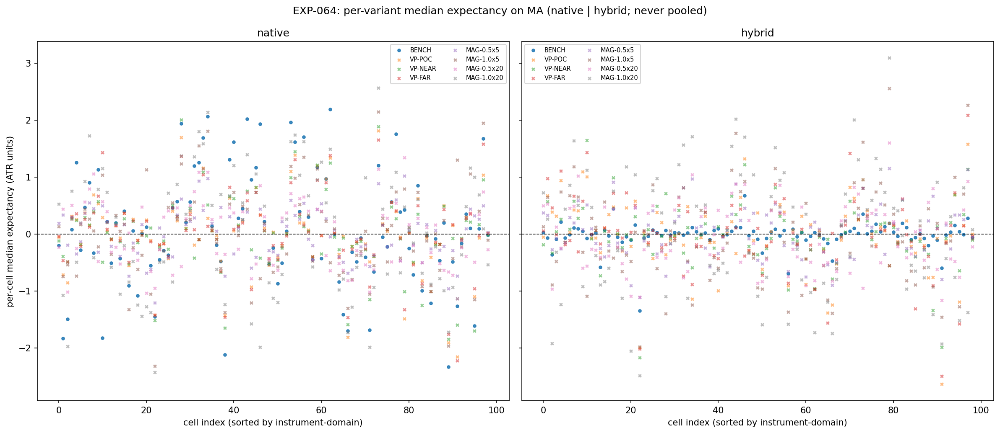
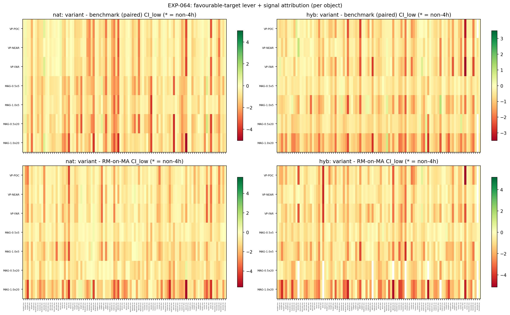
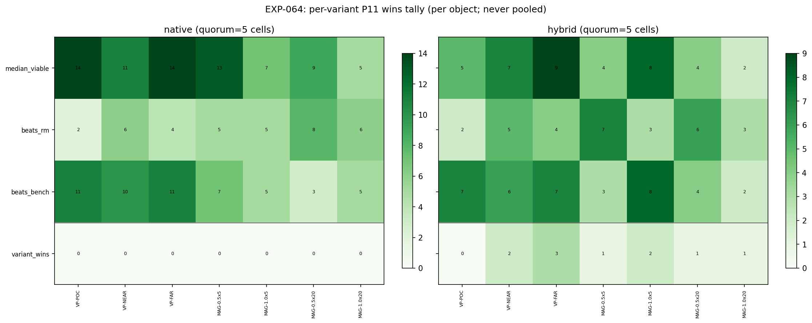
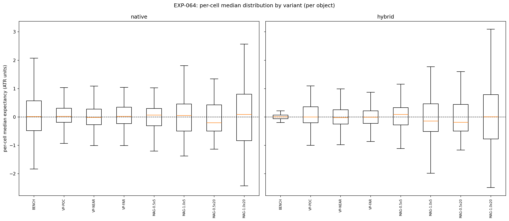
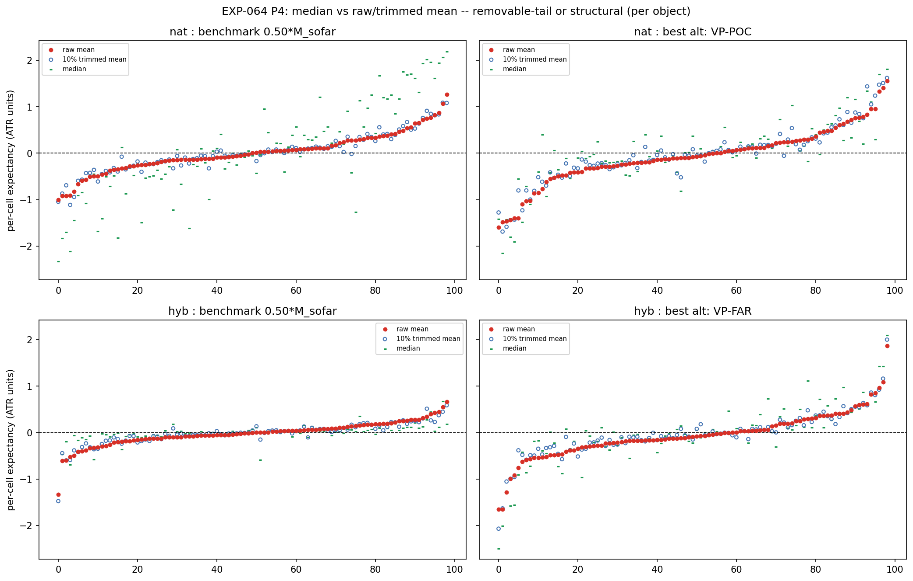

# Experiment Report: EXP-064 — MA(20,50)-Substrate Favourable-Target Geometry (Conditioned HA Harami; /VPTARGET, /MAGTARGET vs Benchmark 50%; Dual Conditioning Object: Hybrid and Native), Phase 015 Surface S1

## Status: COMPLETED

**Date**: 2026-06-18
**Instruments**: all 17 VAL-003-admitted instruments; 99 member cells (3 COVERAGE_EXCLUDED: US500-4h, JP225-2h/4h)
**Data Views / Feature Categories**: 5m/15m/30m/1h/2h/4h real domain OHLC; HA candles for harami detection only; MA(20,50) crossover substrate (real close); `/STRONG-STAT` live magnitude-percentile filter (p75, trailing 20); 8 favourable-target variants: BENCH (50%-of-`M_sofar`), VP-POC/VP-NEAR/VP-FAR (`/VPTARGET`: volume profile of prior completed MA segment), MAG-0.5×5/1.0×5/0.5×20/1.0×20 (`/MAGTARGET`: trailing MA-segment-magnitude distances); P15 path-ordered intrabar fills; P14 median ATR-normalised gross return (binding endpoint)

---

## Question

Does varying the favourable-target leg of the 3-barrier system — from the benchmark 50%-of-`M_sofar` to volume-profile levels of the prior completed MA segment (`/VPTARGET`) or to trailing MA-segment-magnitude distances (`/MAGTARGET`) — improve the conditioned HA harami's gross per-event median expectancy on the MA(20,50) substrate, for each of the two conditioning objects (native MA-segment `/STRONG-STAT` and hybrid ZigZag `/STRONG-STAT` × MA geometry) independently?

## Hypothesis

`HYP-017` (Phase 015 Surface S1): At least one of the 7 alternative favourable-target variants produces a cell-level result where (a) median viability (CI_low_1s > 0, m ≥ 30), (b) signal attribution over the matched-random-on-MA null (variant − RM contrast CI_low_1s > 0), and (c) benchmark improvement (variant − benchmark paired-contrast CI_low_1s > 0) are all satisfied simultaneously, composing by P11 (≥5 cells / ≥3 instruments / ≥3 non-4h) for at least one of the two conditioning objects.

## Method Summary

Four statistical methods as predeclared in `analysis-plan.md`: (1) moving-block bootstrap median CI per cell per variant per object (b = max(1, round(m^(1/3))), N_BOOT = 10,000, per-cell fixed seed); (2) P4 mean diagnostic (raw mean + 10% trimmed mean + worst-5% tail-share — disclosed non-binding co-primary); (3) variant−RM independent contrast CI (signal attribution); (4) variant−benchmark paired-contrast CI (benchmark improvement). All computed per object, never pooled. P11 composition enforced with the P6 non-4h breadth rule (≥3 non-4h cells). Reconciliation: native BENCH arm verified against EXP-061 M0; hybrid BENCH arm against EXP-061 H0 — 99/99 cells to RECON_TOL = 1e-9. See `analysis-plan.md` for full method details.

## Key Findings

### Finding 1: VP variants beat the benchmark geometrically but fail signal attribution

Native VP-POC, VP-NEAR, and VP-FAR each beat the benchmark in 10–11 of their viable cells: VP levels (POC or value-area edges of the prior completed MA segment) are typically further from entry than the adaptive 50%-of-`M_sofar` benchmark, especially when the prior segment was large. However, the matched-random-on-MA null benefits from the same geometric extension, because MA-substrate momentum naturally tends to reach structural price clusters on any in-regime entry. The variant−RM contrast therefore fails in 10–12 of 14 viable VP cells for native VP-FAR: VP improvement is a substrate-driven geometric property, not a harami-signal property.

| Variant | Native viable | Native beats_RM | Native beats_bench | Wins |
|---------|:------------:|:---------------:|:-----------------:|:----:|
| VP-POC  | 14 | 2  | 11 | 0 |
| VP-NEAR | 11 | 6  | 10 | 0 |
| VP-FAR  | 14 | 4  | 11 | 0 |

### Finding 2: MAG variants are signal-specific but underperform the benchmark geometrically

MAG-0.5×20 achieves signal attribution at P11 scale for the native object (8 cells / 7 instruments / 7 non-4h), the only variant whose beats_RM count composes. The 0.5 × median-trailing-20-MA-magnitudes target is genuinely harami-specific rather than substrate-driven. However, MAG-0.5×20 beats the benchmark in only 3 native cells: the trailing median magnitude is typically shorter than the in-progress `M_sofar` at the harami bar, so this target sits closer to entry than the 50%-of-`M_sofar` benchmark and reduces per-event expectancy on hit events.

| Variant     | Native viable | Native beats_RM | Native beats_bench | Wins |
|-------------|:------------:|:---------------:|:-----------------:|:----:|
| MAG-0.5×5   | 13 | 5 | 7 | 0 |
| MAG-1.0×5   | 7  | 5 | 5 | 0 |
| MAG-0.5×20  | 9  | **8** | 3 | 0 |
| MAG-1.0×20  | 5  | 6 | 5 | 0 |

### Finding 3: No variant achieves the full conjunction; both objects EVIDENCE_AGAINST

For native, the maximum individual-cell wins (variant_wins = True, all three gates simultaneously) is 0 cells composing at P11 scale for all 7 alternative variants. For hybrid, the maximum is 3 cells (VP-FAR), well below the P11 quorum of 5 / 3 instruments / 3 non-4h. Neither object produces a single variant that simultaneously clears all binding gates at P11 scale. With 99 powered cells across all variants, this is a systematic negative, not a power failure.

### Finding 4: P4 mean diagnostic — positive median not backed by central tendency

| Object / Variant  | Median of cell-medians | Median of cell-means | Median of cell-trimmed-means |
|-------------------|:----------------------:|:--------------------:|:---------------------------:|
| Native BENCH      | +0.012 | +0.006  | −0.018 |
| Native VP-FAR     | +0.019 | −0.078  | −0.029 |
| Hybrid VP-FAR     | −0.009 | −0.094  | −0.060 |

The trimmed means are negative for VP-FAR on both objects (−0.029 native, −0.060 hybrid), confirming that the positive median reflects a few large-gain cells, not a stable central tendency. The raw mean is strongly negative on VP-FAR due to right-skew geometry that does not survive trimming.

### Finding 5: Consistent with EXP-056 (ZigZag substrate)

EXP-056 found 0/8 variants winning on the ZigZag substrate. EXP-064 finds 0/8 variants winning on the MA substrate for both conditioning objects. Two substrates, two conditioning populations (ZigZag-conditioned hybrid vs MA-segment-conditioned native), same conclusion: the favourable-target geometry is not a productive lever for the conditioned HA harami.

## Conclusion

**Hypothesis REFUTED** (both objects: EVIDENCE_AGAINST).

The binding obstruction differs by variant class: VP variants beat the benchmark geometrically in many cells, but the improvement is substrate-driven — the RM null benefits equally from the same VP levels, so signal attribution fails. MAG variants are signal-specific in some cells (MAG-0.5×20 achieves beats_RM at P11 for native), but the trailing-magnitude estimates set shorter targets than the benchmark and underperform it geometrically. No variant achieves the conjunction of all three binding gates at P11 scale on either object.

The result extends EXP-056's finding from the ZigZag substrate to the MA substrate: the benchmark 50%-of-`M_sofar` favourable geometry appears near-optimal for this setup. The benchmark's adaptive structure (tracking the current in-progress `M_sofar`) makes it difficult to outperform with static VP levels or historical magnitude references. The Phase 015 S1 characterisation is complete; the terminal G-015 will adjudicate the surface slate after EXP-065 (S2) and EXP-066 (S3).

## Registry Disposition

Registry-relevant result (`CF-HA-HARAMI-001/HYP-017`, EXP-064):

- **`docs/signal-registry/multiplicity-registry.md`**: HYP-017 updated to **measured-negative (characterisation)**; retained in the ledger (never deleted or renamed).
- **`docs/signal-registry/candidate-families/harami.md`**: EXP-064 result noted under the `/MA-SUBSTRATE` branch — both objects EVIDENCE_AGAINST on the favourable-target surface.
- **Candidate-family status**: `CF-HA-HARAMI-001` remains `REGISTERED / OPEN` — no closure here; P9 (no-early-closure rule) applies; G-015 adjudicates after the full slate.
- **TEST reads / candidate slots**: 0 TEST reads; 0 candidate slots consumed. No `test-read-ledger.md` entry required.

## Limitations

1. **TRAIN-only**: all cells use the first 49% of each instrument's data (first 70% of first 70% analysis set, F01 file-order prefix). The EVIDENCE_AGAINST verdict applies to the TRAIN stratum; TEST/holdout are sealed and untouched.
2. **`TickVolume` proxy**: the `/VPTARGET` volume profile uses broker tick count as a proxy for traded volume. Tick count is a noisy estimator and may not reliably identify structural price clusters. This disclosed limitation applies to all VP variants.
3. **LOOKBACK = 1 (prior completed segment only)**: VP construction uses only the immediately preceding completed MA segment. A multi-segment profile or longer lookback might produce different results.
4. **OAT design**: the favourable target changes one-at-a-time; adverse and third barrier are fixed at the MA benchmark. Interaction effects between the favourable target and other geometry choices are deferred to the combined experiments (EXP-067/068).
5. **Hybrid power-limited**: the hybrid object's max viable count (9 cells for VP-FAR) is materially lower than native (14 cells), limiting resolution of the hybrid finding. An EVIDENCE_AGAINST result on hybrid could partly reflect insufficient power.

## Implications for Future Research

- The benchmark 50%-of-`M_sofar` favourable target appears near-optimal for this substrate; the S2/S3 surfaces (EXP-065/066) are the higher-priority levers to investigate.
- The MAG-0.5×20 signal-attribution result (beats_RM at P11 for native) is a secondary positive: shorter trailing-magnitude targets are genuinely harami-specific and could inform combined system design if EXP-065/066 surfaces produce viable levers.
- If VP targets are revisited post-G-015, a multi-segment VP profile (LOOKBACK > 1) with real traded volume (not TickVolume) would address the two main identified limitations.

## Recommended Next Experiments

1. **EXP-065 (S2 — Third-Barrier Geometry, Dual-Object)**: the next predeclared surface read in Phase 015; tests whether the MA adaptive time cap can be improved via `/THIRD-TIME` or `/THIRD-EVENT` variants on both objects.
2. **EXP-066 (S3 — Exit-Strategy Surface, Dual-Object)**: position-management exits (`/EXIT-PARTIAL`, `/EXIT-TRAIL-STRUCT`) on the MA substrate for both objects; independent of the favourable-target result.
3. **EXP-067/068 (Combined System, Dual-Object)**: conditional on any S1–S4 surface showing EVIDENCE_FOR; G-015 adjudicates the full slate.

## Artifacts

| Artifact | Path |
|----------|------|
| Scope | [scope.md](scope.md) |
| Analysis Plan | [analysis-plan.md](analysis-plan.md) |
| Code | [code/run_experiment.py](code/run_experiment.py) |
| Audit | [audit.md](audit.md) |
| Results | [results.md](results.md) |
| Pre-Execution Governance | [governance/pre-execution-review.md](governance/pre-execution-review.md) |
| Post-Experiment Governance | [governance/post-experiment-review.md](governance/post-experiment-review.md) |
| Plots | [plots/](plots/) |
| Per-Cell Results | [results/per_cell_expectancy.parquet](results/per_cell_expectancy.parquet) |
| Composition Readout | [results/composition_readout.json](results/composition_readout.json) |
| Reconciliation | [results/reconciliation.csv](results/reconciliation.csv) |
| Run Metadata | [results/run_metadata.json](results/run_metadata.json) |
