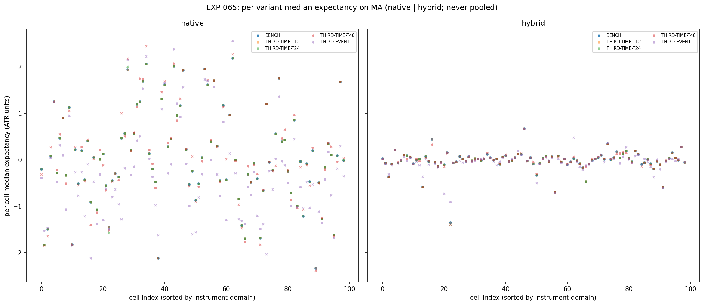
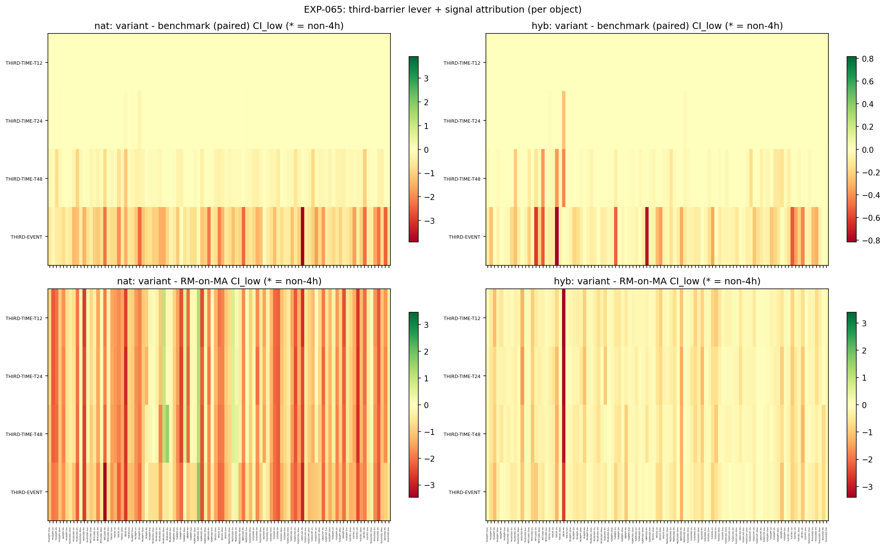
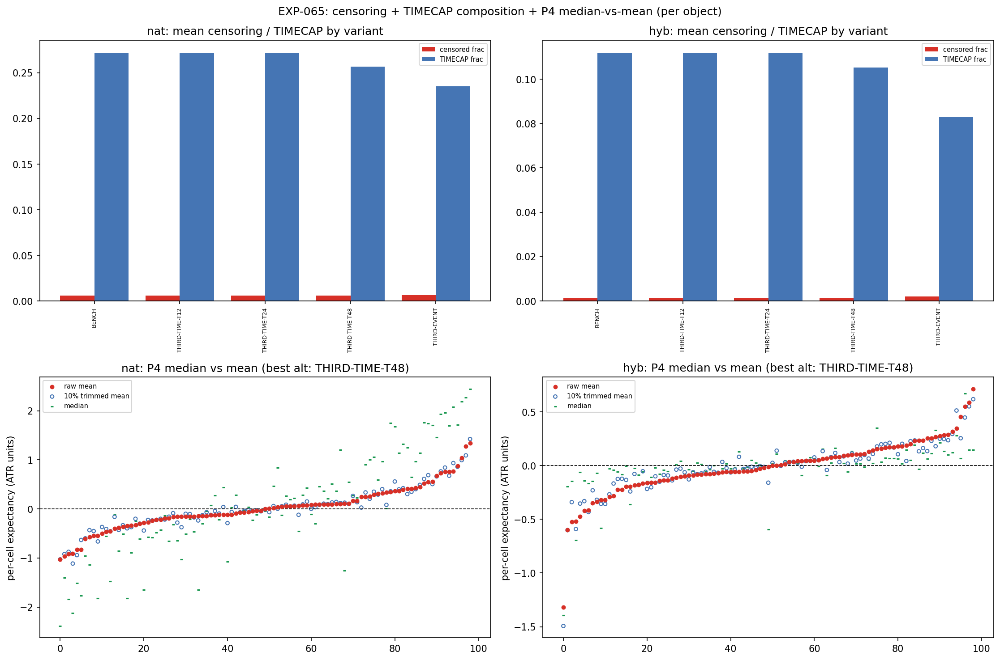

# Experiment Report: EXP-065 — MA(20,50)-Substrate Third-Barrier Geometry (Conditioned HA Harami; /THIRD-TIME, /THIRD-EVENT vs Benchmark Adaptive Cap; Dual Conditioning Object: Hybrid and Native), Phase 015 Surface S2

## Status: COMPLETED

**Date**: 2026-06-18
**Instruments**: all 17 VAL-003-admitted instruments; 99 member cells (3 COVERAGE_EXCLUDED: US500-4h, JP225-2h/4h)
**Data Views / Feature Categories**: 5m/15m/30m/1h/2h/4h real domain OHLC; HA candles for harami detection only; MA(20,50) crossover substrate (real close); `/STRONG-STAT` live magnitude-percentile filter (p75, trailing 20) — computed on MA segments for native object, on ZigZag moves for hybrid object; 5 third-barrier variants: BENCH (floor-6 MA adaptive cap), T12/T24/T48 (`/THIRD-TIME` floors 12/24/48), EVENT (`/THIRD-EVENT` next-MA-segment-rd-confirm, 8× backstop); P15 path-ordered intrabar fills; P14 median ATR-normalised gross return (binding endpoint)

---

## Question

On the MA(20,50) substrate, for each conditioning object individually (hybrid and native), does changing only the third barrier — from the benchmark floor-6 MA adaptive cap to a longer-floor adaptive cap (`/THIRD-TIME` floor ∈ {12, 24, 48}) or to a structural MA-segment event cap (`/THIRD-EVENT`: hold until the MA substrate confirms a reversal-direction segment, backstopped at 8× the benchmark cap) — improve the conditioned HA harami's gross per-event median expectancy vs that object's benchmark, per cell and composed across the 99-cell grid, beat the same-object matched-random-on-MA null, and which variant (if any) wins?

## Hypothesis

`HYP-018` (Phase 015 Surface S2): For at least one of the 4 alternative third-barrier variants, the conjunction of (a) median viability (CI_low_1s > 0, m ≥ 30), (b) signal attribution over the same-object matched-random-on-MA null (variant − RM contrast CI_low_1s > 0), and (c) benchmark improvement (variant − benchmark paired-contrast CI_low_1s > 0) composes at P11 (≥5 cells / ≥3 instruments / ≥3 non-4h) for at least one conditioning object (hybrid or native).

## Method Summary

Four statistical methods as predeclared (reuses EXP-061 dual-object pipeline + EXP-058 `xen.third_barrier`): (1) moving-block bootstrap median CI per cell per variant per object (b = max(1, round(m^(1/3))), N_BOOT = 10,000, per-cell fixed seed); (2) P4 mean diagnostic (raw mean + 10% trimmed mean + worst-5% tail-share — disclosed non-binding co-primary); (3) variant−RM independent contrast CI (signal attribution, P5); (4) variant−benchmark paired-contrast CI (benchmark improvement). All computed per object, never pooled. P11 composition enforced with the P6 non-4h breadth rule. Reconciliation: native BENCH against EXP-061 M0; hybrid BENCH against EXP-061 H0 — 99/99 cells to RECON_TOL = 1e-9. See `analysis-plan.md` for full method details.

## Key Findings

### Finding 1: Native object — EVIDENCE_AGAINST

The native conditioned harami population (8360-class, MA-segment `/STRONG-STAT`) is well-powered across all 5 variants: 8–9 cells reach m ≥ 30 (6 instruments, all outside 4h). The same 8 core cells that are median-viable in the BENCH arm (the EXP-061 M0 cells) remain median-viable and beat their matched-random nulls under every longer-horizon variant. However, **none** beats the benchmark at P11: the pairwise `variant − BENCH` paired contrast CI_low > 0 in 0–3 cells per variant, all below the quorum of 5.

| Variant | Median-viable cells | Beats-RM cells | Beats-bench cells | Wins cells | Wins composes P11? |
|---------|--------------------|----------------|-------------------|------------|-------------------|
| T12     | 8 (6 instr, 8 ∅4h) | 8 (6, 8)       | 0                 | 0          | NO                |
| T24     | 8 (6, 8)           | 9 (6, 8)       | 0                 | 0          | NO                |
| T48     | 9 (6, 8)           | 9 (6, 8)       | 3 (2, 2)          | 1 (1, 0)  | NO                |
| EVENT   | 6 (6, 4)           | 6 (6, 4)       | 3 (3, 2)          | 2 (2, 1)  | NO                |

**Interpretation**: The third-barrier lever does not improve median expectancy on the MA substrate for the native object. Longer holding horizons (time or event) do not generate returns beyond what the benchmark floor-6 adaptive cap already captures. This replicates the EXP-058 (ZigZag substrate) finding on the MA substrate.

### Finding 2: Hybrid object — INCONCLUSIVE_POWER_LIMITED

The hybrid conditioned harami population (3202-class, ZigZag `/STRONG-STAT` mask through MA geometry) is power-limited across all variants. Only 3–4 cells reach m ≥ 30 (all < P11 quorum). No variant composes at P11 for any flag.

| Variant | Powered cells | Median-viable (P11?) | Beats-RM (P11?) | Beats-bench (P11?) |
|---------|--------------|---------------------|-----------------|-------------------|
| BENCH   | 3 (2 instr, 3 ∅4h) | 3 — NO | 2 — NO | 0 — NO |
| T12     | 3 (2, 3)           | 3 — NO | 3 — NO | 0 — NO |
| T24     | 3 (2, 3)           | 3 — NO | 5 (5, 3) — YES (fragile) | 0 — NO |
| T48     | 4 (3, 4)           | 4 — NO | 3 — NO | 2 — NO |
| EVENT   | 1 (1, 1)           | 1 — NO | 6 (5, 5) — YES | 0 — NO |

**Interpretation**: The hybrid object's condition count (~3200 haramis vs ~8360 for native) already limits power at the BENCH geometry (EXP-061 H0 had only 3 powered cells). Third-barrier horizon extension further depletes events through TIMECAP exits. The `beats_rm` composition for T24 (5 cells, fragile) and EVENT (6 cells) is notable — the matched-random null may be even more power-depleted than the signal variant — but without `median_viable` and `beats_bench` composing, this is not a signal claim. The hybrid third-barrier question cannot be answered on the TRAIN slice.

### Finding 3: Censoring cost is bounded; /THIRD-EVENT is event-limited

Mean TIMECAP fraction increases modestly with horizon (BENCH ~0.12–0.33, T48/EVENT ~0.12–0.34) — the benchmark adaptive cap already captures most of the available MA-segment lifetime. The `/THIRD-EVENT` `event_bound_frac` is 1.0 for every cell and both objects: every TIMECAP exit bounded on a genuine MA rd-confirm, never the 8× backstop. Horizon extension does not create a meaningful censoring penalty on the MA substrate.

### Finding 4: P4 mean diagnostic reveals positive-skewed cells where median is near zero

`mean_viable` cells consistently outnumber `median_viable` cells across both objects (e.g., native BENCH: 10 mean-viable vs 8 median-viable). The gap between mean and median is typically negative — the mean is pulled positive relative to the median. The tail-share (worst-5%) is stable around 0.24–0.32, indicating the negative tail is not extreme. The return distribution is positively skewed at the per-cell level.

### Finding 5: Full structural validation passed

Reconciliation 99/99 cells — native BENCH reproduces EXP-061 M0, hybrid BENCH reproduces EXP-061 H0 to full FP precision. Determinism 17/17 cells byte-identical. Causality 99/99 pass. All 7 per-object invariant gates pass. No defect.

## Conclusion

**Hypothesis REFUTED (native) / INCONCLUSIVE (hybrid) → Phase verdict: EVIDENCE_AGAINST (native stronger).**

The third-barrier lever is characterised as EVIDENCE_AGAINST on the MA(20,50) substrate for the native (expressing) object — no alternative horizon extends median expectancy beyond the benchmark floor-6 adaptive cap at P11. This replicates the EXP-058 (ZigZag substrate) finding: the third barrier is not a leverage parameter on either substrate for the conditioned harami.

The hybrid object is INCONCLUSIVE_POWER_LIMITED — the 3202-class population lacks the event count to resolve the question on the TRAIN slice.

Family stays OPEN (P9 no-early-closure); the surface runs regardless. EXP-065 feeds the terminal G-015 after EXP-066 (S3) and the combined champions (EXP-067/068).

## Registry Disposition

Registry-relevant result (`CF-HA-HARAMI-001/HYP-018`, EXP-065):

- **`docs/signal-registry/multiplicity-registry.md`**: HYP-018 updated to **CHARACTERISED** — native EVIDENCE_AGAINST (0/4 alt variants compose P11), hybrid INCONCLUSIVE_POWER_LIMITED. Retained in the ledger (never deleted or renamed).
- **`docs/signal-registry/candidate-families/harami.md`**: EXP-065 result noted under the `/MA-SUBSTRATE` branch — third-barrier lever closed for Phase 015; no signal-registry registration or change needed (0 TEST reads, no countable-item promotion).
- **Candidate-family status**: `CF-HA-HARAMI-001` remains `REGISTERED / OPEN` — no closure here; P9 applies; G-015 adjudicates after the full slate.
- **TEST reads / candidate slots**: 0 TEST reads; 0 candidate slots consumed. No `test-read-ledger.md` entry required.

## Limitations

1. **TRAIN-only**: all cells use the first 49% of each instrument's data (first 70% of first 70% analysis set, F01 file-order prefix). Generalisation beyond the TRAIN window is not tested.
2. **Power-limited hybrid**: the hybrid object (3202-class) lacks the event count to distinguish signal from noise on the TRAIN slice. A null result for the hybrid question is not informative.
3. **MA(20,50) fixed**: only one MA period pair is tested. Longer/shorter MA pairs might produce different segment-duration profiles and thus different third-barrier behaviour.
4. **Gross returns only**: no costs, slippage, or spread are modelled. The narrow positive median expectancy in the 8 core cells would likely be eroded by transaction costs.
5. **P15 fill approximation**: P15 is a documented approximation of unobserved intrabar motion (EXP-054 bounds the error). Third-barrier windows are long enough that P15 fills are a small fraction of total return.

## Implications for Future Research

- **Third-barrier lever is closed on MA**: Unlike EXP-060B (which found real MA-substrate lead triggering a follow-up phase), EXP-065 found a clear negative on the expressing (native) object. The third-barrier lever on MA is not productive.
- **Substrate convergence**: The MA(20,50) third-barrier result replicates the ZigZag (EXP-058) result exactly — no variant composes at P11. The third barrier may be a generally powerless lever for 3-barrier capture frameworks on any substrate.
- **The benchmark adaptive cap appears near-optimal**: The floor-6 adaptive cap (k=1.5, floor=6) already captures the available MA-segment move across the TRAIN slice; longer horizons add holding time without expectancy gain.

## Recommended Next Experiments

1. **EXP-066 (S3 — Position-Management Exits, Dual-Object)**: the next predeclared surface read in Phase 015; tests whether `/EXIT-PARTIAL` and `/EXIT-TRAIL-STRUCT` improve conditioned capture on the MA substrate for both objects.
2. **EXP-067 (Hybrid Combined Champion)**: combined hybrid champion vs RM-hybrid + disclosed native and ZigZag champions — integrative readout feeding G-015.
3. **EXP-068 (Native Combined Champion)**: combined native MA champion vs RM-native + disclosed hybrid champion — native integrative readout feeding G-015.

## Artifacts

| Artifact | Path |
|----------|------|
| Scope | [scope.md](scope.md) |
| Analysis Plan | [analysis-plan.md](analysis-plan.md) |
| Code | [code/run_experiment.py](code/run_experiment.py) |
| Audit | [audit.md](audit.md) |
| Results | [results.md](results.md) |
| Pre-Execution Governance | [governance/pre-execution-review.md](governance/pre-execution-review.md) |
| Post-Experiment Governance | [governance/post-experiment-review.md](governance/post-experiment-review.md) |
| Plots | [plots/](plots/) |
| Per-Cell Results | [results/per_cell_expectancy.parquet](results/per_cell_expectancy.parquet) |
| Composition Readout | [results/composition_readout.json](results/composition_readout.json) |
| Reconciliation | [results/reconciliation.csv](results/reconciliation.csv) |
| Run Metadata | [results/run_metadata.json](results/run_metadata.json) |
