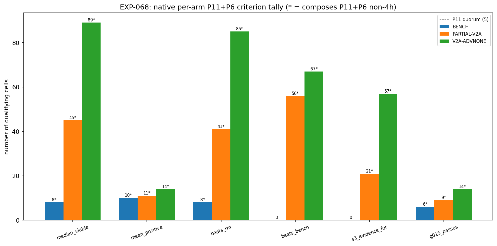
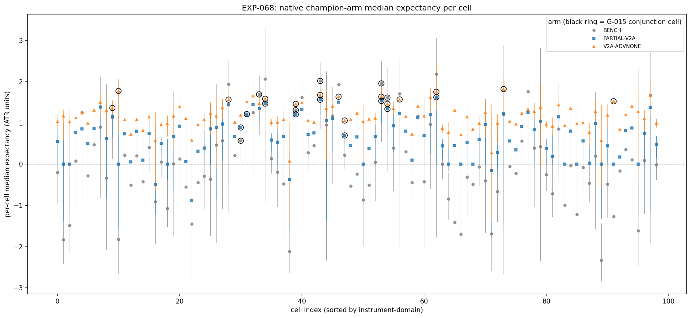
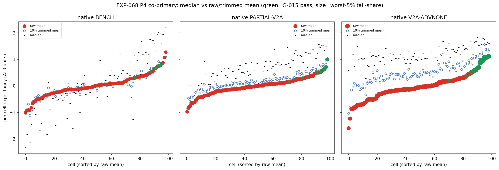

# Experiment Report: EXP-068 — MA(20,50)-Substrate Native Combined Champion (Phase 015 S4/native)

## Status: COMPLETED — PROCEED_TO_SCREEN-candidate (G-015 input; gate not adjudicated here)

**Date**: 2026-06-18
**Instruments**: all 17 VAL-003-admitted; 99 member cells (3 COVERAGE_EXCLUDED: US500-4h, JP225-2h/4h)
**Data Views / Feature Categories**: 5m/15m/30m/1h/2h/4h real domain OHLC; HA candles for harami
detection only; MA(20,50) crossover substrate on real close; native `/STRONG-STAT` (p75, trailing-20
on MA segments); 3 champion arms + 1 hybrid-BENCH P12 check; P15 path-ordered fills; P14 median +
P4 mean co-primary endpoints.

---

## Question

On the native conditioning object (MA-segment `/STRONG-STAT`, 8360-class), does assembling the
per-layer surface winners into the predeclared champion arms — `N-PARTIAL-V2A` (the S3 native winner,
partial exits + 1:1 stop) and `N-V2A×ADV-NONE` (the EXP-060B champion geometry with partial scaling,
never previously computed) — satisfy the **G-015 conjunction** simultaneously: per-cell
median-viable **AND** raw-mean-positive **AND** beats the matched-random-on-MA null, composed at
P11+P6?

## Hypothesis

At least one of the two predeclared champion arms satisfies the full G-015 conjunction (median
`CI_low>0` AND raw-mean `CI_low>0` AND `arm−RM-native CI_low>0`) composed at P11 with the P6 non-4h
rule. **Falsifiable**: if no champion arm satisfies all three simultaneously, the native combined
champion does not meet the G-015 PROCEED criterion.

## Method Summary

Forked EXP-066's validated native pipeline down to 3 native binding arms (BENCH, PARTIAL-V2A,
V2A-ADVNONE) plus a hybrid-BENCH P12 reconciliation check. `N-V2A×ADV-NONE` removes the adverse stop
(implemented by passing an all-`NaN` adverse level to the existing resolver — no `xen/` module
changed), so the MA adaptive cap is the sole stop-out. Per cell: regime-clustered moving-block
bootstrap CIs on the median (binding) and raw mean + 10% trimmed mean + worst-5% tail-share (P4
co-primary); independent arm−RM contrast (P5); paired arm−BENCH contrast (disclosed). G-015
conjunction composed at P11+P6. TRAIN-only; gross; see [analysis-plan.md](analysis-plan.md).

## Key Findings

### Finding 1: Both champion arms compose the full G-015 conjunction

`N-PARTIAL-V2A` composes in **9 cells / 5 instruments / 7 non-4h**; `N-V2A×ADV-NONE` in **14 cells /
9 instruments / 6 non-4h**. Both clear P11+P6. This is the first Phase 015 native read where the
**mean co-primary** clears composition (EXP-066's S3 did not require it). Mechanical readout:
`PROCEED_TO_SCREEN_CANDIDATE`.

### Finding 2: The signal is genuine — present at the single-leg BENCH, not a geometry artifact

The single-leg benchmark already composes the conjunction in **6 non-4h FX cells** (EURUSD-15m/30m,
GBPUSD-1h, NZDUSD-1h/2h, GBPJPY-30m). The non-4h robust core shared by **both** champion arms is 5
cells (GBPJPY-30m, GBPUSD-1h, GBPUSD-5m, NZDUSD-1h, NZDUSD-2h), 4 of which also pass at BENCH. The
mean-positive, RM-beating edge therefore does not depend on the partial-exit / ADV-NONE machinery —
those broaden it. No DE30-truncated cell appears in any G-015-passing set.

### Finding 3: The mean is the binding bottleneck; ADV-NONE recovers it via a tail trade-off

Median viability is broad (PARTIAL-V2A 45, V2A-ADVNONE 89 of 99) but mean-positivity collapses (11
and 14). `N-V2A×ADV-NONE` broadens median viability and beats-RM more than `N-PARTIAL-V2A` (89 vs 45;
85 vs 41) by removing stop-induced negative-median cells (the EXP-060B mechanism), but the P4 closure
classifies it **TAIL_DRIVEN** (63/99 cells tail-share > 0.40) — it buys mean-positive cells by
accepting fat negative tails elsewhere. `N-PARTIAL-V2A` is **PARTIAL_RECOVERY** (1 structural, 0
tail-driven) — the cleaner, bounded-downside champion. The negative mean is **not structural** for
either arm.

### Finding 4: The edge is native/matched-substrate specific (hybrid disclosed, never pooled)

Across the dual-object surface (EXP-061–066) the hybrid object was EVIDENCE_AGAINST at L1/S1/S3 and
INCONCLUSIVE at S2; EXP-067 (hybrid combined champion) is PENDING. The hyb-BENCH arm here is a P12
check only (reconciles EXP-061 H0, 99/99). Consistent with EXP-061: the MA-substrate edge generalises
only when `/STRONG-STAT` is computed on the same MA segment that defines the geometry.

## Conclusion

**Hypothesis SUPPORTED (surface deliverable).** Both champion arms satisfy the full G-015 conjunction
at P11+P6 on the native object, with clean integrity (99/99 reconciliation to EXP-061 M0/H0 and
EXP-066 native PARTIAL-V2A at 1e-9; determinism, causality, ADV-NONE zero-stopout invariant all pass).
EXP-068 therefore delivers a **PROCEED_TO_SCREEN-candidate input to G-015** — the first Phase 015 read
to clear the mean co-primary in composition.

This is a genuine but **narrow** edge: the broad strength is the median; the mean edge is thin (11–14
of 99 cells), `N-V2A×ADV-NONE`'s headline composition is 4h-concentrated (8/14) with a TAIL_DRIVEN
mean structure, and the defensible geometry-independent signal is a ~5-cell non-4h FX core
(GBPUSD/NZDUSD/GBPJPY/EURUSD). **G-015 is not adjudicated here** — the single terminal gate runs after
the full slate (incl. EXP-067 and the cross-object comparison) and must weigh these caveats before any
PROCEED / candidate registration. No candidate slot is consumed; no TEST read.

## Registry Disposition

**Updates applied (registry-relevant):**
- `docs/signal-registry/multiplicity-registry.md` — `CF-HA-HARAMI-001/HYP-021` (EXP-068) advanced
  PLANNED → **CHARACTERISED (PROCEED_TO_SCREEN-candidate; G-015 input)**, with the breadth/concentration
  caveats; **0 candidate slots / 0 TEST reads** retained.
- `docs/signal-registry/candidate-families/harami.md` — added the HYP-021/EXP-068 disposition note;
  refreshed the `MA-SUBSTRATE` native-mode wording per `D0-amendment-001` (parallel first-class
  full-surface, no longer "co-investigated, bounded"). Family stays **REGISTERED / OPEN** (no candidate
  registration here — G-015 only).
- `docs/signal-registry/test-read-ledger.md` — no entry required (TRAIN-only; native population is the
  byte-identical 8360-class EXP-060B/061 set; no new stratum opened; holdouts sealed).

## Limitations

- Narrow mean breadth (mean-positive 11–14 of 99 vs median-viable 45–89); the median is the family's
  broad strength, the mean edge is thin.
- `N-V2A×ADV-NONE`'s G-015 composition is 4h-concentrated (8/14 4h); the load-bearing non-4h breadth
  is 6. The robust geometry-independent core is ~5 non-4h FX cells.
- `N-V2A×ADV-NONE` is TAIL_DRIVEN — its mean recovery accepts fat negative tails in the majority of
  cells.
- Gross only, TRAIN only — a thin mean edge is the most cost-sensitive endpoint and is unverified
  out-of-sample by design.
- Single-object read; the cross-object comparison is disclosed-only until EXP-067 completes.

## Implications for Future Research

- The Phase 015 mean question is partially answered for native: the MA mean ≈ 0 is **not structural**
  and is recoverable in a subset under both champion geometries — but only narrowly, and ADV-NONE's
  recovery is tail-driven. The bounded-downside `N-PARTIAL-V2A` is the safer candidate definition.
- The decisive remaining input to G-015 is a cost-aware / out-of-sample confirmation of the native FX
  core. *(EXP-067, the hybrid combined champion, was dropped after this report — see addendum.)*

> **Addendum (2026-06-18, post-completion): EXP-067 dropped.** By operator direction
> (`D0-amendment-002-drop-exp067.md`), the hybrid combined champion (EXP-067) is **not run** — the
> hybrid object is EVIDENCE_AGAINST across the entire individual surface (no per-layer winner to
> combine) and gates nothing (the native PROCEED-candidate is the independent G-015 path). The hybrid
> object is adjudicated at G-015 on the disclosed surface reads. The Phase 015 experiment slate is
> therefore COMPLETE; recommendation 1 below is superseded.

## Recommended Next Experiments

1. ~~**EXP-067 (hybrid combined champion)**~~ — **DROPPED (Amendment 002)**; the hybrid object is
   adjudicated at G-015 on the disclosed surface reads (EVIDENCE_AGAINST dominant). Next step is the
   single terminal G-015 (operator-adjudicated).
2. **(Post-G-015-PROCEED only) Native FX-core TEST confirmation** — a new scope confirming the non-4h
   FX core under the bounded-downside `N-PARTIAL-V2A` champion on the TEST stratum (consumes the first
   candidate slot + one counted TEST read).
3. **(Post-PROCEED only) Cost-aware + tail-filter follow-up** — re-read the mean co-primary on the FX
   core under costs, and a targeted capped-downside / tail-filter for the `N-V2A×ADV-NONE` TAIL_DRIVEN
   cells (the MEAN_RECOVERABLE lever).

## Artifacts

| Artifact | Path |
|----------|------|
| Scope | [scope.md](scope.md) |
| Analysis Plan | [analysis-plan.md](analysis-plan.md) |
| Code | [code/run_experiment.py](code/run_experiment.py) |
| Audit | [audit.md](audit.md) |
| Results | [results.md](results.md) |
| Governance Reviews | [governance/](governance/) |
| Plots | [plots/](plots/) |
| Key outputs | [results/g015_verdict.json](results/g015_verdict.json), [results/champion_map.csv](results/champion_map.csv), [results/reconciliation.csv](results/reconciliation.csv) |
