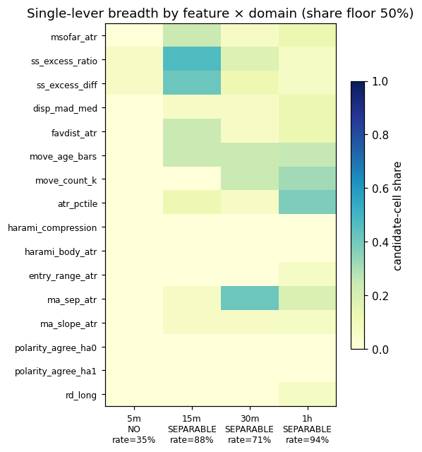

# Experiment Report: EXP-074 — TRAIN-Only Substrate-Wide Loser-Tail Characterization of the 99-Cell MA-Native N-PARTIAL-V2A Harami (CF-HA-HARAMI-001 / HYP-027)

## Status: COMPLETED (characterization; diagnostic — no candidate slot, no TEST/holdout contact)

**Date**: 2026-06-19
**Instruments**: all 17 (full 99-cell MA(20,50)-native substrate matrix)
**Data Views / Feature Categories**: 1-minute time bars → MA(20,50)-segment domain bars
(5m/15m/30m/1h/2h/4h); HA candles for harami detection only; real-price `N-PARTIAL-V2A` returns;
14 causal entry-time features × 3 tail framings.

---

## Question

Before deciding whether to design an exhaustion/tail filter (EXP-075) and eventually spend the
sealed holdout, what — if anything — causally distinguishes the entries that produce the large
losses dragging the `N-PARTIAL-V2A` raw mean below zero (the EXP-071 failure), **across the whole
MA-native substrate**, and is any such separator a substrate-wide property or cell-local noise?

## Hypothesis

Exploratory characterization (TRAIN-only, 0 candidate slots, 0 TEST reads), with two
mechanism-grounded leads: **H1** — the loss tail concentrates at *extreme* `m_sofar/atr_entry`
(exhaustion-magnitude bound; the substrate gates a lower bound but no upper cap); **H2** — the loss
tail concentrates where harami HA polarity disagrees with the MA-segment reversal direction.

## Method Summary

Resolved TRAIN `N-PARTIAL-V2A` events on all 99 cells with the frozen EXP-068/071 machinery (only
the entry mask flipped to TRAIN). Per event, extracted the 14 causal features and ranked each
against three tail framings (T-A extreme q05 + sign; T-B mean-below-median; T-C continuous) using
rank-biserial/AUC, Spearman, phi, Cramér's V, Kruskal–Wallis, with moving-block bootstrap CIs.
Aggregated **per domain** (binding) into a dual-metric four-tier verdict (per-cell any-feature
separability rate + per-feature single-lever breadth); the pooled-substrate verdict is
disclosed-only. See [analysis-plan.md](analysis-plan.md).

## Key Findings

### Finding 1 (headline): H1 exhaustion magnitude is a near-universal separator of the EXTREME q05 loss tail — but the binding verdict masks it

`msofar_atr` (m_sofar/ATR at entry) separates the extreme tail (`r_e < q05`) with rank-biserial
**0.68–0.80 (AUC ≈ 0.84–0.90)**, clearing the 0.15 material bar in **100% of powered cells in every
powered domain** (5m/15m/30m/1h), median effect 0.70–0.79, minimum 0.60, bootstrap 1σ lower bounds
0.60–0.75. **Direction:** higher entry exhaustion ⇒ systematically more likely to land in the worst
5% of outcomes — the catastrophic tail that sank EXP-071's raw mean.

On **every other framing the effect vanishes or flips** (TA_neg ≈ 0, TB_median ≈ 0 to −0.17, TC ≈
−0.07 to −0.22). The pre-registered **all-framing sign-consistency gate** (the anti-p-hacking guard)
therefore disqualifies `msofar_atr` as a "candidate separator," producing 0 candidate cells and
"no uniform lever" in every domain — and the disclosed pooled verdict is `NO_SEPARATOR`.

**The gate failure:** the consistency gate is structurally blind to **tail-shape** effects. The
mechanism is bimodality — high exhaustion makes outcomes bimodal (the reversal either works,
median-positive, or goes catastrophic, q05), so exhaustion is **tail-specific, not
location-monotone**. This is the exact bimodality that broke EXP-071's raw mean while the median and
winsorized mean passed. **The feature that explains why the mean dies is precisely the feature the
consistency gate rejects** — the gate masks the one framing (q05) that diagnoses the mean failure.

### Finding 2: binding per-domain verdict (stands as written) and the stratified lens

| Domain | Binding verdict | Per-cell sep_rate | Read |
|---|---|---|---|
| 5m | NO_SEPARATOR | 0.35 | noisier under the full gate; **still 100% q05 H1 breadth** |
| 15m | SEPARABLE_NO_UNIFORM_LEVER | 0.88 | separable core |
| 30m | SEPARABLE_NO_UNIFORM_LEVER | 0.71 | separable core |
| 1h | SEPARABLE_NO_UNIFORM_LEVER | 0.94 | separable core |
| 2h / 4h | INCONCLUSIVE_POWER | — | 0 powered cells (< 5) |

Pooled (disclosed-only, non-binding): NO_SEPARATOR, 67/99 powered — the trap line. The stratified
read is the correct lens: 15m/30m/1h is the separable core; 2h/4h are simply underpowered.

### Finding 3: H2 refuted; `favdist_atr` is redundant with H1

- **H2 not supported.** `polarity_agree_ha0/ha1` on TA_q05 across all 67 powered cells: median
  effect ≈ −0.003/−0.004, **0% of cells clear 0.15**, range [−0.07, +0.08]. Polarity disagreement
  does not concentrate the loss tail.
- **`favdist_atr` ≡ 0.5·`msofar_atr` exactly** (V2A geometry; ratio 0.5, zero variance, all events).
  Rank-invariant ⇒ identical effects/CIs to H1 in every cell. It is **not** independent
  corroboration of H1 — it *is* H1. Effective causal feature surface is **13, not 14**.

## Conclusion

**Characterization delivered. CAND-001 path NOT closed.** Under its pre-registered question — "is
there a distribution-wide, location-monotone uniform lever?" — the binding verdict is correctly
**No**, in every domain. But that verdict masks the actual finding: **H1 (exhaustion magnitude) is a
strong, broad, replicated separator of the extreme q05 loss tail** — the tail that produced the
EXP-071 raw-mean failure. The mean dies because exhausted entries are bimodal; `msofar_atr`
diagnoses exactly that. This **motivates EXP-075** (a TRAIN-designed, holdout-confirmed exhaustion
**cap**), it does not refute the candidate.

**Governance:** EXP-074's binding verdict stands as written; we do **not** retro-edit the
consistency gate (that would be goalpost-moving on a pre-registered criterion). The resolution is
**framing + routing** — relabel the binding result as "no location-monotone uniform lever; H1 is a
tail-shape lever the gate is blind to by design," and route the gate-collapse decision into
EXP-075's pre-registration.

## Registry Disposition

**Updates applied** (registry-relevant; this change):
- `candidate-families/harami.md`: CF-HA-HARAMI-001 stays **REGISTERED / OPEN**; CAND-001 path **not
  closed**; EXP-074 characterization recorded (q05-tail H1 finding + gate-masking note); routes to
  EXP-075 exhaustion-cap design.
- `multiplicity-registry.md`: HYP-027 / EXP-074 outcome recorded — TRAIN-only diagnostic complete,
  99-cell substrate, **0 candidate slots, 0 counted TEST reads**; binding verdict = no
  location-monotone uniform lever; H1 strong on the q05 tail framing; H2 refuted; `favdist_atr`
  redundant. Item retained (diagnostic outcome — not refuted/blocked, never deleted).
- `test-read-ledger.md`: **unchanged** — EXP-074 spent **0** counted TEST reads (TRAIN-only);
  holdout untouched. Recorded explicitly as a TRAIN-only diagnostic disclosure.

## Limitations

- TRAIN-only; no causal/predictive claim is confirmed — confirmation deferred to EXP-075's holdout.
- In-sample per-cell q05; block bootstrap assumes approximate within-TRAIN stationarity.
- The bimodality reading is an inference from the framing-split effects, not a fitted mixture.
- 2h/4h underpowered (0 powered cells) — the q05-tail H1 read does not extend there.

## Implications for Future Research

- The binding obstacle for the harami family is the **loss tail, not the median edge**, and the tail
  has an identifiable, broad driver (entry exhaustion magnitude). The lever is a **cap**, not the
  existing lower-bound `/STRONG-STAT` gate.
- **Methodological lesson 1 — pooled/unstratified evaluation masks diagnostic structure.** EXP-074's
  single pooled verdict (`NO_SEPARATOR`) hid that 15m/30m/1h are the separable core while 5m is noisy
  and 2h/4h underpowered; the binding read had to be per-domain. Evaluations over heterogeneous
  cells must be **stratified by domain (and disclosed per cell)**, with the pooled number
  disclosed-only — and the masking risk recurs whenever a single global rule is later judged by a
  pooled outcome.
- **Methodological lesson 2 — a gate must not be so rigid it nullifies a worthwhile observation.**
  The all-framing consistency gate is the right anti-p-hacking guard for *location* effects but is
  blind to *tail-shape* effects; it vetoed the strong, broad q05-tail H1 signal. When a guard rejects
  an observation, first check whether the guard is the **wrong instrument for the observation's
  shape** before discarding it — and never retro-edit the guard on the experiment it just judged;
  re-pose the question a priori in a new design (tail-targeted screens pre-register the tail framing).
- Both lessons are carried as **binding requirements** into EXP-075's design
  (`D0-amendment-007`, §"Lessons carried from EXP-074").

## Recommended Next Experiments

1. **EXP-075 (proposed; HYP-028, conditional row already registered)**: TRAIN-only exhaustion-**cap**
   design — an *upper* bound on `m_sofar/atr` at entry (the substrate currently gates only the lower
   bound `m_sofar ≥ p75`). Pre-register the **q05 tail framing** for the H1 lead (transparently
   collapse the consistency gate to the tail framing a priori, not retroactively). Band: **15m–1h
   core** primary; **5m a credible inclusion on the tail framing** (100% q05 breadth). Drop
   `favdist_atr`; do not pursue H2. Lock the filter on TRAIN; defer the one-shot sealed-holdout
   confirmation to a separate future experiment. Requires `D0-amendment-007` before any code runs.

## Artifacts

| Artifact | Path |
|----------|------|
| Scope | [scope.md](scope.md) |
| Analysis Plan | [analysis-plan.md](analysis-plan.md) |
| Code | [code/](code/) |
| Audit | [audit.md](audit.md) |
| Results | [results.md](results.md) |
| Governance Reviews | [governance/](governance/) |
| Plots | [plots/](plots/) |

> Housekeeping (audit Info I1) — DONE: the orphan `plots/02_separator_share.png` was removed; the
> 6 canonical plots remain (`01_cross_cell_leads` … `06_continuity_ranking`).
