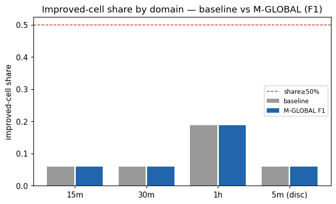

# Experiment Report: EXP-075 — TRAIN Design of an Exhaustion-Cap Entry Filter on the MA-Native N-PARTIAL-V2A Harami (CF-HA-HARAMI-001 / HYP-028)

## Status: COMPLETED (TRAIN-design-and-lock; no candidate slot, no TEST/holdout contact)

**Date**: 2026-06-19
**Instruments**: all 17 (full 99-cell MA(20,50)-native substrate; binding = 15m/30m/1h band core)
**Data Views**: 1-minute time bars → MA(20,50)-segment domain bars (5m/15m/30m/1h/2h/4h); HA candles
for harami detection only; real-price `N-PARTIAL-V2A` returns; exhaustion-cap entry gate.

---

## Question

On the TRAIN stratum, does an entry-time **upper cap on exhaustion magnitude** (`m_sofar/atr`, with
`m_sofar/p75_thr` as a normalizer-robustness form) materially improve the MA-native `N-PARTIAL-V2A`
harami — **lifting the raw-mean leg that failed EXP-071's TEST** while preserving the median edge,
the beats-matched-random property, and tradable event count — **per band-core domain**, and how much
of any improvement is a deployable uniform rule (M-GLOBAL) versus per-cell overfit (M-PERCELL)?

## Hypothesis

**H-CAP:** an upper cap on `msofar_atr` removes enough of the q05 left tail (the EXP-074-identified
driver of the EXP-071 raw-mean failure) to lift the raw mean without breaking the median, beats-RM,
or event count, per band-core domain. Proceed authorized on EXP-074's *framing-resolved* q05-tail
evidence (not a formal `SEPARATOR_FOUND`), with the tail framing pre-registered a priori
(`D0-amendment-007`, operator-ratified 2026-06-19).

## Method Summary

Resolved TRAIN `N-PARTIAL-V2A` events on all 99 cells with the frozen EXP-068/074 machinery
(reconciled to EXP-074 at 1e-9). Applied an entry-time exhaustion cap as a causal boolean subset of
the qualifying events — F1 (`msofar_atr ≤ U`) and F2 (`m_sofar/p75_thr ≤ U'`) — under two selection
methods: **M-GLOBAL** (one pooled-TRAIN-quantile uniform rule from the pre-declared grid
{p85,p90,p95}; the only deployable arm) and **M-PERCELL** (per-cell tuned; diagnostic overfit ceiling,
never deployed). Scored each retained subset on the joint four-leg `improved` criterion
(raw-mean ∧ median ∧ beats-RM-native CI_low>0 ∧ retention≥0.70 ∧ ≥30 retained), bootstrapped with
the frozen moving-block bootstrap and a matched-random null re-drawn at the retained count. Aggregated
**per band-core domain** (15m/30m/1h binding; 5m + band-pooled disclosed-only). See
[analysis-plan.md](analysis-plan.md).

## Key Findings

### Finding 1 (headline): the exhaustion cap is not a lever — `FILTER_INEFFECTIVE`

Neither selection method materially improves any band-core domain:

| Domain | n_pow | base share | M-GLOBAL Δ | M-PERCELL uplift | improved? |
|---|---|---|---|---|---|
| 15m | 17 | 0.059 | 0.000 | −0.059 | no |
| 30m | 17 | 0.059 | 0.000 | **+0.118** | no (< 0.15) |
| 1h | 16 | 0.188 | 0.000 | 0.000 | no |

- **M-GLOBAL adds zero improved cells in every domain**, at the locked U *and across the entire grid*
  (`u_sensitivity` = 0 improved domains at p85/p90/p95, both forms).
- **M-PERCELL** (overfit ceiling) tops out at 30m +0.118 < the 0.15 bar — even per-cell tuning is not
  a lever. F2 (normalizer-robustness, disclosed) gives the same verdict.

### Finding 2: the mechanism — bimodality, shown economically

The cap fails because high `m_sofar/atr` entries are **bimodal** (EXP-074): removing them strips the
big winners along with the catastrophic q05 losers. The cap *lowers* individual-cell means where
high-exhaustion entries are median-positive (e.g. USTEC-1h +0.167 → −0.089 at retention 0.90) — a
near-wash or net negative on the joint criterion. The q05-tail separator EXP-074 identified is real
but **not actionable as an entry cap**: the same feature marks the worst losers and the best winners.
This is precisely the risk the joint four-leg criterion was built to catch, and it caught it.

### Finding 3: robustness and integrity

- **Disposition robust to the bar.** The verdict *tier* turns on `UPLIFT_BAR = 0.15` (30m's +0.118
  would flip to FILTER_OVERFIT at a 0.10 bar), but FILTER_INEFFECTIVE and FILTER_OVERFIT route
  **identically** — do not spend the holdout; route toward closing CAND-001. The 0.15 is a
  pre-registered, analogy-borrowed bar (EXP-074 material bar ↔ AUC 0.575), not calibrated; disclosed.
- **Undefined-feature share ≡ 0.0** (qualifying events always have defined cap features) → retention
  is a clean read of the cap, not feature-undefinedness.
- 67 powered cells identical to EXP-074; baseline `r_e` reconciled at 1e-9; determinism by
  construction. Audit CONDITIONAL PASS (0C/1W/2I).

## Conclusion

**TRAIN-design delivered; the exhaustion-cap lever is refuted.** No entry-time upper cap on
exhaustion magnitude lifts the `N-PARTIAL-V2A` raw mean without eroding the median/beats-RM edge or
event count — not as a deployable uniform rule, not even as a per-cell overfit ceiling, across both
cap forms and the full pre-declared percentile grid. The harami's binding obstacle is an **intrinsic
bimodality of the conditioned entry**, not a removable tail. The locked filter is frozen
(`deployable=false`, sha256-pinned) purely for the record; **it is non-confirmatory and carried
nowhere — no holdout look is warranted.**

This closes the exhaustion-cap route opened by EXP-074. Combined with EXP-071 (TEST_NOT_CONFIRMED)
and EXP-074 (tail driver identified but gate-masked), the three experiments jointly argue the
exhaustion-cap path is exhausted. Whether to **close CF-HA-HARAMI-001/CAND-001** or route to a
*different* lever (not an exhaustion cap) is the **G-016** desk decision; EXP-075 removes the
exhaustion cap from the menu.

## Registry Disposition

**Updates applied** (registry-relevant; this change):
- `candidate-families/harami.md`: CF-HA-HARAMI-001 stays **REGISTERED / OPEN**; EXP-075 disposition
  recorded (FILTER_INEFFECTIVE — exhaustion-cap route refuted on TRAIN); CAND-001 exhaustion-cap path
  closed; family-closure decision routed to G-016.
- `multiplicity-registry.md`: HYP-028 / EXP-075 outcome recorded — TRAIN-design complete, 99-cell
  substrate, 4 arms (F1/F2 × M-GLOBAL/M-PERCELL), grid {p85,p90,p95}, **0 candidate slots, 0 counted
  TEST reads**; verdict FILTER_INEFFECTIVE; no candidate branch registered. Item retained (refuted
  outcome — never deleted/reused).
- `test-read-ledger.md`: **unchanged** — EXP-075 spent **0** counted TEST reads (TRAIN-only); holdout
  untouched. Explicit 0-read disclosure added.

## Limitations

- TRAIN-only; the negative is a TRAIN-design routing result (correctly says a holdout look is not
  warranted). In-sample per-cell q05 and pooled-quantile U; descriptive block-bootstrap CIs.
- Verdict *tier* bar-sensitive (INEFFECTIVE vs OVERFIT at 0.15 vs 0.10); *disposition* is not.
- 2h/4h excluded (0 powered cells) — conclusion scoped to the 15m–1h band core (+5m disclosed).
- `undef_share` reconstructed from EXP-074 (run predated the F4 column; value 0.0, verdict-irrelevant).

## Implications for Future Research

- **The exhaustion-magnitude entry cap is off the menu for this family.** Any further harami work
  must target a *different* lever — the binding obstacle is intrinsic entry bimodality, not a
  removable loss tail, so tail-trimming entry filters are not the route.
- **Methodological confirmation:** EXP-074's joint four-leg criterion (vs a separation gate) was the
  correct instrument — it credited the cap only on the full economic net and correctly returned a
  negative where a tail-only separation screen might have looked promising. The EXP-074 Lessons 1
  (per-domain, never pooled) and 2 (economic endpoint, not a rigid separation gate) held end to end.

## Recommended Next Experiments

1. **G-016 adjudication** (gate, not an experiment): close CF-HA-HARAMI-001/CAND-001 on the
   exhaustion-cap route, or route to a distinct non-exhaustion lever. No further exhaustion-cap
   experiment is warranted; no holdout read is warranted.

## Artifacts

| Artifact | Path |
|----------|------|
| Scope | [scope.md](scope.md) |
| Analysis Plan | [analysis-plan.md](analysis-plan.md) |
| Code | [code/](code/) |
| Audit | [audit.md](audit.md) |
| Results | [results.md](results.md) |
| Governance Reviews | [governance/](governance/) |
| Locked filter (frozen, non-confirmatory) | [results/locked_filter.json](results/locked_filter.json) |
| Plots | [plots/](plots/) (6) |
