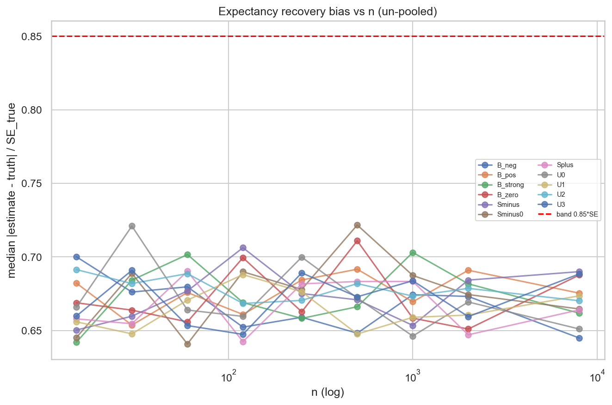
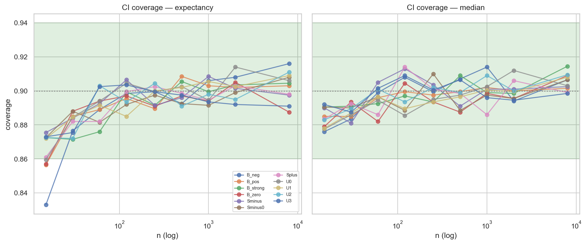

# Experiment Report: EXP-076 — `ASS` Synthetic-Substrate Recovery (`ASS`/VAL-001)

## Status: COMPLETED — RECOVERY_VALIDATED (G-017a) with two governance dispositions

**Date**: 2026-06-20
**Instruments**: none — synthetic return populations only (ATR units)
**Data Views / Feature Categories**: synthetic DGPs (unimodal `U`, skew `S`, bimodal `B`, sparse `SP`);
no market data, no chart types, holdout untouched
**Phase / Gate**: Phase 017 CF-CAPGEO-001 qualifier validation; **G-017a** cheap screen (must pass
before EXP-077)

---

## Question

Before `ASS` is allowed to adjudicate any market signal, can it recover ground truth where ground truth
is known — estimate expectancy and median without material bias, produce calibrated 90% bootstrap CIs,
and shrink sparse signal types toward the pooled prior as designed — across the full
unimodal/skew/bimodal/sparse synthetic span?

## Hypothesis

On synthetic populations with known expectancy/median/shape, `ASS` recovers each estimand to the D0
fixture-calibrated tolerance: per-replicate recovery bias ≤ `0.85·SE_true(n)` for expectancy *and*
median on every `(type, n)`; 90% bootstrap CI coverage in `[0.86, 0.94]`; shrinkage weight `n/(n+k)`
monotone, pulling sparse types (`n ≤ 30`) ≥25% toward the prior and leaving rich types (`n ≥ 2000`)
<5% moved.

## Method Summary

Built the reusable `xen.ass` qualifier (adaptive kNN-bandwidth KDE → empirical-Bayes shrinkage →
within-type percentile bootstrap CI), then over an 11-type × 9-`n` grid drew `R_REP=2000` replicates
per cell and scored each with the un-pooled estimator. Three mechanical D2.1 checks against
fixture-calibrated bands: recovery bias, CI coverage, and SP shrinkage behaviour. Ground truth is
closed-form (expectancy/σ) or 10⁷-draw MC (skew/bimodal medians); every draw is seeded via
`SeedSequence(MASTER_SEED, …)` for byte-identical reruns. See `analysis-plan.md` for the full design
(R1–R4). The verdict is reported **per stratum** (audit C1; binding family doctrine).

## Key Findings

### Finding 1 — Recovery bias: PASS on every cell (the binding G-017a ask)

`ASS` recovers expectancy **and** median to within `0.85·SE_true` on **all 198 `(type, n)` cells**.
Worst observed `median|err|/SE` = **0.722** (expectancy, `Sminus0`/n=500) and **0.702** (median,
`U2`/n=250) — comfortably under the 0.85 band and above the unbiased-estimator floor `0.6745·SE`. The
estimator is unbiased across unimodal, left/right skew (including the **negative-median** skews), and
bimodal shapes.

### Finding 2 — CI coverage: in-band at every n≥30; n=15 expectancy is a disclosed sparse-stress diagnostic

Coverage is within `[0.86, 0.94]` for both estimands at **every n≥30** (0/176 cells out of band;
`verdict_n_ge_30 = PASS`). The only sub-band cells are **4 at n=15, all expectancy** (`U0` 0.8595,
`B_neg` 0.833, `B_zero` 0.857, `B_pos` 0.8565); **median coverage is in-band at every n including
n=15**. Mechanism (audit, independently reproduced): the small-sample percentile-bootstrap
under-coverage of the **mean** (`O(1/√n)`, skew-uncorrected) — expectancy-specific and shape-ordered
(near-nominal on clean normals, worst on bimodal), **not** an implementation defect.

### Finding 3 — Shrinkage: monotone, sparse pull ≥0.25; only the predeclared n=2000 marginal

Weight `n/(n+k)` monotone in n; sparse pull 0.889 (n=15) / 0.80 (n=30) ≥ 0.25; the implemented pull
matches the closed form `k/(n+k)` to ~1e-16. The single literal rich-pull breach is the **predeclared
analytic marginal** at n=2000 (`120/2120 = 0.0566`, ~0.7pp over the <0.05 bound) — surfaced, not
silently passed; n=8000 pull 0.0148.

### Finding 4 — Integrity

Anchor exact (`direct == numpy.mean`, diff 0.0); KDE-integrated vs direct expectancy gap 1.2e-8 (≪ the
0.02·σ flag); determinism byte-identical on all three tables; on-disk CSV hashes match
`integrity.json::table_sha256` (unchanged across the `--rebuild-verdict` regeneration).

## Conclusion

**RECOVERY_VALIDATED (G-017a): `ASS` recovers ground truth — the binding question is answered YES.** The
estimator core is unbiased for expectancy and median across the full synthetic shape span, produces
calibrated CIs everywhere it will be used (n≥30), and shrinks as designed. The two open items are
**governance dispositions on disclosed, mechanism-explained boundary behaviour**, not recovery failures.
`ASS` is a trustworthy *estimator*; calibration under the live protocol (EXP-077) and shape-sight
(EXP-078) remain owed before G-017 `ASS_VALIDATED`.

### Audit history (C1 — verdict representation)

The audit raised **C1 (Critical)**: the original orchestration emitted a single collapsed
`overall_pass_literal` boolean, violating the binding **per-stratum doctrine** (`cf-capgeo-001.md:137,204`;
D0 §D1/§D4). It was fixed as a **representation-only** change — `verdict.json` regenerated per-stratum via
`--rebuild-verdict` from the unchanged, hash-verified tables (**no recompute** of the multi-hour
bootstrap) — and re-audited. **C1 RESOLVED.** Audit verdict: **CONDITIONAL PASS (1C-resolved / 2W / 3I)**.

### Governance dispositions carried to G-017 / Stage 8

- **(a) Coverage binding boundary (dated `D0-amendment`):** ratify coverage binding at **n≥30**, with
  **n=15 expectancy** recorded as a disclosed **sparse-stress diagnostic** (intrinsic bootstrap floor,
  not an `ASS` defect; median coverage holds at n=15). Do **not** change the frozen percentile bootstrap
  now.
- **(b) Downstream propagation guard + n=2000 reading:** carry a binding constraint into
  EXP-077/Phase-018 — no expectancy edge-calls on types with effective n<30 (or treat as weakened
  evidence / defer to the median leg) — and **add a small-n FPR stratum to EXP-077** to confirm
  empirically (real data, moving-block) that the under-coverage does not inflate FPR; that FPR signal,
  not this synthetic floor, is the correct trigger for any future estimator change (BCa/studentized).
  Read the n=2000 rich-pull as monotone-decreasing (≤6% at n=2000, <2% by n=8000) or set `k`/the rich
  anchor explicitly via the same amendment.

### Anti-reversion (per-stratum verdict guard)

To prevent recurrence on subsequent experiments: added a Code-section **"Verdict representation
(per-stratum)"** check + REVISE trigger to `research-pipeline/references/governance-constraints.md`
(read at Stage 4/8 every experiment), and authored
`checkpoints/2026-06-20-017-capgeo-qualifier-validation/LESSON-001-per-stratum-verdict.md` (referenced
from the checkpoint `design.md` guardrails).

## Registry Disposition

**Registry-relevant — updates applied (2026-06-20):**
- `candidate-families/cf-capgeo-001.md`: recorded the EXP-076 G-017a result (recovery validated;
  expectancy-CI sparse-floor caveat at n<30; the two dispositions). Family stays **REGISTERED —
  SCREENING-GATED** pending G-017 (EXP-077/078 still owed).
- `multiplicity-registry.md`: item **`ASS/VAL-001` / EXP-076** outcome set to
  **RECOVERY_VALIDATED_G017a (with dispositions)** — retained, not deleted/renamed.
- `test-read-ledger.md`: **0 counted TEST reads** (synthetic) — ledger **unchanged**; no stratum touched.
- `components/global-techniques.md`: noted `ASS` estimator core recovery-validated at G-017a (unbiased
  expectancy/median; expectancy-CI under-coverage caveat at n<30).

## Limitations

- Synthetic-only: validates the estimator core against known ground truth; calibration under the live
  `WF-EXPANDING` protocol (FPR/MDE/`P(>X)`) and shape discrimination are **not** in scope (EXP-077/078).
- Within-type iid bootstrap is correct for synthetic iid draws; the real-data moving-block variant is
  EXP-077.
- The D1 skew-family `≈mean/≈median` annotations are inconsistent with the frozen `(ξ,ω,α)` for the two
  left-skew members (median-negative, not the annotated positive); immaterial to recovery (ground truth
  computed from the authoritative DGP) — operator may issue a dated D0-amendment if median-positive
  left-skew shapes are required.

## Artifacts

- Code: [`code/run_experiment.py`](code/run_experiment.py) · module [`python/src/xen/ass.py`](../../src/xen/ass.py)
- Results: [`results/verdict.json`](results/verdict.json) (per-stratum), `recovery.csv`, `coverage.csv`,
  `shrinkage.csv`, `ground_truth.csv`, `integrity.json`
- Plots: [`plots/`](plots/) (01 expectancy bias, 02 median bias, 03 coverage, 04 shrinkage)
- Interpretation: [`results.md`](results.md) · Audit: [`audit.md`](audit.md) · Scope: [`scope.md`](scope.md)
  · Plan: [`analysis-plan.md`](analysis-plan.md)
- Governance: [`governance/pre-execution-review.md`](governance/pre-execution-review.md)

## Follow-up (separate future experiments)

- **EXP-077** (`ASS`/VAL-002): dogfood + calibration under `WF-EXPANDING`; add the **small-n FPR
  stratum** per disposition (b).
- **EXP-078** (`ASS`/VAL-003): shape discrimination + `k`-sensitivity; will inform the n=2000 rich-pull
  / `k` decision across the `k`-grid.
