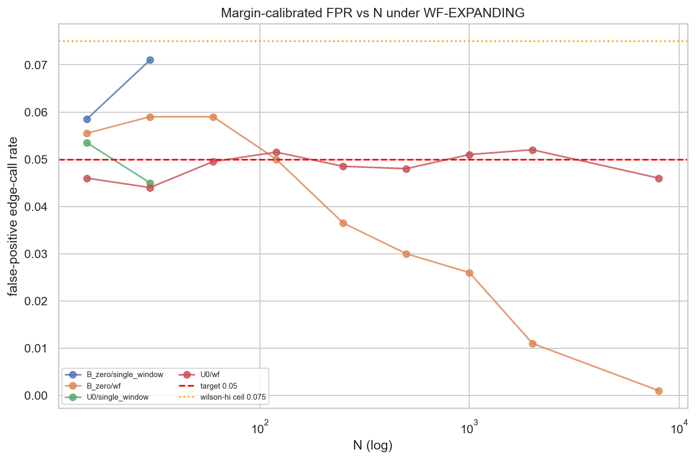
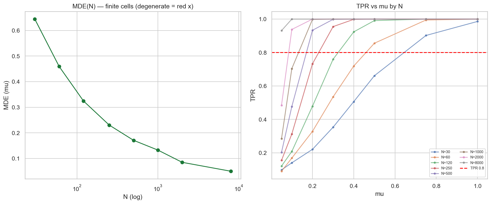
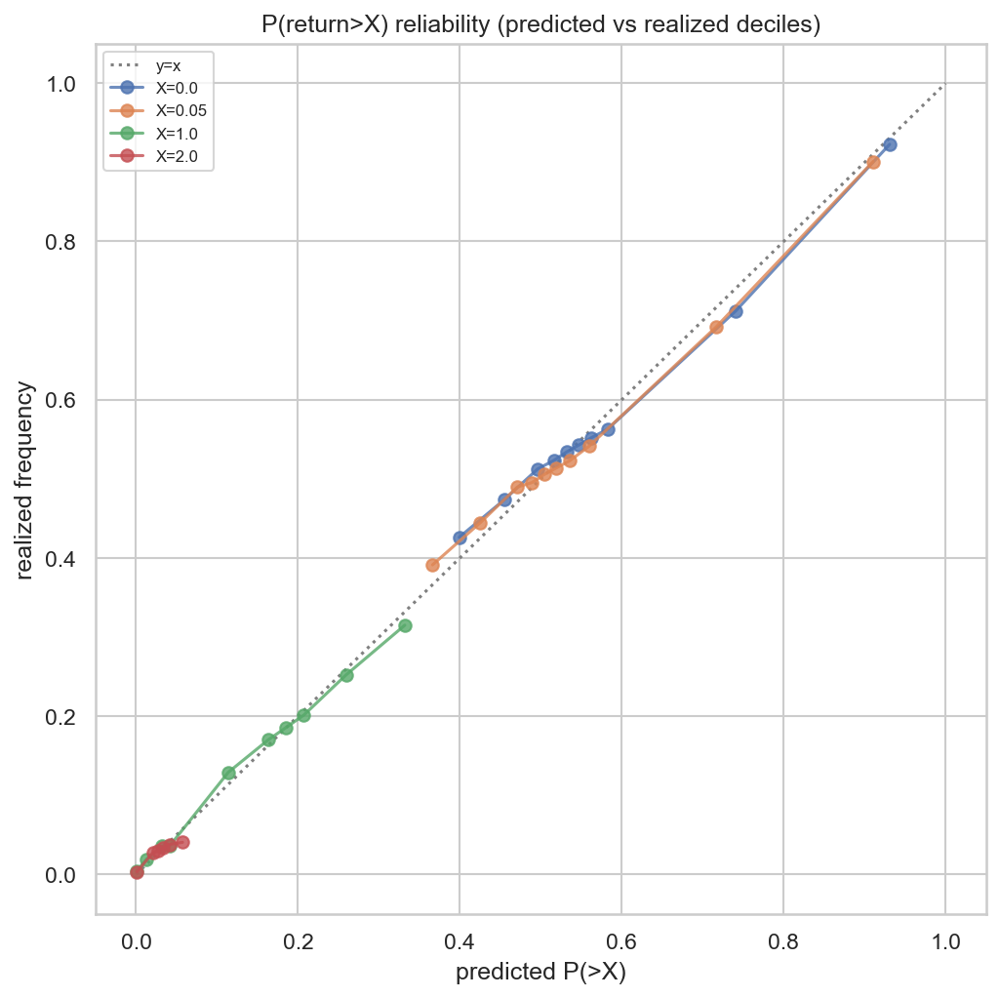
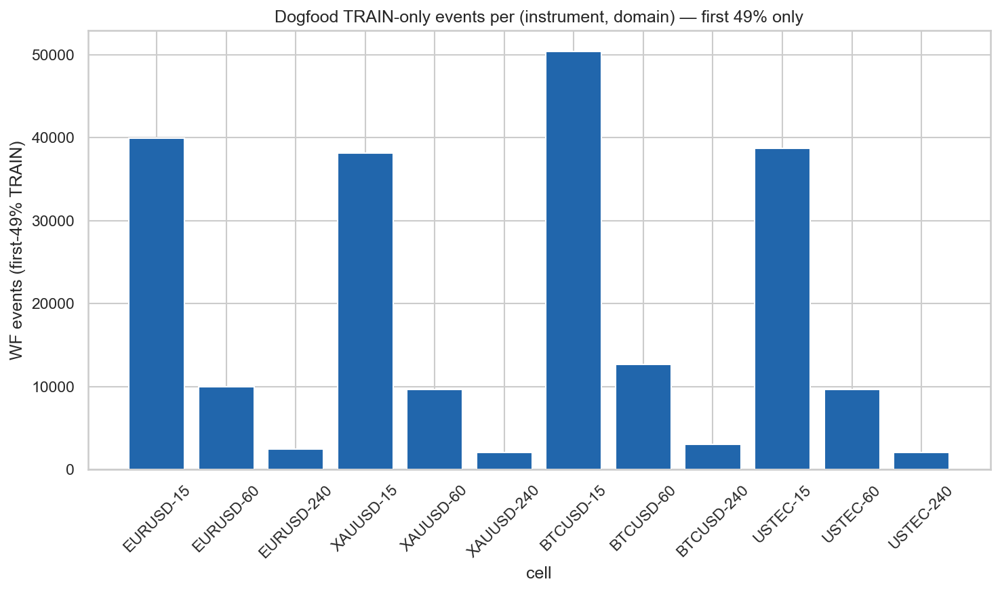

# Experiment Report: EXP-077 — Dogfood + Calibration under `WF-EXPANDING` (`ASS/VAL-002`)

## Status: COMPLETED

**Date**: 2026-06-20
**Instruments**: none for the binding synthetic legs; dogfood uses the 4-instrument core
(EURUSD, XAUUSD, BTCUSD, USTEC) × {15m, 1h, 4h}, current-data **TRAIN-only** (first 49%).
**Data Views / Feature Categories**: frozen D1 synthetic return populations (FPR/MDE/reliability,
binding); current 1-minute time bars sliced to the first-49% TRAIN region, ATR-normalised real-`Close`
forward returns (non-binding dogfood). Phase 017, family CF-CAPGEO-001.

---

## Question

Now that `ASS` recovers known ground truth (EXP-076), does it **control error and stay reliable when
carried by the expanding-window walk-forward protocol that will actually adjudicate Phase 018
candidates** — and is the per-fold counted-read accounting against the 2-read TEST-stratum cap sound
*before* any real TEST contact? And does the whole pipeline run on real bars without touching a single
TEST or holdout row?

## Hypothesis

Under the frozen `WF-EXPANDING` protocol, the `ASS` qualifier controls error and behaves as a usable
yardstick: (1) margin-calibrated FPR ≤ 0.05 (Wilson-hi ≤ 0.075) on every null stratum incl. small-`n`;
(2) finite/non-degenerate MDE for every `n ≥ 30`; (3) `P(return>X)` reliability within the D2.4 band;
(4) counted-read accounting that demonstrably honors the 2-read cap; (5) a real-bar TRAIN-only dogfood
that completes with 0 counted reads; (6) byte-identical determinism. Every result reported **per
stratum** (LESSON-001; D0 §8) — no single collapsed PASS/FAIL is binding.

## Method Summary

Five legs plus a determinism/anchor check, all per stratum. FPR uses a margin `m = Q95(ci_low_1s | null)`
calibrated on a `TAG_CAL` null draw, then validated on an independent `TAG_VAL` draw (breaking any
FPR↔MDE circularity); MDE reads TPR(`CI_low>0`) over a μ-ladder; reliability buckets predicted-vs-realized
`P(>X)` into deciles on held-out folds; accounting drives the D4.1 rule through a scenario table; the
dogfood runs the full `WF-EXPANDING`+`ASS` (moving-block) pipeline on the first-49% real slice. New
reusable module `xen.wf` (protocol + fold-clustered aggregation + counted-read rule); `xen.ass` reused
unchanged plus an in-family moving-block bootstrap. See [analysis-plan.md](analysis-plan.md).

## Key Findings

The headline leg flags (`verdict.json`) are FPR=FAIL, reliability=FAIL, MDE=PASS, accounting=PASS,
dogfood=PASS, anchor+determinism PASS. The audit independently re-derived every number and confirmed
`verdict.json` is a faithful pure function of the result tables; **decomposed per stratum, neither FAIL
is a whole-qualifier failure.**

### Finding 1: FPR error control holds — the U0 "failures" are Monte-Carlo noise around 0.05

The three binding U0 `wf` crossings (n=120/1000/2000, FPR 0.0515/0.051/0.052) sit at z = +0.31/+0.21/+0.41
against a margin **calibrated to** a 0.05 construction target (MC SE ≈ 0.0049); one-sided binomial
P(X ≥ edges | p = 0.05) = 0.39/0.43/0.36 — fully consistent with true FPR = 0.05. Every binding U0 cell
passes the Wilson-hi ≤ 0.075 sub-gate. The bare point-≤-0.05 sub-gate is the wrong instrument for an
estimator calibrated to 0.05 (it crosses ~half the time by chance); the Wilson-hi sub-gate — the
uncertainty-aware part — is satisfied throughout.

**Location-null FPR control holds at every binding `n`.**

### Finding 2: The only genuine FPR signal is a mild, fast-decaying small/mid-`n` inflation on the bimodal mean-null

B_zero `wf` FPR is 0.059 at n=30/60 (z=+1.85, binomial P=0.039 — beyond noise) then collapses
monotonically (0.050 at n=120 → 0.001 at n=8000, z down to −10). The non-binding single-window sub-read
makes it starkest (B_zero n=30 = 0.071, Wilson 0.083 — the only cell breaching the Wilson ceiling). This
is exactly the EXP-076 small-`n` percentile-bootstrap under-coverage on a bimodal mean-null, surfacing as
mild FPR inflation at low effective sample size and vanishing by n ≥ 120. It is a **bounded per-stratum
disclosure**, not a qualifier failure, and triggers the predeclared "defer expectancy edge-calls to the
median at effective-`n` ≤ 60" guard.

### Finding 3: MDE detection power holds at every binding N

`MDE(N)` is finite and non-degenerate at every `n ≥ 30`, decreasing monotonically 0.644 → 0.050 across
n = 30…8000; max TPR reaches 0.986–1.0. The finiteness gate passes everywhere.

### Finding 4: `P(>X)` reliability holds at X=0/0.05/1.0; the X=2.0 failure is a slope-gate artifact, not miscalibration

X = 0/0.05/1.0 pass (slope 0.923/0.926/0.950; max-gap ≤ 0.029). X = 2.0 fails the slope sub-gate (0.652
∉ [0.85,1.15]) **only** — its max-gap is 0.0168 (the best of the four), corr(predicted,realized)=0.934,
and every decile gap ≤ 0.10. Predicted P(>2R) is compressed near zero (range 0.056), so the decile
quantile edges collapse (10→6 bins; decile-0 holds 102,497 of ~210k pairs) and the OLS slope is
ill-conditioned over a tiny predicted span (dropping the large near-zero bucket makes the slope *worse*,
0.378). The qualifier is well-calibrated at 2R in every metric except a slope statistic that has no
stable meaning at this probability scale. The frozen D2.4 gate is **not** retro-edited; the mismatch is a
gate-shape/applicability disclosure.

### Finding 5: Protocol machinery validated — no `PROTOCOL_DEFECT`

Counted-read accounting passes 8/8 scenarios and the cap-honoring trace blocks the third read; the
dogfood completes on all 12 real-bar cells with finite scores, every `train_cutoff = int(int(total·0.7)·0.7)`
(read fraction 0.4900 < 0.491), the TEST stratum and holdout never sliced, **0 counted reads**;
determinism flags all True and the R-anchor `|direct − np.mean| = 0.0`.

## Conclusion

**PARTIALLY SUPPORTED (per stratum) — error-control + protocol legs VALIDATED under `WF-EXPANDING` with
two named, bounded guards. Feeds G-017; does not adjudicate it (G-017 decided post-EXP-078).**

`ASS`'s detection power (MDE), counted-read accounting, real-bar dogfood, determinism, and estimator
anchor all hold cleanly under the expanding-window walk-forward. Error control and `P(>X)` reliability
each hold per stratum subject to one bounded exception apiece: (i) a mild, fast-decaying expectancy-FPR
inflation on the bimodal mean-null at effective-`n` ≤ 60 (the EXP-076 small-`n` under-coverage), handled
by the predeclared defer-to-median guard; and (ii) a slope-sub-gate that is structurally inapplicable to
the compressed-probability 2R stratum, where absolute calibration (max-gap) is in fact excellent. Neither
is a whole-qualifier failure; no protocol leg trips `PROTOCOL_DEFECT`. This matters because it tells
G-017 which `ASS_VALIDATED` legs hold *and* hands forward two precise guards to apply before any Phase
018 TEST contact, rather than a coarse pass/fail.

## Registry Disposition

**Registry-relevant — updates applied** (same change as this report):

- **`docs/signal-registry/candidate-families/cf-capgeo-001.md`** — Phase 017 progress note: EXP-077
  `ASS/VAL-002` error-control + protocol legs **VALIDATED under `WF-EXPANDING` with two per-stratum
  guards**; the gate-row status advanced (EXP-077 done; EXP-078 still owed before G-017).
- **`docs/signal-registry/multiplicity-registry.md`** Phase 017 batch — `ASS/VAL-002` / EXP-077 advanced
  from `PENDING — G0 required` to the validated-with-guards outcome (item retained; per-stratum
  exceptions recorded, not deleted).
- **`docs/signal-registry/components/global-techniques.md`** — `ASS` and `WF-EXPANDING` carry the
  EXP-077 validation note (error control / MDE / reliability / counted-read accounting under the
  walk-forward, with the two guards).
- **`docs/signal-registry/test-read-ledger.md`** — **UNCHANGED. 0 counted TEST reads** (synthetic legs
  touch no market data; the dogfood is confined to the first-49% TRAIN region; the TEST stratum and
  final-30% holdout were never sliced). No stratum tally moves; a maintenance note is appended.
- **Slots:** 0 candidate slots (methodology validation, not candidate screening).

## Limitations

- The binding FPR/MDE/reliability legs run on synthetic populations (iid by construction); real serial
  dependence is exercised only by the non-binding dogfood (moving-block). Phase 018 real strata remain
  the live test.
- R_REP = 2000 gives FPR SE ≈ 0.0049; a hard point-≤-0.05 sub-gate cannot distinguish 0.05 from ~0.052.
- The B_zero `n ≤ 60` guard boundary is specific to the 5-fold `WF-EXPANDING` effective-`n`, not a face-`n`
  property of `ASS`.
- X=2.0 reliability has only 6 populated deciles; the slope statistic is structurally unstable there
  (max-gap and correlation are the reliable readouts).
- The dogfood is a pipeline smoke (expectancy CIs straddle 0 by design) and carries no market-edge claim.

## Implications for Future Research

- G-017 should ratify two predeclared guards rather than reading the leg flags as failures: a
  defer-to-median rule for bimodal/asymmetric mean-null strata at effective-`n` ≤ 60, and a
  minimum-predicted-range applicability condition on the D2.4 slope sub-gate (bind on max-gap when the
  predicted-probability range is compressed).
- The FPR point-≤-0.05 sub-gate vs the Wilson-hi sub-gate question is worth a small protocol-refinement
  scope: a calibrated-to-0.05 estimator will fail a hard point cut ~half the time by chance.

## Recommended Next Experiments

1. **EXP-078 (already slated, `ASS/VAL-003`)**: shape discrimination (bimodal-vs-unimodal flag, closing
   the EXP-074 tail-shape-blind-guard gap) + `k`-sensitivity — the remaining `ASS_VALIDATED` legs feeding
   the G-017 conjunction.
2. **(proposed, new EXP) FPR decision-rule refinement**: replace/supplement the point-≤-0.05 sub-gate
   with a Wilson-hi-only or MC-CI-aware rule, pre-registered before any TEST contact.
3. **(proposed, register-only at G-017/EXP-078 checkpoint)** the two per-stratum guards above as binding
   Phase 018 predeclarations — not acted on in Phase 017.

## Artifacts

| Artifact | Path |
|----------|------|
| Scope | [scope.md](scope.md) |
| Analysis Plan | [analysis-plan.md](analysis-plan.md) |
| Code | [code/run_experiment.py](code/run_experiment.py) |
| Modules | [`python/src/xen/wf.py`](../../src/xen/wf.py) (new), [`python/src/xen/ass.py`](../../src/xen/ass.py) (moving-block extension) |
| Audit | [audit.md](audit.md) |
| Results | [results.md](results.md) |
| Governance Reviews | [governance/](governance/) |
| Plots | [plots/](plots/) |
