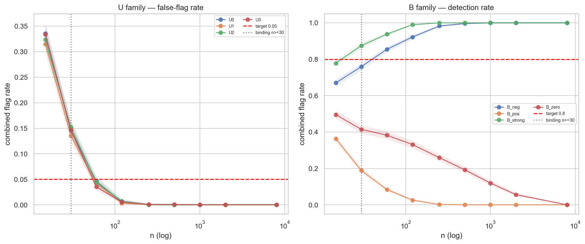
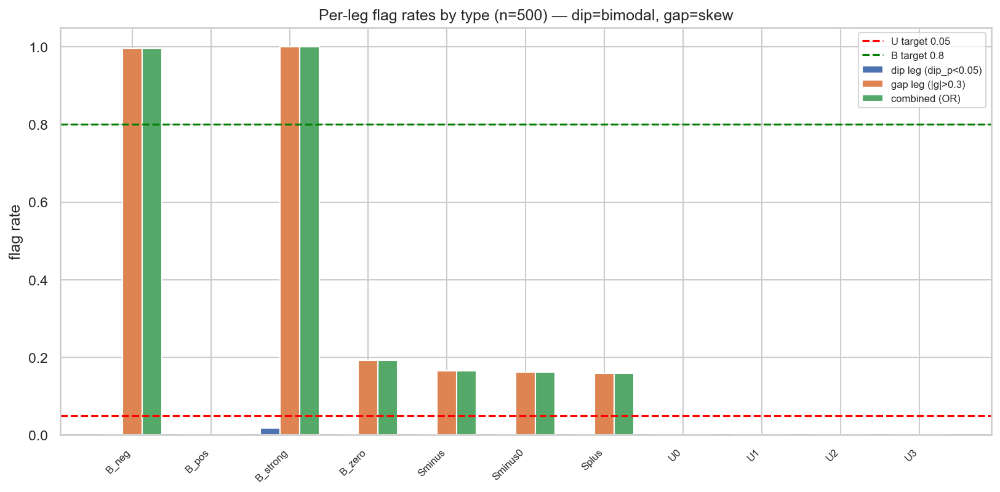
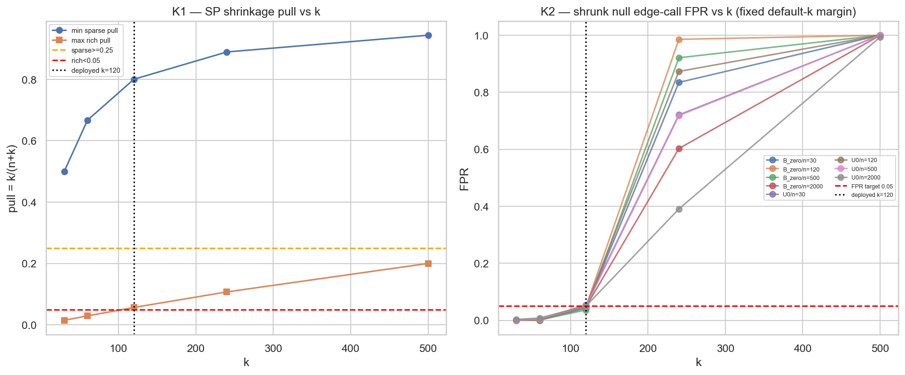

# Experiment Report: EXP-078 — Shape Discrimination + `k`-Sensitivity (`ASS`/VAL-003)

## Status: COMPLETED — DISCOVERY_ONLY (binding double-FAIL, per-stratum)

**Date**: 2026-06-21
**Instruments**: none (synthetic return populations only — ATR units)
**Data Views / Feature Categories**: synthetic DGPs reused from EXP-076 D1 (unimodal `U`, skew `S`, bimodal `B`); no market data, no chart types, holdout untouched
**Phase**: 017 — CF-CAPGEO-001 Qualifier & Protocol Validation (the **last** experiment owed before terminal **G-017**)

---

## Question

Does the frozen `ASS` shape diagnostic `flag = (dip_p < 0.05) OR (|g| > τ_gap=0.30)` actually **flag bimodal /
mean-weak populations versus clean unimodal nulls** at a controlled false-flag rate — closing the EXP-074
tail-shape-blind-guard gap — and is the `ASS` verdict **stable** against its one tunable knob `k` (the
shrinkage constant) across a pre-registered sensitivity band?

## Hypothesis

On synthetic populations of **known** shape: (1) the diagnostic separates bimodal `B` from unimodal `U` at
`τ_gap=0.30` — false-flag on every `U` stratum ≤ 0.05, detection on every `B` stratum ≥ 0.80, for each
`n≥30`; (2) across the grid `k ∈ {0.5×,1×,2×}·median-n ∪ {30,500}`, the `ASS` binding routing is invariant
(or bounded-and-disclosed). **Falsified** if any `U` false-flag > 0.05, any `B` (n≥30) detection < 0.80, or an
undisclosed/unbounded routing flip.

## Method Summary

Monte-Carlo false-positive / true-positive rates (`R_REP=2000`, Wilson 95% intervals) of the frozen
diagnostic on labelled synthetic populations, per `(type, n)`, with a per-leg dip-vs-gap decomposition; plus a
paired `k`-sweep re-running the `k`-dependent `ASS` dispositions (K1 shrinkage behaviour, K2 shrunk-expectancy
null edge-call FPR) across the pre-registered grid. One in-family extension (`xen.ass.shape_diagnostic`); the
`ASS` scoring core was reused unchanged (integrity anchors reconcile to EXP-076/077 at diff 0.0). See
[analysis-plan.md](analysis-plan.md). All thresholds frozen at D0 — measured here, not tuned.

## Key Findings

### Finding 1: The shape diagnostic is structurally blind to the *subtle* version of its target shape (BINDING — FAIL)

B-detection is a clean **two-way split by bimodal shape**, not a uniform failure (pooled "B FAIL" masks it):

| B type | true \|g\| | dip_p (n=8k) | detection n=30 → n=8000 | per-stratum |
|--------|-----------|--------------|--------------------------|-------------|
| `B_strong` | 0.60 | ≈0 (dip-bimodal) | 0.875 → 1.0 | **PASS** |
| `B_neg` | 0.50 | ≈0.12 | 0.7595 → 1.0 | miss @ n=30 only, PASS n≥60 |
| `B_zero` | **0.25** | ≈0.99 | 0.4145 → **0.0** | **FAIL** (decays with n) |
| `B_pos` | **0.067** | ≈0.99 | 0.1885 → **0.0** | **FAIL** (decays with n) |

Strongly-separated bimodals (`B_neg`, `B_strong`) are detected and detection rises to 1.0 with `n`. The subtle
median-positive bimodals `B_zero`/`B_pos` — **exactly the CF-HA-HARAMI-001 "median-positive dominant mode +
minority catastrophic mode" failure shape** — are undetectable, and their apparent small-`n` detection
**decays monotonically to 0** as `n` grows: the signature of a sub-threshold true effect seen only through
sampling noise.

### Finding 2: Mechanism — both diagnostic legs miss the subtle shape

The gap leg fails because the true robust gap is **below** the frozen `τ_gap=0.30` (`B_zero` |g|=0.25, `B_pos`
|g|=0.067, independently re-derived). The dip leg fails because these mixtures are **not dip-bimodal**
(`dip_p≈0.99`): the minority catastrophic mode (10% / 5% at σ=0.6) is too small/broad to carve a density
antimode. Net: neither leg can see the shape; this is **"an effect of a shape the gate cannot see," not "no
effect."** Conclusion for the qualifier: **`ASS` only PARTIALLY closes the EXP-074 gap.**

### Finding 3: Clean-unimodal false-flag is an n=30 binding-floor effect (BINDING — FAIL)

All four `U` types false-flag 0.135–0.152 at `n=30` (above the 0.05 ceiling and the 0.075 Wilson-hi ceiling),
but pass cleanly for `n≥60` (≤0.046) and `n≥120` (≤0.007). A small-sample noise floor of the OR-rule at
`τ_gap=0.30` — the D0 bite-check's reported false-flag 0.000 was evaluated at a single larger `n` and did not
probe the `n=30` floor. Because `n=30` **is** binding, the U leg verdict is **FAIL**; the operating point is
sound for `n≥60`.

### Finding 4: The shrunk-expectancy edge-call FPR is k-fragile (BINDING — ROUTING_FLIP)

K1 (shrinkage behaviour: monotone weight + sparse-pull ≥0.25) is genuinely **INVARIANT** across the grid. K2
(null edge-call FPR) flips `CONTROLLED → INFLATED` at **`k=240` (the 2× multiplier — a core grid point, not an
extreme anchor)** and `k=500`. Mechanism: the margin is frozen at `k=120`; raising `k` shrinks the null
estimate toward the positive pooled prior (`pool_mean=+0.518`); the shrunk null center crosses the fixed margin
between `k=120` (+0.414) and `k=240` (+0.460) → FPR explodes (0.39–0.87 @ k=240), saturating at 1.0 @ k=500.

## Conclusion

**Hypothesis REFUTED on both binding legs → DISCOVERY_ONLY.** All three pre-registered FAIL conditions are met
(a `U` false-flag > 0.05 at n=30; `B` (n≥30) detection < 0.80 for `B_zero`/`B_pos`; an unbounded K2 routing
flip at the 2× multiplier). Determinism holds (byte-identical second pass) so this is **not** a
`PROTOCOL_DEFECT`. The substantive learning: the `ASS` shape diagnostic catches gross bimodality and strong
left-skew but is **structurally blind** to the subtle median-positive minority-catastrophe shape it was
commissioned to catch, its clean-unimodal false-flag needs `n≥60`, and its shrunk edge-call FPR is not robust
to the shrinkage constant. The audit independently reproduced every binding number (mixture means to 1e-4, the
U0 false-flag rates exactly, the sub-0.30 true gaps, the K2 shrink-toward-prior mechanism) and confirmed the
double-FAIL is **implementation-faithful**, not a defect.

## Registry Disposition

**Updates applied (registry-relevant — methodology-validation FAIL feeding G-017 `DISCOVERY_ONLY`):**

- **`multiplicity-registry.md`** (Phase 017 Batch, component-validation ledger): `ASS/VAL-003` / EXP-078
  advanced from `PENDING` to **`SHAPE_DISCRIMINATION_FAIL + k_FRAGILE (DISCOVERY_ONLY input, 2026-06-21)`** —
  item **retained** (not deleted/renamed; this is the file-drawer record of a methodology-validation negative).
  The G-017 gate line annotated: the shape-discrimination leg **fails** the pre-registered band, so the
  `ASS_VALIDATED` conjunction cannot hold → routes to **`DISCOVERY_ONLY`** (terminal adjudication at the
  Phase-017 checkpoint G-017 gate review).
- **`candidate-families/cf-capgeo-001.md`**: recorded as a documented qualifier limitation — `ASS`'s shape leg
  only **partially** closes the EXP-074 gap (subtle-bimodal blind spot `B_zero`/`B_pos`); clean-unimodal
  false-flag requires `n≥60`; the shrunk edge-call FPR is `k`-fragile. Family status **unchanged**
  (`REGISTERED — SCREENING-GATED`): this is a qualifier-validation outcome, not a candidate screen.
- **`test-read-ledger.md`**: **UNCHANGED — 0 counted TEST reads** (synthetic only; no TEST stratum touched, no
  stratum tally consumed). 0 candidate slots.

## Limitations

- Synthetic-only by design — characterizes the diagnostic on **known-shape** populations, not real
  event-return populations (that is Phase 018, gated on G-017 + INFR-003).
- The B-family is four discrete shapes; the detectable/blind boundary is bracketed (`B_neg` |g|=0.50
  detectable, `B_zero` |g|=0.25 blind) but the exact `|g|` crossover near 0.30 is implied, not finely mapped.
- **Audit Warning 1:** the K2 deployed-`k` per-cell `CONTROLLED/INFLATED` labels are self-calibration
  MC-noise-dominated near target (the margin is the Q95 of the same null at `k=120`); read the **across-`k`
  fragility**, not the per-cell deployed-`k` label. The binding `ROUTING_FLIP` is unaffected.
- **Audit Warning 2:** the pre-registered `k`-sweep listed **three** k-dependent dispositions; the run swept
  **two of three** — the EXP-076 D2.1 CI-coverage leg was not swept. Cannot change the verdict (the routing
  already flips on K2), but the k-sweep disclosure is partial.

## Implications for Future Research

- A qualifier leaning on this shape leg alone would still admit a `B_zero`-like population (90% at +0.15, 10%
  catastrophic at −1.5, true mean ≈ 0). The subtle-bimodal blind spot is the primary carry-forward limitation
  for Phase 018 / G-017.
- Phase-018 strata read through the diagnostic should expect a controlled clean-unimodal false-flag only at
  `n≥60`; the shrunk-expectancy edge-call must treat `k` as a load-bearing choice (not assume robustness).

## Recommended Next Experiments (candidate follow-ups only — for the retrospective / G-017 to decide; not initiated)

1. **EXP (proposed)**: finely map the gap-leg `|g|` detectability crossover on a denser bimodal grid around
   `τ_gap=0.30`, to quantify exactly which subtle bimodal shapes `ASS` can/cannot see.
2. **EXP (proposed)**: a complementary minority-mass / left-tail-mass shape detector targeting the
   small-minority-catastrophe shape the current legs miss (do not retro-edit the frozen D2.5 diagnostic).
3. **G-017 decision**: re-anchor or `n`-condition the false-flag operating point so the `n=30` floor is
   controlled, or formally restrict the diagnostic's binding domain to `n≥60`.

## Artifacts

| Artifact | Path |
|----------|------|
| Scope | [scope.md](scope.md) |
| Analysis Plan | [analysis-plan.md](analysis-plan.md) |
| Code | [code/run_experiment.py](code/run_experiment.py) |
| `xen.ass` extension | [../../src/xen/ass.py](../../src/xen/ass.py) (`shape_diagnostic`, `ShapeDiag`) |
| Results (interpretation) | [results.md](results.md) |
| Audit | [audit.md](audit.md) |
| Pre-execution governance | [governance/pre-execution-review.md](governance/pre-execution-review.md) |
| Post-experiment governance | [governance/post-experiment-review.md](governance/post-experiment-review.md) |
| Raw results | [results/](results/) (verdict.json, integrity.json, shape_rates.csv, shape_skew.csv, k_sensitivity.csv, k_sensitivity_shrinkage.csv) |
| Plots | [plots/](plots/) (01_shape_rates_vs_n, 02_leg_rates_by_type, 03_k_sensitivity, 04_dip_vs_gap_scatter) |
