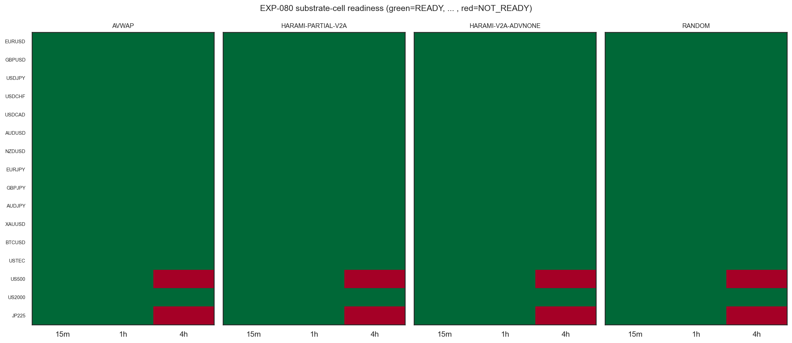
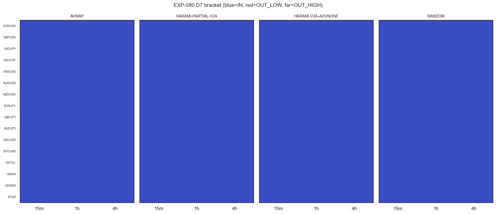

# Experiment Report: EXP-080 — Phase 018 CF-CAPGEO-001 Substrate/Exit Readiness

## Status: COMPLETED

**Date**: 2026-06-22
**Phase**: 018 (CF-CAPGEO-001 data-derived exit / capture geometry), HYP-001, **first experiment**
**Instruments**: 16 (VAL-003 universe minus DE30), VAL-005-admitted 5-year dataset (2021-06-02 → 2026-06-21), first-70% analysis slice
**Data Views**: 1-minute time bars → holdout-fenced 15m/1h/4h domain bars; Heiken Ashi candles for harami detection
**Verdict**: `READINESS_DELIVERED` (readiness/coverage deliverable — **not a market-edge claim**)

---

## Question

For each of the 192 substrate-cells (4 frozen entry substrates × 16 instruments × {15m,1h,4h}), can the
frozen entry detector be computed **deterministically**, **look-ahead-safe**, and **invariant-clean** on
the new 5-year analysis slice under the holdout-fenced `build_domain_bars` construction, with **adequate
per-cell coverage** — *before* any return-structure characterization (EXP-081), exit derivation
(EXP-082), or screening (EXP-083)?

## Hypothesis

Exploratory readiness question (no edge claim): every substrate-cell reproduces deterministically,
causally, and invariant-clean; each cell's realized entry count is produced as a coverage map and checked
against the Phase-017-validated `ASS`-discovery bracket **[15, 8000]** (D7). No exit, return, capture,
expectancy, or P&L metric is computed.

## Method Summary

Deterministic checks dominate: per-cell construction integrity (OHLC/sortedness/holdout-fence +
coverage-based dropped fraction), an entry-detector invariant battery (causality, on-close, structural),
exact two-pass determinism, descriptive entry counts + D7 bracket, and the harami entry-identity
disclosure. One statistical test: a moving-block bootstrap null-FPR machinery sanity at the 5-year scale.
File resolution, holdout-safe loading, and domain construction reuse the VAL-005-validated path
(`discover_infr003_files`, `load_first70`, `build_domain_bars` promoted verbatim to `xen.domain_bars`,
regression-checked frame-identical before any substrate read). See [analysis-plan.md](analysis-plan.md).

## Key Findings

### Finding 1: 184/192 substrate-cells READY; 2 genuine 4h index coverage exclusions

All 16 instruments × {15m,1h,4h} are READY for every substrate except **US500-4h** (dropped 0.251) and
**JP225-4h** (dropped 0.281), which are `COVERAGE_EXCLUDED` by the frozen >0.25 dropped-window band.
Both excluded cells pass every invariant and determinism check — these are **genuine 4h cash-equity-index
coverage-sparsity exclusions**, not substrate or generator defects, consistent with the EXP-043 precedent
(index cells thin at coarse domains; JP225-2h was NOT_READY there). US500-4h is borderline (0.251 vs the
0.25 band). Under the lenient readiness convention these are **excluded from EXP-081 with record**, not
failures. **Member set for EXP-081 = 46 instrument×domain cells (= 184 READY substrate-cells).**

### Finding 2: All 192 cells inside the D7 [15,8000] bracket

![Entry-count distribution vs the [15,8000] band](plots/04_entry_count_distribution.png)

Every substrate-cell's realized entry count falls inside the Phase-017-validated `ASS`-discovery regime:
`SUB-AVWAP` 78–2,641 (sparser, selective); `SUB-HARAMI-PARTIAL-V2A` / `SUB-HARAMI-V2A-ADVNONE` /
`SUB-RANDOM` 284–7,657 (random matched to the harami count). No OUT_LOW/OUT_HIGH cells. `ASS` discovery
is therefore in its validated regime for every cell; the **frozen referee suite is the binding gate
regardless** (D0 §D7).

### Finding 3: Moving-block inference machinery controlled at the 5-year scale (operating regime)

The null-FPR machinery sanity is **CONTROLLED across the entire binding operating regime (n ≥ 120)** at
the validated m_cell scale (N_NULL=5000, N_BOOT=10000): wilson_hi n=120 **0.0642**, n=250 0.0680, n=500
0.0657, n=2000 0.0555 (gate ≤ 0.075). Small-n (n<120) inflation persists (0.081–0.091) but is the
**disclosed Phase-017 EXP-077/078 property** (D0 §D6 Guard (i)), recorded as non-binding by the ratified
D0 §D9 operating floor.

### Finding 4: The two harami substrates share an identical entry population (disclosure)

`SUB-HARAMI-PARTIAL-V2A` and `SUB-HARAMI-V2A-ADVNONE` produce identical entries in every cell (they carry
one MA(20,50)-native `/STRONG-STAT`-conditioned HA-harami entry, differing only by their later benchmark
exit, not applied here) → their entry-level counted-read accounting coincides. An efficiency, not a finding.

## Audit Trail (honest record)

The **initial run returned `SUBSTRATE_REFUTED`** on two verdict-material defects caught by the Stage-5
audit, both since fixed:

1. **Dropped-fraction metric** was mis-denominatored against a continuous 24/7 clock, so it measured
   market-closed time (weekends/sessions) as "dropped windows" — excluding every session instrument and
   leaving only the 24/7 instrument (BTCUSD) READY. Fixed to the validated coverage-based definition
   `(candidate − retained)/candidate` over fence-eligible data-bearing windows (EXP-048/EXP-043 precedent).
2. **Null-FPR probe** ran below the validated machinery scale (N_NULL=1000, N_BOOT=2000), leaving the
   binding n=120 gate decision noise-dominated (wilson_hi 0.0787, a spurious halt). Stage-5 governance
   ruled **re-scale to the validated m_cell machinery** (N_BOOT=10000, N_NULL=5000; the 0.075 gate and
   n≥120 floor unchanged — not goalpost-moving); at that scale n=120 resolves to 0.0642 (controlled).

Both fixed (`experiment-developer`), re-run, and **re-audit PASS** (no Critical/Warning). See
[audit.md](audit.md) (Critical-1/2 + Re-Audit section).

## Conclusion

**`READINESS_DELIVERED`.** The four frozen entry substrates reproduce deterministically, look-ahead-safe,
and invariant-clean on the new 5-year data for 184/192 substrate-cells; coverage is adequate (all cells
in the D7 bracket) and the moving-block inference machinery is controlled at the operating scale. Two 4h
cash-equity-index cells (US500-4h, JP225-4h) are excluded on genuine coverage sparsity, with record.
Phase 018 may proceed to EXP-081 (characterization) on the 46-cell member set. No edge is claimed or
implied — this experiment establishes only that the entries are sound objects to characterize.

## Registry Disposition

**Registry-relevant — updates applied** (readiness/coverage result; 0 candidate slots, 0 counted TEST reads):

- `docs/signal-registry/multiplicity-registry.md` (Phase 018 Batch): EXP-080 recorded **COMPLETE —
  READINESS_DELIVERED**; 184/192 READY; member set 46 instrument×domain cells; **US500-4h + JP225-4h
  `COVERAGE_EXCLUDED` retained with record** (never deleted); D7 192/192 IN_BRACKET; null-FPR controlled
  in the operating regime; 0 slots / 0 TEST reads.
- `docs/signal-registry/candidate-families/cf-capgeo-001.md`: HYP-001 readiness delivered; substrate-cell
  membership established for EXP-081; status advanced (readiness complete → characterization next). No
  edge claim.
- `docs/signal-registry/test-read-ledger.md`: EXP-080 entered as a **DISCLOSURE** (full-analysis-slice
  readiness exposure, no stratum-specific inference) on the INFR-003 5-year strata; **0 counted reads**;
  no tally incremented (consistent with the EXP-043/048 readiness precedent).

## Limitations

- Two 4h index cells excluded on coverage (US500-4h borderline at 0.251); the 4h cash-equity-index corner
  is the thin part of this dataset.
- Small-n null-FPR inflation (n<120) persists as the disclosed Phase-017 property; downstream per-cell
  inference at effective-n<120 must defer to the median / disclose (D0 §D6 Guard (i)).
- The null-FPR operating-floor decision is **scale-sensitive** (resolved only at the validated
  N_BOOT=10000 scale); the n=120 control margin is clear but not large.
- `SUB-AVWAP` is sparser (78–2,641) than the harami substrates (284–7,657); AVWAP per-cell inference will
  carry wider intervals at the same instrument/domain.
- Readiness ≠ edge: nothing here supports or refutes any exit/expectancy/capture claim.

## Implications for Future Research

- The frozen-entry objects are validated for characterization on the new 5-year data; the binding
  programme question (peak → realizable-net-capture conversion) opens at EXP-081.
- 4h index coverage may warrant a scoped addendum (own EXP-ID) if those cells become material — not an
  EXP-080 re-run.

## Recommended Next Experiments

1. **EXP-081 (HYP-002, characterization)**: per-substrate realized return-structure features (D3 inputs) +
   minority-mass / left-tail-mass descriptive read, TRAIN-only, gross, **real prices**, on the 46-cell
   member set (excluding US500-4h, JP225-4h with record).
2. **EXP-082 (HYP-003)** then **EXP-083 (HYP-004)** per the D0 slate (exit derivation; frozen-suite
   screening with the separability gate).

## Artifacts

| Artifact | Path |
|----------|------|
| Scope | [scope.md](scope.md) |
| Analysis Plan | [analysis-plan.md](analysis-plan.md) |
| Code | [code/run_experiment.py](code/run_experiment.py) |
| New modules | [`xen.domain_bars`](../../src/xen/domain_bars.py), [`xen.capgeo_substrates`](../../src/xen/capgeo_substrates.py) |
| Audit (+ Re-Audit) | [audit.md](audit.md) |
| Results interpretation | [results.md](results.md) |
| Pre-execution governance | [governance/pre-execution-review.md](governance/pre-execution-review.md) |
| Results data | [results/](results/) (ready_map.csv, entry_counts_bracket.csv, null_fpr.json, substrate_cell_summary.parquet, run_metadata.json) |
| Plots | [plots/](plots/) |
