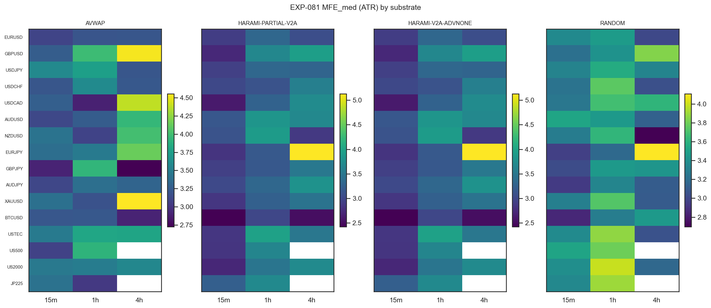
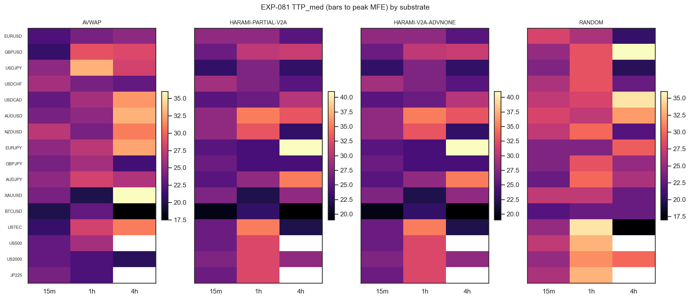
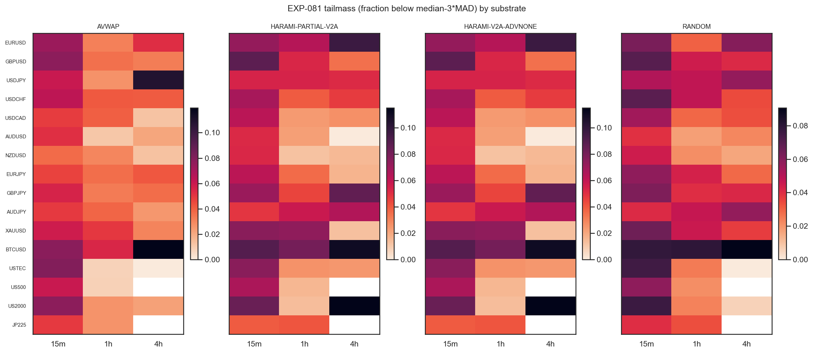
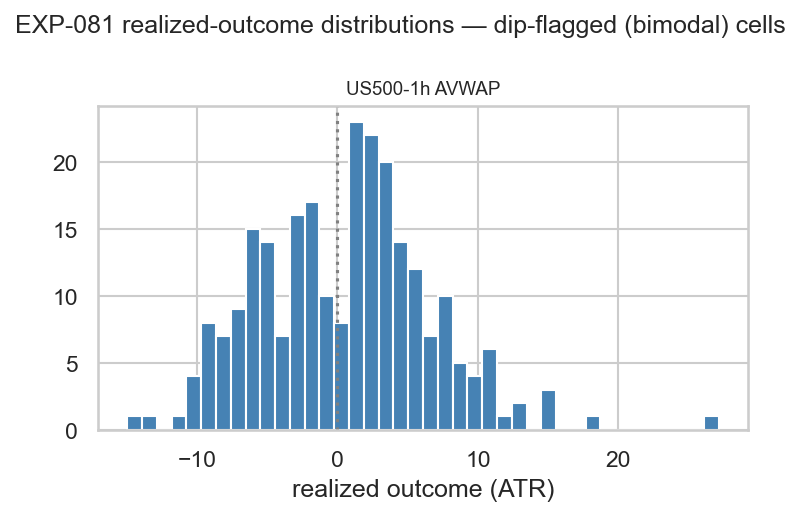
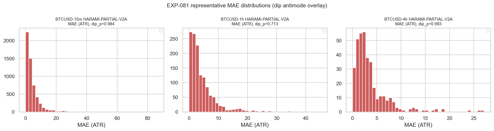

# Experiment Report: EXP-081 — Per-Substrate Realized Return-Structure Characterization (4 Frozen Substrates × 46 Member Cells, 5-Year Data)

## Status: COMPLETED — CHARACTERISATION_DELIVERED

Phase 018 · CF-CAPGEO-001 · HYP-002 · 0 candidate slots · 0 counted TEST reads · audit PASS (0C/1W/3I) · 2026-06-22.

## Question

For each frozen-entry substrate, what does the realized post-entry path (favourable capture, time-to-peak,
adverse excursion, and tail/bimodality shape) look like — and is that structure rich enough to
**mechanically derive** an exit (EXP-082) and to **disclose** whether the catastrophic-minority shape that
closed CF-HA-HARAMI-001 is present?

## Hypothesis

Exploratory characterization (no market-edge claim): each member substrate-cell's realized path over a
per-event adaptive time cap on real prices has a stable, estimable return-structure signature sufficient to
feed the frozen D3 exit-derivation rule and to surface the minority-catastrophe shape per cell.

## Method Summary

- **Member set:** 4 substrates (`SUB-AVWAP`, `SUB-HARAMI-PARTIAL-V2A`, `SUB-HARAMI-V2A-ADVNONE`,
  `SUB-RANDOM`) × 46 EXP-080-READY instrument×domain cells = **184 substrate-cells** (16 instruments ×
  {15m,1h,4h} minus US500-4h, JP225-4h `COVERAGE_EXCLUDED`).
- **Read region:** first-70%-of-analysis **TRAIN sub-split** only (`[0, int(analysis_rows*0.7))`);
  analysis-TEST and the final-30% holdout never sliced.
- **Lookforward:** per-event **adaptive time cap** (validated `xen.expectancy.adaptive_time_caps_by_epoch`,
  cell MA-segment tempo) applied uniformly to all four substrates.
- **Per event (real prices):** lifetime MFE/MAE (ATR, floored ≥0), time-to-peak TTP (bars), realized
  outcome at the cap bar (ATR). **Per cell:** the frozen D3 inputs `MFE_med`, `MFE_q40`, `TTP_med`,
  `TTP_q75`, `MAE_q90`; the shape read `m_anti` (Hartigan dip + KDE antimode of MAE), `tailmass` and `q05`
  (catastrophe boundary `median − 3·MAD` on the outcome); and a **non-binding `ASS`** expectancy/median/tail
  disclosure (G-017 DISCOVERY_ONLY).
- New code: `xen.capgeo_geometry` (path geometry + shape diagnostics). Frozen modules reused unchanged.

## Key Findings

### Finding 1: D3 inputs delivered and EXP-082-ready (all 184 cells)

Every member cell yields the EXP-082 barrier inputs: `T_fav` = `MFE_med`/`MFE_q40` (~3.2–3.4 ATR),
`S_adv` = `m_anti` else `MAE_q90` (≈9–9.7 ATR), `H_cap` = `TTP_q75`/`TTP_med` (~37–52 bars, median ~44).
**No cell below the 30-event floor** (`n_usable` 46–5535, median 1083) → a derived candidate can be formed
for every member cell. Determinism exact (two-pass fingerprint identical); EXP-080 entry reconciliation
184/184; holdout untouched.

### Finding 2: Gross capture availability ≈ random (move availability is not the differentiator)

Per-cell paired vs the within-cell `SUB-RANDOM` control (46 cells): harami's median favourable excursion is
**below** random (17/46 above), AVWAP's is coin-flip (28/46); the outcome-median edge over random is ≈
chance (23–25/46). The frozen entries do not sit on systematically larger gross moves than random timing in
the same regime — the **AVWAP-situation / EXP-047 finding reproduced on the 5-year data**. This is the
empirical justification for the family's exit-first thesis.

### Finding 3: The only structure is the outcome shape — CF-HA-HARAMI-001 signature reproduced

| Substrate | median-of-cell means | median-of-cell medians | cells median>0 | cells median>mean |
|---|---|---|---|---|
| SUB-AVWAP | +0.157 | +0.150 | 26/46 | ≈ symmetric |
| **SUB-HARAMI** (PARTIAL-V2A ≡ V2A-ADVNONE) | **+0.000** | **+0.135** | **30/46** | **33/46** |
| SUB-RANDOM | +0.062 | +0.085 | 28/46 | — |

The harami entry carries a **median-positive edge (+0.135 ATR) whose mean is ≈ 0** — 33/46 cells have
median > mean (catastrophic left-tail drag; `tailmass` 0.0526 > random 0.0437 in 31/46 cells; `q05` ≈ −9
ATR). This is the **exact failure shape that closed CF-HA-HARAMI-001**, now persisting on the disjoint
5-year dataset. AVWAP is weaker but roughly symmetric (mean ≈ median); random is the modest positive
baseline.

### Finding 4: `m_anti` resolves in 1/184 cells — the catastrophe is a heavy tail, not a separated mode

The MAE distributions are predominantly unimodal to the Hartigan dip (dip_p median 0.976; 184 finite, 136
unique p-values; lone resolver US500-1h AVWAP, dip_p 0.032, `m_anti` 1.79). The catastrophe is a heavy
**continuous** left tail, not a cleanly separated second mode — so `m_anti` is correctly NaN almost
everywhere and EXP-082's adverse leg uses the `MAE_q90` fallback in 183/184 cells, **exactly as D9
anticipated**. The dip test is genuinely exercised; this is the data's shape, not a defect.

## Conclusion

**CHARACTERISATION_DELIVERED.** The HYP-002 question is answered: a complete, deterministic, EXP-082-ready
D3-input set exists for all 184 member substrate-cells, and the exit-relevant structure is concentrated in
the **outcome tail/shape**, not in gross favourable availability (which ≈ random). No edge, tradability, or
pass/fail claim is made (gross, TRAIN-only, 0 slots). The result re-confirms, on fresh 5-year data, both
inherited lessons in one place: capture availability is not the lever (CF-AVWAP-001), and the conditioned
harami's mean is killed by a catastrophic minority while its median is positive (CF-HA-HARAMI-001).

## Registry Disposition

**Registry-relevant — recorded.**
- `candidate-families/cf-capgeo-001.md`: HYP-002 advanced from GATED to **COMPLETE —
  CHARACTERISATION_DELIVERED**. Family stays `REGISTERED` / SCREENING (characterization only — no
  candidate slot, no PROCEED/screen verdict).
- `multiplicity-registry.md` (Phase 018 batch): EXP-081 recorded as the HYP-002 characterization that
  **locks the D3 inputs** for the registered `/EXIT-DERIVED` candidates (`D1-MEDIAN-CAPTURE`,
  `D2-TAIL-ROBUST`, `D3-CAPTURE-EFFICIENT`). No new countable item; no item refuted.
- `test-read-ledger.md`: **TRAIN-only disclosure**, 0 counted reads; all 48 strata tallies unchanged
  (EXP-074/075/080 precedent).

## Limitations

- **Gross, no costs; TRAIN-only; no edge verdict.** Net behavior, the analysis-TEST stratum, and the
  holdout are all out of scope.
- **`m_anti` power-limited by design** (1/184) — catastrophe-detection is carried by `tailmass`/`q05` on
  the outcome distribution, as intended.
- **Harami substrates are one object** (identical entries; differ only by later benchmark exits).
- **Per-cell real-vs-random contrasts are descriptive** — the binding matched-control inference is
  EXP-083's separability gate, not run here.
- `ASS` readouts are **non-binding** disclosure (G-017 DISCOVERY_ONLY).

## Implications for Future Research

A data-derived exit's value must come from the **adverse/tail leg** (`S_adv` truncating the catastrophe),
since gross favourable availability ≈ random. The decisive downstream question is **separability**: does
cutting the catastrophe tail also remove the median-positive edge? If yes, it is the same
unfilterable-mechanism trap that closed CF-HA-HARAMI-001; if no, a tail-truncating exit is a genuine
candidate.

## Recommended Next Experiments

- **EXP-082 (HYP-003, derive):** apply the frozen D3 mechanical rule to these inputs; expect the
  differentiation to hinge on `S_adv` (= `MAE_q90` fallback), not `T_fav`.
- **EXP-083 (HYP-004, test + benchmark):** the **separability gate (S1∧S2) is the crux**; per-stratum
  adjudication; counted TEST reads spent only there.

## Artifacts

- Scope: [`scope.md`](scope.md) · Analysis plan: [`analysis-plan.md`](analysis-plan.md)
- Code: [`code/run_experiment.py`](code/run_experiment.py) · Module: [`../../src/xen/capgeo_geometry.py`](../../src/xen/capgeo_geometry.py)
- Results: [`results/substrate_cell_summary.parquet`](results/substrate_cell_summary.parquet) ·
  [`results/per_event_geometry.parquet`](results/per_event_geometry.parquet) ·
  [`results/ass_discovery.json`](results/ass_discovery.json) ·
  [`results/run_metadata.json`](results/run_metadata.json)
- Plots: [`plots/`](plots/) (01 MFE_med · 02 TTP · 03 MAE representative · 04 tailmass · 05 outcome bimodal)
- Audit: [`audit.md`](audit.md) · Interpretation: [`results.md`](results.md) · Governance:
  [`governance/pre-execution-review.md`](governance/pre-execution-review.md)
