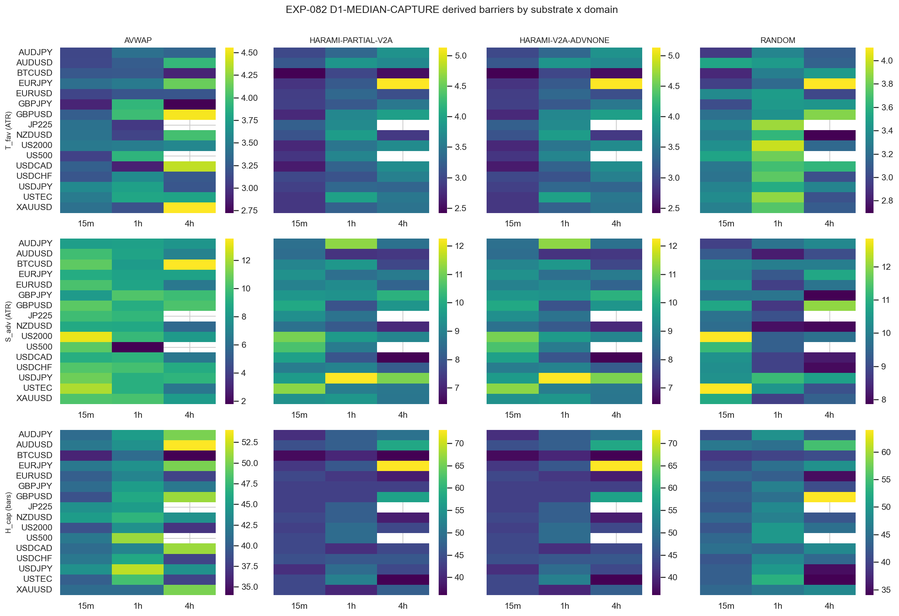
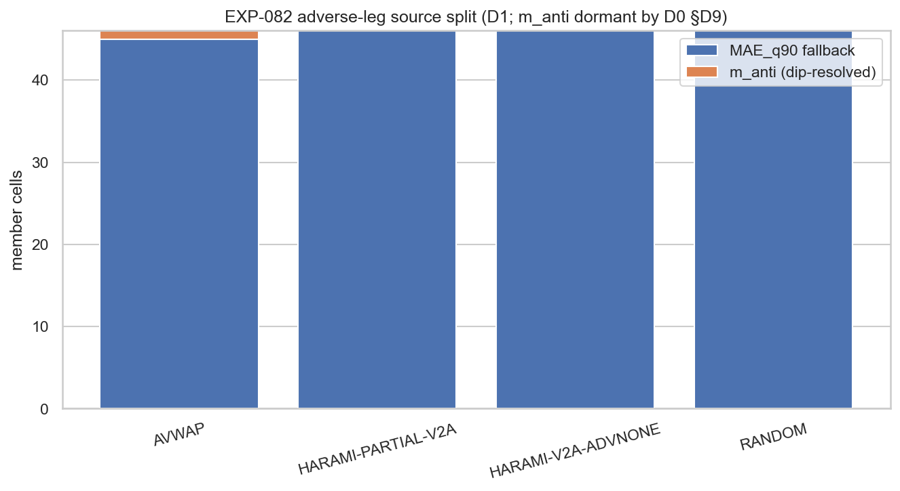
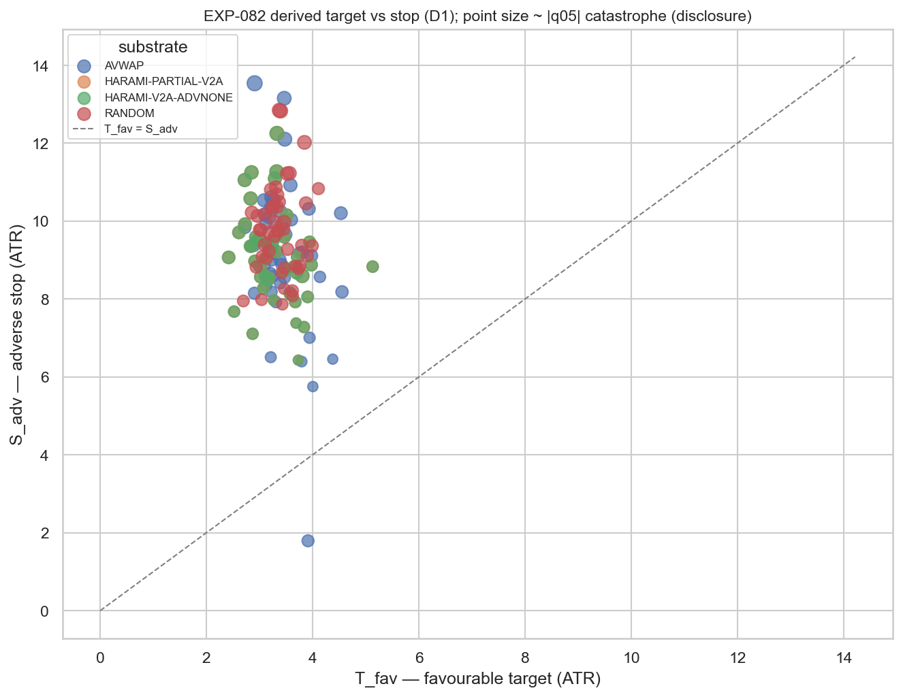

# Experiment Report: EXP-082 — Mechanical Exit Derivation from the Frozen D3 Rule

## Status: COMPLETED — DERIVATION_DELIVERED

**Date:** 2026-06-22
**Instruments:** 16 (VAL-003 universe minus DE30) — via the EXP-081 derived inputs; no market data read here
**Data Views / Feature Categories:** EXP-081 per-cell TRAIN return-structure statistics (no `data/timebars/` read)
**Phase 018 · CF-CAPGEO-001 · HYP-003 (derive) · 0 candidate slots · 0 counted TEST reads · audit PASS (0C/1W/3I)**

---

## Question

Does applying the frozen D0 §D3 mechanical exit-derivation rule to EXP-081's locked per-cell TRAIN
statistics yield a well-defined, estimable triple-barrier exit `(T_fav, S_adv, H_cap)` for every member
substrate-cell, for each of the three registered `/EXIT-DERIVED` candidates — and what do the derived
exits turn out to be?

## Hypothesis

Mechanical derivation, no market-edge claim: the frozen rule maps each cell's EXP-081 statistics to a
well-defined barrier triple for `D1-MEDIAN-CAPTURE`, `D2-TAIL-ROBUST`, `D3-CAPTURE-EFFICIENT`, with the
adverse leg always defined and no candidate formed below the ≥30-event floor. The experiment verdict is
**DERIVATION_DELIVERED** (a completeness/determinism verdict — there is no SUPPORTED/REFUTED axis and no
edge is evaluated).

## Method Summary

Deterministic transformation of EXP-081's `substrate_cell_summary.parquet` (184 cells). The D0 §D3 rule
is implemented as one pure function `xen.capgeo_exits.derive_barriers` (the binding artifact EXP-083
imports and re-fits per walk-forward fold). The orchestrator asserts the EXP-081 provenance fingerprint,
applies the rule per cell, runs the validity/estimability/degeneracy gates, asserts harami-substrate
triple identity, replays for byte-identical determinism, computes a disclosure-only structural-guard
read (no returns/P&L), accounts the D1≡D2 coincidence, and sha256-pins the rule module. No exit is
applied, no return computed, no screen/separability/WF/`ASS` run — those are EXP-083. See
[`analysis-plan.md`](analysis-plan.md) for the exact formulas.

## Key Findings

### Finding 1: The rule is total over the member set — 552/552 valid (DERIVATION_DELIVERED)

Every (cell, candidate) yields `(T_fav>0, S_adv>0, H_cap≥1)`: **552/552 valid**, 0 underpowered,
0 degenerate (`derivation_validity.json`). Barriers are comfortably interior — `T_fav` med 3.31 ATR
(D1/D2) / 2.56 (D3); `S_adv` med 9.21 ATR; `H_cap` 34–73 bars (D1/D2, q75-based) / 17–41 (D3,
median-based). No cell nears the ≥30-event floor (EXP-081 `n_usable` ∈ [46, 5535]). The verdict is
robust, not marginal.

*D1-MEDIAN-CAPTURE `T_fav` / `S_adv` (ATR) and `H_cap` (bars) heatmaps across the 46 instrument×domain
cells, faceted by substrate. The wide `S_adv` (~9 ATR) vs modest `T_fav` (~3 ATR) is visible in every
cell.*

### Finding 2: 3 registered candidates collapse to 2 distinct exit definitions on this snapshot (D1≡D2)

D1 and D2 emit **numerically identical** triples on **184/184** cells (`n_d1_ne_d2 = 0`). D2's
distinguishing operation is `S_adv = min(m_anti, MAE_q90)` when the dip resolves, else `MAE_q90`; the dip
resolves in **1/184** cells (US500-1h `SUB-AVWAP`) where `m_anti = 1.79 < MAE_q90 = 9.00`, so `min`
returns `m_anti` = D1's value. The audit confirmed D1/D2 are genuinely **distinct functions** (a
synthetic `m_anti = 6 > MAE_q90 = 4` makes D1 keep 6.0, D2 tighten to 4.0); they merely coincide here.
D2's tail-robustness lever is therefore **dormant** — the thesis is untested by construction on this
snapshot, not refuted. EXP-083 must carry D1/D2 as distinct functions (a fold subsample could resolve
`m_anti > MAE_q90`) while accounting them as numerically identical on the full-TRAIN snapshot.

*Per substrate, the adverse-leg source across the 46 cells: 1 cell `m_anti`-resolved (US500-1h-AVWAP),
45 `MAE_q90`-fallback — the dip-mode stop is dormant, exactly as the D9 bite-check anticipated.*

### Finding 3: The catastrophe-engaging guard is inert; the adverse leg reverts to a generic wide stop

`s_adv_source` is `m_anti` in only **3/552 rows** and `MAE_q90` in **549/552**. EXP-081 found the MAE
distribution unimodal almost everywhere (`dip_p` median 0.976; only 0.5% of cells dip below 0.05) — the
catastrophe is a heavy **continuous** left tail, not a separated mode. D0 §D3 left-tail-parameterized the
adverse leg on `m_anti` *specifically* as the structural anti-harami guard; with no separated mode to
detect, the guard's instrument is dormant and the leg falls back to a generic `MAE_q90` stop (~9.0–9.7
ATR). The rule degraded gracefully and exactly as D9 predicted — this corrupts no EXP-082 number — but
the *specific* tail-cutting mechanism the rule was built to express is inactive on this data. This is the
same family of shape-blindness G-017 flagged for `ASS` (a mode/dip detector cannot see an unseparated
tail).

### Finding 4 (the crux for EXP-083): the derived exit reproduces the CF-HA-HARAMI-001 failure geometry

The derived stop `S_adv` (≈9.2 ATR `MAE_q90`) sits **at the edge of** the catastrophe magnitude `|q05|`
(≈9 ATR): median `S_adv − |q05| = −0.008 ATR`, with the stop landing *outside* the catastrophe in ~50%
of cells. The reward-to-risk geometry is `T_fav/S_adv ≈ 0.35` (D1/D2) / `0.28` (D3) — a modest target
behind a wide stop. Per substrate the picture is uniform (median `S_adv − |q05|`: AVWAP +0.06, both
harami −0.0001, random −0.08; `T_fav/S_adv` 0.34–0.37). Geometrically, a stop this wide rarely triggers
before the catastrophe completes while the modest target harvests the median — the prior family's
**"harvest the median, leave the catastrophe"** shape reproduced inside the derived exit itself. This
**pre-loads EXP-083's separability gate (S2)** as the crux: a candidate whose net edge survives only
because its wide stop never cuts the catastrophe is a capture-bound / median-only artifact and must fail
S2.

*Derived favourable target vs adverse stop (ATR), coloured by substrate, point size ∝ `|q05|`
catastrophe magnitude. Points cluster far below the `T_fav = S_adv` diagonal (wide stop, modest target),
and `S_adv` co-locates with the catastrophe magnitude — the structural-guard disclosure.*

### Finding 5: Integrity — deterministic, holdout-clean, hash-pinned, harami-identical

Determinism replay byte-identical; harami triple-identity holds (46×3 triples bit-identical across the
two harami substrates); EXP-081 provenance fingerprint asserted (8/8 checks); the `derive_barriers`
module sha256 (`34d03f45…`) matches on-disk so EXP-083's hash-pin assertion will hold; the EXP-081
summary sha256 is pinned; `holdout_untouched = true`, `counted_test_reads = 0`, `candidate_slots = 0`.
The audit independently re-derived all 552 triples from the raw EXP-081 summary with **0 mismatches**.

## Conclusion

**DERIVATION_DELIVERED.** The HYP-003 question is answered yes for all 552 (cell × candidate): the frozen
D3 rule produces a well-defined, estimable triple-barrier exit for every member cell, deterministically
and holdout-clean, and the binding rule function is hash-pinned for EXP-083. There is **no edge,
tradability, or viability claim** (0 slots, 0 counted TEST reads, no exit simulated).

What we learned beyond "the rule ran" is structural and matters for the family: the derived exits are, on
this data, a **wide generic-quantile stop behind a modest target**, with the rule's intended
catastrophe-engaging instrument (`m_anti`) dormant because the catastrophe is a continuous tail, not a
separated mode. The derived stop sits at the catastrophe edge in the exact CF-HA-HARAMI-001 trap geometry
— so **EXP-083's separability gate (S2) is the decisive next test, not a formality.** The family's
central question is now sharply posed: can *any* exit geometry cut the catastrophe tail without removing
the median edge, or is this the same unfilterable-mechanism death a third time?

## Registry Disposition

**Registry-relevant — updates applied.**

- **`docs/signal-registry/candidate-families/cf-capgeo-001.md`:** HYP-003 row advanced **GATED →
  COMPLETE — DERIVATION_DELIVERED**; family stays `REGISTERED` / SCREENING (derivation only — no
  candidate slot, no PROCEED/screen verdict). The D1/D2/D3 triples are locked; the mechanism caveats
  (D1≡D2-on-snapshot, dormant catastrophe guard, harami-trap geometry) are recorded; HYP-004 remains
  GATED.
- **`docs/signal-registry/multiplicity-registry.md`** (Phase 018 batch): EXP-082 recorded as the HYP-003
  derivation that **locks the parameterization** of the already-registered `/EXIT-DERIVED` items
  `D1-MEDIAN-CAPTURE`, `D2-TAIL-ROBUST`, `D3-CAPTURE-EFFICIENT`. **No new countable item; no item
  refuted.** Notes D1≡D2-on-snapshot (distinct functions, coincident values) and the `derive_barriers`
  sha256 pin.
- **`docs/signal-registry/test-read-ledger.md`:** EXP-082 is a derivation off TRAIN-only inputs with
  **no market data read** → recorded as a **disclosure, not a counted read**; all 48 strata tallies
  unchanged (0 counted reads, open), holdout sealed (EXP-074/075/080/081 precedent).

## Limitations

- **No edge / tradability / viability verdict.** Gross, TRAIN-only, no exit applied, no return computed,
  no counted TEST read. EXP-082 *defines and locks* exits; it does not *evaluate* them.
- **D2's tail-robustness lever is dormant** (D1≡D2 184/184) — the tail-robust thesis is untested by
  construction here, not refuted.
- **The catastrophe guard is inert by construction** (the adverse leg reverts to `MAE_q90` in 549/552
  rows because the catastrophe is a continuous tail). The rule degrades gracefully (moves no number), but
  the intended differentiation is inactive on this snapshot.
- **The derived stop sits at the catastrophe edge in a harami-trap geometry** — the single most important
  carry-forward: EXP-083's separability gate (S2) is the crux, pre-loaded toward the derived stops doing
  little tail truncation.

## Implications for Future Research

- The family's outcome now hinges on a single question the derivation has sharpened: is a catastrophe
  tail that is a *continuous heavy tail* (not a separated mode) cuttable by *any* exit barrier without
  destroying the median edge? If not, CF-CAPGEO-001 meets the same abstract death as its two predecessors
  — but this time the death (or survival) is adjudicated by a purpose-built separability gate rather than
  discovered downstream.
- The dormant `m_anti` instrument suggests that if a tail-cutting exit is ever warranted, its adverse leg
  should be parameterized on a *tail quantile* (minority-mass) rather than a *dip mode* — but that is a
  new D0-amendment decision, not an EXP-082/083 scope change.

## Recommended Next Experiments

1. **EXP-083 (HYP-004, test + benchmark — already on the Phase 018 slate):** evaluate all TRAIN-valid
   derived candidates (D1/D2/D3) **and** the conventional benchmark exits under the **frozen referee
   suite (binding)** with the **separability gate (S1 ∧ S2)** as the pre-TEST shape-guard, per substrate,
   on the new 5-year strata. Counted TEST reads are spent only there (D4.1: one frozen WF run per
   stratum, all valid candidates batched, Holm across the {candidate × stratum} grid). S2 is the crux,
   and this result frames it: a candidate whose net edge survives only because its wide stop never cuts
   the catastrophe must fail S2.
2. **(Conditional, own D0 only on a confirmed EXP-083 result):** an operator-directed re-parameterization
   of the adverse leg from a dip-mode detector to a tail-quantile stop — a new D0-amendment, not a scope
   extension.

## Artifacts

| Artifact | Path |
|----------|------|
| Scope | [scope.md](scope.md) |
| Analysis Plan | [analysis-plan.md](analysis-plan.md) |
| Code (orchestration) | [code/run_experiment.py](code/run_experiment.py) |
| Frozen rule module (binding artifact) | [../../src/xen/capgeo_exits.py](../../src/xen/capgeo_exits.py) |
| Derived candidates | [results/derived_candidates.parquet](results/derived_candidates.parquet) · [.csv](results/derived_candidates.csv) |
| Validity report | [results/derivation_validity.json](results/derivation_validity.json) |
| Run metadata (hashes/pins) | [results/run_metadata.json](results/run_metadata.json) |
| Audit | [audit.md](audit.md) |
| Results interpretation | [results.md](results.md) |
| Governance reviews | [governance/](governance/) |
| Plots | [plots/](plots/) |
