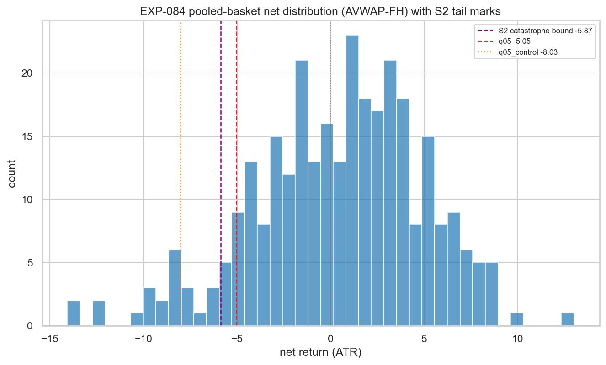
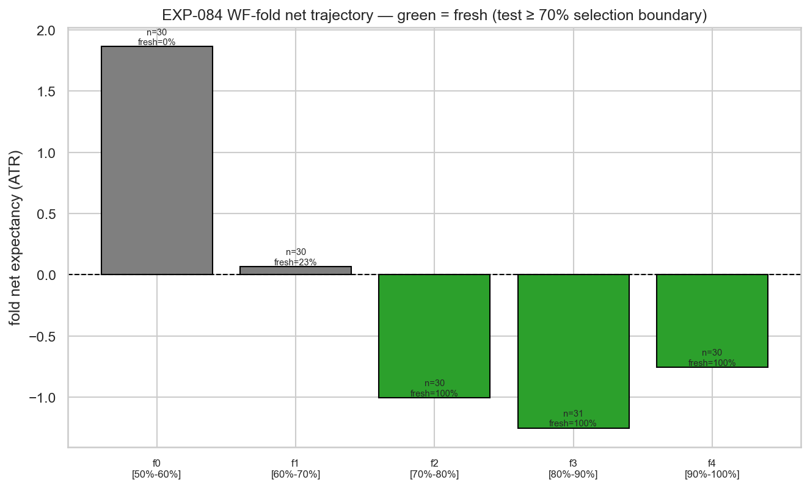
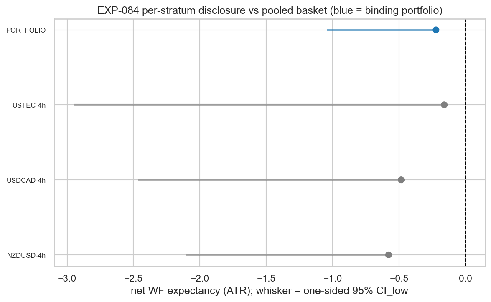
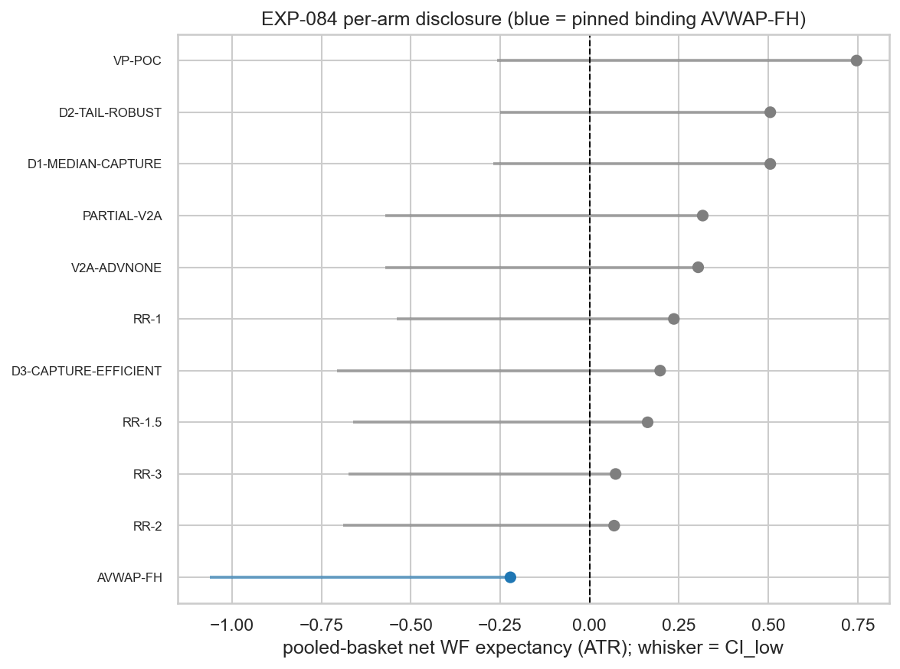

# Experiment Report: EXP-084 — AVWAP-4h Portfolio Confirmation Read of the Net-Surviving Capture Geometry (CF-CAPGEO-001 Phase 018 / HYP-004b)

## Status: COMPLETED — `NOT_CONFIRM`

**Date**: 2026-06-22
**Instruments**: NZDUSD, USDCAD, USTEC (4h), pooled into one portfolio basket
**Data Views / Feature Categories**: 5-year INFR-003 1-minute time bars → holdout-fenced 4h domain bars; `SUB-AVWAP` reversal events; real OHLC, ATR(14) units; NET of the EXP-085 cost model

---

## Question

EXP-085 showed the net edge among the EXP-083 survivors sits entirely in the small, separability-unadjudicated
4h `SUB-AVWAP` cells (NZDUSD/USDCAD/USTEC), robust across exit rule. Pool those three instruments into one
basket, exit them by the simplest parameter-free rule, charge the same costs, and put the basket to a single
honest out-of-sample test — now with enough pooled events to run the catastrophe-tail separability gate (S2)
that small per-cell samples blocked. **Does the basket hold up out-of-sample?**

## Hypothesis

**HYP-004b (confirmation leg of HYP-004).** The AVWAP-4h reversal capture geometry, expressed as a portfolio
basket exited by the pinned parameter-free `AVWAP-FH` and charged the EXP-085 cost model, **CONFIRMS**
net-tradable out-of-sample under the frozen `WF-EXPANDING` adjudication + the D4 G-018 conjunction, with the
separability gate (S1 ∧ S2) now binding on the pooled basket.

## Method Summary

One frozen `WF-EXPANDING` read (initial train 0.50, 5 expanding folds × 0.10, min fold ≥ 30, fold-clustered
moving-block bootstrap, one aggregate verdict) of a single hash-pinned portfolio basket: `SUB-AVWAP` 4h events
pooled across the three instruments by event close-time, exited by the a-priori-pinned `AVWAP-FH`, NET of the
EXP-085 per-instrument round-trip + bar-count financing cost. The binding **G-018 conjunction** requires all
of: WF expectancy `CI_low > m` (FPR-calibrated margin), WF median `CI_low > 0`, beats matched-random
`CI_low > 0`, and TRAIN separability **S1 ∧ S2**. Per-stratum (3) and per-arm (11) reads are **disclosure**
(non-binding). See [analysis-plan.md](analysis-plan.md) for the full method and the binding-suite
instantiation (`xen.wf` aggregate + FPR margin, not the framework-era bps gate stack).

The Stage-4 governance review applied one fix before execution: an *unadjudicable* S2 (pooled WF
initial-train `n_train < 120`) now triggers a process-level HALT to the operator rather than being collapsed
into a binding `NOT_CONFIRM`. At this run `n_train_sep = 152 ≥ 120`, so the HALT did not fire and S2 was
genuinely adjudicated.

## Key Findings

### Finding 1: The basket separates on TRAIN but has no net edge out-of-sample — `NOT_CONFIRM`

Pooled `n = 303`; separability TRAIN region `n = 152`; OOS WF test `n = 151` (5 folds, all ≥ 30). The binding
G-018 conjunction (audit-verified, reproduces exactly):

| Binding leg | Value | Threshold | Pass? |
|---|---|---|---|
| Suite expectancy (FPR margin) | `exp_lo = −1.045` | `> m = −0.0396` | **FAIL** |
| Co-primary median | `med_lo = −0.821` | `> 0` | **FAIL** |
| Beats matched-random | `beats_lo = −0.656` | `> 0` | **FAIL** |
| S1 attribution | `s1_excess_lo = 1.109` | `> m` | PASS |
| S2 tail non-residual | `tailmass 0.0263 ≤ 0.06` ∧ `q05 −5.049 ≥ −8.430` | both | PASS (n=152) |

The basket *separates* on TRAIN (S1 ∧ S2 pass) but **all three economic legs fail** out-of-sample. Pooled net
expectancy is **−0.221 ATR** (CI_low −1.045); net median point estimate +0.058 but CI_low −0.821.

### Finding 2: The apparent edge is selection-region overlap and reverses in the held-back folds (the mechanism)

The frozen §D5 schedule begins WF testing at 50% of the analysis set, but EXP-083/085 *selected* this
candidate on [0, 70%]. The per-fold trajectory makes the consequence visible:

| Fold | Test window | Fresh? | Net expectancy |
|---|---|---|---|
| fold0 | [50.2%, 60.1%] | No (selection-overlap) | **+1.866** |
| fold1 | [60.1%, 70.0%] | No | **+0.068** |
| fold2 | [70.0%, 79.9%] | **Yes** | **−1.002** |
| fold3 | [79.9%, 90.1%] | **Yes** | **−1.250** |
| fold4 | [90.1%, 100%] | **Yes** | **−0.754** |

The two non-fresh folds (overlapping the selection window) are positive; **all three genuinely held-back folds
are negative**. The positive signal that motivated the HYP-004 line is an artifact of evaluating on the region
the candidate was mined from — exactly the Risk-1 concern the scope and plan flagged, now realized.

### Finding 3: Not masking a positive stratum, and exit-invariant

All three member strata are net-negative on expectancy (NZDUSD −0.579, USDCAD −0.484, USTEC −0.159) with
deeply negative CI_lows (−2.100, −2.468, −2.949). USTEC shows a positive *median* point estimate (+0.925) on
n=77, but its mean and CI_low remain negative — a single-instrument median quirk, disclosure-only. The
non-confirmation is **exit-invariant**: none of the 11 exit arms has a positive CI_low (best point estimates
VP-POC +0.747, D1/D2 +0.505 still have exp_lo < 0). No exit rescues the basket OOS.

## Conclusion

**Hypothesis HYP-004b REFUTED at the portfolio level (`NOT_CONFIRM`).**

The AVWAP-4h reversal capture geometry is **not net-tradable out-of-sample as a portfolio**. The basket
separates on TRAIN (the portfolio framing successfully made S2 adjudicable at n=152, and S2 passed — validating
the `AVWAP-FH` pin's "genuine continuous tail" rationale), but carries no positive net edge in the genuinely
held-back folds under any exit. The single apparent positive signal was selection-region overlap and reverses
out-of-sample. This is a well-powered substantive negative (`n_oos = 151`, 0 subfloor folds), not a power
deficit — so `INCONCLUSIVE_SPANS_ZERO` does not apply.

**HYP-004 closes at G-018.** Combined with EXP-083 (the data-derived exits D1/D2/D3 earned no distinctive TRAIN
support) and EXP-085 (the only net-surviving cells were the shape-unadjudicated low-n cells), the family's
"data-derived beats conventional" thesis is **unsupported on TRAIN and now additionally unconfirmed
out-of-sample as a portfolio**. The global holdout was never touched and is **not** released. The read cost
**0 counted TEST reads** (portfolio-aggregate disclosure).

## Registry Disposition

**Registry-relevant: YES — updates applied (this change):**

- `docs/signal-registry/multiplicity-registry.md` — EXP-084 row → **`COMPLETE — NOT_CONFIRM`** (portfolio
  read; 0 candidate slots; no new countable item; outcome recorded and **retained**).
- `docs/signal-registry/candidate-families/cf-capgeo-001.md` — **HYP-004 CLOSED at G-018**; the AVWAP-4h
  portfolio capture geometry is not net-tradable OOS; data-derived-beats-conventional thesis unsupported on
  TRAIN and now unconfirmed OOS; family status advanced accordingly.
- `docs/signal-registry/test-read-ledger.md` — EXP-084 entered as a **disclosure** against NZDUSD-4h /
  USDCAD-4h / USTEC-4h (portfolio-aggregate rule); **0 counted reads**; the three strata become *disclosed*
  (basket-claim-only; future clean per-instrument read mildly weakened, EXP-032 precedent); all 48 strata stay
  **0/2 open**; holdout never read.

## Limitations

- **Disclosure-only scope.** No per-stratum or per-arm *binding* claim is made (portfolio-aggregate rule). The
  three member strata are now disclosed; a future clean per-instrument counted read on them is permanently
  mildly weakened.
- **Negative FPR margin (audit Info 1).** The null-calibrated margin came out mildly negative (`m = −0.0396`),
  making the expectancy leg marginally easier than `> 0`. Conservative-safe here (the expectancy CI_low −1.045
  misses even the negative bar, and the median/beats-random legs fail independently of `m`); flagged for any
  future read where a CONFIRM could hinge on `m`.
- **USTEC median quirk (audit Info 2).** USTEC's positive net median (+0.925, n=77) against a negative mean is
  a single-instrument disclosure signature, not a basket signal.
- **Pooled FX+index basket.** Mixes FX and an index in ATR units by operator ratification; the per-stratum
  disclosure shows the OOS negativity is broad, so pooling did not manufacture the result.

## Implications for Future Research

- The cross-exit invariance of the failure points **away from exit design entirely** — no exit rescues the
  4h AVWAP reversal geometry OOS. Future capture-geometry work should target a different lever (entry /
  availability / regime conditioning), not exit tuning.
- The Phase 018 CF-CAPGEO-001 line has now exhausted its TRAIN screen → cost gate → OOS confirmation sequence
  with no net-tradable OOS geometry found. The phase retrospective should record HYP-004 closed.

## Recommended Next Experiments

1. **EXP-086 (proposed) — regime/availability-conditioned entry, new candidate family.** Target a different
   entry condition for 4h reversals (the EXP-083 finding located any edge in AVWAP-4h *availability*, which
   EXP-084 now shows does not persist OOS). New G0 registration + D0; not a re-run of EXP-084.
2. **EXP-087 (proposed) — clean counted read on the well-powered AUDUSD-1h harami stratum.** It was net-
   *inconclusive* on TRAIN in EXP-085 (median leg failed by a hair); a separate scope could open a counted
   read with its own D0-fixed binding stratum and Holm family — distinct from the disclosed 4h basket.
3. **EXP-088 (proposed) — cost-vs-selection fragility characterization (TRAIN-only).** Quantify how much of
   the 4h gross edge is structurally cost-fragile vs selection-fragile, to decide whether any 4h reversal line
   warrants a future counted read.

## Artifacts

| Artifact | Path |
|----------|------|
| Scope | [scope.md](scope.md) |
| Analysis Plan | [analysis-plan.md](analysis-plan.md) |
| Code | [code/run_experiment.py](code/run_experiment.py) |
| Audit (PASS) | [audit.md](audit.md) |
| Results interpretation | [results.md](results.md) |
| Governance reviews | [governance/](governance/) |
| Results data | [results/portfolio_confirm.csv](results/portfolio_confirm.csv) · [run_metadata.json](results/run_metadata.json) |
| Plots | [plots/](plots/) |
