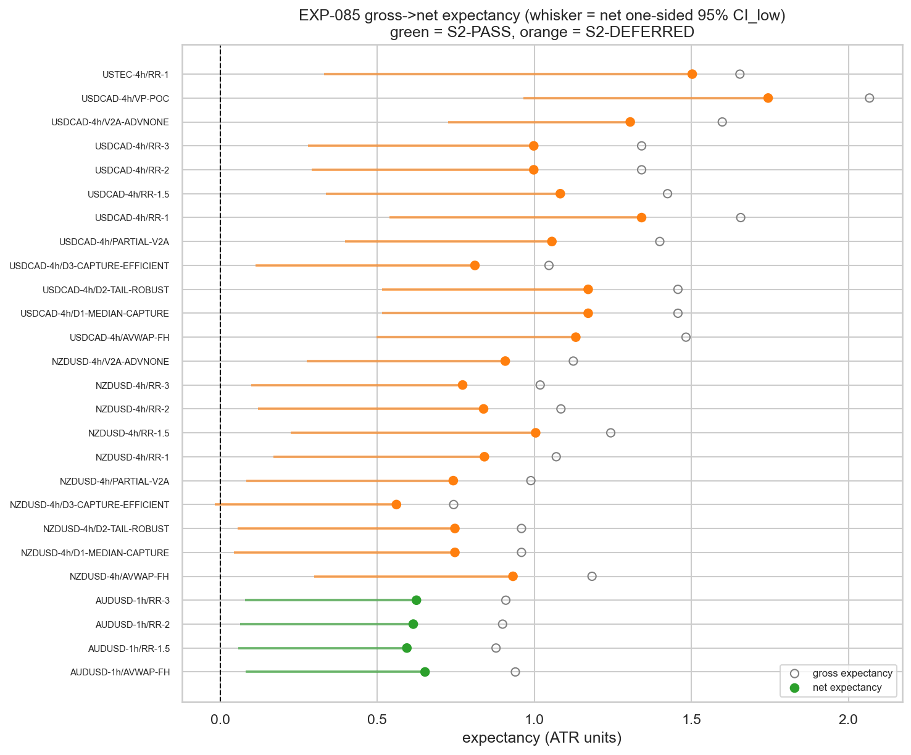
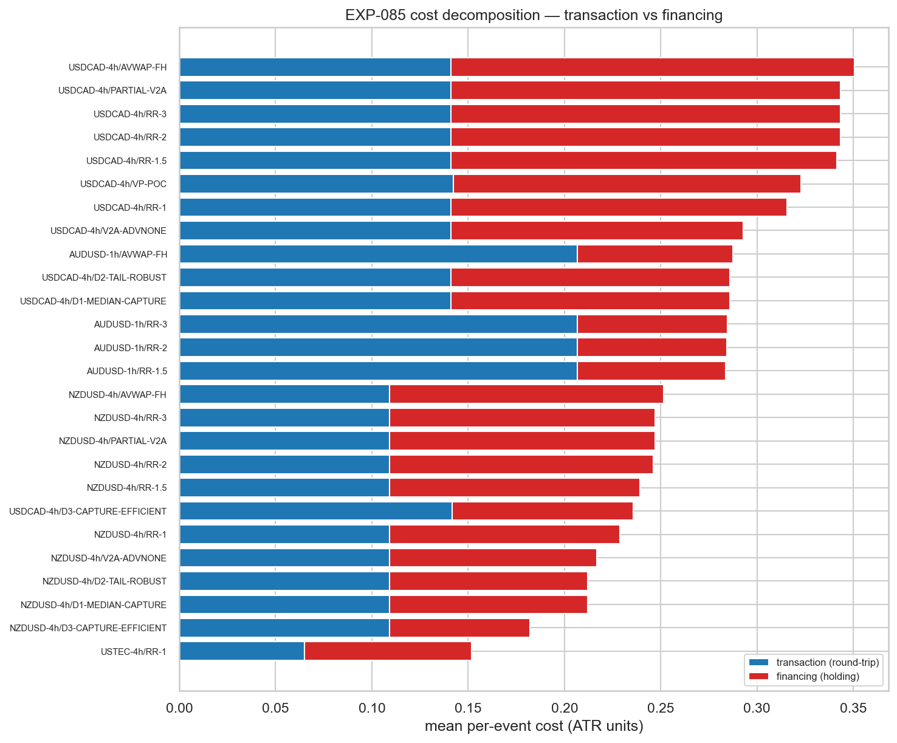
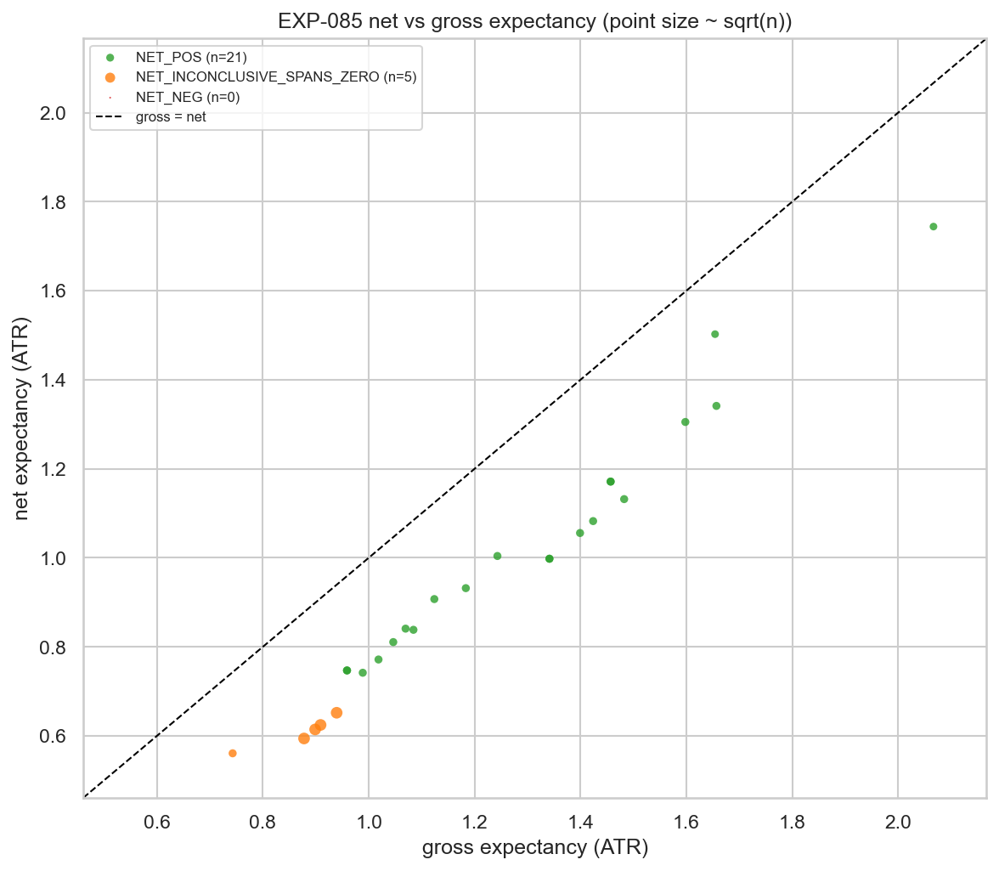

# Experiment Report: EXP-085 — TRAIN-Only Gross→Net Cost Read-Gate on the EXP-083 Valid-Candidate Set

## Status: COMPLETED (read-gate; verdict `NET_SURVIVES`, per-stratum-masked)

**Date**: 2026-06-22
**Instruments**: AUDUSD (1h), NZDUSD / USDCAD / USTEC (4h) — the 4 survivor strata only
**Data Views / Feature Categories**: 5-year INFR-003 / VAL-005 1-minute bars → holdout-fenced `build_domain_bars`; real OHLC, ATR(14) units; frozen substrates `SUB-HARAMI-V2A`, `SUB-AVWAP`

---

## Question

The EXP-083 TRAIN screen found 26 gross survivors whose stops sit at the catastrophe edge (≈ −7.28 ATR per
stop-out), scored with no cost charged. **Do any of them still make money once realistic spread, slippage, and
holding-time financing are subtracted on training data — before spending one of the programme's two lifetime
TEST reads?** If not, we learn it for free (the EXP-030/045 "gross edge, cost-killed" pattern).

## Hypothesis

Read-gate question (TRAIN-only, net): under a predeclared conservative per-event round-trip + adverse-side
financing model (frozen before any TRAIN read), does **any** of the 26 EXP-083 hash-pinned valid
`{candidate × stratum}` survivors retain a **net** per-event edge (net expectancy ∧ net median one-sided
`CI_low > 0`, per stratum)? Verdict ∈ {`NET_SURVIVES`, `NET_FLAT`}.

## Method Summary

The 26 survivors were re-resolved on the TRAIN sub-split by reusing the frozen EXP-083 orchestration (the
`ass_overlay.py` import pattern), asserting the valid-set internal content hash `fa4035f3…` and reconciling
each survivor's gross to EXP-083 (n_resolved exact, mean within 1e-9). A new module `xen.capgeo_cost` recovers
the per-event exit bar that the frozen resolvers discard (line-faithful mirrors of the three resolver
families, reconciled to the frozen `Resolution.ret` within 1e-9 + cls/mask exact), then applies the
operator-ratified cost model in ATR units: `cost_ATR = (RT/1e4 + F/1e4 × holding_days) × P_entry / ATR_entry`;
`net = gross − cost`. Net expectancy and median one-sided 95% `CI_low` were bootstrapped per stratum
(moving-block, `b=max(1,round(m^(1/3)))`, `N_BOOT=10_000`), with the net matched-random excess as a
non-binding companion. See [analysis-plan.md](analysis-plan.md). Constants (operator-ratified Stage 4):
RT/F bps = AUDUSD 4.0/0.8, NZDUSD 4.5/0.8, USDCAD 4.0/0.7, USTEC 5.0/1.2; holding-days = bar-count proxy
`(exit−entry)×domain_minutes/1440`.

## Key Findings

### Finding 1: The pooled `NET_SURVIVES` masks the per-stratum picture — read-eligibility is entirely shape-unadjudicated low-n cells

21/26 survivors are `NET_POS`, but the per-stratum re-derivation (independently confirmed in the audit) is the
binding read:

| Stratum (cell) | substrate / n / S2 | verdicts | net read |
|---|---|---|---|
| **AUDUSD-1h** | `SUB-HARAMI-V2A` / **988** / **S2-PASS** | **4/4 NET_INCONCLUSIVE** | exp_lo **+0.057…+0.081 > 0**, med_lo **−0.020…−0.047 < 0** (median leg fails) |
| NZDUSD-4h | `SUB-AVWAP` / 77 / **S2-DEFERRED** | 9 NET_POS, 1 inconclusive (D3) | net_exp +0.56…+1.00, net_med +0.92…+1.77 |
| USDCAD-4h | `SUB-AVWAP` / 77 (VP-POC 44) / **S2-DEFERRED** | 11/11 NET_POS | net_exp +0.81…+1.74, net_med +1.51…+3.98 |
| USTEC-4h | `SUB-AVWAP` / 46 / **S2-DEFERRED** | 1/1 NET_POS | net_exp +1.50, net_med +2.13 |

**All 21 `NET_POS` are S2-DEFERRED low-n 4h `SUB-AVWAP` cells** (n=44–78; separability never adjudicated,
n<120). **The only S2-PASS, well-powered stratum — AUDUSD-1h (n=988) — is `NET_INCONCLUSIVE` in all 4 cells**:
net expectancy is solidly positive (point +0.59…+0.65 ATR, lower bound > 0) but the net **median** lower bound
sits just below zero, so it fails the conjunction (the CF-HA-HARAMI "median-positive-but-not-quite" signature
in the one cell with the power to resolve it).

*Interpretation:* the pooled "21/26 net-positive" is a disclosure, not a clean tradability signal. Read the
verdict per stratum: every net survivor is shape-unadjudicated low-n; the shape-guarded, well-powered stratum
is net-inconclusive.

### Finding 2: Cost did not kill the gross edge — but only because 4h gross magnitude dwarfs cost

On the 4h cells gross expectancy is 0.74–2.07 ATR (median 1.2–4.4 ATR) against a mean per-event cost of only
0.15–0.35 ATR (~15–30% of gross), so net ≈ gross and stays positive. On AUDUSD-1h the cost bites harder
(`txn_share` 0.72, because a 1h ATR is smaller so the same fixed bps is a larger ATR-unit fraction) — enough
to leave the median leg short, not enough to flip the sign.

*Mechanism:* this is **why EXP-085 did not reproduce the EXP-030/045 cost-kill.** Those families had bps-scale
gross edges where conservative cost was comparable in magnitude → net went negative. Here the ATR-unit 4h
magnitudes are large, so a fixed price-bps round-trip ÷ a large 4h ATR is a small ATR-unit cost — partly a
genuine economic effect (a fixed spread is a smaller fraction of a larger expected move), partly an
ATR-normalization property, and the favourable magnitudes sit **entirely** in n=44–78 cells the EXP-083 ASS
overlay already flagged as small-n-inflated.

### Finding 3: The gate sees the tail; the limitation is power/adjudication, not gate shape

In the 4h cells net median ≫ net mean (e.g. USDCAD/D1 net_med 3.98 vs net_exp 1.17) — the catastrophe tail
persists after cost. The binding **expectancy ∧ median** gate is appropriately tail-aware (the mean leg
incorporates the catastrophic losers, so `net_exp_lo > 0` means the mean survives the tail and cost), unlike
the EXP-074 tail-blind consistency gate. The real limitation is **statistical power and separability
adjudication**: at n=77 the bootstrap mean lower bound clears zero despite the tail, and S2 — the dedicated
catastrophe-separability guard — was deferred on every survivor (n<120).

## Conclusion

**`NET_SURVIVES` (predeclared rule, rule-correct) — qualified per stratum.** ≥1 survivor clears the net
conjunction on TRAIN, so by the scope's predeclared definition the verdict is `NET_SURVIVES` and the 21
`NET_POS` form the read-eligible set. The honest, binding per-stratum reading: **the read-eligible set is
entirely shape-unadjudicated, low-n (n=44–78) 4h `SUB-AVWAP` cells; the only S2-PASS, well-powered stratum
(AUDUSD-1h, n=988) is net-inconclusive (median leg fails).** Realistic cost was not the eliminator the prior
families saw, but the net-positive signal does not coincide with the cells the programme has adjudicated or
powered.

**This experiment authorizes nothing.** It is a read-gate input to the operator's G-018 decision. Per
D0-amendment-002, an EXP-084 counted TEST read opens only on (a) `NET_SURVIVES` (met) **and** (b) additional
operator ratification at EXP-084's own D0. The net matched-random excess companion (positive in all 26 cells)
is non-binding disclosure. Audit PASS (0C/2W/3I); `reconciliation_ok` + `determinism_ok` True; holdout sealed;
0 counted TEST reads; 0 candidate slots.

## Registry Disposition

**Registry-relevant — updates applied in the same change:**

- `docs/signal-registry/multiplicity-registry.md` — the **EXP-085** row advanced from `REGISTERED + SEQUENCED`
  to **COMPLETE — `NET_SURVIVES` (per-stratum-masked)**: 21 `NET_POS` all S2-DEFERRED low-n 4h `SUB-AVWAP`; the
  S2-PASS AUDUSD-1h stratum `NET_INCONCLUSIVE`; 0 candidate slots, 0 counted TEST reads (item retained). The
  **EXP-084** row remains `RESERVED-CONDITIONAL` — leg (a) `NET_SURVIVES` now satisfied, still gated on leg (b)
  operator ratification at EXP-084 D0; the read-eligible set is shape-unadjudicated low-n only.
- `docs/signal-registry/test-read-ledger.md` — **unchanged** (TRAIN-only disclosure; all 48 INFR-003 strata
  stay 0/2 open), per the EXP-074/075/080/081/082/083 precedent.
- `docs/signal-registry/candidate-families/cf-capgeo-001.md` — EXP-085 read-gate outcome recorded under the
  HYP-004 line; family stays `REGISTERED`/SCREENING; G-018 decision pending operator ratification.

## Limitations

- **Read-eligibility ≠ tradability.** All 21 read-eligible survivors are S2-DEFERRED (separability never
  adjudicated, n<120); net-positive on TRAIN at low n is weak evidence.
- **Small-n CIs.** VP-POC (n=44) and USTEC-RR-1 (n=46) are below the EXP-077 Guard-(i) n≤60 threshold where the
  bootstrap expectancy CI is known to under-cover (EXP-076). The audit shows this is **non-material here**: the
  binding rule also requires the robust median leg, which those cells clear, so requiring both legs is
  conservative and no verdict moves.
- **ATR-unit framing.** The favourable 4h cost/ATR ratio is partly a normalization property; a notional-unit
  cost frame would shift the relative cost burden.
- **TRAIN-only.** No referee suite, no WF-EXPANDING, no TEST/holdout contact — robustness eligibility, not
  confirmation. VP-POC carries EXP-083's selection-on-geometry caveat.

## Implications for Future Research

- The G-018 read decision is sharpened: the net survivors (shape-unadjudicated low-n 4h) and the shape-guarded
  well-powered stratum (AUDUSD-1h, net-inconclusive) are **disjoint** — neither is a clean confirm target.
- The CF-HA-HARAMI median-positive/mean-killed shape (EXP-081/082) persists into the net read on the one
  well-powered cell, consistent with the family's central difficulty.

## Recommended Next Experiments

These are inputs to the operator's G-018 decision, framed as candidate new scopes (not a recommendation to
spend a lifetime TEST read):

1. **G-018 decision (operator):** decline EXP-084 (close HYP-004 at G-018, 0 lifetime reads) vs ratify a
   narrow read. EXP-085 shows neither candidate target is clean: 4h survivors are shape-unadjudicated/small-n
   inflated; AUDUSD-1h fails the median leg on TRAIN.
2. **EXP-084 (reserved-conditional, only if ratified):** a narrowly-scoped counted read under the frozen
   cost-calibrated referee suite, binding stratum + Holm family fixed in its own D0 — explicitly choosing
   between AUDUSD-1h and the 4h survivors, not pooling them.
3. **(new TRAIN-only scope, no read):** a TRAIN-only S2 power-extension or notional-unit cost reframing to test
   whether the 4h net-positivity is separability-survivable and cost-frame-robust before any read is
   contemplated.

## Artifacts

| Artifact | Path |
|----------|------|
| Scope | [scope.md](scope.md) |
| Analysis Plan | [analysis-plan.md](analysis-plan.md) |
| Code | [code/run_experiment.py](code/run_experiment.py) · new module [`xen.capgeo_cost`](../../src/xen/capgeo_cost.py) |
| Audit | [audit.md](audit.md) |
| Results | [results.md](results.md) |
| Governance Reviews | [governance/](governance/) |
| Plots | [plots/](plots/) |
| Results data | [results/cost_readgate.csv](results/cost_readgate.csv) · [results/valid_net_set.json](results/valid_net_set.json) · [results/run_metadata.json](results/run_metadata.json) |
