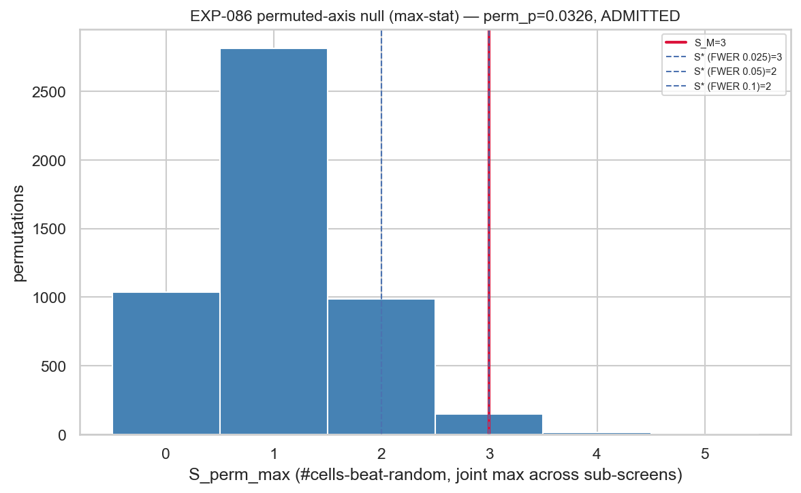
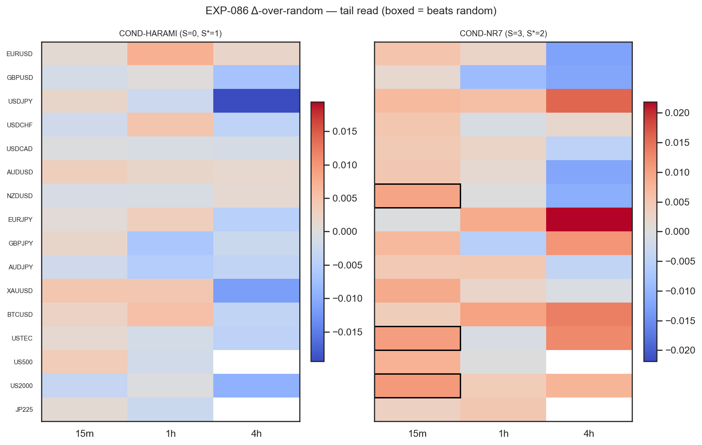

# Experiment Report: EXP-086 — Screen M: Single-Series Magnitude / Non-Directional Availability

## Status: COMPLETED — `SCREEN_DELIVERED`; provisional disposition `ADMITTED` (NON-BINDING, pending G-019)

**Date**: 2026-06-22
**Phase**: 019 (Family-Selection Availability Screen) · **Axis**: M — single-series magnitude · **Hypothesis**: `CF-VOLEXP-001/HYP-001`
**Instruments**: 16 (VAL-005 universe) × {15m, 1h, 4h} = 46 EXP-080-READY member cells (US500-4h, JP225-4h `COVERAGE_EXCLUDED`)
**Data Views / Feature Categories**: 1-minute time bars → 15m/1h/4h domain bars (real OHLC); two single-series compression primitives (raw HA-harami inside-bar; real-OHLC NR7). TRAIN sub-split only; final-30% holdout never touched.

---

## Question

After a single instrument goes "quiet" (a compression signal), does it then move *more than chance* — not in a direction, just in raw size — and is any predictable size big enough to beat a two-sided trading cost? This is a **family-agnostic availability screen**, not an edge or tradability test. Its only deliverable is the realized statistics that the terminal G-019 gate converts into an admit / exonerate / inconclusive disposition for the single-series-magnitude cell of the availability 2×2.

## Hypothesis

> Conditioned on existing single-series compression primitives, does forward **non-directional** availability beat a matched within-instrument random control by more than the multiplicity-adjusted permuted-axis null (D2b) at the realized cell count — on **either** of two separately-reported reads (typical-range; tail/bimodality) — and does any predictable range clear a **two-sided** cost?

The two reads are kept strictly separate; a pooled `|move|` number is prohibited (D3.M).

## Method Summary

Per member cell × primitive, over each event's adaptive time cap on **real** domain OHLC, two strictly-separate per-cell Δ-over-matched-random reads were computed: (1) **typical-range** = median of the direction-agnostic symmetric excursion `max(MFE, MAE)`; (2) **tail** = `tailmass` (fraction below `median − 3·MAD`) of the regime-signed realized outcome. A cell "beats random" if its one-sided 95% lower bound on Δ (moving-block bootstrap SE) exceeds 0. The binding decision rule is the **D2b multiplicity-adjusted permuted-axis admission gate**: across the 4 sub-screens {2 primitives × 2 reads}, `S = #cells-beat-random`, the axis statistic is the **max-statistic** `S_M = max_sub S` with a joint permuted-axis null (`S* = Q95`, axis perm-p). A two-sided magnitude-budget (frozen EXP-085 cost table) qualifies any admission's economics. See [analysis-plan.md](analysis-plan.md). All TRAIN-only, gross, real-price; 0 candidate slots, 0 counted TEST reads.

## Key Findings

### Finding 1 — Two distinct verdicts (do not conflate)

| Layer | Verdict | Meaning |
|---|---|---|
| **Experiment integrity** | **`SCREEN_DELIVERED`** | All statistics produced deterministically for both primitives across all 46 cells; `determinism_ok`, `recon_all_ok`, `holdout_untouched` all `true`; `counted_test_reads=0`, `candidate_slots=0`. |
| **Availability disposition** | **`ADMITTED` — PROVISIONAL, NON-BINDING** | Single-axis: `S_M = 3 > S* = 2` (FWER 0.05), axis `perm_p = 0.0326`, `ranking_z = 2.62`. **Binding admit/exonerate is G-019** (cross-axis Holm over {M, X, (F)} can only *raise* `perm_p`; little headroom under 0.05). |

### Finding 2 — Typical-range is dead; the tail is the only live thread

The four sub-screens (`S` = #cells-beat-random of 46):

| Sub-screen | Statistic | `S` | single-sub `perm_p` |
|---|---|---|---|
| HARAMI · typical-range | median `max(MFE,MAE)` | 0 | 1.000 |
| HARAMI · tail | tailmass | 0 | 1.000 |
| NR7 · typical-range | median `max(MFE,MAE)` | 0 | 1.000 |
| **NR7 · tail** | **tailmass** | **3** | **0.0066** |

Typical/normal range availability is **null** on both primitives (NR7 conditioned median range is *below* random, `Δ̂` median ≈ −0.28 ATR — a quiet bar is followed by a compressed near-term range). The single live thread is **NR7 · tail**, driving `S_M = 3`. The binding axis `perm_p = 0.0326` is NR7-tail's own `0.0066` after the max-statistic within-axis multiplicity penalty (4 sub-screens, keep-the-best).

### Finding 3 — The effect is broadly present but only 15m-powered (anti-masking)

The three admitted cells are **all 15m** (NZDUSD-15m, USTEC-15m, US2000-15m). Per-domain re-derivation of NR7 · tail shows this is a **power** effect, not a 15m-specific one:

| Domain | cells | median `n_cond` | median tailmass `Δ̂` | cells with `Δ̂ > 0` | median `s_cell` | `S` |
|---|---|---|---|---|---|---|
| 15m | 16 | 10254 | +0.0052 | **15 / 16** | 0.0050 | **3** |
| 1h | 16 | 2514 | +0.0024 | 10 / 16 | 0.0085 | 0 |
| 4h | 14 | 430 | +0.0006 | 7 / 14 | 0.0211 | 0 |

The tailmass lift is positive in the large majority of NR7 cells in *every* domain; only 15m (n≈10k) has the events to power the one-sided bound. Several 4h cells have *larger* raw lifts but fail on a large SE. The pooled `S_M = 3` therefore **understates** a broadly-present-but-underpowered effect — it is conservative, not masking.

### Finding 4 — Mechanism and gate-shape

**Mechanism:** NR7 (narrowest true-range in 7 bars) is a genuine low-volatility compression state; conditioned on it, the regime-signed outcome carries a small but consistent **excess of rare large adverse-signed catastrophe-tail moves** vs matched random — the classic **compression → expansion** fingerprint — while the *median* range is suppressed. So the structure is **tail-only, not location**: exactly the low, tail-concentrated `CF-VOLEXP-001` prior. The effect is economically tiny (~0.5–1.1 extra catastrophe events per 100; Δ tailmass 0.005–0.011 at 15m). HARAMI shows the same-sign but weaker tail lift that never clears its SE.

**Gate-shape:** the binding statistic is tailmass (a shape statistic) and it correctly *sees* the tail while the location read is null — right instrument for the shape present. Recorded note: the tail read is **left-tail-only on a regime-signed outcome** (adverse catastrophe, by design), so a purely favourable (right-tail) magnitude expansion would be only partially visible; this does not affect the present admit.

## Conclusion

**Provisional `ADMITTED` (NON-BINDING) — borderline, tail-only ⇒ long-vol, not an edge.** The single-series magnitude cell is **not uniformly dead**: there is a small, real, broadly-present compression → rare-tail-expansion signal under NR7 that provisionally clears the multiplicity-adjusted gate at FWER 0.05 but **fails at 0.025**. By the harvest-model guard (design §8), a tail-driven admission is a **long-vol / two-sided-cost** finding for `CF-VOLEXP-001` — **never** a directional edge. Typical/normal range is dead. The binding admit/exonerate is deferred to **G-019**, after the {M, X, (F)} slate, under a cross-axis Holm step-down that can only raise `perm_p = 0.0326` (little headroom). This is gross, TRAIN-only, with no exit/sizing/P&L and no TEST/holdout contact.

## Registry Disposition

**Updates applied (registry-relevant):**
- `docs/signal-registry/multiplicity-registry.md` — Phase 019 Batch EXP-086 row advanced from `AUTHORIZED` to **`SCREEN_DELIVERED` — provisional `ADMITTED` (NON-BINDING)**: `S_M=3 > S*=2`, `perm_p=0.0326`, driver NR7/tail, all-15m, borderline (fails FWER 0.025), tail-only ⇒ long-vol, binding at G-019. Retained, never deleted. 0 slots / 0 counted reads.
- `docs/signal-registry/candidate-families/family-selection-phase-019.md` — `CF-VOLEXP-001` status updated: Screen M delivered a **provisional ADMIT** (tail-only/long-vol, NR7-driven, 15m-powered, borderline); typical-range null; binding admit/exonerate pending G-019. Kill/pass logic retained.
- `docs/signal-registry/test-read-ledger.md` — EXP-086 **disclosure** entry (TRAIN-only, no stratum-specific inference, 0 counted reads; all 48 INFR-003 strata remain 0/2 open; holdout never read), per the EXP-080/081/082/083/085 convention.

## Limitations

- **Borderline admit**: survives FWER 0.05/0.10, **fails 0.025**; one primitive (NR7), one powered domain (15m), tiny effect.
- **Magnitude-budget `net_atr` is necessary-not-sufficient — not an edge** (audit W2). For the tail read, harvestable = `|q05|` (the *size* of the rare adverse move, several ATR), so `net_atr` is large/positive (NZDUSD-15m +8.27, USTEC-15m +11.40 ATR) but presupposes you are *positioned* to monetise that tail (the long-vol thesis itself, untested here). US2000-15m is `cost_available=false` (US2000 ∉ the EXP-085 4-instrument table). Not part of the admission gate; moves no verdict-bearing number.
- **Conservatively-built null** (audit W1): the max-statistic joint null uses independent per-sub-screen permutation streams; max-over-independent ≥ max-over-dependent, so `S*` is if anything too high — cannot inflate the admit.
- **Binding decision deferred** to G-019; **gross, TRAIN-only** (no exit/cost-as-gate/sizing/P&L; no TEST/holdout contact).

## Implications for Future Research

- The single-series quadrant of the availability 2×2 is **not closed**: a long-vol thread exists. Whether it survives cross-axis multiplicity (G-019) and is economically harvestable (a future net screen) is open.
- The compression → rare-tail signal is a **magnitude/long-vol** phenomenon — it must never be re-used as a directional edge (the gross→net trap that ate AVWAP).

## Recommended Next Experiments

1. **EXP-087 — Screen X** (cross-sectional relative strength, `CF-XSECT-001/HYP-001`), then optionally **EXP-088 — Screen F** (order-flow, `CF-FLOW-001/HYP-001`, reserved-conditional), on the same D2b gate, so G-019 has the full {M, X, (F)} slate.
2. **G-019 adjudication** (terminal): cross-axis Holm step-down over the axis perm-p values; M enters at 0.0326 with little headroom under 0.05.
3. **Conditional on M surviving G-019 as ADMITTED**: open `CF-VOLEXP-001` at its own G0/D0 and run a **long-vol readiness / characterization** (`CF-VOLEXP-001/HYP-002+`) — two-sided-cost net harvest of the NR7 rare tail (NR7 confirmed the stronger primitive; 15m the powered domain). No exit/sizing/P&L before that admission.
4. **If M is exonerated at G-019**: record the single-series magnitude cell as measured-dead and route per design §7 / D5. The result is retained regardless.

## Artifacts

| Artifact | Path |
|----------|------|
| Scope | [scope.md](scope.md) |
| Analysis Plan | [analysis-plan.md](analysis-plan.md) |
| Code | [code/run_experiment.py](code/run_experiment.py) |
| New modules | `python/src/xen/compression_primitives.py`, `python/src/xen/availability_gate.py` |
| Audit | [audit.md](audit.md) |
| Results interpretation | [results.md](results.md) |
| Governance (pre-execution) | [governance/pre-execution-review.md](governance/pre-execution-review.md) |
| Raw outputs | [results/axis_admission.json](results/axis_admission.json), [results/cell_availability.csv](results/cell_availability.csv), [results/run_metadata.json](results/run_metadata.json) |
| Plots | [plots/](plots/) |
