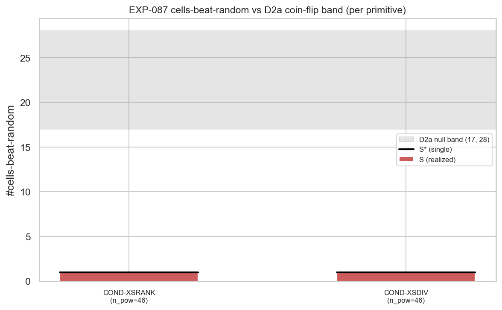
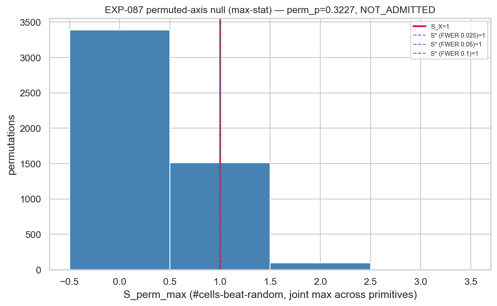

# Experiment Report: EXP-087 — Screen X: Cross-Sectional Relative-Strength Availability (Phase 019 Family-Selection)

## Status: COMPLETED

**Date**: 2026-06-22
**Instruments**: 16 (VAL-005 universe, no DE30) × {15m, 1h, 4h} = 46 EXP-080-READY member cells (US500-4h, JP225-4h `COVERAGE_EXCLUDED`)
**Data Views / Feature Categories**: 1-minute time bars → 15m/1h/4h domain bars (real OHLC); two cross-sectional relative-strength conditioning primitives (`COND-XSRANK`, `COND-XSDIV`). TRAIN sub-split only; final-30% holdout never touched.

---

## Question

Conditioned on **cross-sectional relative strength** — where an instrument sits in the 16-instrument
basket by trailing 20-bar return — does an entry traded in the relative-move direction show more
**directional-favourable** availability (median MFE, ATR units, on real prices) than a direction-matched
random-timing control, by more than the multiplicity-adjusted permuted-axis null would produce at the
realized cell count?

This is a **family-agnostic availability screen** for the **cross-sectional × directional** cell of the
Phase 019 availability 2×2 — **not** an edge, tradability, or candidate verdict. It is the cheap "does
the information exist" read; the binding admit/exonerate is G-019.

## Hypothesis

`CF-XSECT-001/HYP-001`: cross-sectional-conditioned directional-favourable availability beats a matched
within-instrument random control by more than the D2b permuted-axis admission gate at the realized cell
count. Cross-sectional relative strength was the programme's **a-priori mechanism favourite** — the one
information axis never varied (every prior family was single-series) — but had to earn admission on the
screen like any other axis.

## Method Summary

EXP-081/EXP-086 clone with the information axis swapped to cross-sectional conditioning and a single
directional-favourable read (D3.X). Per domain, a forward-filled union timestamp grid across the 16
instruments (strictly causal last-completed-bar fill) gives each instrument's trailing 20-bar log return;
top/bottom-decile membership fires LONG/SHORT events on each instrument's own domain-bar timeline. For
each of 46 member cells × 2 primitives, the directional-favourable `MFE_med` Δ-over-matched-random is
tested per cell (one-sided moving-block-bootstrap lower bound > 0), then aggregated through the **reused,
unchanged** EXP-086 D2b admission gate (`xen.availability_gate`): `S = #cells-beat-random`, joint
max-statistic permuted-axis null, `S* = Q95`, axis perm-p, ranking z. See [analysis-plan.md](analysis-plan.md).

## Key Findings

### Finding 1: The axis does not beat random, and the result is homogeneous across strata

`S_X = 1` cells-beat-random of 46 powered cells sits **at the permuted-axis null ceiling** `S* = 1`
(FWER 0.05); axis perm-p `= 0.323`, ranking z `= 1.26`. Both primitives independently fail (`S = 1` each;
COND-XSRANK perm-p 0.113, COND-XSDIV perm-p 0.236). Only **2 of 92** cell-reads beat random. Routing is
invariant across `N_PERM ∈ {1000, 5000}` (stability S*=1, perm-p 0.313) and across the FWER band
{0.025, 0.05, 0.10} (all `S*=1`, all not admitted).

Per-stratum (disclosure, LESSON-001):

| Domain | primitive | cells | beats | mean Δ̂ (ATR) | cells Δ̂ > 0 |
|--------|-----------|-------|-------|---------------|--------------|
| 15m | COND-XSRANK | 16 | 0 | −0.279 | 2/16 |
| 15m | COND-XSDIV  | 16 | 0 | −0.244 | 2/16 |
| 1h  | COND-XSRANK | 16 | 0 | −0.152 | 5/16 |
| 1h  | COND-XSDIV  | 16 | 0 | −0.140 | 5/16 |
| 4h  | COND-XSRANK | 14 | 1 | −0.024 | 6/14 |
| 4h  | COND-XSDIV  | 14 | 1 | +0.084 | 8/14 |

The pooled headline is **not masking heterogeneity** (audit-confirmed). The picture is uniformly negative:
cross-sectional conditioning gives no favourable-excursion advantage at any domain, and at the fast
domains (15m, 1h) it *degrades* it — conditioned median favourable MFE is materially below the
direction-matched random median.

### Finding 2: The two "beats" are small-cell multiplicity artefacts the gate correctly absorbs

The only two cells clearing the per-cell lower bound are the two smallest 4h cells: GBPUSD-4h COND-XSRANK
(Δ̂ = 1.19 ATR, ci_low = 0.0235, n_cond = 353) and NZDUSD-4h COND-XSDIV (Δ̂ = 0.54 ATR, ci_low = 0.0234,
n_cond = 450) — both lower bounds *barely* above zero. This is exactly the few-events-per-cell regime
where ranking over 16 instruments manufactures lucky cells (the multiplicity caution the scope flagged as
load-bearing for this axis). The joint permuted-axis null reproduces the same `S* = 1` ceiling, so the
gate does not credit them.

### Finding 3: Mechanism — cross-sectional extremes carry no favourable continuation

A decile event fires only **after** the trailing 20-bar relative move has already occurred, so the
conditioned entry buys late into relative strength / sells late into relative weakness. Over the
subsequent adaptive-cap window the relative-strength extreme does not extend favourably more than a
direction-matched random clock — and at intraday speed it does slightly worse (mean Δ̂ progression
−0.26 → −0.15 → ≈0 from 15m to 4h). This is consistent with **short-horizon mean-reversion / exhaustion
of intraday cross-sectional momentum**: the information is spent by the time the rank crystallises. A
genuine *absence* of directional-favourable continuation, not a single binding leg the gate vetoed. The
binding gate is a location read on a location effect, unsaturated (max attainable `S = 46`, `S* = 1`), so
this is a true "no effect," correctly distinguished from "an effect the gate cannot see."

## Conclusion

**Experiment verdict: `SCREEN_DELIVERED`.** All per-cell and axis statistics were produced
deterministically; determinism (metrics + permutation stream), matched-random count + direction-mix
reconciliation, and causal forward-fill all hold; holdout untouched (`counted_test_reads = 0`).

**Provisional disposition (NON-BINDING): `NOT_ADMITTED`.** `S_X = 1 ≤ S* = 1` and axis perm-p
`= 0.323 > 0.05` at every FWER level and both `N_PERM` scales. **`NOT_ADMITTED` is distinct from
`EXONERATED`**: the scope's provisional EXONERATED requires every sub-screen `S` *inside* the D2a
coin-flip null band [17, 28]; here `S = 1` falls **far below** the band — the axis is provisionally
**dead-by-absence** (it underperforms even the coin-flip baseline), not exonerated-by-coin-flip. **What
G-019 reads:** the axis perm-p values (COND-XSRANK 0.113, COND-XSDIV 0.236; axis max-stat 0.323) and the
ranking z (1.26) enter the cross-axis Holm step-down over {M, X, (F)}; Holm can only raise these, so no
post-adjustment admission is reachable from `S_X = 1`.

Cross-sectional relative strength was the a-priori mechanism favourite; on this screen it **earns no
admission**. Audit PASS (0 Critical / 0 Warning / 2 Info — both Info non-material). With Screen M
(EXP-086) provisionally admitted only on a borderline tail-only signal and Screen X not admitted, the
slate evidence points toward price-derived information — single-series geometry *and* cross-sectional
relational — being largely exhausted on this dataset; **G-019 formalises this against the frozen D5 rule.**

## Registry Disposition

**Updates applied** (registry-relevant):
- `docs/signal-registry/candidate-families/family-selection-phase-019.md` — CF-XSECT-001 status advanced to
  `DRAFT — SCREEN-X-DELIVERED, PROVISIONALLY NOT_ADMITTED (NON-BINDING, below D2a band), PENDING-G-019`.
  Realized statistics recorded; family **not** finally exonerated/screened here — that is G-019's call.
- `docs/signal-registry/multiplicity-registry.md` — EXP-087 row outcome recorded (both countable primitives
  COND-XSRANK + COND-XSDIV: provisional NOT_ADMITTED, S_X=1 ≤ S*=1, below band). Item **retained** in the ledger.
- `docs/signal-registry/test-read-ledger.md` — EXP-087 spent **0 counted TEST reads** (TRAIN-only availability
  disclosure, no stratum-specific inference); all 48 strata remain 0/2 open. Disclosure entry added.

## Limitations

- **TRAIN-only, gross, availability-only.** No exit, barrier, target, stop, portfolio, or market-neutral
  construction (deferred to a family's own post-admission G0/D0). Measures gross directional-favourable
  availability, not net tradability.
- **Frozen conditioning by design.** Lookback 20, both-tail deciles, `MIN_XS_INSTR = 8`, forward-filled
  union grid all frozen (D0-amendment-002); no lookback or basket-definition sweep.
- **Provisional, not binding.** The binding admit/exonerate is G-019; EXP-087 contributes statistics only.
- **Audit Info notes (non-material):** the disposition *string* inherits a stale `S_M` label from the
  frozen EXP-086 gate module (binding JSON fields correctly labelled `S_X`); `causal_fill_ok` is a
  statically-true constant. Neither moves any verdict-bearing number.

## Implications for Future Research

- The cross-sectional × directional availability cell is provisionally dead-by-absence; cross-sectional
  *continuation* at intraday domains carries no favourable edge over random.
- The mechanism (late entry after the move) points at timing, not the specific basket definition, as the
  binding problem — suggesting a *reversion* read rather than a longer-lookback continuation read.

## Recommended Next Experiments

1. **G-019 adjudication (scheduled, binding)**: feed EXP-087's axis perm-p and ranking z into the
   cross-axis Holm step-down over {M, X, (F)}. No new experiment required.
2. **EXP-XXX (proposed, new scope only if the slate warrants it)**: cross-sectional *reversion*
   availability — test whether *fading* the cross-sectional decile (entering against the relative move)
   shows favourable availability. A different hypothesis and family; must open its own G0/D0, not an
   extension of EXP-087.

## Artifacts

| Artifact | Path |
|----------|------|
| Scope | [scope.md](scope.md) |
| Analysis Plan | [analysis-plan.md](analysis-plan.md) |
| Code | [code/](code/) |
| Audit | [audit.md](audit.md) |
| Results | [results.md](results.md) |
| Governance Reviews | [governance/](governance/) |
| Plots | [plots/](plots/) |
