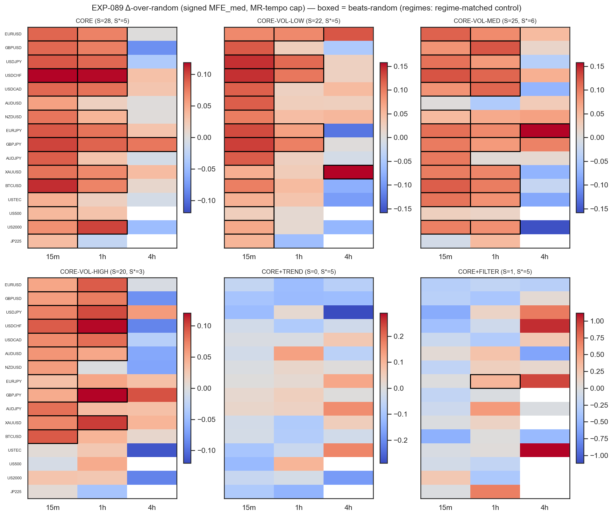
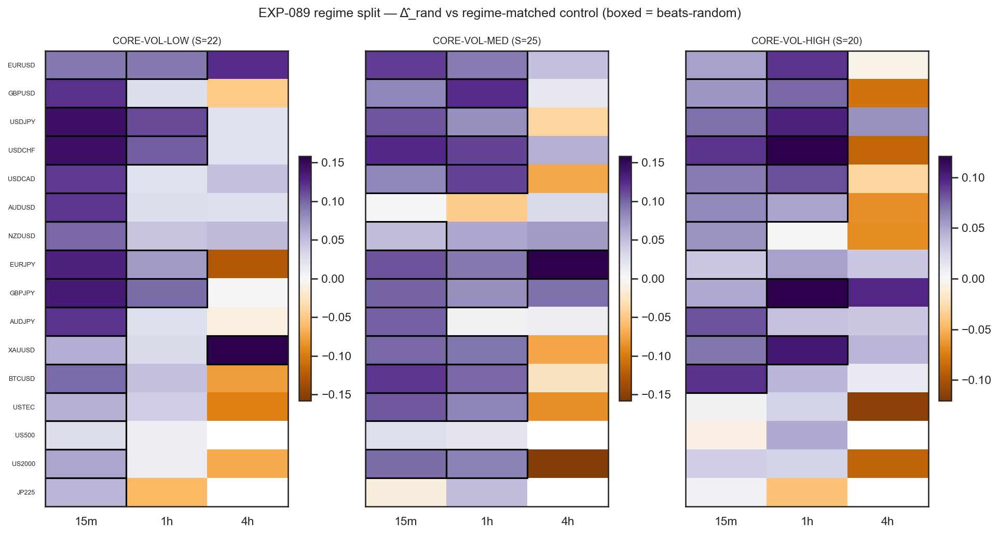
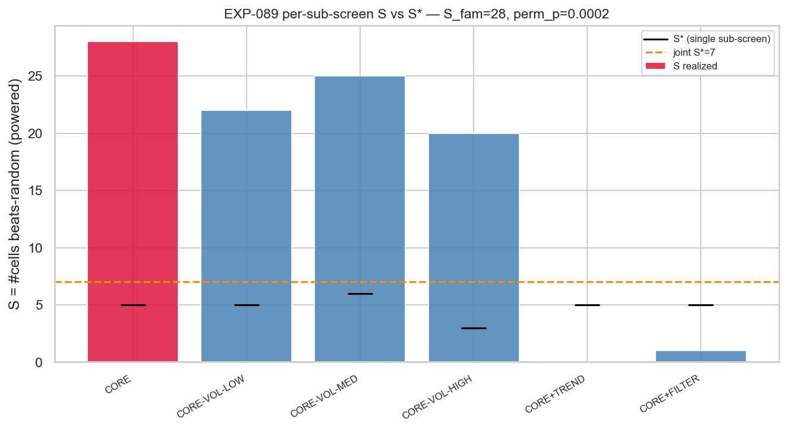
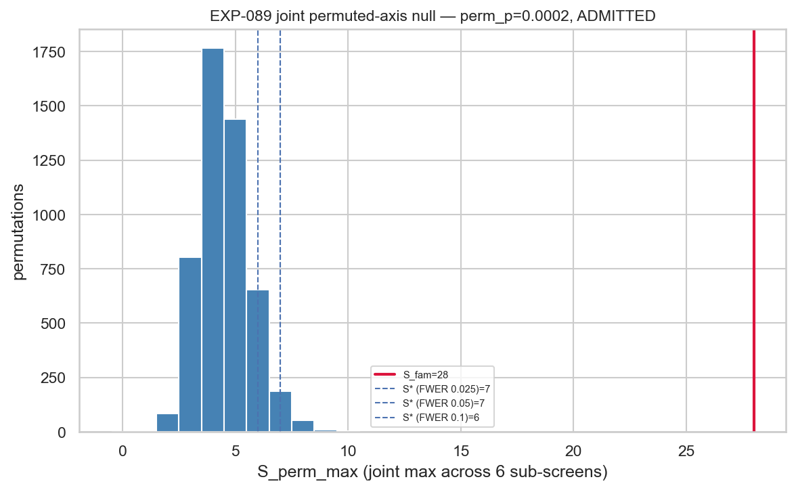

# EXP-089 — CF-MR-001 Mean-Reversion Entry Availability Screen (Phase 020)

**Status:** `SCREEN_DELIVERED` · **Provisional disposition (NON-BINDING — pending G-020): `ADMITTED`**
**Family:** CF-MR-001 (RSI-2 mean-reversion fade + global `/VOLREGIME` partition) · **HYP:** `CF-MR-001/HYP-001`
**Date:** 2026-06-23 · **Run:** amended (`D0-amendment-001`) · **Slots:** 0 · **Counted TEST reads:** 0 · **Holdout:** sealed

> **This is an availability screen, not a tradability/edge/P&L claim.** It measures whether the *raw favourable
> excursion* after an RSI-2 extreme exceeds a matched random control, gross, TRAIN-only, with no exit/cost. The
> binding admit/exonerate is adjudicated at **G-020**; the disposition here is NON-BINDING input.

---

## 1. Question

Does the RSI-2 mean-reversion entry — **bare**, **partitioned by a strategy-agnostic ATR volatility regime**,
or with a **trend / RSI-momentum filter** — produce signal-conditional favourable excursion (entry-signed,
ATR-normalised) beyond a count- and direction-matched random control, by more than the multiplicity-adjusted
joint-max permuted-axis null at the realized cell count, on **any** of 6 sub-screens? The programme prior is
*availability ≈ random* (the hypothesis the screen tries to reject).

## 2. Scope (frozen) and exclusions

- **Data:** VAL-005 5-year 1-minute bars, 16 instruments × {15m, 1h, 4h} = **46 member cells** (US500-4h,
  JP225-4h `COVERAGE_EXCLUDED`); **TRAIN sub-split only** (`[0, int(int(total_rows·0.7)·0.7))`); analysis-TEST
  and the final-30% holdout never sliced. Real domain OHLC only.
- **Entry (frozen):** `RSI(2)` Wilder; long `RSI₂<10`, short `RSI₂>90`. Variants: TREND (`Close≷EMA₂₀`),
  RSI-FILTER (`RSI₅≷50`). Regime: `ATR(14)` causal rolling-50 percentile, 33/66 → LOW/MED/HIGH.
- **Endpoint:** entry-signed favourable `MFE_med` (ATR units) over a **causal MR-tempo cap** (see §3).
- **Excluded:** no exit/stop/target/cost/P&L (availability only); parameter tuning, the 25/75 scheme, the
  contrarian arm, regime×variant cross-cuts — all registered-but-deferred.

## 3. Method (amended — see §6 for why)

Per cell, per sub-screen: compute entry-signed favourable `MFE_med` over `[entry+1, entry+cap]` on real OHLC,
ATR(14)-normalised. **Cap = causal MR-tempo cap:** `clip(round(1.0 × median(durations of the last 20 RSI-2
reversion episodes closed strictly before entry)), 3, 40)`; a reversion episode runs from an RSI-2 extreme to
the first later bar with RSI-2 back through 50. The **same cap rule is applied to the matched control** (horizon
parity). Per-cell **leg-1** test: `Δ̂_rand = MFE_med(signal) − MFE_med(matched control)`, beats-random iff the
one-sided lower bound (`Z=1.645`, moving-block + iid bootstrap SE) > 0. **All 6 sub-screens are single-test**
through `xen.availability_gate.run_sub_screen`; the `/VOLREGIME` controls are drawn from **same-regime bars**
(so the entry-ATR denominator cancels within the comparison). Family statistic `S_fam = max_sub S`; joint-max
permuted-axis null (`combine_axis`, signal-shuffle, shared permutation index) → `S* = Q95`, axis perm-p;
**ADMITTED iff `S_fam > S*` ∧ perm-p ≤ 0.05** (FWER 0.05, no cross-axis Holm — single family). `N_PERM=5000`,
MC-stable vs 1000. Gate is bite-GREEN at the single-test `f01a000b…`. Deterministic (byte-identical second
pass); reconciled (count/direction/regime-membership).

## 4. Results

**Family:** `S_fam = 28`, `S* = 7`, axis perm-p ≈ **0.0002** → provisional **ADMITTED**, robust across the FWER
band {0.025, 0.05, 0.10} (S* = 7/7/6) and MC-stable (1000: S*=6, p≈0.001). **Driving lever: CORE** (bare fade,
ranking z = 17.3).

| Sub-screen | S (powered) | reading |
|---|---|---|
| **CORE** (bare RSI-2 fade) | **28 / 46** | the lever |
| CORE-VOL-LOW | 22 / 46 | passes, **but adds nothing over CORE** |
| CORE-VOL-MED | 25 / 46 | passes, but adds nothing over CORE |
| CORE-VOL-HIGH | 20 / 46 | passes, but adds nothing over CORE |
| CORE+TREND | 0 / 46 | edge destroyed by trend agreement |
| CORE+FILTER | 1 / 29 | edge destroyed by momentum agreement |

**The lever is the entry mechanism, not the regime partition.** The three regimes pass uniformly with flat,
small per-cell `Δ̂_rand` medians (LOW 0.050, MED 0.080, HIGH 0.045 ATR — indistinguishable from CORE's 0.060):
conditioning on volatility regime neither raises nor concentrates the availability. The second "new lever" the
family was opened on (vol-regime as signal definition) is **inert**.

**Where it lives — a frequency gradient (per-stratum; pooled S is disclosure):**

| Domain | CORE cells passing | per-cell `Δ̂_rand` median |
|---|---|---|
| 15m | **16 / 16** (universal) | 0.085 ATR |
| 1h | 11 / 16 | 0.072 ATR |
| 4h | **1 / 14** | ≈ 0 |

Passing cells span **all 16 instruments**; the effect is monotone in bar frequency — near-universal intraday,
absent at 4h. The honest claim is *favourable availability for the bare RSI-2 fade at 15m/1h*.

**Magnitude & horizon:** CORE favourable `MFE_med` ≈ 0.75 ATR vs ≈ 0.69 ATR random → `Δ̂_rand` ≈ 0.06 ATR
(median), positive in ~87% of cells. Effective horizon ≈ **3 bars** (77% of caps at the FLOOR=3; CAP_MAX never
binds) — the family is genuinely short-lived.

## 5. Mechanism & why it is credible

After an RSI-2 extreme, price reverts favourably over the next ~3 bars more than from a random-timed,
direction-matched entry — the documented short-horizon reversion bounce. The result is **conservative**: the
endpoint divides by entry-bar ATR, and RSI-2 extremes occur after sharp moves (elevated entry ATR), which
*deflates* signal `MFE/ATR` and biases the test **against** the signal. The **variant kill** (TREND S=0,
FILTER S=1) corroborates the mechanism — imposing trend/momentum agreement contradicts the fade and removes the
edge. The gate is a location test and the effect is a location shift, so the binding gate can see it.

## 6. Amendment history (the first run was a deviation)

The **first** EXP-089 run reported provisional ADMITTED `S_fam=27` driven *entirely* by CORE-VOL-LOW. The audit
found two verdict-material confounds of the frozen design (not code bugs):

- **C-1 — ATR-normalization confound.** Normalizing forward excursion by entry-bar ATR while the `/VOLREGIME`
  label *is* the entry-ATR percentile, with volatility mean-reverting over a long window, produced a spurious
  symmetric LOW>>HIGH ladder; the leg-2 conjunction + regime-membership null were structurally blind to it.
- **C-2 — trend-length horizon.** The endpoint was measured over a trend-length adaptive cap (~30–100 bars) vs
  the 1–5 bar RSI-2 reversion scale, crediting post-reversion drift rather than the bounce — a different
  strategy.

Per operator direction the experiment was **amended in place** (`D0-amendment-001`): MR-tempo cap (fixes C-2),
regime-matched + horizon-matched control with leg-2 retired (fixes C-1), all 6 sub-screens single-test. The
deviation results were hard-deleted. **Both fixes are empirically confirmed** in this run: the regime `Δ̂_rand`
ladder collapsed to flat (0.050/0.080/0.045 vs +0.55/0/−0.52), the driver flipped from CORE-VOL-LOW to CORE,
and the cap median dropped to ~3 bars. See [`audit.md`](audit.md) (fresh audit + C-1/C-2 appendix) and
[`D0-amendment-001`](../../../docs/experiments-docs/checkpoints/2026-06-23-020-mean-reversion-entry-availability/D0-amendment-001-mr-horizon-and-regime-matched-control.md).

## 7. Audit caveats (all Info, non-material)

- **I-1:** effective MR horizon ≈ 3 bars (FLOOR-dominated) — confirms the family is short-lived; the favourable
  availability is *within ~3 bars*.
- **I-2:** CORE availability is a 15m/1h phenomenon (report per domain; not timeframe-flat).
- **I-3 (cosmetic):** `run_metadata.provisional_disposition_NON_BINDING` carries a stale "pending G-019" string
  from the frozen `combine_axis`; `family_admission.json` has the corrected G-020 caption. No binding number
  affected.

Audit verdict: **no Critical findings**; `SCREEN_DELIVERED` valid; provisional ADMITTED credible.
([`audit.md`](audit.md))

## 8. Conclusion (NON-BINDING — G-020 is binding)

The RSI-2 mean-reversion fade shows real, multiplicity-robust favourable **availability** at 15m/1h across all
16 instruments, driven by the **bare entry** (the vol-regime partition is inert; the trend/momentum variants
are counter-productive), over a genuinely short ~3-bar horizon, measured conservatively. This is the
programme's **first non-random price entry** to clear the family-selection availability gate after the Phase 019
terminal branch — provisionally. **Availability ≠ capturable edge:** no exit, no cost, gross, TRAIN-only. The
provisional `ADMITTED` is credible input to G-020, which adjudicates the binding admit/exonerate and (on admit)
would open the **bare RSI-2 fade, intraday, first** — *not* the volatility-regime lever.

## 9. Follow-ups (NEW scopes only, on admit)

1. **Capture-geometry / exit phase** for the bare RSI-2 fade: does ~0.75-ATR / ~3-bar availability survive a
   real exit (RSI-revert / fixed-bar / barrier) net of cost? The availability→tradability step.
2. **Frequency-boundary characterization** of the 15m→1h→4h decay.
3. *(Deferred, low priority on this evidence)* the regime partition added nothing, so 25/75 / contrarian /
   regime×variant cross-cuts are low-value next steps.

## Signal-registry disposition (registry-relevant; recorded same change)

- **`candidate-families/cf-mr-001.md`:** advanced to `SCREENED — provisional ADMITTED (NON-BINDING), pending
  G-020`. **No slot consumed, family NOT marked ADMITTED** (binding admit is G-020). Amendment + inert-regime /
  bare-fade lever recorded.
- **`multiplicity-registry.md` (Phase 020 batch):** EXP-089 outcome recorded — CORE beats-random (the lever);
  LOW/MED/HIGH pass but inert (add nothing over CORE); TREND/FILTER dead. **Leg-2 (beats-CORE conjunction +
  regime-membership null) retired by `D0-amendment-001`** — no longer a countable item; recorded, items
  retained.
- **`test-read-ledger.md`:** **0 counted TEST reads** — EXP-089 entered as a TRAIN-only disclosure; all 48
  strata unchanged at 0/2 open; holdout sealed.

## Artifacts

[`scope.md`](scope.md) · [`analysis-plan.md`](analysis-plan.md) · [`code/run_experiment.py`](code/run_experiment.py) ·
[`audit.md`](audit.md) · [`results.md`](results.md) ·
[`governance/pre-execution-review.md`](governance/pre-execution-review.md) ·
[`results/family_admission.json`](results/family_admission.json) · [`results/run_metadata.json`](results/run_metadata.json) ·
[`results/cell_availability.csv`](results/cell_availability.csv) · `plots/`
