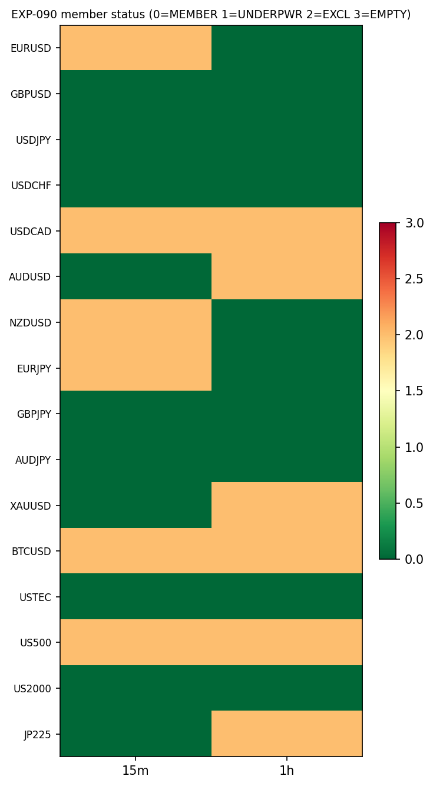
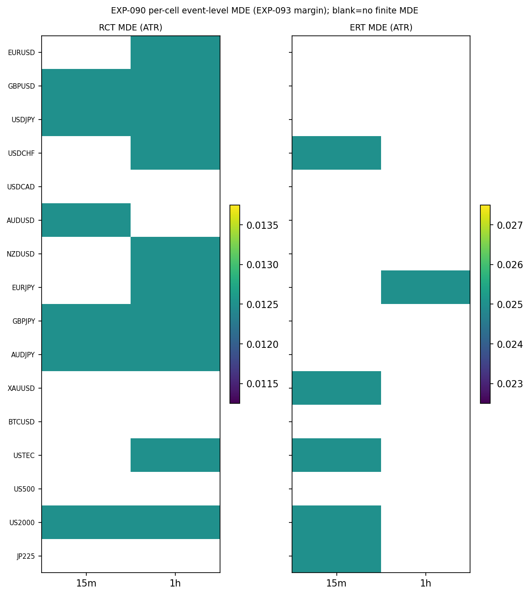

# Experiment Report: EXP-090 — RSI-2 Fade Exit-Substrate Readiness & Per-Cell Inference Calibration

## Status: COMPLETED

**Date**: 2026-06-24
**Phase / Family / HYP**: Phase 021 (CF-MR-001 batch 2) · CF-MR-001 (bare RSI-2 mean-reversion fade) · `CF-MR-001/HYP-002`
**Instruments**: 16 (EURUSD, GBPUSD, USDJPY, USDCHF, USDCAD, AUDUSD, NZDUSD, EURJPY, GBPJPY, AUDJPY, XAUUSD, BTCUSD, USTEC, US500, US2000, JP225) × {15m, 1h} = 32 cells
**Data Views**: 1-minute time bars (VAL-005 5-year dataset) → holdout-fenced {15m,1h} domain bars; 1-minute base series as the intrabar fill source. TRAIN sub-split only (first 49% file-order rows).

---

## Question

For each of the 32 member cells (16 instruments × {15m,1h}), is the bare RSI-2 fade entry substrate **and** the new 1-minute intrabar exit-fill substrate constructible, deterministic, causal, and holdout-fenced — and is the binding net-expectancy referee **statistically powered** (controlled false-positive rate, finite minimum detectable effect) on that cell's event population? This is the **readiness + calibration** gate before the Phase 021 exit screen (EXP-091). It is **not** an exit screen and makes **no market-edge claim**.

## Hypothesis

Exploratory readiness/calibration question (no edge claim): each member cell, on TRAIN, should (1) compute the CORE fade entries deterministically and look-ahead-safe with ≥15 events; (2) resolve every frozen exit arm to exactly one terminal (favourable fill / adverse stop / cap-close) through the 1-minute engine — deterministic, timestamp-aligned, causal, holdout-fenced, with real touched fill prices; and (3) exhibit a controlled per-cell FPR (≤ α₀ = 0.05 under two structurally-different nulls) and a **finite event-level MDE** under the binding mean net-expectancy moving-block bootstrap lower bound (`Z=1.645`). A cell passing all three is a **MEMBER** carrying its MDE as the EXP-093 margin; otherwise `COVERAGE_EXCLUDED` with record.

## Method Summary

A single 32-cell loop (see [analysis-plan.md](analysis-plan.md)): build holdout-fenced domain bars + the TRAIN 1-minute slice; generate frozen CORE fade entries; resolve five unified-engine exit arms (RCT, ERT, ATR-barrier, RSI-revert, fixed-bar; the two-leg partial/trail is deferred to EXP-091) through the new `xen.intrabar_fill` engine for **readiness only** (no expectancy, no cost, no selection); then calibrate the binding **mean** net-expectancy lower bound per cell on synthetic null/planted-edge draws over a matched-random exit-resolved return shape (real fade outcomes never read — the EXP-044 anti-overfitting fence). Determinism is replayed on two cells and the headline outputs are SHA-256 hash-pinned.

## Key Findings

### Finding 1: Verdict `READINESS_CALIBRATION_DELIVERED` — 20 MEMBER / 12 COVERAGE_EXCLUDED

All 32 cells delivered a verdict; determinism PASS (EURUSD-15m, AUDJPY-1h byte-identical); holdout untouched; 0 counted TEST reads; 0 candidate slots. Membership is balanced **10 × 15m + 10 × 1h**.

**The 20 MEMBER cells (carried arm → margin, ATR units):**

| Cell | Arm(s) | Margin | Cell | Arm(s) | Margin |
|---|---|---|---|---|---|
| EURUSD-1h | RCT | 0.0125 | GBPJPY-15m | RCT | 0.0125 |
| GBPUSD-15m | RCT | 0.0125 | GBPJPY-1h | RCT | 0.0125 |
| GBPUSD-1h | RCT | 0.0125 | AUDJPY-15m | RCT | 0.0125 |
| USDJPY-15m | RCT | 0.0125 | AUDJPY-1h | RCT | 0.0125 |
| USDJPY-1h | RCT | 0.0125 | XAUUSD-15m | ERT | 0.025 |
| USDCHF-15m | ERT | 0.025 | USTEC-15m | ERT | 0.025 |
| USDCHF-1h | RCT | 0.0125 | USTEC-1h | RCT | 0.0125 |
| AUDUSD-15m | RCT | 0.0125 | US2000-15m | RCT, ERT | 0.0125 / 0.025 |
| NZDUSD-1h | RCT | 0.0125 | US2000-1h | RCT | 0.0125 |
| EURJPY-1h | RCT, ERT | 0.0125 / 0.025 | JP225-15m | ERT | 0.025 |

**The 12 COVERAGE_EXCLUDED cells** — EURUSD-15m, USDCAD-15m, USDCAD-1h, AUDUSD-1h, NZDUSD-15m, EURJPY-15m, XAUUSD-1h, BTCUSD-15m, BTCUSD-1h, US500-15m, US500-1h, JP225-1h — all excluded for the **same** reason: *no finite MDE on either native arm (RCT/ERT) at controlled FPR*. This is a **power/recovery outcome, not** an FPR-control failure, an engine failure, or a coverage shortfall (every cell is `IN_FLOOR`, ≥12,827 events on 15m, ≥3,293 on 1h; all dropped-fractions ≤ 0.217 < 0.25).

The carried margins are uniformly small — RCT 0.0125 ATR, ERT 0.025 ATR — i.e. the binding mean lower bound recovers a planted edge of as little as 1.25% of an ATR at TPR ≥ 0.80 on these event counts. RCT (the operator-proposed reversion-completion target) is the more frequently powered native arm.

### Finding 2: The 1-minute exit-fill substrate is constructible and clean on all cells

Across all 32 cells × 5 arms: **fill-price validity TRUE everywhere** (every fill ∈ `[Low,High]` of its touching 1-minute bar), timestamp-alignment TRUE, determinism TRUE. Resolution completeness is 0.991–1.000 (median 0.996); the conservative adverse-first tie-break fires on at most 0.18% of events. The engine (the one justified new shared module `xen.intrabar_fill`) is ready for EXP-091's native and ATR-barrier arms.

### Finding 3: The binding referee is error-controlled on the admitted cells

Every MEMBER's carried arm has FPR ≤ 0.050 under **both** nulls (0 violations). After the Null B fix (below), the FPR is symmetric and controlled across both nulls and both domains: native-arm median FPR 0.048–0.051, max 0.063–0.070 — sampling noise around the true 0.05. The `null_fpr_sanity.controlled_alpha0: false` flag is the over-strict pooled all-points boolean tripping on expected noise-level exceedances (a true-0.05 estimator reads above 0.05 on ~half its points), not a machinery defect.

## Conclusion

**Deliverable criterion MET — `READINESS_CALIBRATION_DELIVERED`.** The bare-fade entry substrate, the new 1-minute intrabar exit-fill substrate, and the binding net-expectancy referee are constructible, deterministic, causal, holdout-fenced, and powered on **20 of 32 cells**, which carry forward to EXP-091 with their calibrated margins. The 12 excluded cells cannot bound a confirmation at their realized event count and are excluded with record. No edge is claimed, computed, or implied; the real fade outcomes were never resolved (the EXP-091 step does that first).

### Member distinction vs the (superseded) broken-Null-B run

An earlier run of this experiment used a flawed Null B (see Audit) and produced **12** members. After the fix, the set is **20**, decomposing against the prior 12 as:

- **9 robust** (member in *both* runs — the safest carry-forward core): AUDJPY-15m, EURUSD-1h, GBPJPY-15m, US2000-15m, USDCHF-15m, USDCHF-1h, USTEC-15m, USTEC-1h, XAUUSD-15m.
- **11 newly admitted** once the valid Null B stopped wrongly excluding them (mostly 1h cells the rotation artifact had penalized): AUDJPY-1h, AUDUSD-15m, EURJPY-1h, GBPJPY-1h, GBPUSD-15m, GBPUSD-1h, JP225-15m, NZDUSD-1h, US2000-1h, USDJPY-15m, USDJPY-1h.
- **3 boundary-noise dropouts** (prior member, now excluded; their Null B FPR landed 0.051–0.057, just over the hard 0.05 gate): EURJPY-15m, EURUSD-15m, NZDUSD-15m.

**Caveat (boundary fragility):** the admission gate is a hard `fpr_mean ≤ 0.05` under both nulls, with ~±0.014 Wilson sampling noise at 1000 draws. Cells whose true FPR sits near 0.05 flip in/out between runs on noise alone. The **9 robust** cells are well inside the boundary; the 3 dropouts and some newly-admitted cells are genuinely marginal. EXP-091 should treat the robust core as the safest evidence and read marginal cells with that fragility in mind.

## Registry Disposition

**Updates applied.** `CF-MR-001/HYP-002` EXP-090 advanced `PLANNED → COMPLETE — READINESS_CALIBRATION_DELIVERED` in [`multiplicity-registry.md`](../../../docs/signal-registry/multiplicity-registry.md) (Phase 021 batch) and recorded in [`candidate-families/cf-mr-001.md`](../../../docs/signal-registry/candidate-families/cf-mr-001.md). **0 candidate slots** (the first CF-MR-001 slot was consumed at G-020; Phase 021 spends none). **0 counted TEST reads** — TRAIN-only readiness/calibration; the analysis-TEST stratum and the final-30% global holdout were never sliced; all 48 strata stay 0/2 open in [`test-read-ledger.md`](../../../docs/signal-registry/test-read-ledger.md) (readiness/coverage exposure = disclosure, no counted read). No countable exit item is screened or refuted here (that is EXP-091).

## Limitations

- **Readiness/calibration only** — certifies the *estimator* (error-controlled, finite MDE on a representative per-event scale), **not** a market edge. The real fade outcomes were never read.
- **Cost-free by translation-equivariance** — the calibration uses the gross return shape; cost is a per-event location shift and the FPR/MDE are location-invariant, so the gross-shape calibration yields a valid *net* margin. The actual EXP-085 cost model enters the real statistic at EXP-091.
- **Median leg dropped** — the disclosed median lower bound (D5, non-binding, "never gates") was omitted for performance (it was ~86% of bootstrap cost); the binding mean leg is bit-identical to the shared `xen.ass` estimator. See [audit.md](audit.md).
- **Boundary fragility** — the hard ≤0.05 FPR gate flips marginal cells between runs (±0.014 noise); see the member-distinction caveat above.
- **N_CAL_MAX = 4000** caps high-count 15m cells, yielding a conservatively *larger* MDE/margin than the realized count would — a harder EXP-093 bar, never an admission shortcut.

## Implications for Future Research

- The 20-member grid (with margins) defines the EXP-091 exit/capture-geometry screen. RCT is the more frequently powered native arm.
- The three 1-hour robust members (EURUSD-1h, USDCHF-1h, USTEC-1h) and the newly-admitted 1h cells sit nearer the FPR boundary than the 15m members — less headroom; watch them when the real fade exits are resolved.
- Methodological lesson (programme-wide): a calibration second null must **block-permute the resolved returns**, not rotate the price path, when returns are ATR-normalized and the binding statistic is the mean (see [`D0-amendment-002.md`](../../../docs/experiments-docs/checkpoints/2026-06-23-021-mr-fade-capture-geometry/D0-amendment-002.md)).

## Recommended Next Experiments

1. **EXP-091** (planned): TRAIN-only exit/capture-geometry screen (gross + EXP-085 cost) over the frozen slate on the 20 member cells; native pair (RCT/ERT) vs conventional contrast; empty screen ⇒ G-021 NOT_TRADABLE at 0 reads.
2. Possible follow-up (own D0-amendment): if EXP-091 power is marginal on 1h, reconsider the hard ≤0.05 gate vs a Wilson-bounded gate to reduce boundary flips.

## Artifacts

| Artifact | Path |
|----------|------|
| Scope | [scope.md](scope.md) |
| Analysis Plan | [analysis-plan.md](analysis-plan.md) |
| Code | [code/run_experiment.py](code/run_experiment.py), [`xen.intrabar_fill`](../../src/xen/intrabar_fill.py) |
| Audit | [audit.md](audit.md) |
| Results | [results.md](results.md) |
| Governance | [governance/pre-execution-review.md](governance/pre-execution-review.md) |
| D0 amendment (this run's fixes) | [D0-amendment-002.md](../../../docs/experiments-docs/checkpoints/2026-06-23-021-mr-fade-capture-geometry/D0-amendment-002.md) |
| Plots | [plots/](plots/) |
| Results data | [results/](results/) (member_map, entry_coverage, exit_substrate_readiness, fpr_mde_per_cell, calibration_draws, null_fpr_sanity, run_metadata) |
