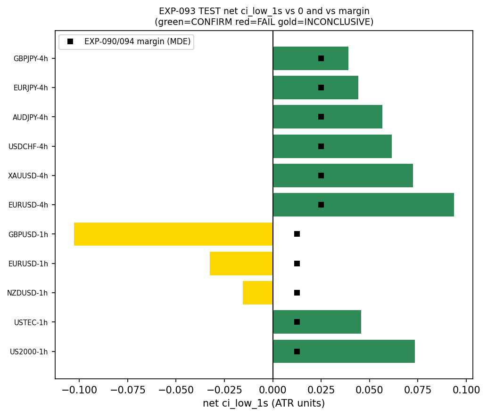
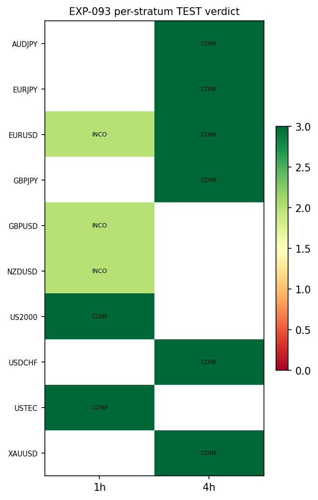
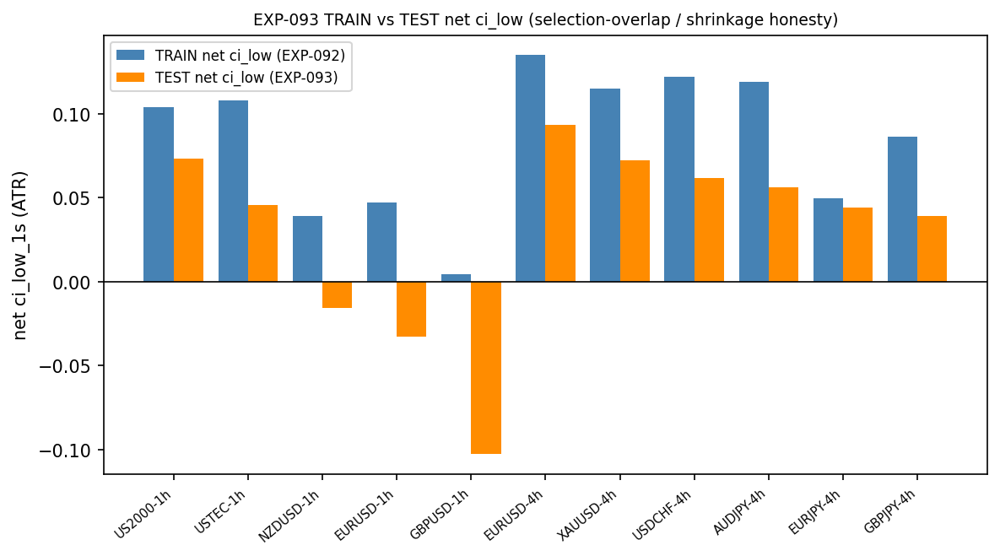

# Experiment Report: EXP-093 — One-Shot TEST Confirmation of the RSI-2 Fade (EXIT-RCT)

## Status: COMPLETED — TEST_CONFIRMED (HYP-002 tradability SUPPORTED; routes G-021 TRADABLE)

**Date**: 2026-06-24
**Instruments**: 7 — EURUSD, USDCHF, XAUUSD, AUDJPY, GBPJPY, EURJPY (4h); USTEC, US2000, NZDUSD, GBPUSD, EURUSD (1h)
**Data Views / Feature Categories**: INFR-003 5-year 1-minute bars → 1h/4h domain bars; CORE RSI-2 fade entries;
EXIT-RCT exits via the 1-minute intrabar fill engine; **analysis-TEST stratum** (real OHLC, ATR(14) units)

---

## Question

Of the 11 EXP-092 hash-pinned EXIT-RCT candidate cells, which **confirm a positive net-of-cost per-event
expectancy out-of-sample** (analysis-TEST stratum) under the frozen referee, the phase Holm-11 rule, and the
per-cell margin condition? This is Phase 021's single binding tradability read.

## Hypothesis

`CF-MR-001/HYP-002` — the admitted bare RSI-2 fade (CORE), exited by the native reversion-completion target
EXIT-RCT and net of conservative cost, produces a positive net per-event expectancy that **confirms on a counted
TEST read** (`Holm-adj p ≤ 0.05 AND net ci_low_1s > margin`), on ≥1 carried (instrument, domain) cell.

## Method Summary

Verbatim reuse of the audited EXP-090/092 substrate (`build_cell_context`, `resolve_arm`/RCT, `xen.intrabar_fill`,
`net_return_atr`, `D0-amendment-003` cost), with the **only** change being the data slice: the analysis set
`[0, int(total·0.7))` is loaded (TRAIN region as causal indicator warmup), and the binding estimand is taken from
CORE entries whose domain `CloseTime` falls in the **analysis-TEST stratum** `[ts_lo, analysis_edge]`; the 1m
fill clips at the analysis edge (the final-30% global holdout is never loaded). Per cell: the moving-block
bootstrap net one-sided lower bound (`net ci_low_1s`, Z=1.645) and a one-sided bootstrap p from the same stream;
Holm–Bonferroni over the 11 carried cells; the frozen D6/4c adjudication. See [analysis-plan.md](analysis-plan.md)
and [`D0-amendment-006`](../../../docs/experiments-docs/checkpoints/2026-06-23-021-mr-fade-capture-geometry/D0-amendment-006.md)
(carried set = all 11; Holm-11).

## Key Findings

### Finding 1: 8 of 11 carried cells CONFIRM — the fade is net-tradable out-of-sample

Eight cells clear `Holm-adj p = 0.0011` **and** `net ci_low_1s > margin`, spanning **7 instruments across both
domains**. The **six 4h cells are the robust core** — mean-AND-median positive, `net ci_low_1s` 0.039–0.094 (1.6–
3.7× the 0.025 margin): EURUSD-4h +0.094, XAUUSD-4h +0.072, USDCHF-4h +0.062, AUDJPY-4h +0.057, EURJPY-4h +0.044,
GBPJPY-4h +0.039 (n 388–458). The **two 1h confirms** (US2000-1h +0.073, USTEC-1h +0.046; n~1.6k) clear the
binding **mean** gate but are **mean-carried** (USTEC-1h TEST median −0.026; US2000-1h median ≈ +0.004). The RCT
target is reached ~99% of events (`terminal_fav` 0.985–0.996); intrabar tie-breaks are negligible
(`tie_break_frac ≈ 0`).

### Finding 2: the three non-confirming 1h cells split into reversal vs near-zero

Re-labeled per their actual bounds (audit W1): **GBPUSD-1h** (net_mean −0.080, ci_low −0.103, n=1653) and
**EURUSD-1h** (net_mean −0.010, ci_low −0.032, n=1619) are **well-powered net-negative — EVIDENCE_AGAINST**, a
genuine out-of-sample reversal; **NZDUSD-1h** (net_mean +0.003, ci_low −0.015) is **near-zero / INCONCLUSIVE**.
GBPUSD-1h was pre-disqualified at `D0-amendment-006 §2` (below margin on TRAIN); its EVIDENCE_AGAINST outcome was
expected and its counted read was spent as ratified.

### Finding 3: mechanism — cost geometry + selection-overlap shrinkage

Gross expectancy is ~domain-invariant (~0.22–0.31 ATR); 4h dominates the confirm set because the fixed-bps
conservative cost is a smaller ATR fraction on the larger-ATR 4h domain (the EXP-091/092 cost-geometry mechanism,
reproduced OOS — **not** a stronger 4h signal). Every cell shrank from TRAIN to TEST (Δ `net ci_low` −0.005 to
−0.107, the expected selection-overlap shrinkage); the robust core's larger TRAIN bounds absorbed the shrink and
stayed above margin, while the thin-margin 1h cells fell below zero. The honest prior — TRAIN eligibility ≠ OOS
edge — realized exactly as predeclared, while the strongest cells held.

## Conclusion

**HYP-002 tradability SUPPORTED.** The frozen one-shot TEST confirms a positive net-of-cost per-event expectancy
on 8 of 11 carried cells under Holm-11 + the per-cell margin, with the six 4h cells mean-AND-median positive and
breadth across 7 instruments and both domains. Per the predeclared D6/4c rule and G-021 §2, **≥1 carried cell
CONFIRMS → routes G-021 TRADABLE.** This is the **programme's first net-positive out-of-sample price entry** — a
genuine reversal of the G-019 "price-derived information exhausted" routing for this lever. The read is on the
**analysis-TEST stratum**, not the final-30% global holdout (which stays sealed); a global-holdout release is a
separate, later gate. Audit PASS (0 Critical; numbers reproduced from raw data, holdout-clean, deterministic,
Holm-correct).

## Registry Disposition

**Updates applied (registry-relevant; counted TEST reads spent):**
- **`test-read-ledger.md`** — EXP-093 entered as the **first counted TEST read** of the CF-MR-001 family on the
  new dataset: **11 counted reads, one per carried (instrument, domain) stratum**, each **0→1** (cap 2/stratum,
  one read preserved). Strata: EURUSD-1h, GBPUSD-1h, NZDUSD-1h, US2000-1h, USTEC-1h, AUDJPY-4h, EURJPY-4h,
  EURUSD-4h, GBPJPY-4h, USDCHF-4h, XAUUSD-4h. The other 37 strata stay 0/2; the final-30% global holdout never
  read.
- **`candidate-families/cf-mr-001.md`** — EXP-093 outcome added (`TEST_CONFIRMED`, 8/11; robust 4h core); HYP-002
  tradability SUPPORTED pending G-021.
- **`multiplicity-registry.md`** — Phase 021 batch advanced: EXP-093 `PLANNED → TEST_CONFIRMED` (8 CONFIRM /
  2 EVIDENCE_AGAINST / 1 INCONCLUSIVE; all 11 outcomes retained). No new countable item; 0 candidate slots.

## Limitations

- **Analysis-TEST stratum, not the global holdout** — sanctioned counted read; each carried stratum now 1/2. A
  global-holdout confirmation is a separate gate.
- **4h dominance is cost-geometry**, not a stronger 4h signal (gross is domain-invariant).
- **1h confirms are mean-carried** (median-fragile); the six 4h cells are the robust, mean-AND-median-positive core.
- **Single OOS read** with uniform TRAIN→TEST shrinkage; a second read or the holdout would further de-risk the core.

## Artifacts

[scope.md](scope.md) · [analysis-plan.md](analysis-plan.md) · [code/run_experiment.py](code/run_experiment.py) ·
[results/](results/) (`test_adjudication.csv`, `test_per_cell.csv`, `train_vs_test.csv`, `run_metadata.json`) ·
[audit.md](audit.md) · [results.md](results.md) ·
[governance/pre-execution-review.md](governance/pre-execution-review.md) · plots in [plots/](plots/).

## Follow-up Recommendations (separate future experiments)

1. **Global-holdout release decision for the 4h robust core** — a governed one-shot gate (à la EXP-032), scoped to
   the six mean-AND-median-positive 4h cells, with its own checkpoint/D0.
2. **1h median-fragility diagnostic** — TRAIN-only characterisation of whether the 1h edge is tail-carried and
   whether a shape-aware exit recovers the median (new HYP, own D0).
3. **Deferred levers**, each its own dated `D0-amendment-*` + slot decision — faster-turnover cost sensitivity,
   the inert vol-regime partition, the contrarian arm, the 25/75 scheme, 15m capture.
