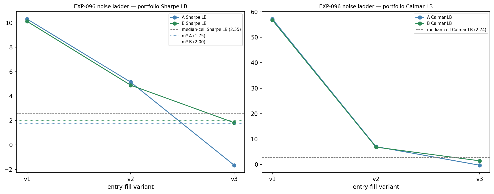
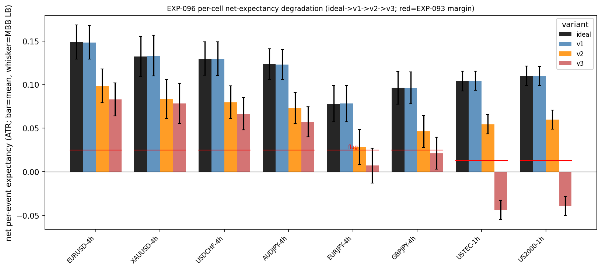
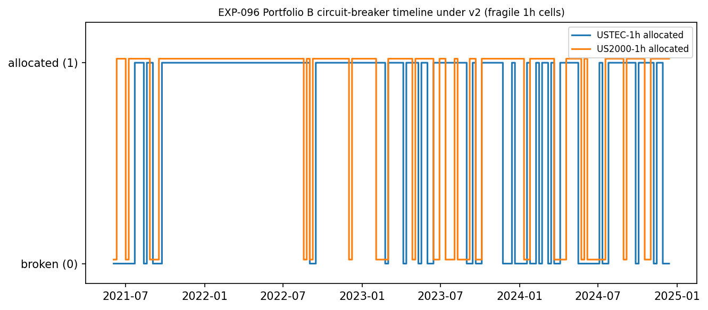
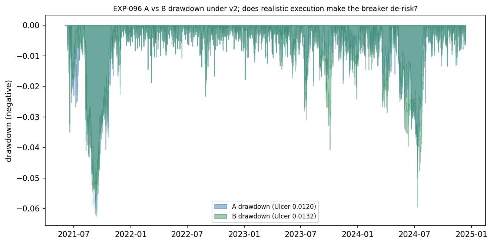

# Experiment Report: EXP-096 — Noise Infusion: Realistic 1-Minute Entry Fill (RSI-2 Fade Portfolio, 8 confirmed cells)

## Status: COMPLETED (analysis-set only — NO holdout verdict)

**Date**: 2026-06-25
**Family / HYP**: `CF-MR-001` / `HYP-003` (fill-realism leg) · **Phase**: 022 (batch 3 — Portfolio Construction, Noise Infusion & Global-Holdout Release)
**Instruments**: the 8 G-021-confirmed cells — EURUSD-4h, XAUUSD-4h, USDCHF-4h, AUDJPY-4h, EURJPY-4h, GBPJPY-4h, USTEC-1h, US2000-1h
**Data Views / Feature Categories**: VAL-005 INFR-003 5-year 1-minute bars → causal 1h/4h domain bars; EXIT-RCT net per-event return streams (ATR units) reused from the EXP-090/093 substrate with **intra-1h mark-to-market** (amendment-001 A1); the entry execution price re-resolved from real 1-minute bars under the v1/v2(binding)/v3 fill ladder. Analysis set only (TRAIN + the EXP-093 analysis-TEST series reused as portfolio-aggregate disclosure).

---

## Question

Deployed as the EXP-095 causal ERC portfolio but with entries filled at a realistic 1-minute price instead of the idealized signal-bar close, does the confirmed RSI-2 fade retain its risk-adjusted diversification benefit — and which cells, if any, does realistic execution break?

## Hypothesis

`HYP-003` (fill-realism leg): under a realistic 1-minute entry fill (binding variant 2 = next-1m-open + 0.05×ATR adverse slippage), the portfolio annualized-Sharpe lower bound (co-binding Calmar LB) still clears the deployment-realistic cross-cell-median single-cell lower bound by more than its sampling band — i.e. the in-sample diversification benefit survives execution. Descriptive on the analysis set; decides **no** holdout verdict.

## Method Summary

A **pure entry-leg perturbation** of the EXP-095 construction. The EXIT-RCT target and adverse stop are built from the signal-bar close and are frozen, so the resolved exit path (`exit_fill`, `kind`, `exit_domain_idx`, the `keep` mask) is reused verbatim from the EXP-090/093 substrate; only the entry execution price changes (`net = direction·(exit_fill − entry_fill)/atr − cost`, cost notional pinned to the signal close so it is not double-counted). A new causal entry-side fill (`xen.intrabar_fill.resolve_entry_fills`) computes v1 (first 1-minute open after the signal close), v2 (v1 + 0.05×ATR adverse slippage, **binding**), and v3 (worst touched price over the next 3 one-minute bars, a stress ceiling). The portfolio (A static ERC / B circuit-breaker) is re-derived under the binding v2 with intra-1h MTM, reusing `xen.portfolio` verbatim; the binding read is the v2 portfolio Sharpe MBB lower bound + co-binding Calmar LB vs the cross-cell-median single-cell LB (amendment-001 A2/A3). The gate MDE m\* is **inherited** from EXP-095 (not recomputed). See [analysis-plan.md](analysis-plan.md) and [scope.md](scope.md). All parameters frozen at D0; the v1/v3 variants and the covariance-window bracket are disclosure only.

## Key Findings

### Finding 1: The diversification benefit SURVIVES the binding v2 fill

Portfolio A v2 annualized Sharpe **6.496 (MBB LB 5.147)**, B 6.287 (LB 4.897), naive-IV 6.441 (LB 5.089). Against the deployment-realistic cross-cell-median single-cell Sharpe LB (**2.554**), the binding like-for-like benefit is **ADDS_VALUE**: A margin **+2.59 > sampling band 1.35**, co-binding A Calmar LB +4.28 also ADDS_VALUE. The margin is far outside the disclosed covariance-window nuisance bracket (v2 A Sharpe 6.55/6.50/6.46 at 60/90/120-day). ERC ≈ naive-IV again (A 5.147 vs naive 5.089) — the lift is generic low-correlation diversification, not ERC-specific.

*Interpretation:* per the pre-registered SURVIVES/WITHIN-NOISE/BREAKS rule, the binding noise-survival read is **SURVIVES**.

### Finding 2: Mechanism — a uniform cost-scale slippage that preserves the relative margin

`v2_net_mean = v1_net_mean − 0.05000` **exactly** for every cell (re-derived: EURUSD-4h 0.14847→0.09847; USTEC-1h 0.10451→0.05451). Execution latency alone (v1) is near-costless (mean entry gap ≈ 0; v1 A Sharpe LB 10.31 ≈ idealized 10.28). The flat 0.05-ATR adverse tick is subtracted from every cell roughly equally, so it **halves both** the portfolio Sharpe LB **and** the cross-cell-median baseline — the diversification *gap* survives even though the *level* roughly halves. This is not variance hiding and not a denominator change (the `keep` mask is byte-identical to EXP-093; event counts unchanged).

### Finding 3: Per-cell degradation is broad-based; EURJPY-4h flagged but retained

All eight v2 per-cell single-cell Sharpe LBs are **positive** (min **0.130 EURJPY-4h**, median **2.554**, max **3.652 EURUSD-4h**); the portfolio A v2 LB (5.147) exceeds even the best single cell's LB — no broken cell is masked inside the aggregate. One cell, **EURJPY-4h**, is flagged `NOISE_DEGRADED` (v2 net `ci_low` 0.0079 < its 0.025 margin) but is still **net-positive** and **retained** under the operator's portfolio-only membership rule; GBPJPY-4h is next-weakest (0.0278, just clears). This is a disclosure input to the G-022a holdout-frozen-set decision, not a verdict here.

### Finding 4: Noise ladder — v1 neutral → v2 survives → v3 stress-ceiling breaks A (not B)

Portfolio A Sharpe LB: ideal **10.28** → v1 **10.31** → v2 **5.15** → v3 **−1.65** (A MaxDD **40.9%**). Portfolio B holds under v3: Sharpe LB **+1.83**, MaxDD **6.0%**. v3 bites the **fast 1h cells** hardest because a 3-minute swing is a larger fraction of a 1h cell's ATR(14) than of a 4h cell's (v3 entry gap ≈ 0.15 ATR for the 1h cells vs ≈ 0.05–0.075 for the 4h cells). **v3 is a deliberately harsh stress ceiling** (the absolute worst touched price over 3 minutes), disclosure-only — not a deployment estimate; the binding realistic-conservative fill is v2, which survives.

### Finding 5: Circuit-breaker — NEUTRAL at v2, large tail-insurance at v3 (material to G-022a)

At the binding v2, A ≈ B (d Sharpe LB +0.25, d MaxDD +0.0013, d Ulcer −0.0012; all inside the sampling-band overlap) — **breaker NEUTRAL**, reproducing EXP-095. Under v3 stress, B (Sharpe LB +1.83, MaxDD 6.0%) vastly outperforms A (−1.65, MaxDD 40.9%) by de-allocating the fragile 1h cells (USTEC-1h 26.1% / US2000-1h 21.7% of grid steps). The audit gate-shape forensics confirm this is a real **edge-decay-threshold** effect (the breaker is dormant at v2 because no cell's trailing-50 mean is negative, and active at v3 when the 1h-cell means flip negative), not an artifact.

*Implication:* the breaker costs ≈nothing at the binding v2 and provides large tail insurance at the stress ceiling — a genuine argument for deploying **Portfolio B** that EXP-095 (noise-free, no stress probe) could not see.

### Finding 6: Gate statistic remains clearable under noise (inherited m\*)

v2 A Sharpe LB **5.147 ≥ m\* 1.75** (edge +3.40); v2 B LB **4.897 ≥ m\* 2.00** (edge +2.90) → `statistic_clearable_under_noise = true`. m\* is inherited from EXP-095's A4 MDE-curve (not recomputed under noise — operator decision); the realized v2 edge clears it comfortably for both portfolios. Routes G-022a to freeze the confirmation band ≥ m\*.

### Finding 7: Integrity clean; construction reused verbatim

Provenance abs-diff **0.0** vs EXP-093 on all 8 cells (counts match); MTM conservation ≤1.4e-14; determinism byte-identical (A & B); causal-fill + causal-weight assertions PASS; keep-mask invariant (`n_entry_unavailable_on_keep = 0`); `holdout_untouched = true`, `counted_test_reads = 0`, `candidate_slots = 0`. The idealized variant reproduces EXP-095's A Sharpe **point 11.691 exactly** — confirming the EXP-095 construction is reused verbatim and the noise read is directly comparable.

## Conclusion

**HYP-003 fill-realism leg: SURVIVES — descriptive, analysis-set only, no holdout verdict.**

Under a realistic 1-minute entry fill, the confirmed RSI-2 fade portfolio retains its risk-adjusted diversification benefit: the binding v2 portfolio Sharpe lower bound (5.147) clears the deployment-realistic cross-cell-median baseline (2.554) by +2.59 — nearly twice the sampling band — co-binding on Calmar, broad-based across all eight cells, and clears the inherited gate m\*. The realistic fill is latency-neutral plus a flat 0.05-ATR adverse tick that hits all cells uniformly, so the edge halves in level but survives in relative terms. Realistic execution therefore **does not break the deployable portfolio**; it hands G-022a a non-empty deployable set, a noise-realistic band estimate (≥ m\*), and a sharpened A-vs-B decision — the circuit-breaker is free at the binding v2 and provides large tail insurance at the v3 stress ceiling, arguing for Portfolio B. The binding deployment confirmation remains EXP-097 on the sealed global holdout. Magnitudes (Sharpe ~6–12) are in-sample favorable-selected — read the survival/relative gap, not the level.

## Registry Disposition

**Updates applied (registry-relevant; portfolio-aggregate / cost-re-resolution disclosure — no tally moves):**

- **`candidate-families/cf-mr-001.md`:** status **unchanged** — `ADMITTED (BINDING)` / **TRADABLE**; EXP-096 is the fill-realism leg of the HYP-003 deployment wrapper; **0 new candidate slots**. EXP-096 outcome subsection added under HYP-003.
- **`multiplicity-registry.md`:** Phase 022 batch EXP-096 row updated `PLANNED → COMPLETE` with the outcome (fill-realism leg SURVIVES at binding v2; circuit-breaker neutral-at-v2/tail-protective-at-v3; EURJPY-4h flagged-retained; statistic clearable under noise).
- **`test-read-ledger.md`:** EXP-096 disclosure line confirmed — **0 counted TEST reads**; the 11 carried strata stay **1/2**, the other 37 stay **0/2**; final-30% global holdout never loaded (`holdout_untouched=true`, `counted_test_reads=0`, `candidate_slots=0`).

## Limitations

- **In-sample, favorable-selected magnitudes.** Sharpe ~6–12 are properties of 8 G-021-confirmed cells under continuous marking; read the survival/relative gap, not the level. The binding deployment estimate is EXP-097 on the global holdout.
- **v3 is a deliberately harsh stress ceiling, not a fill model.** "v3 A BREAKS" is an upper-bound execution probe; the realistic-conservative binding fill is v2, which survives. Do not read v3 as deployment failure.
- **m\* inherited, not recomputed under noise** (operator decision). The realized v2 edge clears it comfortably, but the gate MDE was calibrated on the EXP-095 noise-free series; G-022a freezes the band ≥ m\*.
- **EURJPY-4h flagged-retained.** A slippage-fragile cell carried under portfolio-only membership — a G-022a membership input, not a drop.
- **Diversification is correlation-dependent.** The benefit rests on the realized low cross-cell correlation (EXP-095 mean |corr| 0.10); a higher-correlation regime would compress it.

## Implications for Future Research

- G-022a can freeze a non-empty deployable set with a noise-realistic band ≥ m\*; the A-vs-B evidence now leans toward **Portfolio B** (free at v2, tail insurance at stress).
- The EURJPY-4h fragility raises the binding-set composition question (carry 8 vs trim to 7) for the holdout read.
- The diversification benefit's robustness to a correlation-stress regime is the open robustness question.

## Recommended Next Experiments

1. **G-022a pre-holdout freeze (governance, not a new EXP):** freeze the confirmation band ≥ m\* (≥1.75 A / ≥2.00 B), the A-vs-B deployment choice (EXP-096 argues for B), and the holdout-frozen deployable set (decide whether to carry EURJPY-4h). Proceed to EXP-097, else HALT (holdout preserved).
2. **EXP-097 (planned, gated behind G-022a):** global-holdout release — the single sanctioned one-shot. Run the frozen noise-aware (v2) portfolio on the final-30% global holdout under the G-022a band; binding DEPLOYABLE_CONFIRMED / DECAYED / INCONCLUSIVE verdict.
3. **EXP-XXX (proposed, new D0):** correlation-stress robustness of the v2 diversification benefit on a high-correlation regime subsample — a new experiment, not a re-selection from EXP-096's disclosed brackets.

## Artifacts

| Artifact | Path |
|----------|------|
| Scope | [scope.md](scope.md) |
| Analysis Plan | [analysis-plan.md](analysis-plan.md) |
| Code | [code/run_experiment.py](code/run_experiment.py) · entry-side fill [python/src/xen/intrabar_fill.py](../../src/xen/intrabar_fill.py) |
| Audit (PASS, 0C/0W/5I) | [audit.md](audit.md) |
| Results | [results.md](results.md) |
| Governance Reviews | [governance/](governance/) |
| Plots | [plots/](plots/) |
| Results data | [results/](results/) |
