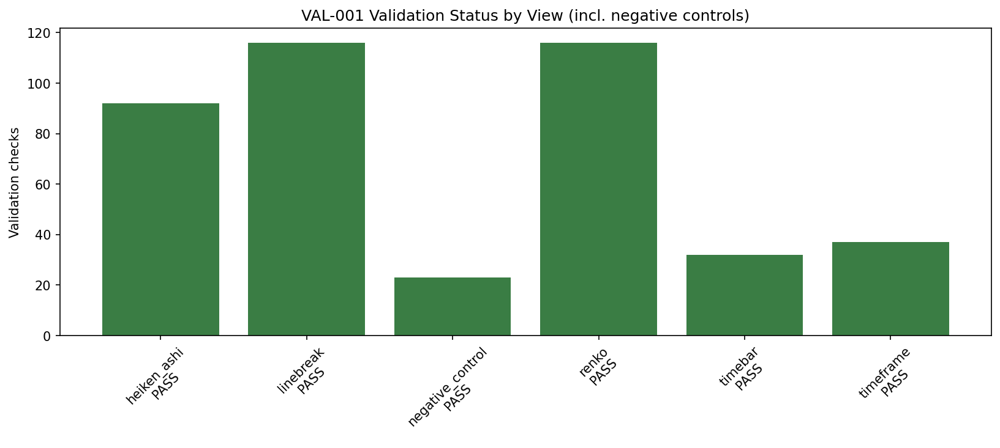
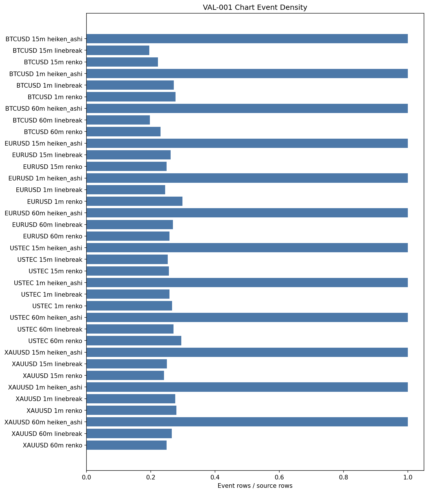

# Experiment Report: VAL-001 - Data Architecture Temporal Integrity Validation

## Status: COMPLETED (rev. 3)

**Date**: 2026-06-01
**Instruments**: BTCUSD, EURUSD, USTEC, XAUUSD
**Data Views / Feature Categories**: 1-minute time bars; 15-minute and
60-minute OHLC resamples; Line Break level 3; Renko ATR period 14; Heiken Ashi

---

## Question

Can the current Xen data layer be trusted to support future thesis work without
detected temporal alignment failures or look-ahead contamination in any scoped
row?

## Hypothesis

The available Xen data architecture preserves temporal alignment across scoped
time-bar, timeframe, and chart-type views — exhibiting no future-timestamp or
cross-view misalignment in any emitted row, and no structural look-ahead in
prefix-stability probes positioned at the head, middle, and tail of the analysis
slice — when every derived view is generated only from the first 70% of each
chronologically ordered base dataset.

## Revision Note

VAL-001 was first executed and approved under rev. 2. A post-completion review
found three detection-power gaps, which were fixed and re-run in place as rev. 3
(same ID, by explicit governance decision):

1. **Coverage** — a negative control now backs every data-integrity and
   alignment check (8 → 23), including the base time-bar integrity checks that
   previously had no failure-detection evidence.
2. **Determinism control** — now routes an actually non-deterministic generator
   through the real determinism check, instead of testing `DataFrame.equals`.
3. **Look-ahead** — prefix stability is probed at the head, middle, and tail of
   each slice at three cut points, and the hypothesis scopes the structural
   no-look-ahead claim to those probe windows while full-output timestamp
   alignment is checked on every emitted row.

A manual generator-correctness review (Line Break and Renko against
`architecture.md`) found no defect; no positive value-correctness check was added,
because deterministic + reproducible generation lets downstream consumers
replicate any result.

## Method Summary

VAL-001 validated all available base time-bar files using only the first-70%
chronological analysis slice. It checked base OHLC integrity, compared 15-minute
and 60-minute resamples against an independent pandas oracle plus a golden
fixture, validated chart-type timestamp mappings on full output, probed prefix
stability and deterministic regeneration, and required 23 injected negative
controls to be detected. No strategy returns, P&L, forecasts, stops, targets, or
parameter optimization were in scope.

## Key Findings

### Finding 1: All validation checks passed

The run produced 416 validation rows: 416 PASS, 0 FAIL, 0 INCONCLUSIVE. Each real
instrument contributed 98 PASS checks; the synthetic control group contributed 24
(23 negative controls + 1 golden fixture).

### Finding 2: Every negative control was detected (complete coverage)

All 23 negative controls were detected. Coverage now spans base time-bar
integrity, resample oracle agreement and output-side checks, every sparse-chart
alignment check, Heiken Ashi real-price/mapping/count checks, the chart schema
check, the look-ahead generator (prefix stability), and an actually
non-deterministic generator (determinism). This closes the rev. 2 gap where only
8 of the check types had detection-power evidence and the base-integrity checks
had none.

### Finding 3: Timeframe and chart-type denominators behaved as expected, reproducibly

15-minute and 60-minute resamples matched the independent oracle with zero row or
OHLC disagreements. Heiken Ashi emitted one row per source row everywhere; Line
Break densities ranged 0.195149–0.275556 and Renko 0.222171–0.298266. Renko
produced 107,824 duplicate `SourceCloseTime` groups and 128,556 extra same-source
rows, explicitly reported. Every event count and density reproduced the rev. 2
run byte-for-byte — direct evidence of deterministic generation.

### Finding 4: No structural look-ahead across the slice

All 60 prefix-stability checks (head/middle/tail for 1-minute views; `full` for
15m/60m) and all 36 determinism checks passed, with zero diverged cuts. The
injected look-ahead generator was caught at all three cut points.

## Conclusion

**Hypothesis SUPPORTED.**

The current Xen data layer is ready to support the next research thesis from a
temporal-integrity standpoint. Support is deterministic rather than statistical:
zero observed validation failures across the scoped files, plus detection of every
injected fault across the full set of data-integrity and alignment checks.

This does not mean future strategy results will be profitable or predictive. It
means the current base data, timeframe aggregation, and chart-type generation
passed the timestamp-alignment and no-look-ahead gate needed before downstream
thesis work should rely on them.

## Limitations

- Covers the four base files available at run time, not future data or generator
  changes.
- Structural no-look-ahead and determinism are probed on bounded windows
  (head/middle/tail); full outputs are still checked for timestamp alignment on
  every row.
- A few structural/informational checks (`required_columns_present`,
  `single_symbol_per_file`, `timeframe_source_is_base`, `analysis_slice_loaded`)
  have no negative control; the audit deems this non-blocking.
- No active checkpoint `design.md` exists; this acts as a thesis-readiness gate.
- `run_metadata.json` records parameters and probe configuration but not a script
  hash.

## Implications for Future Research

- A first active thesis checkpoint can now be designed on top of the validated
  data layer.
- Any future change to chart generators, `aggregate_ohlc()`, or the loading
  convention should trigger a fresh VAL rerun.
- Downstream experiments must still enforce real-price outcome discipline:
  strategy returns and P&L use real time-matched prices, never synthetic chart
  prices.

## Recommended Next Experiments

1. **EXP-001 (proposed)**: Define the first thesis checkpoint and run a narrow
   signal-quality experiment using the validated data-layer assumptions.
2. **VAL-002 (conditional)**: Rerun temporal-integrity validation if data files,
   chart generators, `aggregate_ohlc()`, or holdout-loading conventions change.

## Artifacts

| Artifact | Path |
|----------|------|
| Scope | [scope.md](scope.md) |
| Analysis Plan | [analysis-plan.md](analysis-plan.md) |
| Code | [code/run_experiment.py](code/run_experiment.py) |
| Audit | [audit.md](audit.md) |
| Results | [results.md](results.md) |
| Governance Reviews | [governance/](governance/) |
| Raw Result Tables | [results/](results/) |
| Plots | [plots/](plots/) |
