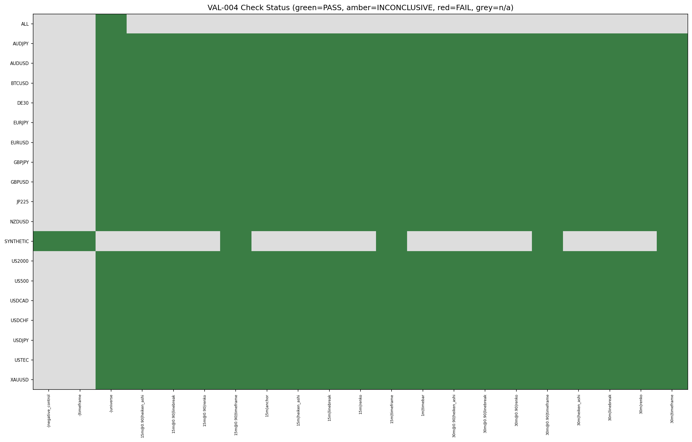
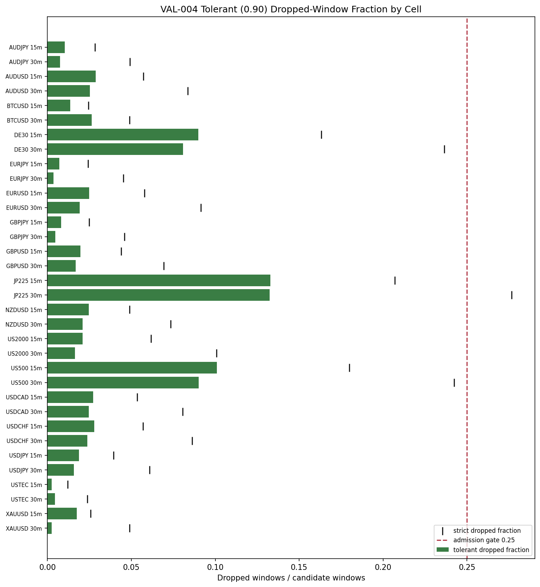

# Experiment Report: VAL-004 — 15m/30m Domain Temporal-Integrity Validation (Phase 014 Gate)

## Status: COMPLETED

**Date**: 2026-06-14
**Instruments**: AUDJPY, AUDUSD, BTCUSD, DE30, EURJPY, EURUSD, GBPJPY, GBPUSD, JP225, NZDUSD, US2000, US500, USDCAD, USDCHF, USDJPY, USTEC, XAUUSD (all 17 VAL-003-admitted)
**Data Views / Feature Categories**: 1-minute time bars → aggregated OHLC (15m and 30m, each in strict and tolerant `min_coverage=0.90` modes); Heiken Ashi, Line Break (level 3), Renko (ATR 14) chart views over the new domains.

---

## Question

For each instrument × {15m, 30m} × {strict, 0.90}: does the aggregated domain pass all VAL-001 rev. 3 integrity checks, are all negative controls detected, does the output reproduce deterministically, and what is the per-cell dropped-window fraction under `min_coverage=0.90`?

## Hypothesis

The 15m and 30m domains, constructed by `aggregate_ohlc` from the first-70% analysis slice of each chronologically ordered 1-minute base file in both strict and tolerant (`min_coverage=0.90`) modes, preserve temporal alignment across the scoped time-bar, timeframe, and chart-type views — no future-timestamp or cross-view misalignment in any emitted row, no structural look-ahead in prefix stability probes at head/middle/tail — for every one of the 17 instruments.

## Method Summary

A VAL-series rerun of VAL-001 (rev. 3). The VAL-001 check battery, probe bounds, negative-control catalogue, chart parameters, and pass/fail semantics are reused byte-for-byte. Two scoped changes: (1) timeframe set extended to [15, 30] (15m strict = determinism anchor against the prior record); (2) tolerant-mode (`min_coverage=0.90`) pass added, parameterizing the oracle retention predicate and SourceBars range check with the same floor expression used by `aggregate_ohlc`. New disclosures: per-cell dropped-window fraction, 15m determinism anchor fingerprint with cross-run reconciliation, 30m golden fixture, and tolerant SourceBars range controls. See `analysis-plan.md` for full methodology.

## Key Findings

### Finding 1: Full Suite PASS — All 68 Cells ADMITTED

Every cell (17 instruments × 2 domains × 2 modes) passes all integrity checks with 0 failures. All 68 tolerant-mode cells are ADMITTED (dropped fraction ≤ 0.25 gate). No cell is COVERAGE_EXCLUDED or INCONCLUSIVE.

### Finding 2: Tolerant Coverage — All Dropped Fractions Well Below the 0.25 Gate

The highest dropped fraction is JP225-15m at 0.133. Index instruments (DE30, JP225, US500) have higher fractions (0.08–0.13) reflecting market-hour gaps, but all are well below the admission threshold. Tolerant fractions are consistently lower than strict fractions, as expected (tolerant retains legitimate partial windows).

### Finding 3: 15m Strict Determinism Anchor Reconciled

All 17 instruments' 15m strict output reconciles to the pinned VAL-001/VAL-003 record — every prior (instrument, view, check) key is present and PASS in VAL-004. Within-run determinism confirmed for every cell.

### Finding 4: All 28 Negative Controls Detected

Every injected fault, including the two tolerant SourceBars-range controls (below-floor and above-period) and both must-not-overfire assertions (legitimate in-range partials not falsely flagged), is detected. Detection power is intact.

## Conclusion

**SUPPORTED (PASS)** — full Suite PASS. The 15m/30m domains in both strict and tolerant modes preserve temporal alignment, OHLC integrity, cross-view timestamp alignment, and deterministic regeneration across all 17 instruments. The §5 VAL gate in the Phase 014 checkpoint design is **PASSED**. All 17 instruments × {15m, 30m} cells are individually admissible to EXP-048 (substrate/detector readiness).

## Limitations

- VAL-004 validates construction integrity only. It does not test signal, edge, strategy, or market-behavior properties of the new domains.
- DE30 truncated-coverage disclosure (broker history ends 2026-01-16) carries forward from VAL-003; this is a data-coverage feature, not an integrity defect.

## Implications for Future Research

- 15m and 30m domains are cleared for EXP-048 (substrate/detector readiness in the HA-harami family).
- The tolerant construction mode (`min_coverage=0.90`) admits all cells with dropped fractions 0.003–0.133, so no cell is excluded by the coverage gate on these domains.
- The 15m strict determinism anchor confirms the code path has not drifted from the VAL-001/VAL-003 baseline — the 30m and tolerant claims produced by the same path are trustworthy.

## Recommended Next Experiments

1. **EXP-048**: ZigZag substrate and HA harami detector readiness across all 102 cells (Phase 014-A), gated on this VAL PASS for 15m/30m.

## Artifacts

| Artifact | Path |
|----------|------|
| Scope | [scope.md](scope.md) |
| Analysis Plan | [analysis-plan.md](analysis-plan.md) |
| Code | [code/](code/) |
| Audit | [audit.md](audit.md) |
| Results | [results.md](results.md) |
| Governance Reviews | [governance/](governance/) |
| Plots | [plots/](plots/) |
