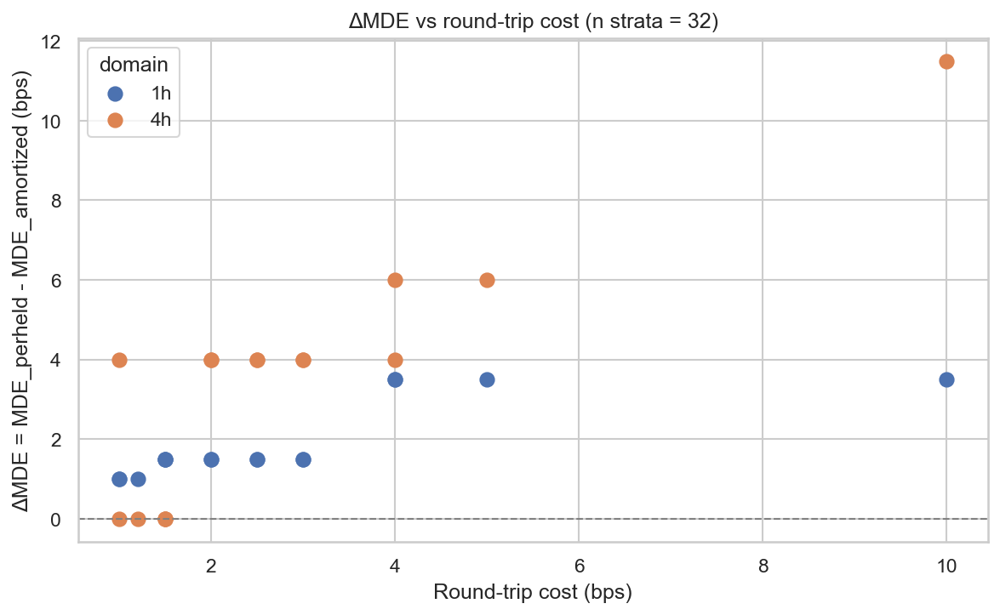
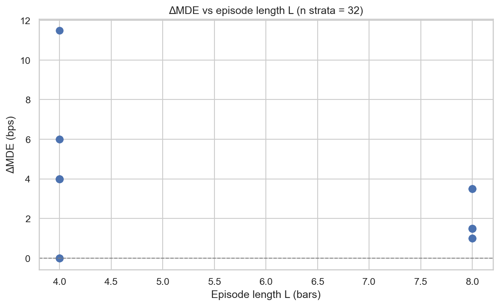

# Experiment Report: EXP-001 — E1 Cost-Control Arm (referee renew, D-referee)

## Status: COMPLETED

**Date**: 2026-06-28
**Instruments**: 16 of the 17-instrument universe (DE30 skipped — no 5-year-era file)
**Data Views**: open-to-open `≤t-1` real returns (E0 primitive) on fenced 1h/4h domain bars; first-70% analysis slice; global holdout sealed.
**Classification**: analysis-only (synthetic exogenous positions + planted edge; no price→signal).

---

## Question

How much of Component A's economic-MDE inflation (L-12 Mode-1) is the **per-held-bar cost
convention** (F3) rather than the conjunctive gate shape? For a persistent (low-turnover) signal,
does charging the round-trip **once per holding episode** (amortized) instead of **on every held
bar** lower the gate-stack MDE at equal-or-better FPR — and by how much, per stratum?

## Hypothesis

For a persistent signal of episode length `L`, the frozen per-held-bar convention over-charges
turnover ≈`L×`; amortizing recovers detection power. Binding contrast per stratum:
**ΔMDE = MDE_perheld − MDE_amortized** at matched FPR. ACCOUNTING_MATERIAL if amortized
DET-dominates (lower MDE, FPR no worse); largest on high-cost instruments and longest `L`.

## Method Summary

Two cost conventions, identical everything else (same draws, seeds, split, bootstrap), pushed
through the frozen gate via an **additive seam** (`referee_adaptive.gate_stack_core_costfn` —
mirrors frozen `gate_stack_core`, swaps the **signal-leg** return function only; naive L3 leg
stays frozen per-held-bar; reduces bit-identically to the frozen core at `strategy_return_bps`).
Per stratum (instrument × domain): **FPR** on two null substrates (permuted-returns+persistent;
reblock-random), **MDE** = first `EDGE_GRID_BPS` level at ≥50% detection (DETECTED_FLOOR). See
[design.md](design.md).

---

## Key Findings

### Finding 1 — Accounting is MATERIAL, scaling with cost and L (ΔMDE ≥ 0 on all 32 strata)

Amortizing the round-trip lowers the detection floor on every stratum; the gain grows with
round-trip cost and with episode length `L` (1h `L=8` > 4h `L=4`).

| Representative stratum | cost (bps) | L | MDE_perheld | MDE_amort | **ΔMDE** |
|---|---|---|---|---|---|
| EURUSD/1h (low cost) | 1.0 | 8 | 2.0 | 1.0 | **1.0** |
| XAUUSD/1h | 3.0 | 8 | 2.0 | 0.5 | **1.5** |
| USTEC/1h (mid) | 4.0 | 8 | 4.0 | 0.5 | **3.5** |
| BTCUSD/1h | 10.0 | 8 | 4.0 | 0.5 | **3.5** |
| JP225/4h | 4.0 | 4 | 8.0 | 2.0 | **6.0** |
| BTCUSD/4h (high cost) | 10.0 | 4 | 12.0 | 0.5 | **11.5** |

Pool (disclosure-only, L-03): finite ΔMDE median **1.50 bps**, max **11.50 bps**. Per-stratum
sign is homogeneous (ΔMDE ≥ 0 everywhere; `mde_monotone_ok` true 32/32) — the pool is a clean
disclosure, not masking. Full table: [results/per_stratum.csv](results/per_stratum.csv).

**Units (binding framing, audit Warning 1):** the `EDGE_GRID` is calibrated in **per-held-net-edge
bps** (the plant sets `net_edge_bps` = per-held net). ΔMDE is therefore the **reduction in the
per-held-net detection floor for the same gross signal** — not an amortized-net MDE. Read it as
"per-held accounting wastes ΔMDE bps of detectable edge on phantom turnover cost."

### Finding 2 — Mechanism: per-held-bar over-charges turnover ≈ L×

Per-held charges `cost` on every active bar; a direction held across an episode of length `L`
pays ≈`L × cost` for one round-trip it actually incurs. Amortized charges once per entry. For the
**same gross drift**, amortized nets more → detects at a lower floor. The effect is the F3
over-charge signature: ΔMDE largest on high-cost BTCUSD and at the longer 4h `L`.

**This is direct evidence that L-12 Mode-1 (referee over-rejection) is partly *accounting*, not
solely gate shape.** It scopes E3: adopt amortized accounting first; the composite redesign then
only needs to target the genuine tail-only/sparse residue.

### Finding 3 — 4h power caveat (audit Warning 2)

4h strata are small (`n ≈ 4–6k` returns) → low bootstrap power and coarse grid steps (≥4 bps at
the top). Some 4h ties / partial detections reflect **power + grid coarseness**, not "accounting
immaterial". Read 4h cells with their effective-n; the 4h ΔMDE (e.g. BTCUSD 11.5) is a lower bound
on a coarse grid.

### Methodological note — convention-specific plant calibration

First run fired 12 `no-real-edge` tripwires (amortized arm only). Audited as a **mis-specified
guard, not a leak**: `plant_positive_edge(edge=0)` injects gross drift `= cost` calibrated to
cancel the *per-held-bar* charge, so it is a true zero-net only for per-held; for amortized it is
a genuine `≈ cost·(1−1/L)` edge the gate correctly passes (independently fit: pass→1 iff
`cost·(1−1/L) > materiality`). Guard re-specified to a **no-plant null** (real returns, no drift →
0.000 pass both arms); rerun gave **bit-identical ΔMDE** and all tripwires clean. Takeaway: a
cost-compensated plant is convention-specific — the E2/E3 batteries must define the null per
convention. `plant0_passrate_*` retained in results as the disclosure.

---

## Conclusion

**Hypothesis SUPPORTED (per stratum): ACCOUNTING_MATERIAL.** The per-held-bar cost convention
inflates the economic detection floor on every one of 32 strata; amortizing recovers 1.0–11.5 bps
of per-held-net MDE, scaling with round-trip cost and episode length. A meaningful share of the
L-12 Mode-1 over-rejection on persistent low-turnover signals is **accounting**, fixable by
charging cost once per episode rather than per held bar — independent of any gate-shape redesign.

## Registry Disposition

**Not a candidate screen — referee-renew methodological substrate** (Chapter-02 Phase-001
§D0/E1). EXP-001 does **not** adjudicate CF-MR-002 or any candidate; **0 candidate slots, 0
counted TEST reads, global holdout sealed**. Disposition recorded as an E-series row in the
Chapter-02 Phase-001 batch of `docs/signal-registry/multiplicity-registry.md`. No candidate-family
status change; no family detail card (no candidate adjudicated). Frozen Chapter-01 suite untouched
(`referee_calibration.py` byte-identical); the seam is additive in `referee_adaptive.py`.

## Limitations

- Constant-drift plant only (per design; the non-constant Q2 battery is E2). ΔMDE is conditioned
  on the persistent blockwise position shape.
- 4h low power / coarse grid (Finding 3).
- ΔMDE in per-held-net-edge grid units (Finding 1 framing).
- DE30 absent from the 5-year era (no current file) — 16/17 instruments.

## Recommended Next Experiments

1. **E2 (proposed)**: repeat the cost-convention contrast under the **non-constant** planted-edge
   battery (Q2 shapes) with per-convention nulls — test whether the accounting gain survives
   tail-only / sparse signals.
2. **E3 (proposed)**: composite gate redesign that **adopts amortized accounting**, then targets
   only the residual tail-only/sparse over-rejection (L-12 Modes 2–3). FPR-recalibrated and frozen
   before any candidate read.

## Artifacts

| Artifact | Path |
|----------|------|
| Design (scope + analysis plan + pre-exec GATE) | [design.md](design.md) |
| Code (harness + helper + seam) | [code/](code/) |
| Audit (PASS after one fix+rerun) | [audit.md](audit.md) |
| Report (this file) | [report.md](report.md) |
| Plots | [plots/](plots/) |
| Results | [results/](results/) |

---

## GATE: APPROVE (orchestrator inline post-exec, 2026-06-28)

Checked against `references/governance-constraints.md` + audit.md:
- **Verdict forensics + causal-provenance present** (audit.md): per-stratum re-derivation (3
  strata, exact match), masking check (identical planted series, costfn-only divergence),
  mechanism stated, gate-shape (location effect → right instrument). ✓
- **Causal provenance**: open-to-open `≤t-1`; first-70% + domain fence; synthetic exogenous
  positions, planted oracle stimulus; no price→signal; analysis-only confirmed; frozen suite
  byte-unmodified; seam equivalence bit-identical. ✓
- **Every verdict-material finding fixed-and-rerun**: the mis-specified no-real-edge guard
  (Critical 1) fixed → re-executed → all tripwires held, **ΔMDE bit-identical** (orthogonality
  proven). ✓
- **Per-stratum binding** (L-03); pool disclosure-only. ✓ **Leak tripwires** (4) held. ✓
- **Registry disposition recorded**: referee-renew E-series row; 0 slots / 0 reads; no candidate
  advanced; holdout sealed. ✓

No REVISE issues. EXP-001 COMPLETE.
