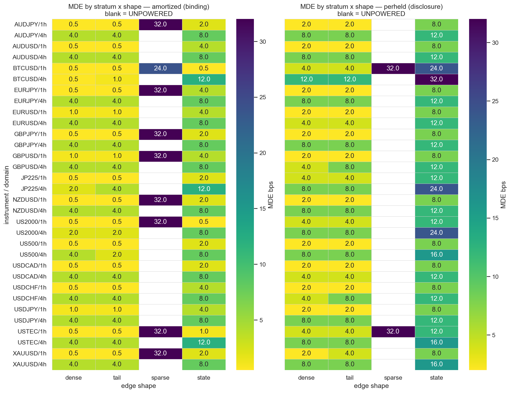

# Experiment Report: EXP-002 — E2 Synthetic-Positive Battery + Dogfood (referee renew)

## Status: COMPLETED

**Date**: 2026-06-29
**Instruments**: 16 of 17 (DE30 skipped — no 5-year-era file)
**Data Views**: open-to-open `≤t-1` real returns (E0) on fenced 1h/4h domain bars; first-70% slice;
global holdout sealed.
**Classification**: analysis-only (synthetic exogenous positions + planted oracle edges + frozen
primitives; no price→signal).

---

## Question

Does the frozen conjunctive 5-leg gate keep **finite power** on non-constant true edges (tail-only,
sparse/event, state-dependent), or is it **structurally blind** to any shape that is not
dense+location (L-12 §1/§2)? Per stratum × shape: finite MDE (DETECTED_FLOOR) or UNPOWERED.

## Method Summary

Four matched-magnitude edge shapes (DENSE anchor, TAIL-ONLY, SPARSE/event, STATE-dependent) — each
injecting the **same mean drift `e` over its declared denominator** — swept over `EDGE_GRID_BPS` and
pushed through the **frozen** gate via the E1 seam `gate_stack_core_costfn` (legs unchanged; **binds
on the amortized accounting-clean convention**, per-held disclosed). MDE = first `e` at ≥50%
detection; no finite MDE = UNPOWERED. FPR from three fresh nulls (block-permute returns,
reblock-random positions, real dogfood signals). See [design.md](design.md).

---

## Key Findings

### Finding 1 — The frozen gate is structurally blind to SPARSE edges, degraded on STATE, robust to DENSE+TAIL

| Shape | Binding (amortized) outcome | Read |
|---|---|---|
| **DENSE** (anchor) | DETECTED 32/32 | gate is built for this |
| **TAIL-ONLY** | DETECTED 32/32, MDE ≈ DENSE | **not blind to tail concentration** |
| **SPARSE/event** | **~uniformly blind** (23 DENSE_ONLY_BLIND + 9 finite **only at grid-top 32 bps**) | gate cannot see a usable sparse edge |
| **STATE-dependent** | 15 DETECTED + 17 MDE_INFLATED (~2–4× DENSE) | degraded by sub-population dilution |

Per stratum is binding (L-03); the per-shape picture is homogeneous (sparse blindness spans **all**
cost tiers 1.0→10.0 — not cost-driven). The 9 "inflated" sparse cells reach finite MDE only at the
32 bps grid top, so **SPARSE reads as ~uniformly blind** (audit Warning 1).

### Finding 2 — Mechanism: the blindness localizes to two named legs (leg-level, audit-confirmed)

Tracing `gate_stack_row` leg results across the edge grid:

| Shape | Binding leg | Why |
|---|---|---|
| **SPARSE** | **L1_readiness** (structural) | ~6% activity → too few state-episodes (test **16/27 < min_state_count 20**) → **L1=False at every `e`, incl. 32 bps**. Edge-independent — the L-12 §2 "structurally-impossible leg", **not** low statistical power. (L5 also vetoes the diluted mean — a dual veto.) |
| **STATE** | **L5_materiality** | edge on state-A bars only (`frac_A=0.5`) → pooled mean **halved** (pooled/δ=0.51) → below the materiality floor until `e`≈2× lifts it (L-03 pooling). L1 fine. |
| **TAIL** | — (none) | matched mean + dense activity → the mean-based legs (L3 CI, L5 materiality) see the same mean as DENSE; tail concentration perturbs variance/L4 only. |

This **confirms L-12 §1/§2** and pins the failure to **activity** (sparse → L1) and **pooling**
(state → L5) — **not** edge shape generically.

### Finding 3 — FPR control + leak resistance intact

FPR = **0.000** on all 32 strata, both conventions (abstract nulls, 160 draws/stratum, Wilson hw
≈0.026). Real dogfood (Donchian R + MA 20/50, **causally lagged**): **0/64** PASS. All leak tripwires
held — FPR control, no-plant guard, and the **future-destroying control collapsed** every detection.

---

## Conclusion

**Question answered (characterisation):** the frozen conjunctive gate is the **right instrument for
dense+location edges**, **structurally blind to sparse/event edges** (the L1 readiness leg vetoes
them at any magnitude), and **degraded on state/sub-population edges** (L5 materiality on the pooled
mean). It is **not** blind to tail concentration. The L-12 §1/§2 over-rejection is real and now
**localized to two named legs**, giving E3 a precise target.

This is the EXP-019-style calibration substrate (synthetic-positive battery + dogfood-negative) that
**E3's adaptive gate will be measured against** — FPR-controlled here, with a finite-power map per
shape.

## Registry Disposition

**Not a candidate screen — referee-renew methodological substrate** (Chapter-02 Phase-001 §E2).
EXP-002 does **not** adjudicate CF-MR-002 or any candidate; **0 candidate slots, 0 counted TEST
reads, global holdout sealed**. Recorded as the E2 row in the Chapter-02 Phase-001 batch E-series
table of `docs/signal-registry/multiplicity-registry.md`. No candidate-family status change; no
family detail card. Frozen suite `referee_calibration.py` byte-unmodified.

## Limitations / Caveats (from audit)

- ΔMDE/MDE in per-held-net-edge grid units (E1 convention); binding read is amortized.
- 4h strata small (n≈4–6k) — but the sparse veto is L1=False (deterministic), not a power boundary,
  so the sparse classification is robust to resamples.
- SPARSE 9 "MDE_INFLATED" cells are effectively blind (finite only at 32 bps) — read as blind.
- Two surfaced deviations, both audit-cleared: turnover helpers **promoted** to `referee_adaptive`
  (behaviorally identical to EXP-001 local copy; frozen suite untouched); dogfood **causal lag** (+1
  bar) verified no look-ahead (`lagged[i]==raw[i-1]`, acts on confirmed bars ≤t-1).

## Implications for E3 (reconciled with the binding D0 — operator decision 2026-06-29)

Audit Warning 2 suggested a *power-aware L1*. That is **superseded** by the ratified D0
(checkpoint:102–103): **keep L1+coverage rigid** (the candidate-blind validity floor that earns
FPR≈0); **adapt only the economic legs L3/L5**. Reconciliation: the **sparse-L1-veto is the validity
floor working as intended** — an honest UNPOWERED refusal of a ~6%-activity vehicle that lacks the
episodes to adjudicate, **not** a Mode-1 false-reject to fix. (The L-04 lesson is *match the
evaluation vehicle to the sparse signal* — an event-level method — **not** loosen the floor;
loosening L1 would re-introduce the FPR risk the floor removes. That vehicle question is out of
Phase-001 gate scope.) E3 therefore:
1. **Adapts L3/L5 only** — power-aware economic gating (apply where finite MDE), a **sub-population /
   per-state L5** so materiality isn't fooled by a pooled-diluted mean (the recoverable STATE loss),
   amortized accounting (E1), and **remove the L2 no-op** (F4). **L1 stays rigid.**
2. **Sparse stays UNPOWERED by design** — the correct, FPR-preserving outcome; not an E3 target.

**Scoping (operator, 2026-06-29):** E3 is **split** — **E3a** = this economic-leg core (single
question, in budget); **E3b** (deferred, registered) = the return-series unit (Q9/F10) + composite-
form DET-dominance selection (Q4). D0 is **not** amended.

## Recommended Next Experiments

1. **E3 (proposed)**: adaptive gate build — power-aware leg gating (L1) + sub-population L5 + the
   validity→economics composite, adopting amortized accounting (E1), FPR-recalibrated on **this E2
   substrate** and frozen before any candidate read.
2. **E4 (proposed)**: robustness — sensitivity of the blindness map to `f_tail`/`a_sparse`/`frac_A`
   and to the alpha/materiality thresholds.

## Artifacts

| Artifact | Path |
|----------|------|
| Design (scope + analysis plan + pre-exec GATE) | [design.md](design.md) |
| Code (harness + shape module) | [code/](code/) |
| Audit (PASS, 0 critical) | [audit.md](audit.md) |
| Report (this file) | [report.md](report.md) |
| Plots | [plots/](plots/) |
| Results | [results/](results/) |

---

## GATE: APPROVE (orchestrator inline post-exec, 2026-06-29)

Against `references/governance-constraints.md` + audit.md:
- **Verdict forensics + causal-provenance present**: per-stratum re-derivation (3 cells exact),
  matched-magnitude (shape not magnitude), **leg-level mechanism** (L1/L5/none per shape), gate-shape
  check (the experiment's purpose). ✓
- **Causal provenance**: open-to-open ≤t-1; first-70% + domain fence; synthetic exogenous positions +
  oracle plant; **dogfood causal lag verified no look-ahead**; analysis-only; frozen suite
  byte-unmodified; promotion behaviorally identical; seam bit-identical. ✓
- **No verdict-material findings** (audit 0 Critical) → no fix+rerun owed; the 2 Warnings are
  interpreter framing, carried into Findings 1/2 + the E3 implications. ✓
- **Per-stratum binding** (L-03); pool disclosure-only; FPR control held; **leak tripwires (3) held**
  incl. future-destroy collapse. ✓
- **Registry disposition recorded**: E2 referee-renew row; 0 slots / 0 reads; no candidate advanced;
  holdout sealed. ✓

No REVISE issues. EXP-002 COMPLETE.
