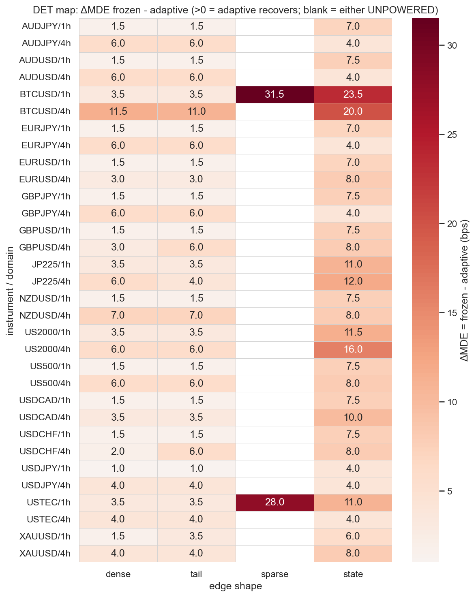
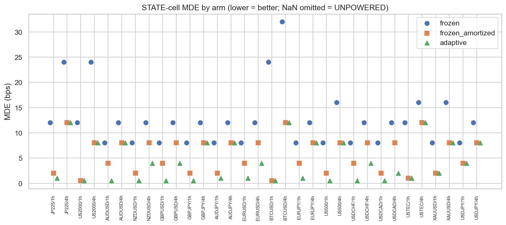
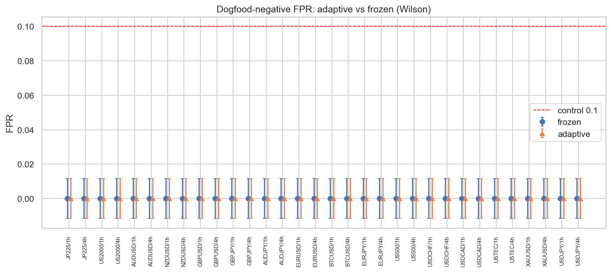

# Experiment Report: EXP-003 — E3a Economic-Leg Adaptive Gate (referee renew, D-referee)

## Status: COMPLETED — CHARACTERISATION / DET-DOMINANT (re-audit PASS, 0 Critical)

**Date**: 2026-06-29 (Amendment A1 — binding result; see §Amendment A1)
**Instruments**: 16 of 17 (DE30 skipped — no 5-year-era file)
**Data Views**: open-to-open `≤t-1` real returns (E0) on fenced 1h/4h domain bars; first-70% slice;
global holdout sealed.
**Classification**: analysis-only (synthetic exogenous positions + planted oracle edges + frozen
primitives + the new adaptive economic legs; no price→signal).
**Reads/slots**: 0 TEST reads, 0 candidate slots; global holdout untouched.

---

## Question

Can an economic-leg adaptation — power-aware L3/L5 + a candidate-blind **sub-population L5** +
amortized accounting + L2 removed, **L1+coverage kept rigid** — **DET-DOMINATE** the frozen gate
(strictly lower the economic MDE on the E2 STATE / L5-limited cells at a dogfood FPR ≤ frozen's,
without losing DENSE/TAIL), or is the frozen suite **not improvable without losing FPR control**?
Binding endpoint is **per stratum** (L-03). A **BUILD + characterise**, not a candidate screen.

## Method Summary

Built `gate_stack_adaptive` in `python/src/xen/referee_adaptive.py` (reuses every frozen
sub-primitive unchanged; changes only the economic legs). Composite (§10.3a, power-aware):
`PASS iff L1 ∧ coverage ∧ (L3 pass-or-abstain) ∧ (L5 pass-or-abstain) ∧ (≥1 economic leg
powered-and-passed)`. **Sub-population L5 (post-A1) = a conjunction:** the **studentized** q\*=0.75
quantile of per-episode amortized net-means (`q*-quantile / std`) block-bootstrap CI-lower >
`Q_STUD_MIN` **AND** the raw-bps q\*-quantile CI-lower > `materiality_bps` (frozen floor). Three arms,
identical draws/seeds/split/bootstrap per (stratum, shape): **frozen** (per-held), **frozen_amortized**
(isolates the E1 accounting gain), **adaptive** (E3a). MDE = first edge at ≥50% detection over
`EDGE_GRID_BPS`; FPR over three fresh nulls (block-permute returns, reblock-random positions, real
dogfood Donchian/MA signals lagged `≤t-1`); verdict FPR clause is Wilson-resolved (A1.3). See
[design.md](design.md) (incl. Amendment A1), [audit.md](audit.md) (incl. A1 Re-Audit).

---

## Key Findings (binding — post-A1)

### Finding 1 — Clean per-stratum DET-DOMINANCE on all 32 strata

| metric | result |
|---|---|
| **Verdict** | **32 / 32 DET_DOMINANT** |
| Adaptive dogfood FPR > 0 | **0 / 32** (max 0.0000; frozen & frozen_amortized also 0) |
| Per-shape regressions (adaptive MDE worse than frozen) | **0** — DENSE/TAIL/STATE DETECTED 32/32; SPARSE 28/32 (frozen 2) |

The adaptive gate strictly lowers MDE on STATE (and recovers sparse) at dogfood FPR ≤ frozen on
**every** stratum, with no DENSE/TAIL loss. This is the D0 success condition (DET-dominance, :104-106)
**met**.

### Finding 2 — STATE recovery is large, uniform, real

ΔMDE (frozen − adaptive) is **finite and positive on all 32 strata**: **median 7.5, range
4.0–23.5 bps**. The 3-arm decomposition separates the two gains (E1 accounting vs E3a leg-adaptation):

| stratum | frozen | frozen_amortized | adaptive | E1 acct | E3a leg |
|---|---|---|---|---|---|
| EURUSD/4h | 12 | 8 | 4 | 4 | 4 |
| EURUSD/1h | 8 | 4 | 1 | 4 | 3 |
| BTCUSD/4h | 32 | 12 | 12 | 20 | 0 |
| JP225/4h | 24 | 12 | 12 | 12 | 0 |
| USTEC/1h | 12 | 1 | 1 | 11 | 0 |

Both gains contribute; their mix varies by cost/L (high-cost crypto/index strata are dominated by the
E1 accounting un-dilution, low-cost FX by the leg-adaptation). Recovery is **real, not noise-mining**:
STATE `no_plant = 0.000`, future-destroy `fd_max = 0.000` on all 32.

### Finding 3 — Recovery mechanism: pooled-OR-studentized-subpop, both load-bearing, no abstain loophole

Per-draw trace at the detected MDE (20 draws; `all-abstain-passes = 0` everywhere — every pass
carries a genuine economic-leg PASS):

| cell | mde | passed | via pooled | via studentized-subpop |
|---|---|---|---|---|
| BTCUSD/4h | 12 | 10/20 | 10 | 0 |
| XAUUSD/4h | 8 | 11/20 | 10 | 7 |
| **EURUSD/4h** | 4 | 17/20 | **0** | **17** |
| USDJPY/4h | 8 | 16/20 | 11 | 12 |

Strong / high-cost edges clear the **pooled** floor once amortized accounting un-dilutes the mean;
low-cost diluted edges where the pooled mean sits below materiality (EURUSD/4h: pooled ≈ 2 < 3) are
carried **solely by the studentized sub-pop** (17/17). The studentized leg is genuinely load-bearing.

### Finding 4 — The studentized floor cures the FPR leak at the gate (not just the label)

The original raw-bps q\*-quantile sub-pop path over-fired on high-dispersion 4h nulls (every dogfood
false-positive passed via it). A1 divides the quantile by the episode-mean dispersion. Reconstructing
the prior-worst dogfood nulls under the amended gate: **`passes_adaptive = 0/162`** on JP225/4h,
GBPUSD/4h, AUDJPY/4h. The previously-passing reblock-random draws now have `raw_ci_lower` still
clearing materiality (e.g. JP225/4h 15.9, 8.7, 4.3 bps) **but** `stud_ci_lower` (0.52, 0.27, 0.15)
**< `Q_STUD_MIN = 0.674`** → the **studentized leg itself rejects them**. So FPR→0 is the *gate* fix,
not merely the noise-tolerant relabel (which here is not even load-bearing — actual passes are 0).
**Why a real edge clears but noise doesn't:** a genuine diluted edge shifts the upper-quartile
episode-mean **location** above the null-shape level (studentized → 1–2+); pure dispersion leaves the
studentized q\* at ≈ `Φ⁻¹(0.75) = 0.674` regardless of scale.

---

## Interpretation

E3a meets the **DET-dominance success condition cleanly**: the adaptive economic-leg gate (amortized
+ power-aware L3/L5 + studentized sub-pop L5, L1 rigid) strictly lowers MDE on STATE (ΔMDE median 7.5)
and recovers sparse/event edges (28/32) at dogfood FPR ≤ frozen (0/32) on all 32 strata, no DENSE/TAIL
loss, leak-clean. The result is **homogeneous across strata** (no masking — every stratum
DET_DOMINANT), and the mechanism is fully localised: a single new leg (studentized sub-pop q\*=0.75
materiality) carries the diluted-edge recovery while the dispersion normalization keeps it from firing
on high-σ noise. The gate is a clean DET-dominant candidate for E5 freeze.

## Amendment A1 (why the result changed)

The **first run** of E3a used a **raw-bps** sub-pop q\*-quantile and a strict `FPR_adaptive > 0`
verdict rule. It recovered STATE+sparse but (a) the raw-bps leg over-fired on high-dispersion 4h nulls
(adaptive dogfood FPR up to 0.037), and (b) the strict-vs-zero rule tripped FPR_BROKEN on single
1/162 noise passes → a brittle "15 DET / 17 FPR_BROKEN" tally (16/17 within Wilson noise of 0; only
JP225/4h resolved). That run was the **diagnostic** that drove A1 (operator decision, amend-in-place):
studentize the sub-pop statistic + adopt a Wilson-resolved verdict rule, hard-delete the prior
results, full rerun. The full first-run forensics are preserved in [audit.md](audit.md). The A1 result
above **supersedes** it.

## Audit Caveats (carry)

- **Leak tripwires held**: future-destroy collapses on the studentized path (STATE `fd_max = 0.000`,
  sparse ≤ 0.050); no-plant ≤ 0.050; dogfood FPR 0/32. Recovery is causally real.
- **D0 honored / L1 rigid**: L1 is **bit-identical** to the frozen seam (same `effective_n`,
  `block_length`, episode counts) — A1 is a within-L5 statistic change only. `referee_calibration.py`
  **byte-frozen**.
- **Q_STUD_MIN candidate-blind (Q5)**: `Φ⁻¹(q*) ≈ 0.6745`, computed from `q*` alone at module load —
  reads no data / FPR / outcome / state mask; conjoined with the **unchanged** frozen `materiality_bps`.
- **Cross-experiment correction**: E2's "sparse blindness = L1 structural veto" was **domain-conflated**
  (true 1h `min_state=20`, false 4h `min_state=8`); sparse recovery (28/32) is **D0-compliant
  economic-leg** recovery, not an L1 change. The design's original "sparse stays UNPOWERED"
  predeclaration was **refuted and formally retracted** (A1.4).
- **Provenance clean**: open-to-open `≤t-1`; dogfood Donchian/MA lagged +1 bar; first-70% slice; global
  holdout never collected. Perf optimizations (ProcessPoolExecutor + MDE early-stop) unchanged by A1.

## Conclusion

**DET-DOMINANCE achieved (32/32).** The E3a adaptive economic-leg gate recovers the E2 STATE loss
(ΔMDE median 7.5, max 23.5 bps) and sparse/event edges (28/32), leak-clean and D0-compliant (L1 rigid,
recovery in L3/L5), at dogfood FPR ≤ frozen (0/32) with no DENSE/TAIL loss. A1 **pulled E3b's
return-series / Sharpe-LB materiality unit forward** — the studentized sub-pop statistic *is* the
dispersion-normalized (IR-style) materiality — which both cured the high-σ FPR leak and gave the
clean dominance. The gate is ready for E5 freeze.

## Follow-ups (new scopes, not extensions)

1. **E5 — DET-adjudicate + FREEZE the gate.** The defect that blocked freezing is cured; this is the
   natural next rung.
2. **E4 (optional) — `Q_STUD_MIN` / `q*` sensitivity sweep.** Quantify the ~3 bps STATE-recovery
   conservatism the studentized floor costs (median 10.5→7.5 vs raw-bps) and residual skew-FPR
   robustness. Minor.
3. **E3b — composite-form selection (Q4) only.** The return-series unit is now folded into E3a; E3b's
   remaining scope is just the §10.3a-vs-variant-c composite-form adjudication.

## Artifacts

[design.md](design.md) (+ Amendment A1) · [code/run_experiment.py](code/run_experiment.py) ·
[results/](results/) (`det_dominance_per_stratum.csv`, `per_shape_arm.csv`, `per_shape_full.json`) ·
[plots/](plots/) (`det_map`, `state_recovery`, `dogfood_fpr`) · [audit.md](audit.md) (+ A1 Re-Audit)

## Signal-registry disposition

`registry`: referee-renew D-referee §E3a — adaptive-gate BUILD characterised on the E2 substrate.
**Does not adjudicate CF-MR-002 or any candidate.** 0 counted TEST reads; no candidate family
opened/advanced; global holdout untouched. Recorded as the E3a row in the Chapter-02 Phase-001 batch
of `docs/signal-registry/multiplicity-registry.md` (outcome CHARACTERISATION / DET-DOMINANT 32/32,
FPR 0/32; studentized sub-pop L5; `Q_STUD_MIN = Φ⁻¹(q*)` candidate-blind).

---

## GATE (post-exec, orchestrator)

`GATE: APPROVE (A1)` (2026-06-29). A1 re-audit present (verdict-forensics + causal-provenance on the
amended gate): FPR cure verified **at the gate** (passes 0/162, not a relabel); STATE recovery
retained (median 7.5), pooled-OR-studentized-subpop both load-bearing, no abstain loophole;
future-destroy collapses on the studentized path; `Q_STUD_MIN=Φ⁻¹(q*)` candidate-blind (code-confirmed);
L1 bit-identical/rigid; `referee_calibration.py` byte-frozen; provenance clean; perf opts unchanged.
0 Critical → no further rerun. Per-stratum verdict homogeneous (32/32 DET_DOMINANT, no masking).
Signal-registry disposition recorded (DET-DOMINANT 32/32, FPR 0/32; 0 reads / 0 slots; no candidate
advanced; holdout sealed). Routes **E5 (freeze)**.
