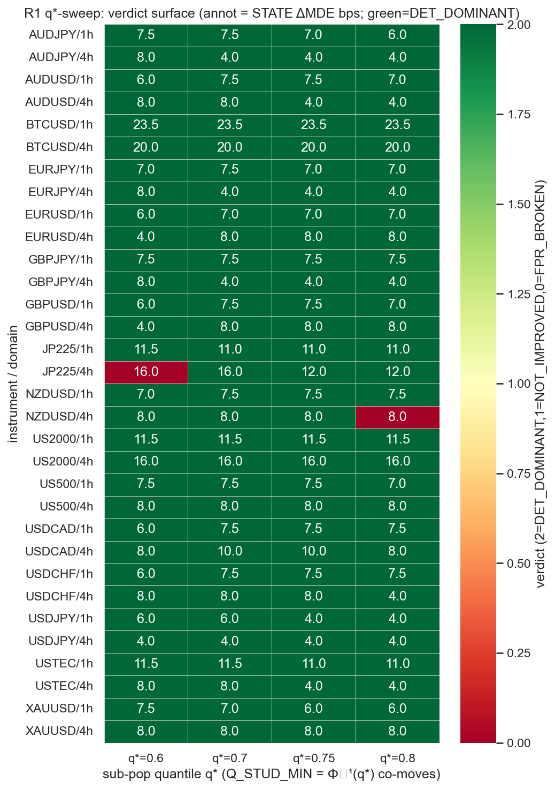
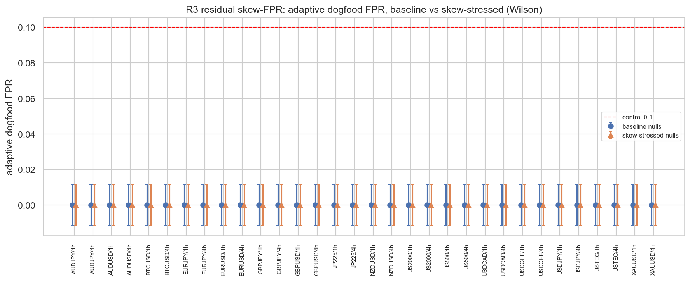
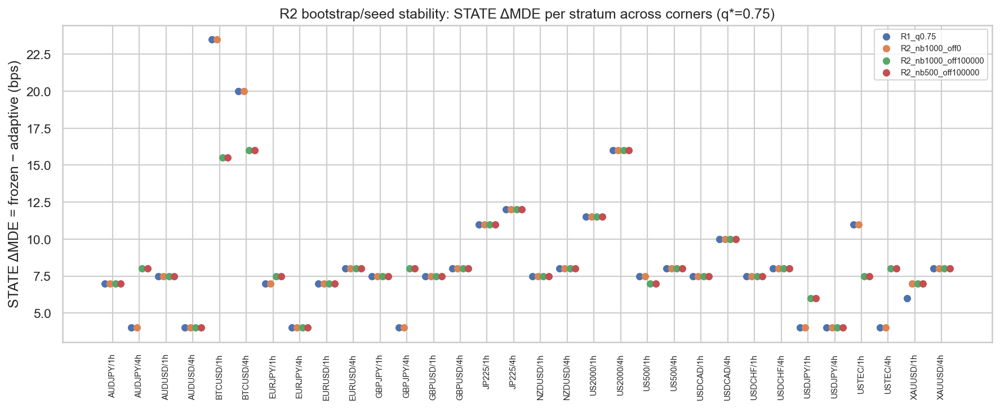

# Experiment Report: EXP-004 — E4 Robustness Pass (referee renew, D-referee)

## Status: COMPLETED — CHARACTERISATION / FREEZE LICENSED (audit PASS, 0 Critical)

**Date**: 2026-06-29
**Instruments**: 16 of 17 (DE30 skipped — no 5-year-era file)
**Data Views**: open-to-open `≤t-1` real returns (E0) on fenced 1h/4h domain bars; first-70% slice;
global holdout sealed.
**Classification**: analysis-only (synthetic exogenous positions + planted oracle edges + frozen
primitives + the E3a adaptive economic legs; no price→signal).
**Reads/slots**: 0 TEST reads, 0 candidate slots; global holdout untouched.

---

## Question

Is E3a's per-stratum DET-dominance verdict (32/32 DET_DOMINANT, STATE ΔMDE>0, dogfood FPR 0/32 ≤
frozen) **robust** — does it survive perturbation of the one free knob `q*∈{0.6,0.7,0.8}` (with
`Q_STUD_MIN=Φ⁻¹(q*)` co-moving, candidate-blind), of the bootstrap count + master seed, and of a
skew-stressed null — so the **E5 freeze is licensed at q*=0.75**; or does some perturbation flip a
stratum, bounding the safe range? Binding endpoint **per stratum** (L-03). A robustness
characterisation, not a candidate screen.

## Method Summary

Reused the EXP-003 3-arm DET orchestration (`frozen` / `frozen_amortized` / `adaptive`) with the
swept knobs threaded **explicitly** — `q` passed to `gate_stack_adaptive`, the coupled
`Q_STUD_MIN=Φ⁻¹(q)` set per-config on the `referee_adaptive` module (sole consumer: `adaptive_row`),
`n_bootstrap`/`seed_off` as params. `referee_adaptive.py` + `referee_calibration.py` stayed
**byte-frozen** (git-verified); `materiality_bps`, L1+coverage, the cost map untouched. **9 configs ×
32 strata = 288 per-stratum verdicts**: R1 q-sweep {0.6,0.7,0.75,0.8}; R2 (N_BOOTSTRAP,seed_off) over
{500,1000}×{0,+100000}; R3 right-skew-stressed null; + D-CIwidth/D-regime disclosures. All E3a leak
tripwires (future-destroy, no-plant, Wilson-resolved dogfood-FPR) retained at **every** sweep point.
See [design.md](design.md), [audit.md](audit.md).

---

## Key Findings (binding — per stratum)

### Finding 1 — Regression anchor reproduces EXP-003 exactly (harness correctness)

At `(q=0.75, N_BOOTSTRAP=500, seed_off=0, standard nulls)` the driver reproduces EXP-003 (A1)
**0/32 mismatches** on verdict, STATE ΔMDE, and adaptive dogfood FPR. The swept-knob plumbing is
correct → every sweep point is interpretable.

### Finding 2 — Freeze licensed at q*=0.75; safe range {0.7, 0.75}

| config | DET_DOMINANT | FPR_BROKEN | STATE ΔMDE median (bps) | flipped stratum |
|---|---|---|---|---|
| R1 q*=0.6 | 31/32 | 1 | 8.0 | JP225/4h |
| R1 q*=0.7 | **32/32** | 0 | 7.75 | — |
| **R1 q*=0.75 (anchor)** | **32/32** | 0 | 7.5 | — |
| R1 q*=0.8 | 31/32 | 1 | 7.5 | NZDUSD/4h |

The binding operating point (q*=0.75) is **32/32 DET_DOMINANT with adaptive dogfood FPR 0.0**, zero
per-shape regressions (DENSE/TAIL/SPARSE/STATE), STATE recovery retained (ΔMDE median 7.5, min 4.0).
q*=0.7 is equally clean. The extremes q*=0.6 / q*=0.8 each pick up exactly one flipped stratum →
**safe range {0.7, 0.75}**, baseline validated.

### Finding 3 — Every "break" is a single 1/162 label artifact, not a gate FPR leak

All **6** FPR_BROKEN across the whole sweep have `dogfood_passes_adaptive = 1 / 162` (adaptive FPR
0.00617, frozen 0.0). The A1.3 verdict rule flips because `wilson_lower(1,162)=0.00109 > 0`. The
gate's *actual* dogfood FPR never exceeds **0.62%** anywhere — two orders below the 2α=0.10 control
bound — and none of the single passes survive future-destroy. So these are a **verdict-labeling**
consequence of comparing a single noise pass against a *zero* frozen baseline, **not** an FPR leak.
(R2 +100000-seed corners: 2; D-regime recent-third: 2 — same mechanism, all 4h.)

### Finding 4 — Residual skew-FPR refuted (R3); no Q_STUD_MIN bump

A strongly right-skewed null (sample skew ≈ 3.6, mean ≈ 0) yields **0/32 adaptive passes (FPR 0.0)**;
the `frozen`/`frozen_amortized` arms are also 0.0 on it (the null is well-formed — no alignment
introduced). The studentized floor `Q_STUD_MIN=Φ⁻¹(q*)` holds because marginal skew lifts the *raw*
q*-quantile but not the *studentized* one (the null shape still lands at ≈Φ⁻¹(q*)). The A1.2 deferred
skew-FPR concern is **refuted** — the predeclared conservative `Q_STUD_MIN` bump is **not** warranted.

### Finding 5 — Bootstrap/seed stability + disclosures

R2: 94/96 DET_DOMINANT; the 2 breaks are the single-pass artifact (Finding 3). STATE ΔMDE is stable
across N_BOOTSTRAP {500,1000} and seed offsets. **D-CIwidth:** all 4h strata carry 144–231 sub-pop
episodes (≫ MIN_EPISODES_SUBPOP=5); CI half-widths 0.83–8.87 bps scale with dispersion (BTCUSD
widest) — non-degenerate, consistent with L-06. **D-regime:** the most-recent third holds 30/32
DET_DOMINANT (2 single-pass breaks) — dominance is not an early-regime artifact.

---

## Interpretation

E4 meets the **RANGE-BOUNDED** predeclared outcome (design §"KNOB-SENSITIVE / RANGE-BOUNDED"): the
E3a adaptive gate's DET-dominance is **robust at q*=0.75** and across q*=0.7, the bootstrap/seed grid,
and a strong skew stress — the gate's true dogfood FPR stays ≤0.62% (≪ 10% control) everywhere and
future-destroy collapses (max 0.050), so the **E5 freeze is licensed at q*=0.75** with safe range
{0.7,0.75}. The result is **homogeneous** (no stratum is systematically vetoed; all flips are single
1/162 passes on 4h cells). The one genuine caveat is methodological, not a gate defect: the A1.3
FPR_BROKEN **verdict rule** retains single-draw brittleness against a zero frozen baseline
(`wilson_lower(1,162)>0`). This is a recorded **E5 freeze-adjudication precondition**, not an E4
change — applying a fix in E4 would be tuning on the test (A1.2 discipline). R3 additionally retires
the residual-skew-FPR worry that E3a A1 left open.

## Audit Caveats (carry)

- **Leak-clean at every sweep point**: future-destroy max 0.050 (≤ guard 0.10); no-plant + Wilson-
  resolved dogfood-FPR control held on all 288 rows. A studentized quantile *can* mine noise; it did
  not.
- **Causal-provenance clean**: open-to-open `≤t-1`; dogfood Donchian/MA lagged +1; `skew_returns` is
  an elementwise marginal transform (reads input series only); first-70% slice; holdout never
  collected. Not price-primary.
- **Frozen-suite integrity**: `referee_adaptive.py` + `referee_calibration.py` byte-unchanged (git);
  only the runtime-derived `ra.Q_STUD_MIN=Φ⁻¹(q)` is set per config — candidate-blind (reads no data/
  FPR/outcome/mask). Frozen STATE-MDE verified q-invariant (q perturbs only the adaptive arm).
- **Warning (non-material)**: the 6 FPR_BROKEN are single-draw labels (Finding 3); baseline 32/32
  clean ⇒ does not move E4's range-bounded conclusion. Recorded E5 precondition.

## Conclusion

**FREEZE LICENSED (RANGE-BOUNDED).** The E3a adaptive gate is robust to its one free knob (safe
range q*∈{0.7,0.75}), to bootstrap count/seed, and to marginal return skew (R3 0/32), at a true
dogfood FPR ≤0.62% ≪ control, leak-clean. E5 may freeze at **q*=0.75**, adopting a less brittle
freeze-adjudication rule (min-pass-count ≥2 or control-relative FPR comparison) to retire the
single-draw labeling artifact. The defect-free due-diligence the freeze required is complete.

## Follow-ups (new scopes, not extensions)

1. **E5 — DET-adjudicate + FREEZE the gate at q*=0.75**, with the mandatory folded Q4 composite-form
   check (§10.3a vs variant-c). Adopt the less-brittle verdict rule (min-pass-count≥2 /
   control-relative) **before** freezing — derived candidate-blind, not from E4 outcomes.
2. (No skew remedy needed — R3 refuted the A1.2 concern.)

## Artifacts

[design.md](design.md) (+ pre-exec GATE) · [code/run_experiment.py](code/run_experiment.py) ·
[results/](results/) (`robustness_per_config_stratum.csv`, `regression_anchor_check.json`,
`ci_width_4h_disclosure.csv`) · [plots/](plots/) (`qsweep_surface`, `bootstrap_seed_stability`,
`skew_fpr`) · [audit.md](audit.md)

## Signal-registry disposition

`registry`: referee-renew D-referee §E4 — robustness characterisation of the E3a adaptive-gate BUILD
on the E2 substrate. **Does not adjudicate CF-MR-002 or any candidate.** 0 counted TEST reads; no
candidate family opened/advanced; global holdout untouched. The E4 row in the Chapter-02 Phase-001
batch of `docs/signal-registry/multiplicity-registry.md` is advanced to COMPLETE (outcome
FREEZE-LICENSED, safe q* range {0.7,0.75}; R3 skew-FPR refuted 0/32; A1.3 verdict-rule single-draw
brittleness recorded as an E5 precondition).

---

## GATE: APPROVE (post-exec, orchestrator inline, 2026-06-29)

Checked against `references/governance-constraints.md`:
- **Verdict forensics present** — per-stratum re-derivation (32-stratum stability table across 9
  configs), mechanism statement (true FPR ≤0.62% ≪ control; STATE recovery retained; breaks = A1.3
  label artifact), gate-shape check (R3 right-skew correctly not mistaken for an edge). Run
  autonomously. ✓
- **Causal-provenance & leak pass present** — provenance trace of swept knobs (`Q_STUD_MIN=Φ⁻¹(q)`
  candidate-blind, reads no data/FPR/outcome/mask), open-to-open `≤t-1`, `skew_returns` marginal-only
  contract; **future-destroy collapsed at every sweep point (max 0.050 ≤ guard)**; frozen modules
  byte-unchanged (git); analysis-only (not price-primary). ✓
- **Per-stratum masking check** — no pooled headline as verdict; all 6 flips individually disclosed as
  single 1/162 passes on distinct non-anchor 4h cells; baseline 32/32 not masking a flip. ✓
- **Every verdict-material finding fixed-and-rerun** — 0 Critical. The single Warning (A1.3
  single-draw FPR-label brittleness) is shown non-material to E4's range-bounded conclusion and is a
  predeclared **E5 precondition** (applying a fix in E4 = tuning-on-test, A1.2) → correctly NOT
  reworked here. ✓
- **Regression anchor** 0/32 reproduces EXP-003 → harness correct; sweep interpretable. ✓
- **Signal-registry disposition recorded** — referee-renew D-referee §E4; **no candidate family
  opened/advanced** (methodological build, correct); multiplicity-registry E4 row → COMPLETE; 0 TEST
  reads (no test-read-ledger entry; none counted); global holdout sealed. ✓
- **Budget** — 3 probes / 2–4, 3 plots / 3–5, 0 new src modules / 0–1; not tuned on CF-MR-002. ✓

No REVISE issues. **E4 CLOSED.** Routes **E5 (DET-adjudicate + FREEZE at q\*=0.75** with the folded
Q4 composite-form check and the E4-derived less-brittle freeze-adjudication FPR rule).
