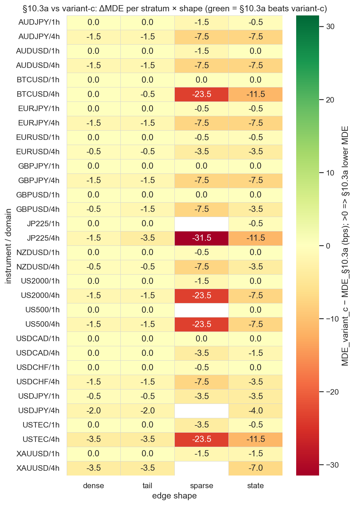
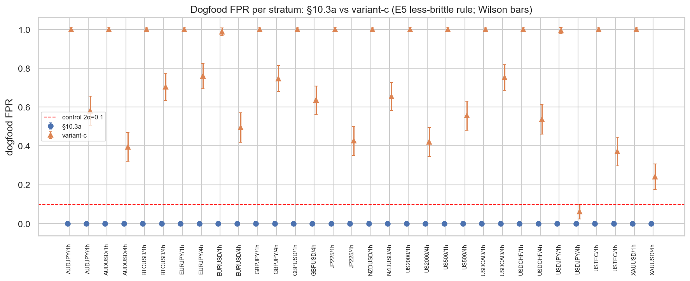
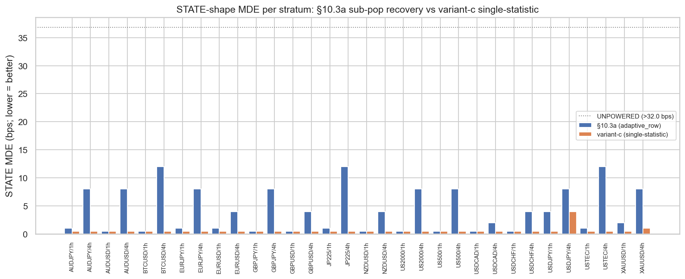

# Experiment Report: EXP-005 — E5 DET-Adjudication + FREEZE (+ folded Q4 form-check)

## Status: COMPLETED — RENEWED REFEREE FROZEN (audit PASS, 0 Critical)

**Date**: 2026-06-29
**Instruments**: 16 of 17 (DE30 skipped — no 5-year-era file) → 16 × {1h,4h} = 32 strata
**Data Views**: open-to-open `≤t-1` real returns (E0) on fenced 1h/4h domain bars; first-70% slice;
global holdout sealed.
**Classification**: analysis-only (synthetic exogenous positions + planted oracle edges + frozen
primitives + the adaptive verdict paths; no price→signal).
**Reads/slots**: 0 TEST reads, 0 candidate slots; global holdout untouched; not tuned on CF-MR-002.

---

## Question

On the E2/E3a substrate (32 strata × 4 shapes, q\*=0.75), does the **§10.3a** validity→economics
composite (the as-built `adaptive_row`) **DET-match-or-beat** the **single-statistic variant-c**
(L1+coverage admissibility ∧ a single binding economic statistic = incremental-net vs-naive
CI-lower > 0; L5/sub-pop demoted to diagnostics) — per stratum, lower MDE at **equal-or-better FPR** —
licensing the **FREEZE** of §10.3a at q\*=0.75 as the renewed referee; or does variant-c dominate, so
the winner is frozen instead? Binding endpoint **per stratum** (L-03).

## Method Summary

3-form DET comparison at the single E4-validated operating point (q\*=0.75, N_BOOTSTRAP=500,
seed_off=0, standard nulls), reusing the EXP-003/EXP-004 harness logic unchanged:
**frozen** (per-held DET reference + regression anchor) · **§10.3a** (`gate_stack_adaptive` +
`adaptive_row`, the freeze candidate) · **variant-c** (`gate_stack_adaptive` +
`adaptive_row_variant_c`, the rejected-alternative; **same core, single-statistic verdict**, added
additively to `referee_adaptive.py`). Per (stratum, shape, form): MDE = DETECTED_FLOOR. Per
(stratum, form): dogfood-FPR over 3 null families (block-permute returns; reblock-random positions;
causally-lagged Donchian-20 + MA 20/50). **E4-derived less-brittle freeze-adjudication FPR rule**
(adjudication harness only; gate byte-unchanged): a form is FPR-ACCEPTABLE iff `passes < 2` OR
`wilson_lower(passes,draws) ≤ 2α`. DET-eligibility = leak-clean (FPR-acceptable ∧ future-destroy
collapsed ∧ no no-plant breach); a leaking form is off the DET curve. See
[design.md](design.md), [audit.md](audit.md).

---

## Key Findings (binding — per stratum)

### Finding 1 — Regression anchor reproduces EXP-003(A1)/EXP-004 exactly (additivity proof)

§10.3a reproduces EXP-003 **0/32 mismatches** (verdict, STATE ΔMDE, adaptive dogfood FPR). STATE
ΔMDE (frozen − §10.3a) median **7.5**, min **4.0**, max **23.5** — bit-matches E3a/E4. `git diff` on
`referee_adaptive.py` = **70 insertions, 0 deletions**; `adaptive_row`/`gate_stack_adaptive`/all
constants byte-unchanged; `referee_calibration.py` byte-frozen. Adding variant-c is purely additive.

### Finding 2 — §10.3a matches-or-beats variant-c on 32/32 strata

| metric | result |
|---|---|
| **Adjudication** | **32 / 32 `10.3a_MATCHES_OR_BEATS`** (0 `VARIANT_C_DOMINATES`, 0 `MIXED`) |
| §10.3a leak-clean | **32 / 32** (dogfood FPR max **0.0**; future-destroy max **0.050** ≤ guard) |
| variant-c leak-clean | **0 / 32** (DET-ineligible on every stratum) |

§10.3a wins because variant-c is **off the DET curve** (no FPR control), not on an MDE race — the
DET-dominance definition (lower MDE at **equal-or-better FPR**) working as designed.

### Finding 3 — variant-c is REFUTED: the single-statistic form has no FPR control

variant-c dogfood FPR ranges **0.062 – 1.000** (all 16 1h strata ≈ 1.0; EURUSD/1h 0.988, BTCUSD/4h
0.704, EURUSD/4h 0.494); future-destroy max **1.000** (survives on BTCUSD/4h, USDJPY/4h, XAUUSD/4h).
**Mechanism:** variant-c's single statistic is `ci_naive.lower > 0` — the incremental edge over the
**naive-momentum** control — with **no absolute floor**. The naive momentum strategy is net-negative
on these series (whipsaw + cost), so a null/random position "beats naive" trivially (FPR → 1.0), and
the comparison to a *losing baseline* persists under return-permutation (survives future-destroy).
This is **mechanism-general**: any single-statistic form omitting an absolute edge floor inherits the
"beats a losing baseline" leak. §10.3a does not leak because it additionally requires L3 **neutral**
CI-lower>0 **and** L5 materiality (pooled OR studentized-subpop) — all of which collapse under
future-destroy.

### Finding 4 — Renewed referee FROZEN at §10.3a, q\*=0.75

`results/freeze_manifest.json`: **FROZEN** → §10.3a (`gate_stack_adaptive` + `adaptive_row`); rejected
alternative = variant-c (refuted, no FPR control). Pinned: `sha256(referee_adaptive.py) =
b4fd6cb1…ae847`; constants q\*=0.75, `Q_STUD_MIN=Φ⁻¹(0.75)=0.6744897502`, materiality 1.5/3.0 (1h/4h),
the full 17-instrument cost map, return basis open-to-open `≤t-1`, `ALPHA=0.05`,
`MIN_EPISODES_SUBPOP=5`, the adjudication FPR rule (`MIN_FPR_PASSES=2`, `2α`). This is the artifact
**D-benchmark** adjudicates CF-MR-002 against (in parallel with the retained frozen Chapter-01 suite).

---

## Interpretation

E5 delivers its predeclared **primary success**: §10.3a matches-or-beats variant-c on **all 32**
strata, §10.3a is leak-clean, and the renewed referee is frozen at q\*=0.75. The Q4 composite-form
question (D0 :112) is settled by DET-dominance with **one** predeclared criterion controlling the
2-way multiplicity, soft-vote stays dropped.

The decisive content is the **refutation of variant-c**, not a narrow MDE margin: the single-statistic
(incremental-over-naive) form has **no FPR control** — it admits anything less-bad than a money-losing
momentum baseline, so its dogfood FPR reaches 1.0 and it survives future-destroy. This is a strong,
mechanism-level validation of the multi-leg validity→economics architecture: the neutral-CI +
materiality + studentized-subpop legs §10.3a keeps are exactly what supplies the FPR control the single
statistic lacks. The L-12 renew thus freezes a gate that (E3a/E4) DET-dominates the frozen Chapter-01
conjunction on STATE recovery while (E5) beating the simplest single-statistic alternative on FPR
control — the efficient point on both axes the renew set out to find.

The result is **homogeneous** (32/32, no masking — every stratum tells the same story). The
E4-derived less-brittle FPR rule (`MIN_FPR_PASSES=2` / `2α`) was adopted candidate-blind and retires
the single-1/162 labeling artifact; with §10.3a's true FPR 0/32 it changes labels, never the freeze.

## Audit Caveats (carry)

- **Leak result:** §10.3a future-destroy collapses (≤0.050); variant-c's non-collapse (≤1.0) is its
  **expected refutation**, recorded as the rejection rationale — **not** a §10.3a defect. The freeze
  gate keys on §10.3a-only leak-cleanliness. Causal-provenance clean (open-to-open `≤t-1`; dogfood
  lagged +1; analysis-only; `referee_calibration.py` byte-frozen; freeze pins the sha256).
- **Disclosure-field hardening (resolved):** the STATE-MDE gap field is now computed **only where
  both forms are DET-eligible (leak-clean)** and is NaN otherwise — `n_strata_both_det_eligible = 0`,
  `gap = NaN` — honestly stating that no valid §10.3a-vs-variant-c MDE comparison exists (a leaking
  gate's MDE is meaningless). The earlier "−2.5" was a leak-contaminated artifact; it never entered
  the FPR-gated verdict. variant-c's `adaptive_row_variant_c` docstring now carries an explicit
  "⚠ REJECTED — NOT THE FROZEN REFEREE / never call as a gate" banner so the co-resident rejected
  path cannot be mistaken for the frozen §10.3a referee.
- **Info:** the manifest's `git_commit` (6e170d4) is the pre-E5 HEAD; the `sha256` pins the actual
  (uncommitted) bytes — the E5 commit carries exactly those bytes. DE30 absent (32 strata, as E1–E4).
- **Process:** a mid-run fix corrected the adjudication/freeze *classification* logic to faithfully
  implement DET-dominance-at-equal-FPR (FPR-disqualify a leaking form before the MDE compare; §10.3a-
  only leak gating); the underlying MDE/FPR/future-destroy numbers were unchanged and the regression
  anchor passed in both runs. The binding result is the post-fix rerun. No surviving Critical.

## Conclusion

**RENEWED REFEREE FROZEN.** The §10.3a validity→economics composite (`adaptive_row`, q\*=0.75)
matches-or-beats the single-statistic variant-c 32/32 under DET-dominance and is leak-clean; variant-c
is refuted (no FPR control). The gate is hash-pinned (`freeze_manifest.json`) as the Chapter-02 renewed
referee, with variant-c recorded as the rejected alternative. The full D-referee ladder (E0→E5) is
complete; the referee is frozen **before** it adjudicates any live candidate (L-12 governance honored).

## Follow-ups (new scopes, not extensions)

1. **D-benchmark** — run CF-MR-002 (causal RSI-2 fade) in-engine through the lean pipeline; adjudicate
   on **both** the frozen Chapter-01 suite **and** the newly-frozen §10.3a referee (parallel
   disclosure). This is the next checkpoint rung; it is the first **price-primary, operator-gated**
   (credentialed/cost-bearing cTrader) run — not part of E5.
2. (No referee-renew follow-up — the ladder is closed at the freeze.)

## Artifacts

[design.md](design.md) (+ pre-exec GATE) · [code/run_experiment.py](code/run_experiment.py) ·
[results/](results/) (`form_adjudication_per_stratum.csv`, `freeze_manifest.json`,
`adjudication_summary.json`, `regression_anchor_check.json`) · [plots/](plots/) (`form_det_map`,
`state_mde_103a_vs_variant_c`, `dogfood_fpr_forms`) · [audit.md](audit.md)

## Signal-registry disposition

`registry`: referee-renew D-referee **§E5 — DET-adjudication + FREEZE** (methodological substrate).
**Screens no candidate; adjudicates no candidate family; touches no candidate slot or TEST read.**
0 counted TEST reads; global holdout untouched. Recorded as the E5 row in the Chapter-02 Phase-001
batch of `multiplicity-registry.md` (outcome: §10.3a FROZEN as the renewed referee, variant-c REFUTED;
freeze hash-pinned). No `candidate-families/` or `test-read-ledger.md` change (methodological).

---

## GATE (post-exec, orchestrator)

`GATE: APPROVE` (2026-06-29). Checked against `references/governance-constraints.md`:
- **Verdict forensics present** — per-stratum re-derivation (32/32 `10.3a_MATCHES_OR_BEATS`, no
  masking — homogeneous), mechanism (variant-c off the DET curve: incremental-over-naive has no
  absolute floor → FPR up to 1.0, survives future-destroy; §10.3a's neutral-CI + materiality + subpop
  legs supply the control), gate-shape check (DET-at-equal-FPR sees all 4 shapes; FPR axis separates
  the forms). Run autonomously. ✓
- **Causal-provenance & leak pass present** — provenance trace of verdict-bearing columns (open-to-open
  `≤t-1`, dogfood lagged +1, no `rct[di]` pattern); **both** forms' future-destroy behaviour resolved
  (§10.3a collapses ≤0.050; variant-c's non-collapse = its refutation); additivity verified (anchor
  0/32 + additions-only diff); `referee_calibration.py` byte-frozen; freeze manifest sha256 correct;
  analysis-only (not price-primary). ✓
- **Per-stratum masking check** — done; pooled tally is a faithful disclosure (homogeneous), not a
  verdict shortcut; the lone variant-c FPR-"acceptable" stratum (USDJPY/4h) still disqualified by
  surviving future-destroy. ✓
- **Every verdict-material finding fixed-and-rerun** — the mid-run adjudication/freeze classification
  bug was fixed and re-executed before the binding result; 0 surviving Critical; the one Warning shown
  unable to move the FPR-gated verdict. ✓
- **Signal-registry disposition recorded** — D-referee §E5, methodological; multiplicity-registry E5
  row → COMPLETE (§10.3a FROZEN, variant-c REFUTED); **no candidate family opened/advanced**; 0 TEST
  reads (no ledger entry); global holdout sealed. ✓
- **Budget** — 1 additive src verdict path + harness; 3 stat blocks; 3 plots; within comparative; not
  tuned on CF-MR-002. ✓

No REVISE issues. **E5 CLOSED — renewed referee FROZEN.** The D-referee ladder (E0→E5) is complete.
**Next: D-benchmark (CF-MR-002 causal in-engine) — a CRITICAL, operator-gated decision** (credentialed/
cost-bearing cTrader run); not initiated by this experiment.
