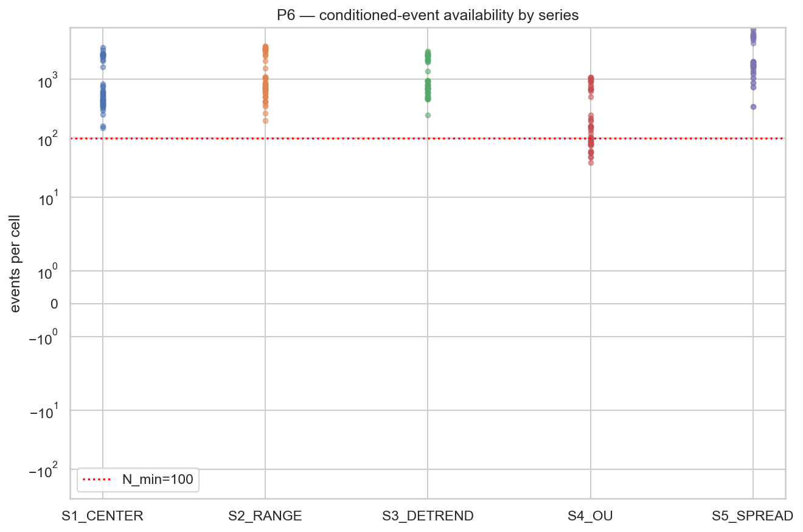
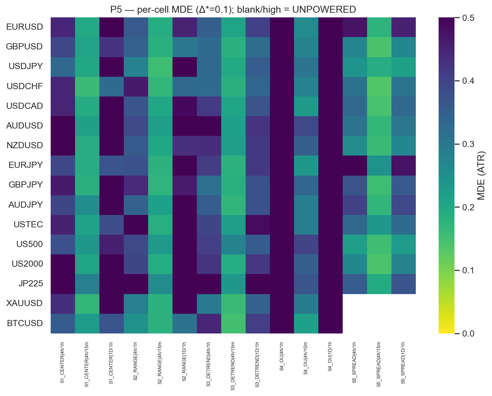

# Experiment Report: EXP-008 — CF-MR-003/HYP-001 Cross-Domain Mean-Reversion Availability Screen

## Status: CLOSED — METHODOLOGY FINDING (evaluation-vehicle mismatch; family verdict HELD, not booked)

**Date**: 2026-07-01
**Instruments**: 16 (INFR-003 5-year canonical; VAL-003 universe minus DE30)
**Data Views**: real time-bar OHLC → domain bars {15m, 1h, 4h, 1D}; analysis-only, TRAIN-only

> **Read this first.** EXP-008 ran three times and its value is **methodological, not a family verdict**:
> (1) 3-leg screen → INCONCLUSIVE (an inherited `Hurst-DFA<0.45` leg is structurally unsatisfiable on
> deviation *levels* — forensic in **Amendment A1**); (2) 2-leg VR∧HL screen → EXONERATE; (3) a **vehicle
> diagnostic** (**Amendment A2**) showed that EXONERATE is a **vehicle artifact** — the inherited
> fixed-horizon-MFE metric + regime-matched-random-timing null are **non-native to mean-reversion** and
> mask a small native reversion separation (anchor-hit **+2.9 pp** under a dislocation-matched null, MFE
> blind). **The EXONERATE is HELD, not booked.** CF-MR-003 stays REGISTERED with preliminary positive
> native evidence; the native re-screen is **EXP-009** (target-based estimand + dislocation-binned null).
> Sections below describe run (1); the full arc + numbers are in `design.md` Amendments A1/A2 and L-13.

---

## Question

Do exec-domain entry events conditioned on a **cross-domain deviation series characterised
mean-reverting at `≤ t-1`** show a favourable reversion excursion (price collapse toward the
higher-domain anchor) beyond a matched-random, matched-count, matched-regime control — for **any** of
5 anchor constructions × 3 domain pairs, per stratum? Honest prior: **no** (terminal branch;
CF-MR-002 exonerated). Edge = **Δ-over-random**, never raw excursion.

## Hypothesis

`CF-MR-003/HYP-001` — MR-screen-conditioned entries produce a reversion excursion exceeding a matched
random control on TRAIN, or they do not (prior: they do not). **This screen gates the whole family.**

## Method Summary

Per (instrument, anchor-series, domain-pair): build a higher-domain anchor (5 constructions), form the
exec-domain deviation `d_t = price − a_t`, select entry bars where `d` is **screened mean-reverting**
(`VR ∧ half-life ∧ Hurst-DFA`, `≤ t-1`) **and** extreme (`|z| ≥ 2`), then measure the forward
favourable excursion toward the anchor (ATR units, real prices) vs a within-instrument regime-matched
random control. Admission = cross-axis Holm max-statistic permuted-axis test over the 15 series×domain
axes (frozen `xen.availability_gate`). Two leak tripwires shipped. Full plan: [design.md](design.md).

---

## Key Findings

### Finding 1 — INCONCLUSIVE (underpowered): the screen selects too few events to test availability

0 of 15 axes eligible; 0 powered instrument-cells anywhere; per-cell **max 18 events** vs `N_min=100`.
Only 33 of 240 cells even cleared the ≥2-event inclusion floor (S3:1, S4:30, S5:1; S1/S2: 0). Per §7,
`>½ axes ineligible-UNPOWERED` → **INCONCLUSIVE**. This is *not* EXONERATE — the axes were never
powered, so availability was never **tested** (distinct from tested-and-found-flat). Per-stratum picture
is **uniform UNPOWERED** across all 5 series × 3 pairs — no pooled headline masks a stratum (L-03).

### Finding 2 — Mechanism: the Hurst-DFA<0.45 leg vetoes the 3-leg conjunction

Drop-one-leg disclosure (`results/dropone_sensitivity.json`), event totals over all 240 cells:

| Leg combo | Total events | Cells ≥100 events |
|---|---|---|
| VR only | 433,790 | 222/240 |
| HL only | 609,626 | 234/240 |
| **VR+HL (drop Hurst)** | **315,644** | **216/240** |
| Hurst only | 792 | 0/240 |
| VR+Hurst / HL+Hurst | 528 / 339 | 0/240 |
| **ALL3 (design screen)** | **280** | **0/240** |

Every combo **containing** Hurst → ≤792 total events, **0/240** powered; every combo **excluding** it →
**216–234/240** powered. On EURUSD·4h/1h the extreme-bar per-leg pass counts are VR=446, HL=1202,
**Hurst=0** (S1). Root cause: `Hurst-DFA<0.45` measures **increment anti-persistence**, but is applied
to the mean-reverting deviation **level** series, which is locally **persistent** (Hurst>0.5) even while
reverting to the anchor in the VR/half-life sense. The Hurst leg contradicts the other two. The DFA is a
correct standard DFA (validated: white noise α≈0.52, random walk α≈1.48), so this is a **real property
of the screen specification**, not an implementation artifact. This is the **L-12 §3 near-impossible
conjunctive leg** pattern reappearing **inside the screen** (not the referee).

### Finding 3 — Leak-clean by construction (no admitting cell)

Both future-destroying tripwires (conditioning-label permutation, forward-excursion time-reversal) are
shipped and wired into the admission gate. With 0 powered/admitting cells there is no edge to survive a
tripwire — the family is leak-clean vacuously. Causal-provenance verified: every decision input `≤ t-1`,
excursion strictly forward, S5 basket TRAIN-sliced per instrument before timestamp-alignment, holdout
sealed. Audit **PASS, 0 Critical**.

---

## Conclusion

**HYP-001 — no family verdict; EXP-008 is a METHODOLOGY FINDING (L-13).** The cross-domain MR family was
evaluated with a vehicle **inherited from the price-geometry family** (fixed-horizon signed-MFE toward the
anchor + Δ-over-regime-matched-**random-timing**) that is **non-native to mean-reversion**. Run (1)'s
INCONCLUSIVE was an inherited-Hurst-leg artifact (Amendment A1); run (2)'s EXONERATE is a **vehicle
artifact** — the vehicle diagnostic (Amendment A2) shows the native target metrics (**anchor-hit +2.9 pp**,
**fraction-recovered +2.7 pp**, CIs exclude 0) separate under a **dislocation-matched** null while the MFE
metric stays blind, and that the random-timing null reads spuriously negative on near-anchor bars.

**The EXONERATE is HELD, not booked.** CF-MR-003 is **neither exonerated nor admitted** — it carries
**preliminary positive native evidence** (small, ≈+2.9 pp, not cost-tested) and must be re-screened with a
native vehicle. Honest calibration: the native separation is small and modest; a residual `|z|`-depth
confound is deferred to the native design (dislocation-**binning**).

**Native re-screen = EXP-009** (new D0, operator-gated): target-based estimands (anchor-hit / time-to-anchor
vs half-life / fraction-recovered / deferred limit-at-anchor P&L) against a dislocation-binned null.

## Registry Disposition

**Updates applied.** CF-MR-003 stays `REGISTERED` — **NOT exonerated, NOT admitted** — with EXP-008
recorded as a **methodology finding** (evaluation-vehicle mismatch indicated; verdict held); preliminary
positive native evidence noted; native re-screen = EXP-009
([candidate-families/cf-mr-003.md](../../../docs/signal-registry/candidate-families/cf-mr-003.md)).
`multiplicity-registry.md` Chapter-02 Phase-002 batch updated to the methodology-finding disposition; **0
slots consumed, 0 counted TEST reads**. `test-read-ledger.md` — **disclosure** (pre-split TRAIN-only; no
stratum-specific inference; **0 counted reads**). Global holdout **sealed**; renewed referee untouched
(L-12). Retained deliverables: Hurst forensic (A1), vehicle diagnostic (A2), lesson **L-13**.

## Limitations

- TRAIN-only availability read; TEST band and global holdout never loaded (by design).
- §8 z*/W_a/recent-third sensitivity sweeps **deferred** (operator-accepted); the decisive §8 diagnostic
  here — the **drop-one leg** disclosure — was run and is reported.
- Excursion is a non-tradable intrabar MFE availability diagnostic (design §2/§4), not a tradable
  open-to-open return — no cost, P&L, or tradability claim is made or implied.
- The verdict is a statement about the **screen's power**, not about whether cross-domain MR
  availability exists — that remains untested on this vehicle.

## Implications for Future Research

- The **VR + half-life** 2-leg screen (drop Hurst) powers 216/240 cells and would let the availability
  question actually be tested. Alternatively, apply Hurst-DFA to the **increment/return** series (where
  `H<0.5` is the correct anti-persistence reading) rather than the deviation level.
- Any conjunctive screen should be pre-checked for a **structurally near-impossible leg** (an
  attainable-pass-region check) before it gates a family — the L-12 §3 lesson now applies to screens,
  not only the referee.

## Recommended Next Experiments

1. **EXP-009 (native re-screen, new D0)** — CF-MR-003/HYP-001 with a **native vehicle**: target-based
   estimands (anchor-hit rate; time-to-anchor scaled by fitted half-life; fraction-of-dislocation
   recovered; deferred limit-at-anchor real-price P&L) against a **dislocation-binned** null (within-`|z|`
   bins), per stratum, with leak tripwires. Analysis-only, TRAIN, 0 reads. The 2-leg VR∧HL screen carries
   forward as the selector; the MFE/random-timing vehicle is retired for this family. (L-13.)

## GATE: APPROVE (post-exec, orchestrator, 2026-07-01; updated after Amendments A1/A2)

EXP-008 closes as a **methodology finding** (not a family verdict). Binding checks:

- **Causal-provenance / integrity intact across all runs:** every decision input `≤ t-1`, excursion
  strictly forward, S5 basket TRAIN-sliced-before-align, additive `availability_gate` change byte-safe,
  holdout sealed, 0 counted reads. Independent re-derivation reproduced the holdout boundary + event
  counts; DFA validated correct (A1 forensic).
- **Verdict HELD, not booked (the key governance action).** The A1 EXONERATE is not a CF-MR-003 closure —
  Amendment A2's vehicle diagnostic (analysis-only, 0 reads; reactive, not pre-registered) **indicates** the evaluation vehicle is
  non-native to MR (native metrics separate under a dislocation-matched null where MFE is blind; L-13).
  Booking EXONERATE would be a false family closure from an unverified vehicle.
- **Signal-registry disposition recorded:** CF-MR-003 stays `REGISTERED` — NOT exonerated/admitted — with
  preliminary positive native evidence; multiplicity-registry Phase-002 batch + test-read-ledger updated
  to the methodology-finding disposition (0 slots / 0 counted reads); referee untouched (L-12).
- **Durable knowledge captured:** lesson **L-13** + memory `evaluation_vehicle_must_be_native`; native
  re-screen scoped as **EXP-009** (new D0, operator-gated).

No operator-gated critical decision was crossed (0 counted reads, no candidate retired/exonerated, no
deployability claim, holdout sealed). → **EXP-008 CLOSED as a METHODOLOGY FINDING; CF-MR-003 verdict
deferred to EXP-009.**

## Artifacts

| Artifact | Path |
|----------|------|
| Design (scope + analysis plan, pre-exec GATE) | [design.md](design.md) |
| Code (module + orchestration) | [code/](code/) · [`xen/cross_domain_mr.py`](../../src/xen/cross_domain_mr.py) |
| Audit (PASS, 0 Critical) | [audit.md](audit.md) |
| Results (per-cell, axes, verdict, drop-one) | [results/](results/) |
| Plots P1–P6 | [plots/](plots/) |
