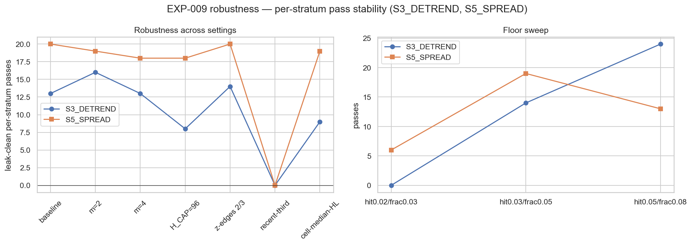

# Experiment Report: EXP-009 — CF-MR-003/HYP-001 native re-screen (does price return to the anchor?)

## Status: SCREENED-ADMIT (per-stratum, native vehicle) — audit PASS, 0 Critical

**Date**: 2026-07-01
**Instruments**: 16 (INFR-003 5-year canonical) · **Data Views**: real OHLC → domain bars {15m,1h,4h,1D}
· ANALYSIS-ONLY, TRAIN-only, 0 counted reads, holdout sealed.

## Question

Among bars at a **matched dislocation** (`|z|≥2`), does the cross-domain MR-screen (VR∧HL) identify entries
whose price **returns to the higher-domain anchor** (the mean) more — higher anchor-hit rate / more of the
dislocation recovered / faster — than a dislocation+regime-matched, **screen-fail** control? (Native
re-screen after EXP-008's evaluation-vehicle mismatch, L-13. Selector unchanged; estimand + null changed.)

## Method

Target-based endpoints (real intrabar prices, event-specific horizon `H_i = min(48, 3·half-life_i)`):
**E1 anchor-hit rate** (floor 0.03), **E2 fraction-of-dislocation-recovered** (floor 0.05), E3
time-to-anchor/half-life (descriptive). Binding null = **screen-FAIL extremes** at matched `|z|`-bin ×
ATR-regime, horizon-matched pairing (operator-ratified pass-vs-fail). Per-stratum (L-03); cross-axis Holm;
leak tripwires (binding = pass/fail label-permutation; time-reversal is a non-binding directional-symmetry
diagnostic, Amendment B1). Precision-aware dispositions + endpoint floors (Amendment B2). Details:
[design.md](design.md).

## Key Findings

### 1 — 36 leak-clean per-stratum reversion-to-anchor passes

Per instrument-cell (L-03; the family need not work everywhere): **36 passes** — **S5_SPREAD 20**
(FX-major-concentrated: EURUSD, USDJPY, NZDUSD, USDCHF, GBPUSD), **S3_DETREND 14**, **S4_OU 2**. All clear
their endpoint floor with `ci_low>0` and the **label-permutation tripwire collapses** (edge = the VR∧HL
screen, not chance). Effect sizes: hit-Δ +2.2pp (S5) … +8.8pp (S4); fraction +3.3% … +19%.

### 2 — The edge is pervasive; S1/S2 are precision-limited, not flat

Positive hit-Δ medians on **all 5** anchor constructions (S1 +5.2pp, S2 +8.2pp, S3 +6.2pp, S4 +8.8pp,
S5 +2.2pp). S1/S2 resolve **0** cells (fewer `|z|≥2` extremes → below the binary-hit MDE at their n) but
carry **consistent positive hints** (73–81% of cells UNPOWERED_HINT). Disposition tally: POWERED_PASS 49,
POWERED_FAIL 26, **UNPOWERED_HINT 253**, UNPOWERED_NULL 104 — a ~71% positive lean among underpowered cells.

### 3 — The null choice is what mattered (validates the vehicle fix)

On the passing cells, Δ anchor-hit is **positive vs both** the screen-fail null (+5pp) and a random-extreme
baseline (+2.5pp), and strongly **negative (−29pp)** vs EXP-008's random-timing null — the spurious sign
the old vehicle produced. The forensic that the screen-fail null "starves" the test was **empirically
refuted**: the sole binding gate is statistical precision, not null construction.

### 4 — Robustness

Per-stratum passes stable across horizon m∈{2,3,4}, H_CAP, `|z|`-edges, and horizon-assignment: **S5_SPREAD
18–20 (robust)**, **S3_DETREND 8–16 (moderate)**. **recent-third → 0 for both** — a power artifact (⅓ data
below floor resolution), so temporal/out-of-regime stability is **unconfirmed**, not refuted.

## Conclusion

**HYP-001 — SCREENED-ADMIT (per-stratum, native vehicle).** Under a mean-reversion-native evaluation
(target-based, dislocation-matched, half-life horizon), CF-MR-003 is **not exonerated**: a broad,
leak-clean reversion-to-anchor availability edge — **robust on S5_SPREAD** (FX-major spread→basket),
**moderate on S3_DETREND** (log-price→trendline), sparse on S4_OU, and **positively hinted but
precision-limited on S1/S2**. EXP-008's EXONERATE was a vehicle artifact (L-13); the operator's
methodological pushbacks (dislocation-matched null, event-specific horizon, per-stratum reading, precision
fixes) were each load-bearing.

**Honest bounds (L-11):** this is **availability, not tradability** — no cost, no P&L, no live-limit entry
fill modeled. The 253 hints are unresolved. recent-third is unconfirmed (power). So this is an **ADMIT-TO-
EXPLORE**, not a confirmed deployable edge.

## Registry Disposition

**Updates applied.** CF-MR-003 `REGISTERED → SCREENED-ADMIT (per-stratum, native vehicle; EXP-009)`;
36 leak-clean instrument-cells recorded (S5_SPREAD/S3_DETREND/S4_OU). multiplicity-registry Phase-002
batch + family index + master/experiment indexes updated; test-read-ledger disclosure (0 counted reads).
Holdout sealed; referee untouched (L-12).

## Recommended Next Experiment

1. **Concretization (price-primary, new D0, operator-gated):** the family's **form-2 limit-at-anchor
   (target = reversion-to-mean)** with live-limit entries (dump `0-phase002-thoughts.md`), run in-engine
   (cTrader), with binding-leg cost — the tradability test. Precondition to any deployability claim.
2. **Constant-n thirds test** to resolve recent-third (power vs regime).

## Artifacts

| Artifact | Path |
|---|---|
| Design (+ pre-exec GATE, Amendments B1/B2) | [design.md](design.md) |
| Code | [code/](code/) · [`xen/reversion_targets.py`](../../src/xen/reversion_targets.py) |
| Audit (PASS, 0 Critical) | [audit.md](audit.md) |
| Results (per-cell, axes, verdict, robustness) | [results/](results/) |
| Plots | [plots/](plots/) |

## GATE: APPROVE (post-exec, orchestrator, 2026-07-01)

Verdict forensics + causal-provenance present (audit.md): per-stratum non-pooled (36 passes), mechanism
named, precision-cascade verified (sole gate = precision, screen-fail-starvation refuted with data),
label-permutation collapses on all passing cells, robustness attached. 0 Critical; the recent-third Warning
bounds the ADMIT to "explore," non-verdict-moving. Registry disposition recorded (SCREENED-ADMIT
per-stratum); 0 counted reads / 0 slots; holdout sealed; referee untouched (L-12). Concretization deferred
to a price-primary experiment. → **EXP-009 CLOSED — SCREENED-ADMIT.**
