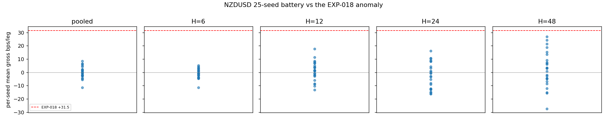
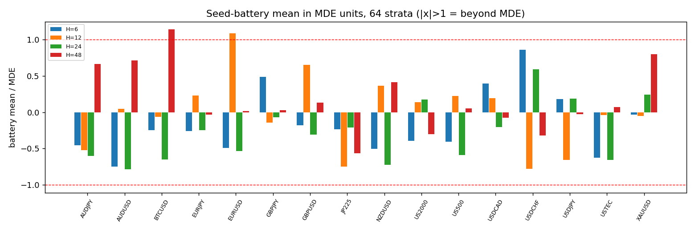
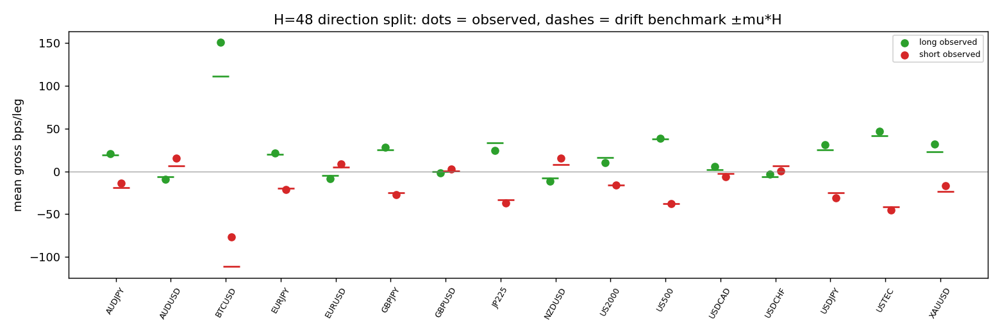
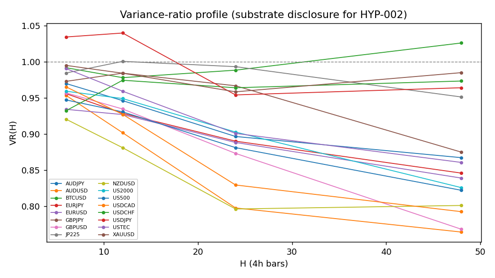

# Experiment Report: EXP-019 — CF-VOLHARV-001/HYP-001 seed/fill falsification of the random-timing harvest anomaly

## Status: COMPLETED — SUPPORTED / ARTIFACT_CONFIRMED (operator verdict 2026-07-05)

**Date**: 2026-07-05
**Instruments**: 16 (full VAL-003 universe minus DE30), 4h domain, TRAIN band only
**Family**: CF-VOLHARV-001 · **Checkpoint**: 2026-07-04-007-cf-volharv-001-falsification-first-screen
**Slots**: 0 · **Counted TEST reads**: 0 · **Holdout**: sealed, untouched

---

## Question

Is the EXP-018 random-timing per-leg positive (NZDUSD rt +31.5 bps/leg, CI_low +13.7, both
directions positive) reproducible across independent seeded schedules under a fully ex-ante
causal construction — or a sampling/clustering artifact, as the analytic symmetry null predicts?

## Hypothesis (falsification-first; predeclared prior = ARTIFACT_CONFIRMED)

A fixed-unit, random-direction, random-timing, fixed-hold market leg has **E[gross P&L] = 0 by
construction**. Any systematic across-seed nonzero is an artifact channel (fills/schedule/
accounting) or an extraordinary process asymmetry requiring escalation — never a bookable edge.

## Method Summary

New lean `RandomHold` C# model (native cTrader market orders, m1 fills; exits = matched-hold
market close ONLY, no TP/SL/refresh; inventory cap 6, deterministic `cap_skip`). Schedules
pre-generated per (instrument, seed) from **(seed, engine bar calendar) only** — never prices
(base seed 20260705, seeds 1–25; gap ~U[4,12] bars; direction = seeded coin; hold round-robin
{6,12,24,48}). 441 engine runs: 16 calendar pre-runs → 400 live (16×25) → 25 NZDUSD +1-bar
delay twins. Estimand: per-leg gross bps via `xen.adjudication.per_leg_net`; seed-level battery
inference per (instrument × hold) stratum. Design incl. §12 dated amendments A1–A6
(EXP-013/018 fences; drop-can't-complete tail rule; 50-bar warmup; engine-calendar source; FTMO
cost table replacing swap; single-conf packaging). Details: [design.md](design.md).

## Integrity gates (all PASS)

| Gate | Result |
|---|---|
| QA pre-exec (fresh-context subagent) | APPROVE run 1 — byte-identical schedule regeneration (50/50 CSVs); golden trace exact (P&L to 1e-9, all 727 smoke legs 1:1 with schedule); single-exit-path verified (L-14); fences byte-match EXP-013 ([qa-review.md](qa-review.md)) |
| Estimand validation | blocking_pass on all 400 live + 25 twin cells; manifest 16/16; reconciliation ~1e-12 ([results/estimand_validation.json](results/estimand_validation.json), [_delay1](results/estimand_validation_delay1.json)) |
| Tripwire 1 — schedule price-independence | PASS (byte-diff regeneration) |
| Tripwire 2 — fill causality | PASS — no fill ever early; ~2% first-tick-of-session lags, direction-symmetric |
| Tripwire 3 — +1-bar delay twin | PASS — live vs twin battery indistinguishable (max pair-diff +0.74 bps ≤ 1.6×SE, all 4 holds) |
| Holdout / TEST band | untouched; 0 censored legs live+twin (tail rule A2) |

## Key Findings

### 1. The EXP-018 anomaly is a sampling draw — NZDUSD battery centres on zero everywhere

Battery means, gross bps/leg (25 seeds × ~4,450 legs/stratum): H6 −0.73 (MDE 1.44), H12 +1.04
(2.85), H24 −2.85 (3.94), H48 +2.20 (5.31). Pooled per-seed means span **[−11.5, +8.6]**;
EXP-018's **+31.5 sits above the entire 25-seed distribution** (100th percentile) — the
predeclared ARTIFACT_CONFIRMED signature exactly.

### 2. Zero-mean construction confirmed globally

Mean of all 1,600 seed-stratum means = −0.017 bps; median |battery mean|/MDE = 0.31; 2/64
strata exceed MDE (~3 expected by chance at 2×SE). Bootstrap calibration clean (per-seed
false-positive rate 2.6% vs 2.5% nominal). Planted +15 bps detectable at battery level in
61/64 strata (exceptions = the 3 predeclared-UNPOWERED BTCUSD holds).

### 3. Direction splits are drift, not asymmetry

Long/short displacements track the analytic ±μ̂·H benchmark with **opposite signs** across the
board (drift-artifact signature). The only same-direction displacement is BTCUSD-48 (+36.6 bps,
MDE 32.1) — and it fails every coherence requirement of PROCESS_ASYMMETRY: 13/25 seed signs
(vs ≥20 required), 2021-bull-concentrated (+73.5 in 2021 vs +11–35 after), tail-fed (top-5%
trim → +20.4), UNPOWERED stratum, common-window caveat. Band: WASH/UNPOWERED. EURUSD-12
(+2.18 vs MDE 2.00, 15/25 signs) = the expected one-in-64 chance exceedance. Band: WASH.

### 4. COST_FLOOR booked (HYP-002 design input)

Commission round-trip (FTMO snapshot 2026-07-04, ×2 per-side / ×1 round-turn readings;
`xen.evaluation.FTMO_COSTS`, raw snapshot in [code/](code/)): FX 0.47–1.04 bps (NZDUSD 0.96),
XAUUSD 0.28, BTCUSD 13.0, indices 0 (spread-only pricing). **Spread unpinned** — FTMO
publishes live-only; must be pinned before any deployable-cost claim (`round_trip_cost_bps`
raises until then). Gross ≈ 0 ⇒ net = −(commission+spread) for the unconditioned object.

### 5. Substrate disclosure: real mean-reversion in the FX block

VR(H) < 1 deepening with H across FX/indices — NZDUSD 0.92/0.88/0.80/0.80 at H=6/12/24/48,
AUDUSD 0.95→0.76, GBPUSD/USDCAD similar; BTCUSD/USDJPY/XAUUSD/USDCHF ≈ random walk. The
oscillation HYP-002 targets exists — and (per findings 1–3) is NOT harvestable by
unconditioned fixed-hold legs, exactly as the analytic null demands.

## Conclusion

**SUPPORTED — ARTIFACT_CONFIRMED in all powered strata (operator verdict, 2026-07-05).**
The EXP-018 random-timing per-leg positive is a draw from a zero-mean construction, not a
property: 25 independent ex-ante seeds put NZDUSD at 0 ± MDE in every hold stratum with the
original +31.5 outside the seed distribution's ceiling. Every artifact channel was closed by
construction and verified (byte-exact schedule regeneration, fill-causality audit, delay twin,
calibrated bootstrap, 1e-12 accounting reconciliation). The MR arc's last positive residue is
retired as evidence; what remains of value is the measured cost floor and the VR substrate
profile — the two declared inputs to any HYP-002 harvest-structure design.

Analyst recommendation and operator verdict agree ([analysis.md](analysis.md) §7).

## Registry Disposition

Evidence rows only (experiment ≠ family): HYP-001 outcome row updated in
`docs/signal-registry/multiplicity-registry.md` (CF-VOLHARV-001 block); evidence-ledger row
appended to `docs/signal-registry/candidate-families/cf-volharv-001.md` (status field
untouched — family disposition is the checkpoint retrospective's). No counted TEST reads;
`test-read-ledger.md` unchanged.

## Limitations

- Cost floor incomplete until per-instrument spreads are pinned (live-only on FTMO's page).
- FTMO commission per-side vs round-turn ambiguity — both readings carried explicitly.
- All 25 seeds share one price window per instrument; across-seed dispersion understates
  window-level uncertainty for common-path shocks (drives the BTCUSD-48 WASH caution).
- Design §5's per-seed plant criterion (≥24/25 CI-flagged) was mis-specified for high-σ
  strata; the battery-level detector (the §8 power object) is what all reads used — disclosed
  in [analysis.md](analysis.md) §6.1.
- ~17 stale schedule rows/seed (pre-2021 m1 feed vs 2020-11 calendar head) — uniform,
  strata-neutral.
- EXP-018's rt arm drew holds from the live arm's realized BarsHeld distribution; EXP-019's
  fixed grid {6,12,24,48} brackets but does not replicate that mix — per-hold strata plus the
  pooled read cover the comparison.

## Follow-ups (separate experiments; operator-gated)

1. **EXP-020 (HYP-002, reserved)** — rebalanced-exposure / grid harvest vs unconditioned twin
   + exposure-matched B&H, designed on this experiment's cost floors + VR profile; gated on
   the checkpoint retrospective.
2. Optional analysis-only probes (no new emissions): BTCUSD-48 ex-2021 battery;
   window-level block bootstrap.
3. Pin FTMO spreads and restate the cost floor at 1×/2×.

## Artifacts

[design.md](design.md) · [qa-review.md](qa-review.md) · [analysis.md](analysis.md) ·
[code/README.md](code/README.md) (implementation map, deviations D1–D6) ·
[analysis_code/](analysis_code/) · [results/](results/) · [plots/](plots/) ·
emissions `data/strategy_runs/EXP-019{,-cal,-delay1,-smoke}/`
