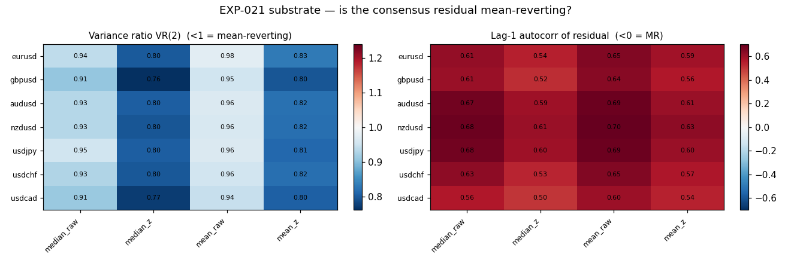
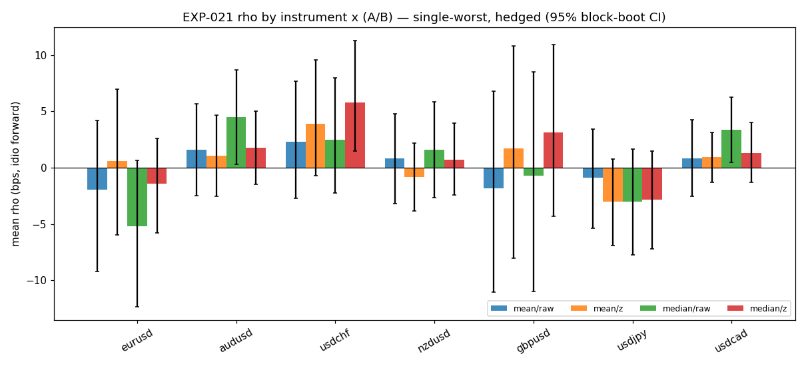
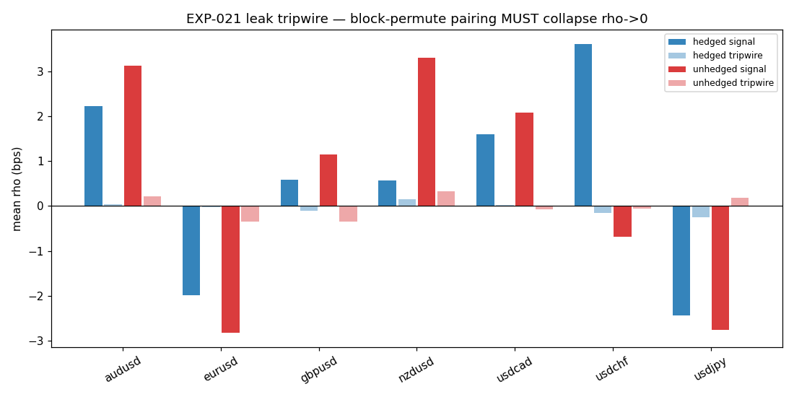

# Experiment Report: EXP-021 — CF-CSRR-001 HYP-001 Currencies Consensus-Residual Reversion

## Status: COMPLETED — NOT SUPPORTED (availability) [operator verdict]

**Date**: 2026-07-06
**Instruments**: 7 USD-pair Currencies basket — EURUSD, GBPUSD, USDJPY, USDCHF, USDCAD, AUDUSD,
NZDUSD (JPY crosses EURJPY/GBPJPY/AUDJPY excluded — operator-approved deviation, §Scope).
**Data Views**: 4h TRAIN (first 49%; 3,526 aligned bars, span 2021-06-02 → 2023-11-20). 1D branch
disclosure-only (NON-REGISTERED). Real time-bar OHLC; open-to-open returns.

---

## Question

On the USD-strength-aligned Currencies basket at 4h, is the cross-sectional **consensus-residual
mean-reverting**, and does any component construction (A×B×C×D) produce signal-conditional
residual-reversion that separates from a random-index + random-timing twin beyond a
multiplicity-adjusted permuted-axis null?

## Hypothesis

**HYP-001** — a member's move away from the basket's USD-strength consensus is transient
idiosyncratic flow and reverts toward consensus within ~its residual half-life; the reversion is
detectable, dislocation-conditioned, and construction-selectable. Availability-only,
execution-agnostic (tradability = EXP-023).

## Method Summary

Execution-agnostic Python availability screen (no fills/P&L/cTrader; no `xen.adjudication` /
estimand-validation gate — no accounting object; precedent EXP-008/009). Members signed to USD
strength (quote σ=−1, base σ=+1); session/daily-reset causal accumulation anchor; consensus
`m=A_est({u_i})`; residual `s_i=u_i−m`; threshold `k`=trailing-median of per-bar max|s|; horizon
`h=2·HL` (HL = per-instrument AR(1) half-life). **Estimand** `ρ=−sign(s_i)·idio_i(t,h)`,
`idio=g_i−G` = consensus-hedged forward **open-to-open** return. Sweep A{median,mean} × B{raw,÷σ_t}
× C{single-worst,all>k} × D{hedged,unhedged} = 16 cells × 7 strata. Controls: random-index twin,
random-timing battery (25 seeds, L-19), **permuted-axis within-bar identity null** (primary,
max-stat multiplicity, 1000 perms), tripwire = temporal block-permute of the (s→forward) pairing.
Hardened `xen.evaluation.block_bootstrap_ci` (L-20). Full detail: [design.md](design.md),
[analysis.md](analysis.md).

---

## Key Findings

### Finding 1: Substrate — the consensus residual mean-reverts (unanimous)

VR(2) < 1 on **28/28** instrument×A×B cells (median 0.87), VR(6) ≈ 0.4, AR(1) half-life **1.1–1.8
4h-bars** (~1 session). Holds on the 1D branch too (VR<1 on 27/28). The predeclared **substrate
kill criterion is NOT triggered** — the residual is a genuinely mean-reverting level.

*Band note:* the design band "autocorr1<0" was mis-specified for a **level** residual — a
mean-reverting level has `0<AR(1)<1` (here ≈0.6, HL=−ln2/ln0.6≈1.36) + VR<1. VR is the correct MR
read and it is unanimous. Disclosed, not a defect in the data.

### Finding 2: Availability — weak, heterogeneous, multiplicity-fragile

Uncorrected, only 5/112 cells clear ci_low>0 + p_perm<0.05 + beat both twins. Under the **mandated
max-stat multiplicity** (over the 16 cells per instrument) **only 1 survives** fw_p<0.05: AUDUSD
median/raw/single/**unhedged** (+9.4 bps, fw_p 0.008) — and that cell is **drift**: its hedged
(mechanism-faithful, consensus-removed) twin is +4.5 bps, **fw_p 0.68 (dead)**. **No hedged
construction survives multiplicity on any instrument** (best: USDCHF fw_p 0.083).

**Strong heterogeneity (L-03):** USDJPY systematically **continues** (mean ρ −2.4, **0/16 cells
positive**, p_perm≈0.99) and **dominates single-worst selection** (635 events vs EURUSD 93) — "fade
the biggest deviator" repeatedly selects the persistent 2021–23 JPY trend, which does not revert. A
pooled read would average a reverting cluster (AUD/NZD/CAD/CHF) against a trending USDJPY and mislead.

**Variants:** V1/V5-screen (median/raw/single/hedged) pooled +0.43 bps, V2 +0.77, V4 +0.65 — all
**0/7 strata survive multiplicity**; none distinguishes. V3 (weighted-implied) and V5 *execution*
(active-entry/passive-exit) not tested here (deferred / EXP-023).

### Finding 3: Alpha vs beta — the raw signal is largely market beta

Decomposing single-worst raw fade: hedged ρ = idiosyncratic **alpha**; (unhedged − hedged) =
consensus-exposure **beta/drift**:

| Inst | alpha (hedged) | beta/drift | raw |
|---|---|---|---|
| AUDUSD | +4.5 | +4.9 | +9.4 |
| NZDUSD | +1.6 | +3.5 | +5.1 |
| USDCAD | **+3.3** | +0.5 | +3.8 |
| USDCHF | +2.5 | −4.2 | −1.7 |
| USDJPY | −3.0 | −0.4 | −3.4 |

The multiplicity survivor (AUDUSD unhedged) is ~half beta. **USDCAD is the cleanest near-pure
idiosyncratic alpha** (+3.3, beta +0.5) but still fw_p 0.54. USDCHF's real alpha (+2.5) is masked in
raw by a negative safe-haven beta.

### Finding 4: Integrity — leak-clean

The future-destroying tripwire (block-permute of the s→forward pairing) **collapses ρ→0 on every
real-positive cell** (collapse ≈ 0: AUDUSD −0.02, USDCHF −0.03, USDCAD +0.03). Non-vacuous (moves the
conditional mean). Provenance causal (≤ t-1 signal from confirmed closes; forward from next open —
golden trace bit-verifiable). Holdout never touched (load capped at first 49%). **0 counted reads, 0
slots.** (Collapse fractions are unstable only where raw≈0, L-15 — the destroy *level* ≈0 is the read.)

### Finding 5 (operator-flagged): AUDUSD's potential — a disclosed lead, NOT booked as support

AUDUSD carries the most consistent positive idiosyncratic lead in the basket, but it does **not**
meet the support bar and is recorded as a follow-up candidate only:
- hedged alpha **+4.5 bps** but **fw_p 0.68** (multiplicity-dead) and **effect ≈ MDE** (4.48 vs 4.18)
  — borderline-powered;
- **~half the raw signal is market beta** (Finding 3);
- **actual time-in-market ~17–21% on 4h** (overlap-aware from data: h=4 bars, 297 events →
  21.0% overlap / 17.2% sequential one-position) — a genuine moderate-exposure leg, *not* the 50%
  basket figure (that pooled all 7 instruments' single-worst events);
- **1D unpowered** — 16/16 cells positive-leaning point estimates but 0/16 significant, MDE (12–54
  bps) ≫ effect, all p_perm>0.09.

So AUDUSD is moderate-exposure with a small, drift-contaminated, multiplicity-fragile payoff — worth
a targeted follow-up, not evidence of the family thesis.

---

## Conclusion

**HYP-001 availability: NOT SUPPORTED (operator verdict, 2026-07-06).**

The USD-strength consensus residual **is mean-reverting** (VR<1 unanimous on 4h and 1D), but the
signal-conditional *idiosyncratic* (hedged) reversion the thesis requires **does not separate under
the mandated multiplicity correction on any instrument or any variant**. The single family-wise
survivor (AUDUSD unhedged) is market drift — removing the consensus, the actual mechanism test,
removes the significance. The conditional edge is heterogeneous (USDJPY continues and dominates
selection) and borderline-powered (~2–4.5 bps ≈ MDE) on a single 2.4-year regime.

Analyst recommendation was NOT SUPPORTED (availability) with a substrate-reverts nuance; the operator
adopted it and directed that **AUDUSD's potential be documented as a disclosed lead** (Finding 5).
Note the *literal* predeclared availability kill criterion is technically not met (AUDUSD unhedged
separates), so this is **not** an auto-retire — family disposition is reserved for the checkpoint-009
retrospective.

## GATE (post-exec)

| Gate | Result | Evidence |
|---|---|---|
| Leak tripwire collapsed + non-vacuous | **PASS** | ρ→0 on all real-positive cells (collapse≈0); permute moves the conditional mean |
| Holdout untouched | **PASS** | load capped at first 49%; panel ends 2023-11-20 |
| Causal provenance ≤ t-1 | **PASS** | anchor/u/m/s/k/HL from confirmed closes ≤ t; forward open-to-open from t+1; golden trace verifiable |
| Estimand reconciliation | **N/A** | no accounting/P&L object (availability screen) |
| No local accounting | **PASS (honored)** | only `xen.evaluation` stats; no per-bar/leg accounting defined |

## Registry Disposition

**Evidence rows only — NO family status transition** (CF-CSRR-001 disposition is reserved for the
checkpoint-009 retrospective, operator-signed).
- `multiplicity-registry.md` — `CF-CSRR-001/HYP-001` row updated to SCREENED with the NOT-SUPPORTED
  (availability) disposition; dated evidence-log line added. 0 counted reads.
- `candidate-families/cf-csrr-001.md` — Evidence ledger row appended (status field untouched).
- `test-read-ledger.md` — no counted TEST read consumed (TRAIN-only); no entry required.
- Family detail index `families/cf-csrr-001/INDEX.md` created with the EXP-021 card.

## Limitations

- Single 2.4-year TRAIN regime (2021–23), dominated by the USD/JPY trend — heterogeneity may be
  regime-specific; no year-split power.
- Hedged idiosyncratic effects ~2–4.5 bps sit at their own MDE — several cells UNPOWERED-adjacent.
- V3 (weighted-implied consensus), the currency-strength-vector build (would service JPY crosses),
  range-scaled B, and V5 *execution* (E/F axes) not tested here.
- 1D branch is disclosure-only (NON-REGISTERED) and unpowered.

## Implications for Future Research

- The consensus-residual **substrate reverts** — the family is not dead at substrate; the failure is
  that idiosyncratic reversion doesn't clear multiplicity net of the common (USD) factor at 4h on FX.
- USDCAD (cleanest alpha) and AUDUSD (moderate exposure) are the instruments to interrogate, not the
  basket pooled.
- The Indices basket (single equity risk factor) may give a cleaner consensus than USD-strength on a
  mixed-exposure FX basket — the natural next read.

## Recommended Next Experiments (open questions, not yet scoped)

1. **Drift-controlled / USDCAD-isolated selection** — de-trend the deviator (or per-instrument-cap
   selection) so single-worst stops capturing the USDJPY trend; re-read the hedged alpha under the
   momentum-signed inverted twin (formal drift-carry, family-card mandate).
2. **Longer / multi-regime panel** — power the ~2–4.5 bps hedged AUD/CAD/CHF cluster.
3. **EXP-022 (Indices mirror)** — HYP-002, VAL-007-gated; a single equity factor consensus.
4. A sparser deep-dislocation threshold (top-decile k) to test the exposure-efficiency angle a
   higher `k` might unlock (this run's trailing-median k gives ~50% basket occupancy — not sparse).

## Artifacts

| Artifact | Path |
|----------|------|
| Design (scope + plan) | [design.md](design.md) |
| QA review (fresh-context, APPROVE run-2) | [qa-review.md](qa-review.md) |
| Analysis code (screen, h-sensitivity, AUDUSD probe, plots) | [analysis_code/](analysis_code/) |
| Analysis (evidence for+against) | [analysis.md](analysis.md) |
| Results (cell reads, substrate, maxstat, golden trace, 1D `*_1d`, h-sensitivity) | [results/](results/) |
| Plots | [plots/](plots/) |
