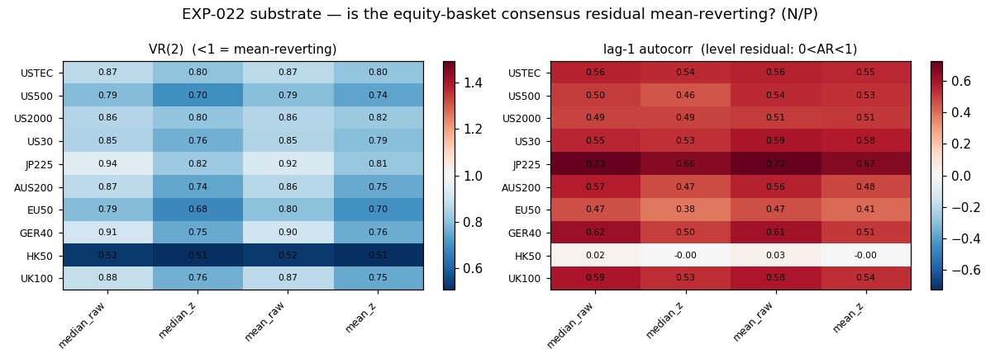
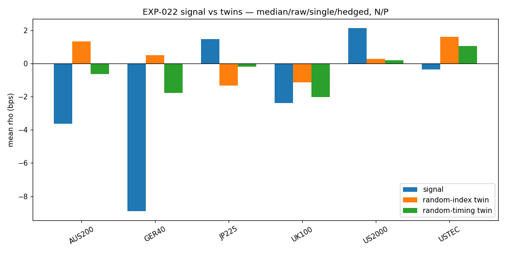
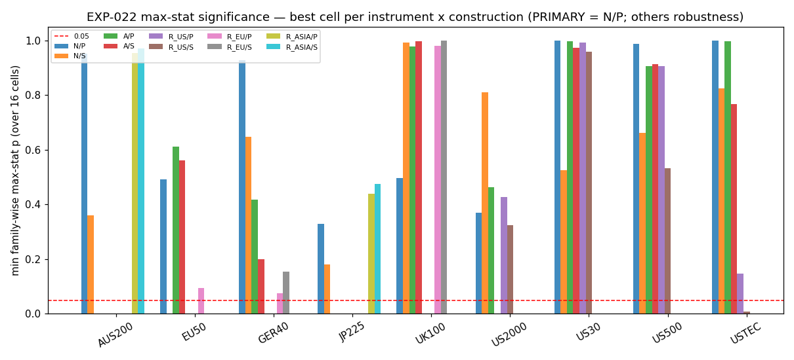
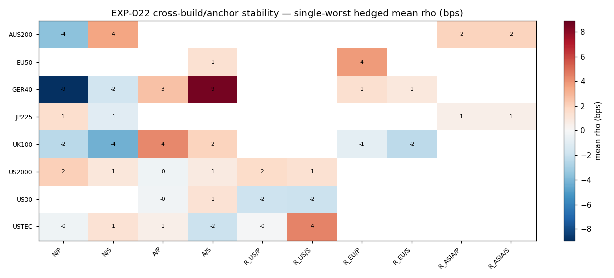

# Experiment Report: EXP-022 — CF-CSRR-001 HYP-002 Indices consensus-residual reversion

## Status: COMPLETED — NOT SUPPORTED (availability; operator verdict 2026-07-06)

**Date**: 2026-07-06
**Instruments**: 10-index equity basket — USTEC, US500, US2000, US30, JP225, AUS200, EU50 (`STOXX50`),
GER40 (`DE40`), HK50, UK100. Effectively a US-cash sub-basket at 4h (see Findings 2/5).
**Data Views / Feature Categories**: 4h TRAIN (first 49%, panel 2021-06-02 → 2023-12-18, 3,253 union bars);
Addendum A1 re-aggregation at `min_coverage=0.50` (3,912 bars) + 1D cross-check. Real OHLC; open-to-open.
Execution-agnostic (no fills / no P&L / no `xen.adjudication` estimand gate — availability screen).

---

## Question

On the native single-factor equity basket at 4h, does the cross-sectional consensus *residual* mean-revert,
and does fading a large residual earn positive **consensus-hedged** forward return beyond a random-index
twin, a random-timing twin, and a dislocation-matched permuted-axis null — robustly across basket builds and
anchor conventions? (Indices mirror of EXP-021 / Currencies.)

## Hypothesis

**HYP-002.** On the Indices basket (10/10 admitted, VAL-007 PASS), 4h TRAIN, execution-agnostic: the
consensus residual is mean-reverting (VR<1), and some (A×B×C×D) construction maximises signal-conditional
**idiosyncratic** (hedged) residual-reversion Δ over both twins and the max-stat permuted-axis null.

## Method Summary

Python characterisation on canonical `xen.bar_aggregator` (1m→4h) + `xen.evaluation` (hardened block-boot CI,
L-20). Estimand ρ_i(t,h) = −sign(s_i)·idio_i, idio = g_i − G (consensus-hedged forward, open-to-open, entry
Open(t+1)/exit Open(t+1+h), h=2·HL). Native single factor: σ_i=+1 all (rising index = risk-on; no
sign-alignment needed — the point of the Indices mirror). **Operator-mandated all three basket builds** —
(N) all-10 naive [PRIMARY], (A) activity-gated, (R) regional blocs {US4/EU3/Asia3} — **and both anchors** —
(P) 00:00-UTC [PRIMARY], (S) per-index session-open. Significance claimed ONLY at PRIMARY (N×P) via max-stat
over 16 A×B×C×D cells/instrument; the other 5 constructions are cross-construction robustness (can downgrade
a lead, never manufacture one; design §3.1). Controls: random-index twin, random-timing battery (25 seeds,
L-19), permuted-axis within-bar identity null (primary, 1000 perms), temporal block-permute tripwire. See
[design.md](design.md) (incl. §12 Amendment A1).

## Key Findings

### Finding 1: Substrate — the equity consensus residual mean-reverts (unanimous)

VR(2)<1 on **40/40** primary instrument×A×B cells (per-instrument mean 0.52–0.87), VR(6)≈0.19–0.53, AR(1)
half-life **~0.8–1.9 4h-bars** (~1 session); 216/240 (90%) across all 6 constructions. **Substrate kill
precheck NOT triggered** — the residual is a genuine mean-reverting level. *(Band note, inherited EXP-021:
the design's `autocorr1<0` sub-band is mis-specified for a level residual — VR<1 is the correct MR read.)*

### Finding 2: Primary idiosyncratic reversion does NOT separate — clean null

- **0/74** powered-n (≥100 events) primary cells clear even the *uncorrected* `ci_low>0 & mean≥1 bp`.
- Under the mandated **max-stat** over 16 cells, **0/9** instruments reach fw_p<0.05; best **JP225 fw_p 0.33**
  (obs 5.5 bps), US2000 0.37. Twins ≈0 at primary; collapse fractions numerically unstable because signal ≈0.
- The native single-factor / common-anchor idiosyncratic reversion the thesis requires does not appear.

 

### Finding 3: UNPOWERED, not CONTRADICTED (B-5)

Every primary cell is UNPOWERED for the design's own ≥1 bp SUPPORTED band — **MDE 3.9–21.7 bps ≫ 1 bp** (§8
projected ~10× more events than the ~239-max realised; `argmax|s|` on a 10-member basket assigns one
owner/bar). Small negatives (GER40 −8.9, AUS200 −3.6) are within their own noise, no CI_high<0. This is
NOT-SUPPORTED-at-the-resolvable-scale, not a powered refutation.

### Finding 4: Two disclosed leads — non-primary, not bookable (§3.1)

All 8 sub-0.05 cells live in **anchor S** + narrowed-consensus builds; none coincides with a primary (N/P)
lead (primary null on both), so none is sign-stable across anchors or survives ≥2/3 builds → **disclosed
leads, not significance**.

- **USTEC (R_US bloc + session-open S, hedged)** — cleanest: +4.71 bps (n=582), p_perm **0.008**, hedged
  (mechanism-faithful), beats both twins, **tripwire collapses 4.40→0.16**. Probe (§7 analysis):
  axis-coherent (all 8 hedged cells +), sign-stable both TRAIN halves, and **genuinely idiosyncratic** —
  alpha +4.71 vs raw +0.30, beta 1.19 drags raw to ~0 (removing consensus *adds* the signal). **USTEC-SPECIFIC**
  — US-bloc siblings do NOT reproduce (US30 −1.8, US2000 ≈0 hedged/drift-heavy, US500 n=5). BUT hardened
  block-boot **ci_low −0.58 does not exclude zero**, effect ≈ MDE 5.28, ~74% held-fraction, primary USTEC
  N/P fw_p 1.0. Registered-branch candidate, not present support.
- **US2000 (activity-gated + S)** — fw_p 0.001 but **drift-heavy**: significant cells are unhedged (+8.4);
  hedged half +3.8. Roughly half is market beta (mirrors EXP-021 AUDUSD). Disclosed lead, mostly drift.

### Finding 5: The screen effectively tested a US-cash sub-basket; Addendum A1 confirms the null generalises

The 90%-coverage 4h filter × short cash sessions culls EU50 (−56% → **0 single-worst events**) and HK50
(−80% → 0); `argmax|s|` then concentrates events on high-vol always-present members (US500 1, US30 28,
AUS200 53). EU50/HK50 were **UNPOWERED (no test), not CONTRADICTED**. **Addendum A1** (design §12; re-run at
`min_coverage=0.50`, everything else frozen) **powered HK50** (0→519 events) and found it a **clean null** —
the US-cash NOT-SUPPORTED **generalises** to the newly-testable EU/Asia member; no hedged/idiosyncratic
EU/Asia lead surfaces. **EU50 remains structurally UNPOWERED** at 4h@0.5 AND 1D (data-length-limited, not a
knob problem). **USTEC lead survives** the coverage change unchanged (+4.79 bps, p_perm 0.002, tripwire-clean,
same underpowered CI caveat).

## Conclusion

**Hypothesis NOT SUPPORTED (availability).** The equity consensus residual mean-reverts (substrate real), but
**no mechanism-faithful (hedged) construction delivers multiplicity-robust idiosyncratic residual reversion**
at the primary construction on any powered instrument (0/74 powered cells clear; best max-stat fw_p 0.33).
The read is powered-null for the **US-cash cluster + (Addendum) HK50**, and **UNPOWERED (not contradicted)**
for **EU50** alone. Addendum A1's coverage correction **confirms rather than overturns** the split verdict.
This mirrors EXP-021 (Currencies): substrate reverts; the sole surviving signals are non-primary, borderline
(effect ≈ MDE), and/or partly drift. The **USTEC** hedged, member-specific, leak-clean lead (+4.7–4.8 bps,
p_perm .002) is a genuine but underpowered, construction-specific **registered-branch candidate** — parallel
to EXP-021's AUDUSD/USDCAD leads — not present support. The predeclared substrate kill is NOT triggered and
no availability kill is literally met (a lead separates), so this is **not an auto-retire**; the Indices-arm
disposition is reserved for the checkpoint-009 retrospective (operator-signed).

**Operator's final verdict (verbatim):** NOT SUPPORTED (availability) — US-cash cluster + HK50 powered clean
null; EU50 UNPOWERED (structural); substrate MR confirmed; USTEC registered as a disclosed member-specific
lead; Indices arm NOT retired (disposition → checkpoint-009 retrospective). The analyst's recommendation
matches this verdict.

## Registry Disposition

**Updates applied (evidence rows only — no family status transition; INFR-001 experiment≠family):**
- `docs/signal-registry/candidate-families/cf-csrr-001.md` — HYP-002 evidence row appended; HYP-002 status
  → COMPLETED (NOT SUPPORTED, availability); USTEC recorded as a disclosed member-specific lead. Family
  **status field UNCHANGED** (REGISTERED/G0-pending; transitions only at the checkpoint retrospective).
- `docs/signal-registry/multiplicity-registry.md` — EXP-022 disposition row (0 slots, 0 counted TEST reads;
  screen-tier, no admission).
- `test-read-ledger.md` — no change (0 counted reads; TRAIN-only availability screen).

## Limitations

- **US-cash-heavy at 4h.** EU50 untestable at any coverage/domain on this 2.5-yr TRAIN (needs a longer panel);
  the "10-index" basket was effectively ~8-index (US-dominated) even after the A1 coverage relaxation.
- **Single-worst is a power sink.** `argmax|s|` on 10 members concentrates events; the design §8 power
  estimate was ~10× optimistic. A future primary should use `all>k` or per-instrument-cap selection.
- **Single regime.** ~2.5-year TRAIN, one macro regime; no TEST/holdout read (by design — 0 reads/0 slots).
- **USTEC lead underpowered.** Coherent + idiosyncratic + leak-clean but hardened CI never excludes zero
  (effect ≈ MDE); significance rests on the permutation null alone; ~74% held-fraction (grid-like occupancy).

## Implications for Future Research

- The cross-sectional consensus-residual thesis is **not supported on its native single-factor substrate**
  under the pre-registered common-anchor / single-worst construction, just as it failed on Currencies —
  the substrate reverts but idiosyncratic reversion net of the common factor is thin / multiplicity-fragile.
- The **US-regional-bloc + session-open-anchor + hedged** residual is the one concrete signal worth a
  registered follow-up (USTEC-specific); it is a NEW multiplicity row (new construction), not a re-read.
- EU/Asia index cross-sectional work needs a coarser cadence or longer history to be testable at all.

## Recommended Next Experiments

1. **EXP-024 (proposed) — registered US-bloc / session-open / higher-event primary.** Pre-register a single
   clean family (R_US bloc, anchor S, `all>k` or per-instrument-cap selection) powered to the ≥1 bp band;
   does the USTEC R_US/S hedged +4.7 bps survive as a *pre-registered primary* with fw_p<0.05 and both-anchor
   sign stability? (Resolves the effect-at-MDE ambiguity that this run's non-primary lead cannot.)
2. **EXP-023 (family plan) — tradability** of any selected model, only if a construction clears its primary:
   V5 active-entry/passive-exit, net of honest cost, three-twin battery incl. momentum-signed inverted
   (drift-carry, USDCAD lesson), block-bootstrap + both halves.
3. **Drift-split probe** on the US2000 A/S lead (momentum-signed inverted twin on the P&L object) before any
   read — quantify the market-beta share flagged in Finding 4.

## Artifacts

| Artifact | Path |
|----------|------|
| Design (scope + plan + §12 Amendment A1) | [design.md](design.md) |
| QA review (fresh-context, APPROVE) | [qa-review.md](qa-review.md) |
| Analysis (evidence for+against, §7 USTEC probe, §8 Addendum A1) | [analysis.md](analysis.md) |
| Analysis code | [analysis_code/](analysis_code/) |
| Report (this file) | [report.md](report.md) |
| Plots | [plots/](plots/) |
| Results outputs (primary + `_cov050` + `_1d`) | [results/](results/) |

**Governance (post-exec):** integrity gates PASS — tripwire ρ→0 (0.32 bps vs 3.61 signal; A1 0.44 vs 6.78),
holdout sealed (load capped first 49%, `holdout_rows_read=0`, panel ends 2023-12-18), causal ≤t-1 provenance,
golden trace bit-verifiable, no local accounting (no P&L object). 0 counted TEST reads, 0 slots.
