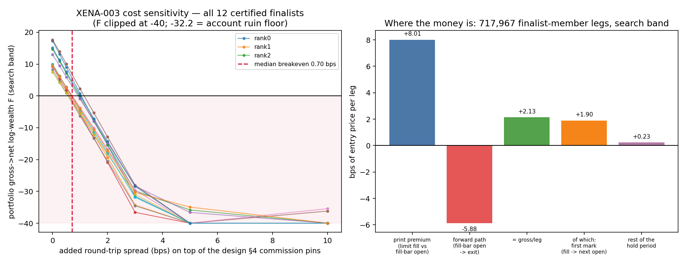

# Experiment Report: XENA-003 — MTFCTX-C3: HTF context filters on a NAIVE REVERSION control (CTRL-03, native limit orders)

## Status: COMPLETED — **OPERATOR VERDICT: NOT SUPPORTED (magnitude)**

**Date:** 2026-07-13 (operator verdict) · analysis 2026-07-12 · adjudication 2026-07-12
**Lane:** XENA (portfolio referee, default route) · **Family group:** CF-MTFCTX-001
**Execution contract:** native cTrader limit orders + m1 fills (EXP-013 carve-out)
**Instruments (12):** USTEC US500 US2000 JP225 AUS200 US30 EU50(STOXX50) GER40(DE40) HK50 UK100 XAUUSD BTCUSD
**Universe:** 2,736 candidates (19 filter variants × 4 holds × 3 domains × 12 instruments)
**Frozen registry:** v3, sha256 `537d691aaf59c19220ac65b922d780e970167e8b71972ea8d864402b36e672a6`
**Gate ledger: 0/2 slots spent. No counted TEST read. TEST band never opened.**

Full evidence: **[analysis.md](analysis.md)** (data-analyst, 2026-07-12). Every number below is
cited from it or from `results/`; nothing is re-derived here.

---

## 1. Question / hypothesis

**Mechanism (design §1):** price returning to the trailing 3-bar extreme marks a local liquidity
point where a **passive limit fill** is hypothesised to capture snap-back over **0.5–4× the HTF
span** (or earlier via a floating 0.5×ATR profit exit). HTF context (ADX, ±DI, vol regime) is
hypothesised to condition the quality of those reversion fills. Portfolio-level adjudication; no
A/B claim.

## 2. Method summary

| Stage | Configuration | Result |
|---|---|---|
| Emission | cTrader **native limit orders**, m1 fills (`execution="native_limit_orders_m1_fills"`), fence `AnalysisEndUtc = 2024-12-11T08:19:00Z` | 2,736/2,736 cells |
| Candidate gate | `gate_universe` (finite `SlPrice` per leg) | PASS |
| Estimand gate (blocking) | `xen.estimand_validation` | **2,777/2,777 cells PASS**, `blocking_pass: true`, manifest 12/12 |
| Physicality tripwire (Amendment 3, native-fill) | fill ∈ [m1 Low, m1 High]; limit actually touched | **PASS** — 51/14,400 flags, all root-caused to tick-stamp/feed-gap ambiguity; no fill at an untouched engine-feed price |
| Search | LAHC ×12 restarts, TRAIN search band only (2021-06-02 → 2023-03-08), budget **27,294** (smoke curve read v2: 13,974 / 17,468 / 27,294 → max), `charge_costs=false` (A-1) | 12 distinct terminals |
| Certification | plateau X ≥ 0.70 ∧ F̂ ≥ F_floor 0.4302; 4 purged folds | **12 of 12 certified** |
| Permutation battery v2 | rotation + grid-open re-pricing, K=10 × 2 restarts @ 27,294 | live ≫ permuted — **CONFOUNDED, see §4.4** |
| Analyst controls (ARM-OPEN / ARM-NEXTOPEN) | entry times/exits/sizing held; only the entry **price basis** moved | F̂ 23 → 0.09–1.93 (below the permuted null) |
| Final gate | **NOT RUN** | ledger 0/2 |

**Evaluation counts (§10.4 — mandatory; they travel with every number below):**

| Stage | `evaluation_count` | `distinct_subsets` |
|---|---|---|
| Search (12 restarts) | **322,803** | **322,803** (no cache collisions) |
| Certification top-up | 1,104 | 1,104 |
| Permutation battery | 10 perms × 2 restarts @ 27,294 budget | null draws |
| Analyst reads (analysis.md) | search-band only; 717,967 legs over 240 finalist-member candidates; top subset n = 195,056 legs | — |

**Platform:** c8g.12xlarge (Graviton4, aarch64), Rust `xena_fold` kernel. Analyst reads on
macOS/aarch64 (rank-0 F̂ re-derived locally = 24.637, exactly reproducing the reported value).

---

## 3. Operator verdict (recorded verbatim, 2026-07-13)

> **XENA-003 (naive reversion, native limit orders) — verdict: NOT SUPPORTED (magnitude)**
>
> Full evidence is in `python/experiments/XENA-003/analysis.md` (data-analyst, already on disk —
> read it and cite it; do not re-derive). Decisive numbers:
> - Gross edge **+1.958 bps/leg**, 95% CI [1.846, 2.073], n=195,056 — real, block- and seed-stable.
> - **Breakeven round-trip spread 0.564–1.146 bps (median 0.705)**; 5/12 finalists survive 0.5 bps,
>   2/12 survive 1.0 bps, **0/12 at 1.5 bps (all at F = −32.2, ruin)**. Pre-registered "nets
>   survive" band is 20–40 bps gross/trade — XENA-003 is 1/15th–1/30th of it.
> - F̂ ≈ 23 decomposes as ~150,000 trades × ~1.4 bps × ~1.05× notional leverage, compounded
>   costlessly. **Not** a sizing-leverage artifact (notional/equity 0.93–1.10×).
> - **91.2% of the gross edge is booked in the single mark from the limit print to the next grid
>   open.** The registered mechanism (snap-back over 0.5–4× HTF span) contributes 0.172 bps (8.8%).
>   Forward path from the fill bar's open is **−5.54 bps** (continuation, not reversion).
> - Discriminating control (entry times/exits/sizing held, entry price moved to the adjacent grid
>   open): F̂ 23 → **0.09–1.93**, below the permuted null. The live≫permuted gap is **the limit
>   print**, not predictive timing.
> - RULED OUT: leak/look-ahead (provenance + physicality PASS), Amendment-4 grid seam (≤0.005% of
>   portfolio money), sizing-leverage compounding, "genuine and cost-surviving."
> - SUPPORTED: passive-limit fill-price advantage (dominant) + a genuine but sub-cost reversion
>   residual. The emission is effectively an ~80%-occupancy two-sided passive quoting grid — a
>   market maker being *charged* the spread it would need to be *paid*. P-10 territory.
> - Family thesis contradicted: unfiltered **V00 is 4.0× over-represented** among finalist slots;
>   the search maximises cadence (1H5M 76%, H05X 53%), not conditioning.
> - Certification uninformative: **79.9% of the 2,736-candidate universe is gross-profitable
>   standalone** (94.7% on 1H5M); the 12 restart winners are near-disjoint (pairwise Jaccard median
>   0.108) yet all score F̂ 21–25 and all certify — a degenerate landscape.

**Analyst recommendation (analysis.md §9):** *NOT SUPPORTED (magnitude) — and DO NOT SPEND A
COUNTED TEST GATE SLOT.* **The operator's verdict and the analyst's recommendation agree.**

---

## 4. Key evidence (all from analysis.md)

### 4.1 The effect is real — and 1/15th–1/30th of the survival band (§3.2)

Top subset (rank 0), n = **195,056 legs**, `xen.evaluation.block_bootstrap_ci`, 5-seed battery,
block sweep 32/64/128 — every CI excludes zero; all block- and seed-stable.

| Quantity (bps of entry price, per leg) | mean | 95% CI (block 64) |
|---|---|---|
| **gross / leg** (the money) | **1.958** | **[1.846, 2.073]** |
| print premium (limit fill vs the open of the bar it filled in) | +7.496 | [7.319, 7.679] |
| forward path (fill-bar open → exit) | **−5.538** | [−5.703, −5.378] |
| **first mark** (fill → next LTF grid open, ONE bar) | **1.785** | [1.726, 1.847] |
| rest of the hold (next open → exit) — *the registered mechanism* | **0.172** | [0.078, 0.269] |

`gross = print + path` verified to 1.1e-13 bps. **91.2% of the gross edge is booked in the single
mark from the limit print to the next grid open.** The registered snap-back mechanism (0.5–4× HTF
span) contributes **8.8%**. Per-year stable (2021/22/23: 1.87 / 2.07 / 1.63 bps). Every instrument
positive (1.35–5.92 bps) — and the edge is a near-constant **2.2–3.6% of the 2×ATR volatility
unit** across twelve unrelated markets, a microstructure (bounce/discretisation) signature.

**Against the pre-registered band:** WS-6 "nets survive" = **20–40 bps gross/trade**; XENA-003 sits
at **1.25–1.55 bps** notional-weighted — **1/15th to 1/30th**.

### 4.2 Cost-fatality (§3.3 — the decision number)

Portfolio F̂ vs added round-trip spread (12 certified finalists; −32.24 = log floor = **ruin**):

| added RT spread | 0 bps (commissions only) | 0.25 | 0.5 | 1.0 | **1.5** | ≥2.0 |
|---|---|---|---|---|---|---|
| rank 0 (best) | 17.15 | 12.98 | 8.78 | −0.01 | **RUIN** | RUIN |
| **# of 12 still positive** | 12 | 12 | **5** | **2** | **0** | **0** |

**Breakeven added round-trip spread:** min **0.564** · median **0.705** · max **1.146 bps**.
Realistic index-CFD round-trip spread is 1–3 bps ⇒ cost-dominated by ~1.5–4×. Even at **zero**
spread, the design's own commission pins cut rank-0 F from 24.82 → 17.15.

### 4.3 Where F̂ = 23 comes from (§3.1) — not leverage

`F ≈ n_trades × leverage × gross_bps/1e4` → 157,960 × 1.05 × 1.431e-4 = **23.7** ≈ F_point 24.82
(remainder = compounding convexity). Notional/equity per position **0.93–1.10×** across all 12
finalists; median stop 53.2 bps; median MAE = 0.14× stop. **Sizing-leverage compounding RULED OUT
as the driver** — the magnitude is trade **count** (133k–158k admitted legs/subset), compounded
costlessly.

*Risk disclosure (standing property of the sizing-only `SlPrice` contract):* with no live stop,
1.81% of legs realise a loss > 1R and 0.31% > 2R (worst −11.25 R); the oracle's `R_max` open-risk
book is optimistic on ~2–4% of legs. Immaterial to F̂ here.

### 4.4 The permutation battery is CONFOUNDED here; the discriminating control kills the edge (§4.4)

Battery v2 rotates each stream **and re-prices entry/exit from grid opens at the new times**. For
bar-close universes (XENA-001/002) only alignment dies; for a **limit-entry** universe the
**entry-price basis** dies too (+7.5 bps/leg). A large live≫permuted gap is therefore
**mechanically guaranteed** — uninformative, not an alarm.

| Arm | entry price | F_point (12 finalists) | vs live |
|---|---|---|---|
| **LIVE** | limit fill at the 3-bar extreme | **21.2 … 24.8** | — |
| ARM-OPEN | open of the LTF bar the fill occurred in | −33.7 … −77.6 (ruin) | collapse 2.4–4.3× |
| **ARM-NEXTOPEN** | open of the **next** LTF bar (implementable market-order analogue) | **+0.09 … +1.93** | collapse 93–99%; **below the permuted null (5.66)** |
| permuted battery v2 | grid opens at rotated times | 3.86 … 7.31 (median **5.66**) | — |

Hold timing, exits and sizing exactly as emitted and move **only** the entry price from the limit
print to the adjacent grid open, and F̂ ≈ 23 disappears. **The live≫permuted gap is the limit
print, not predictive timing.** (Symmetric caveat, per the analyst: these arms are decompositions,
not tradable alternatives — the fills were physical.)

**Cross-universe anchor** (same instruments, bands, oracle, machinery):

| universe | entry mechanism | print premium | gross bps/leg | frac candidates gross-positive | live F̂ median |
|---|---|---|---|---|---|
| XENA-001 | RANDOM, bar-close/open fills | 0.000 | −0.065 | 47.4% | 4.27 |
| XENA-002 | naive momentum, bar-close/open fills | 0.000 | +0.085 | 52.6% | 4.79 |
| **XENA-003** | **passive limit at the 3-bar extreme** | **+4.9 … +8.0** | **+1.91** | **79.9%** | **22.80** |
| XENA-003 permuted | grid-open re-pricing | ~0 by construction | — | — | 5.66 |

### 4.5 Certification is uninformative — a degenerate landscape (§4.6)

| Read | Value |
|---|---|
| n_certified / n_finalists | **12/12** |
| F_floor clearance | **49×–57×** (F̂ 21.2–24.6 vs F_floor 0.4302) — the floor screens nothing |
| plateau min_drop_ratio | 0.905–0.955 (threshold 0.70); `keystones: {}` |
| pbo_like | 0.0 (all 4 purged folds positive for all 12; fold F 1.8–3.9) |
| restart F̂ dispersion | 21.20 / 22.80 / 24.64 (spread 3.44) |
| **pairwise Jaccard between the 12 restart terminals** | **median 0.108** (max 0.180, min 0.043) — **near-disjoint winners** |
| candidates gross-profitable standalone (full 2,736 universe) | **79.9%** (94.7% on 1H5M); median gross/trade 1.91 bps |
| `resim frac_folds_below_search_p25` | 1.0 (all) — structurally vacuous (audit A3), not a divergence signal |

Twelve restarts converge on twelve essentially **disjoint** subsets (11% overlap), all score F̂
21–25, all certify. That is a flat, degenerate landscape in which ~80% of the universe is
gross-profitable and any ~30 high-cadence candidates compound the same 1.4 bps — certification
confirms **ubiquity**, not selection skill.

### 4.6 Family thesis contradicted (§4.7)

| | share of 364 finalist member slots | universe share | ratio |
|---|---|---|---|
| **V00 (baseline, NO HTF filter)** | **21.2%** | 5.3% (1/19) | **4.0× OVER-represented** |
| 1H5M domain (fastest) | 75.8% | 33.3% | 2.3× |
| H05X (shortest hold) | 53.3% | 25.0% | 2.1× |

Median gross/trade: V00 **1.837** bps vs filtered V01–V18 **1.922** bps — a wash. The search
maximises **cadence**, not conditioning. CF-MTFCTX-001's thesis gets **no support** here.

### 4.7 What is ruled out / supported (§7)

| Candidate explanation | Verdict | Driving number |
|---|---|---|
| **Passive-limit fill-price advantage** | **SUPPORTED — dominant** | print premium +7.50 bps on 98.0% of legs; 91.2% of edge in first mark; ARM-NEXTOPEN F̂ 23 → ~1 |
| **Genuine but sub-cost reversion residual** | **SUPPORTED — the honest residual** | +1.958 bps [1.846, 2.073], per-year stable, all 12 instruments; breakeven 0.56–1.15 bps RT |
| Grid-seam artifact (Amendment 4) | **RULED OUT** | appended terminal bin ≤ 0.005% of portfolio money; 11 of 157,960 legs on the seam |
| Sizing-leverage compounding | **RULED OUT as driver** | notional/equity 0.93–1.10×; MAE 0.14× stop |
| Genuine **and** cost-surviving | **RULED OUT** | 12/12 ruined at 1.5 bps RT |
| Leak / look-ahead | **RULED OUT** | provenance PASS (limit built from confirmed t−3..t−1; 99.8% of fills at-or-better); physicality PASS; no L-01 pattern |

**Mechanism, one sentence (analyst):** an ~80%-occupancy two-sided passive market-making grid whose
fills earn a +7.5 bps maker/discretisation premium against the mark grid, of which the price path
takes back −5.5 bps, leaving ~+2 bps of real but volatility-proportional gross per trade;
×150,000 trades at ~1× leverage this compounds costlessly to F̂ ≈ 23 — and is annihilated by
0.7 bps of round-trip spread. **P-10 territory** (passive-limit MR fade, banned as a capture
vehicle for exactly this seam).

---

## 5. Conclusion

**NOT SUPPORTED (magnitude) — operator.** The effect replicates end-to-end and is real; it is
simply **10–30× too small to pay for its own execution**. This is the EXP-025 / L-21 shape exactly:
a genuine channel whose magnitude dies at the cost seam. 91.2% of it is not even the registered
mechanism — it is the limit print. The spectacular F̂ ≈ 23 is a costless-compounding artifact of
150,000 trades × a bounce-scale per-trade edge.

**No gate slot spent, and the analyst's reasoning for why it would be wasted is recorded:** under
A-4 the GROSS gate is binding and a pass was near-certain (search F̂ ≈ 23, fold F 1.8–3.9, threshold
0.0558), while the NET block needed to make that pass meaningful (a) could not be computed (no
spread pins) and (b) is already known to be catastrophically negative at any real spread. A slot
would have bought a permanent-record "pass" on a non-deployable artifact.

## 6. Cross-cutting disclosures (common to XENA-001/002/003)

1. **Framework audit.** `.ignore/temp/new-referee/post-xena-infr-audit.md` (2026-07-13) — five root
   causes: (A) extensive-vs-intensive F statistic (`F_floor` inoperative at live scale — PROVEN:
   XENA-003 clears it by 49–57×; gate threshold shares the lineage — INFERRED; `resim_divergence`
   structurally vacuous — PROVEN); (B) costless cadence-maximizing objective (§4.6 is its
   fingerprint) that also systematically selects the most cost-fragile portfolio; (C) permutation
   battery confounded on non-grid-priced entries — **this universe is the proof** (§4.4);
   (D) plateau screen rewards ubiquity, not robustness (§4.5); (E) governance/process sequencing.
   Warrants a dedicated INFR redesign. Referenced, not restated.
2. **Governance near-miss (recorded).** Design §4 spread pins were never set —
   `universe_manifest.json` carries `cost_bps = 0.0` for **ten of twelve** instruments (only XAUUSD
   0.28 and BTCUSD 13.0 are non-zero). A gate spend would have produced a **binding GROSS pass with
   a vacuous NET block** — the exact L-22 failure shape, on a strategy whose breakeven spread is
   0.7 bps. **Nothing in the pipeline blocked this.**
3. **Proposed new lesson (PROPOSAL — operator ratifies at checkpoint-011; not self-ratified).**
   Suggested **L-25**:
   > *An absolute threshold on an **extensive** statistic — one that scales with band length, trade
   > count, or candidate-pool size — is valid only at the scale at which it was calibrated. A
   > frozen, hash-pinned registry is coherent only for **scale-free** statistics. Any frozen
   > constant must therefore be either (a) defined on a standardized/intensive statistic
   > (per-trade, per-unit-time, or z-scored against a per-universe null), or (b) re-derived per
   > universe from that universe's own null — and no registry may be pinned before at least one live
   > null universe has been run at production scale.*

## 7. Limitations (analysis.md §8)

- **Spread pins missing** (design §4) — the NET informational leg cannot be computed at all.
- **No-live-stop tail:** ~2% of legs run past the nominal sizing unit; `R_max` open-risk book is
  optimistic there (standing property of the sizing-only `SlPrice` contract).
- **Permutation battery needs a design fix for native-fill universes** — the rotation must preserve
  the entry-price basis (or decompose print-vs-path), else it returns a mechanically guaranteed
  "pass" on any limit-entry universe.
- **Not answerable without new emission:** would the ~2 bps survive a fill model with queue
  position, partial fills, or one-tick adverse selection at the touch? (Almost certainly not.)
- 1-ULP cross-platform libm caveat (INFR-007): analyst reads on macOS/aarch64, pinned corpus 499/500;
  re-derived rank-0 F̂ = 24.637 reproduces the reported value exactly, so not load-bearing.

## 8. Implications / recommended next work

1. **No gate spend; no follow-on universe on this mechanism** until the referee is redesigned
   (audit items 1–4). P-10 is re-encountered, not escaped.
2. **INFR (proposed):** entry-price-basis-preserving permutation battery; Jaccard + universe-marginal
   gross-bps/trade disclosure **before** search compute (a cheap pre-search read would have shown a
   1.91 bps median against a 20–40 bps survival band, before 322,803 oracle evaluations); code-enforced
   cost-pin precondition.
3. Analyst-listed probes, if the operator wants to push (all weak leads, recorded for completeness):
   horizon-extension of the 0.172 bps residual (P-02 caution); tick-size correlation of the per-symbol
   first-mark step; a maker-rebate/queue execution contract — a **different family**, needing its own
   emission.

## 9. Registry disposition

**Evidence rows only — no status transitions.** (Experiment ≠ family: CF-MTFCTX-001 status moves only
at the operator-signed checkpoint-011 retrospective.)

| Ledger | Update |
|---|---|
| `docs/signal-registry/xena-runs.md` | XENA-003 row closed: eval count 322,803 / distinct subsets 322,803, certified 12/12, **0/2 gate slots**, outcome NOT SUPPORTED (magnitude) (operator 2026-07-13) |
| `docs/signal-registry/candidate-families/cf-mtfctx-001.md` | evidence row appended (fill-price-advantage decomposition, cost fatality, V00 4.0× over-representation); **status field untouched** |
| `docs/signal-registry/test-read-ledger.md` | **unchanged — no counted TEST read, no holdout contact** |
| `docs/signal-registry/multiplicity-registry.md` | not applicable — XENA runs are accounted in `xena-runs.md` (`docs/references/xena-lane.md` §Registry semantics) |

## 10. Artifacts

| Artifact | Path |
|---|---|
| Design (scope + plan + amendments) | [design.md](design.md) |
| QA (pre-exec, append-only) | [qa-review.md](qa-review.md) |
| **Analysis (data-analyst, full evidence)** | **[analysis.md](analysis.md)** |
| Analyst code | [analysis_code/](analysis_code/) |
| Analyst outputs | [results_analyst/](results_analyst/) (`controls.json`, `cost_sweep.json`, `leg_diagnostics*`, `universe_scan.parquet`) |
| Key plot | [plots/cost_sensitivity_and_decomposition.png](plots/cost_sensitivity_and_decomposition.png) |
| Certification | [results/certification.json](results/certification.json) |
| Evidence package | [results/evidence_package.json](results/evidence_package.json) |
| Permutation battery v2 (confounded — see §4.4) | [results/permutation_battery.json](results/permutation_battery.json) |
| Estimand gate (blocking) | [results/estimand_validation.json](results/estimand_validation.json) |
| Native-fill physicality audit | [results/physicality_audit.json](results/physicality_audit.json) |
| Search restarts ×12 + budget | [results/](results/) |
| Live-data null anchor (random control) | [../XENA-001/report.md](../XENA-001/report.md) |
| Framework audit (cross-cutting) | `.ignore/temp/new-referee/post-xena-infr-audit.md` |
