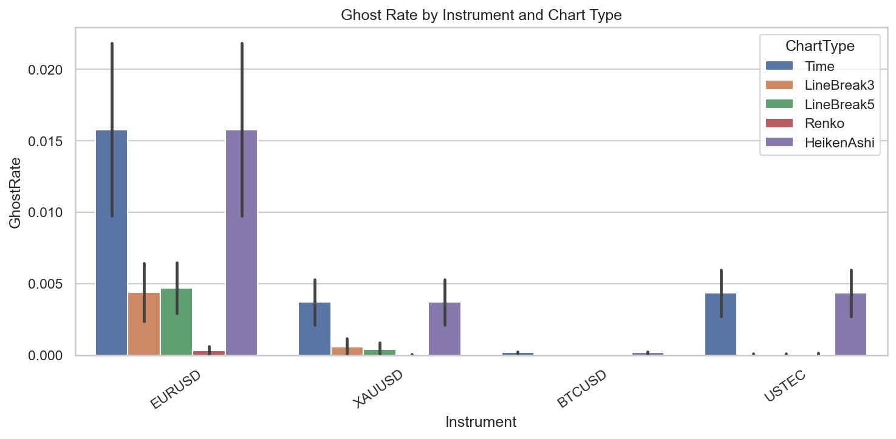
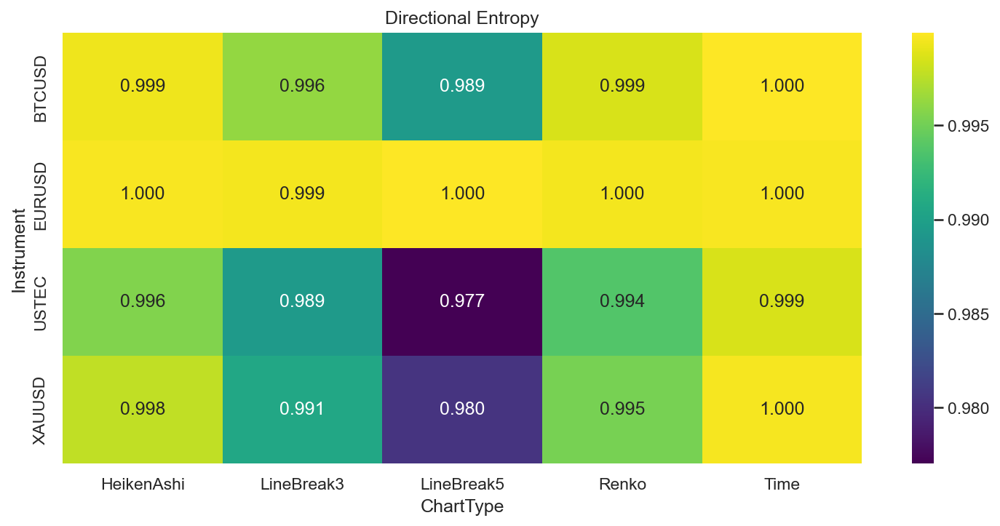

# Experiment Report: EXP-001-TF — Timeframe Replication: Information Density & Ghost Bar Comparison

## Status: COMPLETED

**Date**: 2026-05-17
**Instruments**: EURUSD, XAUUSD, BTCUSD, USTEC
**Feature Categories**: Time Bars (15m, 1h), Line Break (levels 3, 5), Renko (ATR 14), Heiken Ashi

---

## Question

Do the EXP-001 information-density and ghost-bar conclusions replicate when Line Break, Renko, and Heiken Ashi are generated from 15-minute and 1-hour source bars instead of 1-minute bars?

## Hypothesis

Line Break and Renko event bars have higher information density than same-timeframe time bars on at least 3 of 4 instruments, measured as lower ghost rate (≥25% reduction), better use of remaining directional-entropy headroom (≥50% capture), and a practical absolute entropy gain (≥0.005 bits).

## Method Summary

Lazily loaded each instrument's 1-minute bars, sorted by CloseTime, sliced the first 70% analysis set, aggregated into complete 15-minute and 1-hour OHLCV bars, then generated chart types per timeframe. Computed ghost rate, directional entropy, entropy headroom capture, and absolute entropy gain. Compared event charts to same-timeframe time bars using paired instrument-level effect sizes and descriptive bootstrap (n=4 instruments). Full methodology in [analysis-plan.md](analysis-plan.md).

## Key Findings

### Finding 1: Ghost Rate Reduction Replicates Strongly

Event charts achieve 70-100% ghost-rate reduction relative to same-timeframe time bars across all instruments and timeframes. Bootstrap 95% CI for 15m LB3 ghost reduction: [0.742, 0.988]. Renko at 1h: 100% reduction (zero ghost bars).

### Finding 2: Directional Entropy Gains Are Uniformly Negative

All event charts have lower directional entropy than same-timeframe time bars. Bootstrap 95% CI for 15m LB3 entropy gain: [-0.0058, -0.0010] — entirely negative. Maximum entropy gain was +0.00025 (EURUSD 15m LB3), far below the 0.005-bit threshold.

### Finding 3: No Instrument Meets All Three Thresholds

SupportCount = 0/4 for all chart type and timeframe combinations. The headroom capture criterion (≥50%) was not met by any instrument (maximum: 40.6% for EURUSD 15m LB3).

## Conclusion

**Hypothesis REFUTED.**

While ghost-rate reduction replicates robustly at higher timeframes (70-100%), directional entropy gains are uniformly negative across all instruments and timeframes. Event charts filter near-zero-movement bars but also reduce directional information diversity. The EXP-001 conclusion does not replicate at 15m or 1h source bars.

## Limitations

- Bootstrap operates on n=4 instrument-level differences; CIs are descriptive, not inferential.
- Directional entropy is a binary measure (up/down) that does not capture magnitude or duration.
- Single Line Break level (3) and Renko ATR period (14) tested; different parameters might yield different results.

## Implications for Future Research

- Event charts reduce ghost bars but also reduce directional entropy — this trade-off should be evaluated in the context of signal quality, not information density alone.
- The timeframe-replication series (EXP-001-TF through EXP-006-TF) should be completed before drawing cross-experiment conclusions.

## Recommended Next Experiments

1. Complete EXP-002-TF through EXP-006-TF timeframe replications.
2. A follow-up experiment could test whether lower entropy in event charts correlates with better signal-to-noise ratio for trend detection.

## Artifacts

| Artifact | Path |
|----------|------|
| Scope | [scope.md](scope.md) |
| Analysis Plan | [analysis-plan.md](analysis-plan.md) |
| Code | [code/](code/) |
| Audit | [audit.md](audit.md) |
| Results | [results.md](results.md) |
| Governance Reviews | [governance/](governance/) |
| Plots | [plots/](plots/) |
