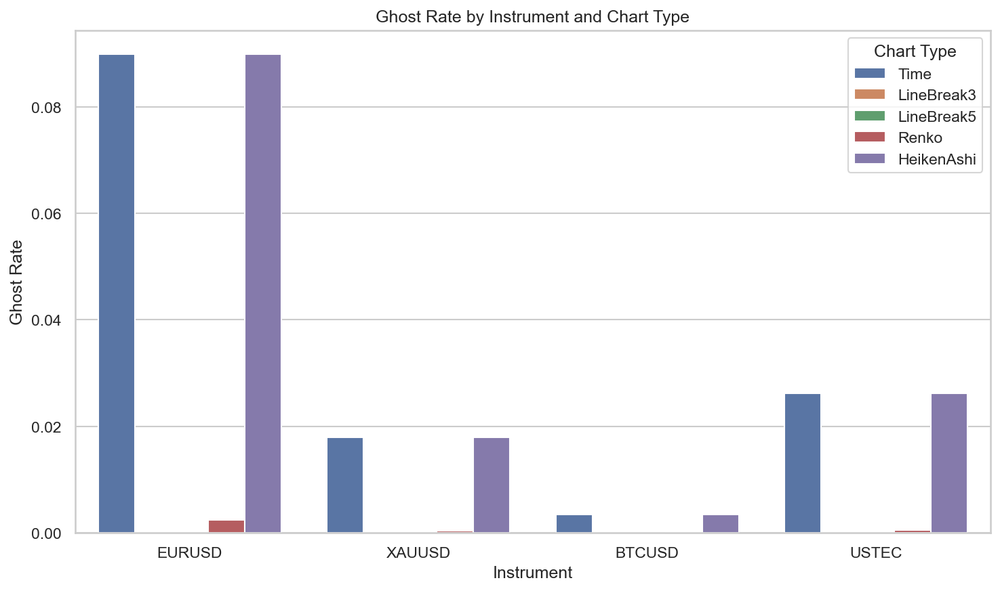
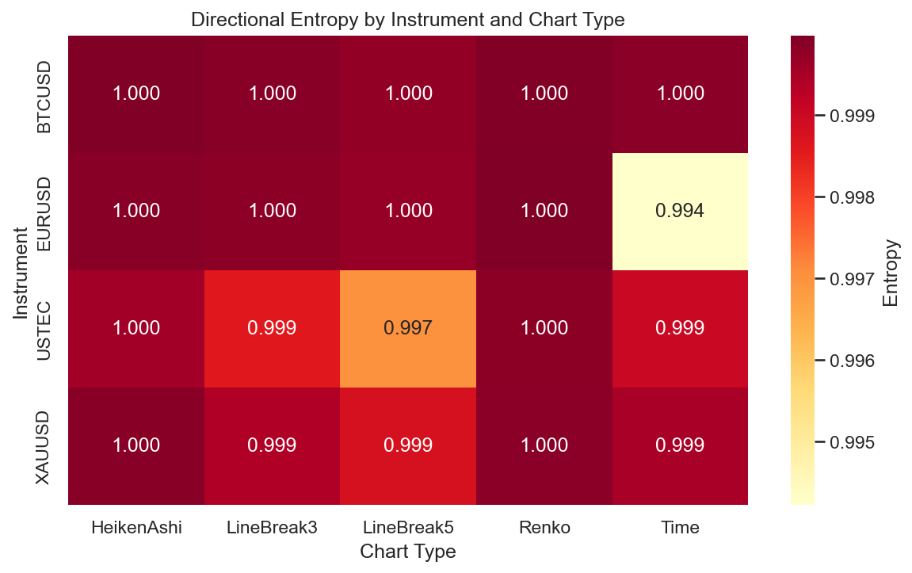

# Experiment Report: EXP-001 — Information Density & Ghost Bar Comparison

## Status: COMPLETED

**Date**: 2026-05-16
**Instruments**: EURUSD, XAUUSD, BTCUSD, USTEC
**Feature Categories**: Time Bars, Line Break (levels 3, 5), Renko (ATR 14), Heiken Ashi

---

## Question

Which Phase 1 chart types spend fewer bars on economically empty movement, and how does their information density compare over the same chronological analysis windows?

## Hypothesis

Line Break and Renko event bars have higher information density than 1-minute time bars on at least 3 of 4 instruments, measured as lower ghost rate, better use of remaining directional-entropy headroom, and a practical absolute entropy gain. Heiken Ashi is included as a smoothed time-bar transformation but is not expected to reduce bar count.

## Method Summary

Deterministic chart-type generation from the pre-holdout analysis set (first 70% of chronologically ordered 1-minute bars), followed by computation of information-density metrics (bar count, bars per day, ghost rate, directional entropy, entropy-headroom capture, absolute entropy gain, median real-price movement, CV by volatility tercile). Event-chart comparisons used distinct `SourceCloseTime` rows to exclude same-source construction artifacts. Paired instrument-level effect sizes and descriptive bootstrap confidence intervals (10,000 resamples) compared event charts against time bars. See [analysis-plan.md](analysis-plan.md) for full methodology.

## Key Findings

### Finding 1: Event charts eliminate ghost bars universally

All event chart types have dramatically lower ghost rates than time bars on every instrument. LineBreak3 and LineBreak5 achieve 0.0 ghost rate across all four instruments. Renko achieves near-zero rates (0.00005 to 0.0024). Time bars range from 0.0035 (BTCUSD) to 0.0899 (EURUSD). Bootstrap mean ghost-rate reduction for LineBreak3 vs Time: 0.034 (95% CI [0.009, 0.072]), all four instruments positive.

This is a structural property of event charts: they only emit bars when price confirms a movement. It does not, by itself, prove higher information content per bar.

### Finding 2: Directional entropy is near-maximum for all chart types

All chart types have directional entropy between 0.994 and 0.9999 bits (binary maximum = 1.0). The up/down direction distribution is nearly balanced regardless of chart type, leaving minimal headroom for improvement.

### Finding 3: Entropy gains are instrument-specific

Only EURUSD meets all three success thresholds (ghost reduction >= 25%, entropy headroom capture >= 50%, absolute entropy gain >= 0.005 bits) for any primary event type:

| Instrument | Chart Type | Ghost Reduction | Entropy Increase | Headroom Capture | Meets All |
|------------|-----------|----------------|-----------------|-----------------|-----------|
| EURUSD | LineBreak3 | 1.0 | +0.0056 | 0.97 | Yes |
| EURUSD | Renko | 0.97 | +0.0057 | 0.98 | Yes |
| XAUUSD | LineBreak3 | 1.0 | -0.00009 | -0.17 | No |
| BTCUSD | LineBreak3 | 1.0 | +0.00004 | 0.25 | No |
| USTEC | LineBreak3 | 1.0 | -0.0004 | -0.42 | No |
| XAUUSD | Renko | 0.98 | +0.0003 | 0.56 | No |
| BTCUSD | Renko | 0.98 | +0.0001 | 0.67 | No |
| USTEC | Renko | 0.98 | +0.0005 | 0.49 | No |

Bootstrap CI for LineBreak3 entropy increase includes zero [-0.0003, 0.0042]; for Renko excludes zero [0.0002, 0.0043] but mean 0.0016 < 0.005 practical threshold.

### Finding 4: Heiken Ashi compresses nothing, smooths direction

Heiken Ashi produces exactly the same bar count and ghost rate as time bars (1:1 mapping). Its directional entropy is slightly higher due to smoothing, but movement metrics are identical because it uses real prices. This confirms the scope expectation that HA would not reduce bar count.

## Conclusion

**Hypothesis REFUTED.**

The hypothesis required Line Break level 3 or Renko ATR-14 to meet all three information-density thresholds on at least 3 of 4 instruments. Only EURUSD meets all thresholds for either primary event type. The ghost-rate reduction is strong and universal but is a structural property of event charts rather than evidence of superior information density. Directional entropy is already near the binary ceiling for 1-minute time bars, leaving minimal headroom for event charts to exploit.

This does not mean event charts are useless. They compress time effectively (LineBreak3 produces ~25% as many bars as time bars) and eliminate empty bars. But the information content per non-ghost bar is not meaningfully higher than that of time bars. Future research should focus on metrics beyond binary directional entropy.

## Limitations

- Four instruments, one analysis period (2023-2025). Results may differ in other market regimes.
- Directional entropy is near the binary ceiling (0.994+), making entropy-gain thresholds extremely difficult to satisfy.
- Bootstrap is descriptive with four instrument-level units, not strong statistical inference.
- 1-minute source bars only; higher-timeframe baselines may yield different comparisons.

## Implications for Future Research

- Binary directional entropy is too coarse a metric for information-density comparison. Multi-state classification or mutual-information approaches may be more discriminative.
- Event charts' value lies in temporal compression and ghost elimination, not per-bar information increase. Strategy-relevant experiments should test whether this compression improves signal timing or reduces noise exposure.
- EURUSD's unique entropy response warrants investigation — it may indicate instrument-specific characteristics relevant to chart-type selection.

## Recommended Next Experiments

1. **EXP-002 (Volatility & Trend Regime Representation)**: Test whether event charts better represent volatility regimes and trend structure.
2. **Multi-state entropy experiment**: Replace binary direction with 3+ state classification to create more headroom for differentiation.
3. **Higher-timeframe baseline comparison**: Compare event charts against 5-minute or 15-minute time bars.

## Artifacts

| Artifact | Path |
|----------|------|
| Scope | [scope.md](scope.md) |
| Analysis Plan | [analysis-plan.md](analysis-plan.md) |
| Code | [code/](code/) |
| Audit | [audit.md](audit.md) |
| Results | [results.md](results.md) |
| Governance Reviews | [governance/](governance/) |
| Plots | [plots/](plots/) |
