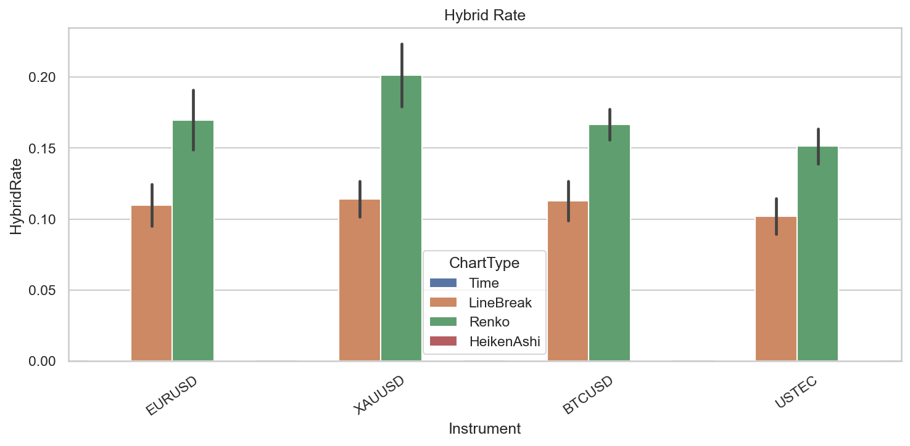
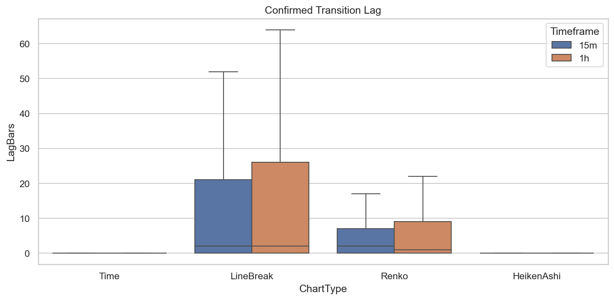

# Experiment Report: EXP-002-TF — Timeframe Replication: Volatility & Trend Regime Representation

## Status: COMPLETED

**Date**: 2026-05-17
**Instruments**: EURUSD, XAUUSD, BTCUSD, USTEC
**Feature Categories**: Time Bars (15m, 1h), Line Break (level 3), Renko (ATR 14), Heiken Ashi

---

## Question

How much boundary cost do Line Break and Renko incur relative to 15-minute and 1-hour time-bar regime timelines, and does the EXP-002 conclusion replicate beyond 1-minute source bars?

## Hypothesis

On at least 3 instruments, Line Break level 3 or Renko ATR-14 has hybrid rate ≤0.05 and median transition lag ≤2 source time bars at each tested timeframe.

## Method Summary

Aggregated 1-minute bars into 15m/1h timeframes within the 70% analysis set, computed rolling realised volatility regimes from same-timeframe time bars, aligned chart-type events by timestamp, and measured hybrid rate (event intervals straddling multiple regimes) and transition lag (first event confirmation after regime change). Full methodology in [analysis-plan.md](analysis-plan.md).

## Key Findings

### Finding 1: Hybrid Rates Exceed 0.05 Bound Universally

LineBreak hybrid rates: 8.9-12.7%. Renko hybrid rates: 13.9-22.3%. All exceed the 0.05 threshold. Bootstrap 95% CI for 1h Renko absolute hybrid excess: [0.170, 0.212].

### Finding 2: Median Transition Lag Generally Within Bounds

Median lag ≤2 source bars for most combinations. Exception: BTCUSD 1h LineBreak = 5.0 bars. Missed transitions: 0-3 per combination (0-1% of total).

### Finding 3: Time-Bar Baseline Is Zero by Construction

Time bars and Heiken Ashi have HybridRate = 0.0 and MedianLagBars = 0.0 because they define the regime timeline.

## Conclusion

**Hypothesis REFUTED.**

Hybrid rates exceed 0.05 on all 4 instruments at both timeframes (8.9-22.3%). SupportCount = 0/4 for all combinations. The boundary cost is structural — event charts emit bars at irregular intervals that do not align with time-based regime boundaries.

## Limitations

- Bootstrap operates on n=4 instrument-level values; CIs are descriptive only.
- Max lag values are extremely large for some combinations (e.g., USTEC 15m LineBreak: 3,376 bars).
- Hybrid rate counts any boundary-crossing interval equally, regardless of proportion spent in each regime.

## Implications for Future Research

- Event charts trade information density (fewer bars, lower ghost rates) for boundary cost (regime misalignment). Both effects should be weighed together.
- Event-chart-specific regime definitions could reduce boundary cost but would change the experiment's question.

## Recommended Next Experiments

1. Complete the timeframe-replication series.
2. Test whether event-chart-specific regime definitions reduce boundary cost.

## Artifacts

| Artifact | Path |
|----------|------|
| Scope | [scope.md](scope.md) |
| Analysis Plan | [analysis-plan.md](analysis-plan.md) |
| Code | [code/](code/) |
| Audit | [audit.md](audit.md) |
| Results | [results.md](results.md) |
| Governance Reviews | [governance/](governance/) |
| Plots | [plots/](plots/) |
