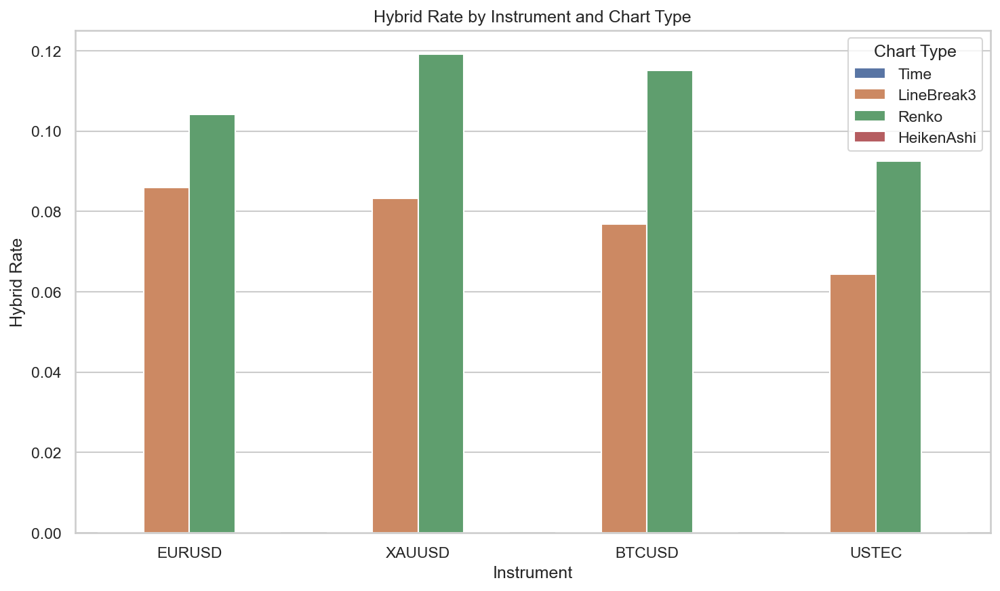
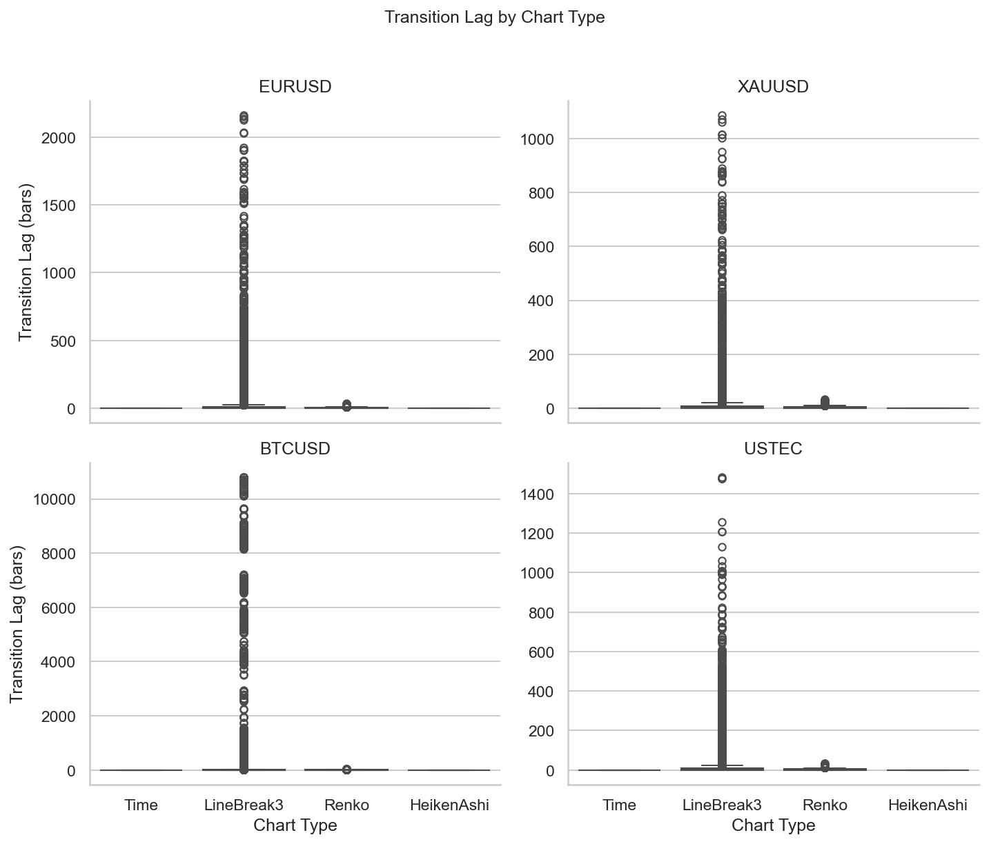

# Experiment Report: EXP-002 — Volatility & Trend Regime Representation

## Status: COMPLETED

**Date**: 2026-05-16
**Instruments**: EURUSD, XAUUSD, BTCUSD, USTEC
**Feature Categories**: Time Bars, Line Break (level 3), Renko (ATR 14), Heiken Ashi

---

## Question

How much volatility-regime boundary cost do Line Break level 3 and Renko ATR-14 incur relative to the 1-minute time-bar regime timeline, and is the cost small enough to preserve useful regime representation?

## Hypothesis

Line Break level 3 and Renko ATR-14 are evaluated for volatility-regime boundary cost versus the 1-minute time-bar lower bound, measured by hybrid rate and regime transition lag. On at least 3 instruments, Line Break or Renko has hybrid rate no greater than 0.05 and median transition lag no greater than 2 source time bars.

## Method Summary

Realised volatility was computed as rolling standard deviation of close-to-close log returns (window=20) on 1-minute time bars within the 70% analysis set. Regime labels (low/medium/high) were assigned using train-segment tercile thresholds. Chart-type events were aligned to the regime timeline by timestamp (CloseTime/SourceCloseTime). Hybrid rate (fraction of bars spanning regime boundaries) and confirmed transition lag (bars from time-bar regime transition to confirming chart event) were computed per chart type per instrument. Paired bootstrap (10,000 resamples, seed=42) provided confidence intervals for absolute excess cost versus the time-bar baseline. See [analysis-plan.md](analysis-plan.md) for full methodology.

## Key Findings

### Finding 1: Both event charts exceed the hybrid rate boundary on all instruments

Line Break hybrid rates range from 6.4% (USTEC) to 8.6% (EURUSD). Renko hybrid rates range from 9.2% (USTEC) to 11.9% (XAUUSD). All exceed the 5.0% bound. Time bars have zero hybrid rate by construction.

| Instrument | Time | LineBreak3 | Renko | HeikenAshi |
|------------|------|------------|-------|------------|
| EURUSD | 0.000 | 0.086 | 0.104 | 0.000 |
| XAUUSD | 0.000 | 0.083 | 0.119 | 0.000 |
| BTCUSD | 0.000 | 0.077 | 0.115 | 0.000 |
| USTEC | 0.000 | 0.064 | 0.092 | 0.000 |

Bootstrap confirms the hybrid rate disadvantage is consistent: LB3 mean diff = -0.078, CI [-0.085, -0.069]; Renko mean diff = -0.108, CI [-0.117, -0.098]. Both CIs exclude zero; 0/4 instruments show improvement.

### Finding 2: Median lag is zero but tail lag and missed transitions are substantial

All chart types show median transition lag of 0.0, but event charts have heavy tails and miss 17–34% of regime transitions entirely.

| Chart Type | Median Lag | P95 Lag | Max Lag | Miss Rate (range) |
|------------|-----------|---------|---------|-------------------|
| Time | 0.0 | 0.0 | 0.0 | 0% |
| LineBreak3 | 0.0 | 12–14 | 158–660 | 25–34% |
| Renko | 0.0 | 7 | 24–40 | 17–24% |
| HeikenAshi | 0.0 | 0.0 | 0.0 | 0% |

### Finding 3: Heiken Ashi mirrors time bars exactly

Heiken Ashi is a 1:1 transformation of time bars, producing identical hybrid rate (0.0) and lag (0.0) on all instruments. This confirms HA provides no regime representation advantage or cost relative to time bars.

## Conclusion

**Hypothesis REFUTED.**

Both Line Break level 3 and Renko ATR-14 exceed the absolute hybrid-rate boundary-cost bound (0.05) on all 4 instruments. The median transition lag criterion (≤ 2.0 bars) is met by both event charts, but this is driven by the zero-median phenomenon and does not compensate for the hybrid rate failure. The boundary cost of event chart aggregation is a structural property — bars that span multiple time bars will necessarily span regime boundaries defined on those time bars.

This does not mean event charts are useless for regime analysis. It means their regime labels should not be assumed to align cleanly with time-bar-defined volatility regimes. Event charts aggregate by price movement, not by volatility dispersion, and the two dimensions do not map cleanly onto each other.

## Limitations

- Regimes are defined on time bars; event charts are evaluated against an external definition, not their own internal structure.
- Bootstrap resamples only 4 instrument-level differences (N=4); CIs are descriptive, not population inference.
- Only Line Break level 3 and Renko ATR-14 were tested; different parameters might produce different boundary costs.
- Volatility terciles are empirical bins, not stable market states.

## Implications for Future Research

- Event charts' value may lie in signal denoising and precision (as found in EXP-003 and EXP-004) rather than regime fidelity.
- Event charts' own internal structure (reversal frequency, brick size changes) might serve as an independent regime detection method.
- The trade-off between regime alignment and noise filtering should be evaluated jointly, not in isolation.

## Recommended Next Experiments

1. **EXP-007 (proposed)**: Evaluate whether event charts' own internal structure can serve as a regime detection method independent of time-bar-defined regimes.
2. **Cross-experiment synthesis**: Combine EXP-002, EXP-003, and EXP-004 findings to assess whether event charts' value lies in signal denoising rather than regime fidelity.

## Artifacts

| Artifact | Path |
|----------|------|
| Scope | [scope.md](scope.md) |
| Analysis Plan | [analysis-plan.md](analysis-plan.md) |
| Code | [code/](code/) |
| Audit | [audit.md](audit.md) |
| Results | [results.md](results.md) |
| Governance Reviews | [governance/](governance/) |
| Plots | [plots/](plots/) |
