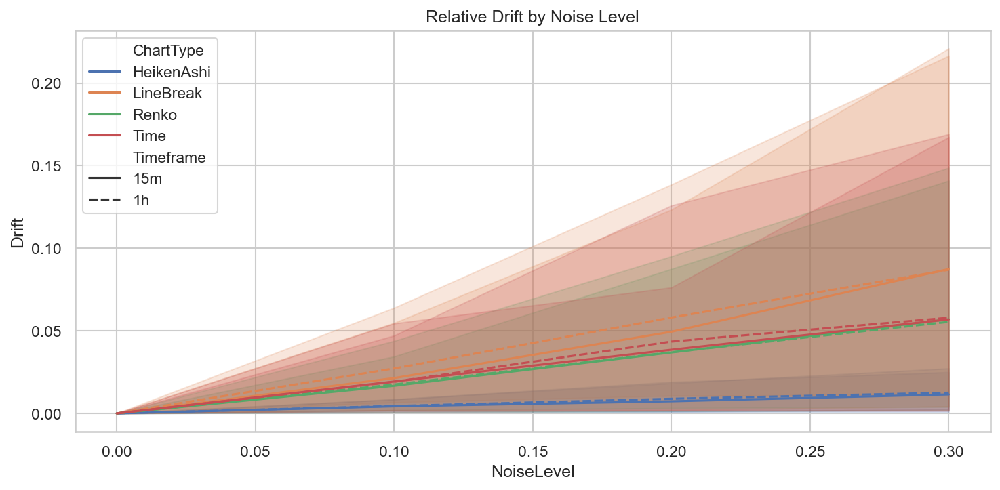
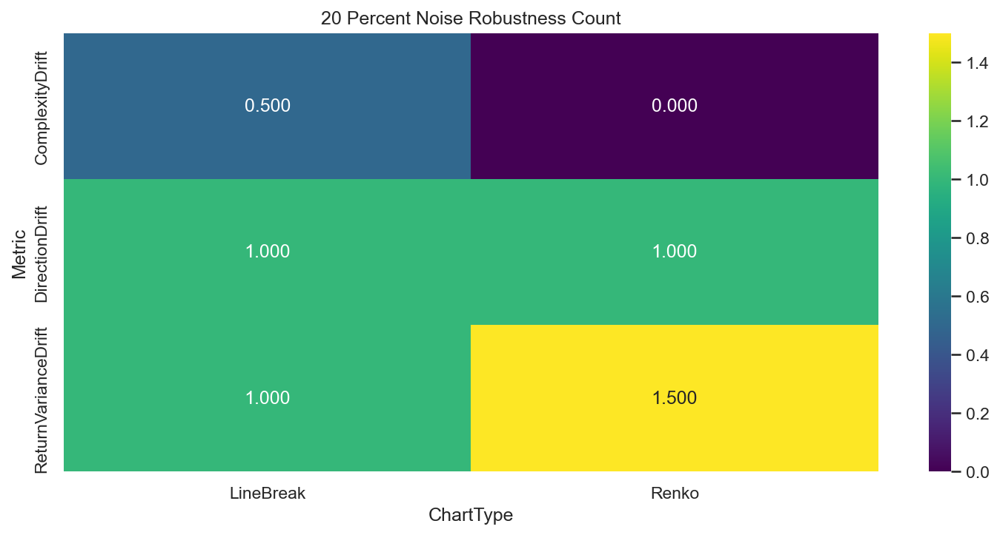

# Experiment Report: EXP-003-TF — Timeframe Replication: Noise Filtering & Statistical Robustness

## Status: COMPLETED

**Date**: 2026-05-17
**Instruments**: EURUSD, XAUUSD, BTCUSD, USTEC
**Feature Categories**: Time Bars (15m, 1h), Line Break (level 3), Renko (ATR 14), Heiken Ashi

---

## Question

Do the EXP-003 noise-robustness findings replicate when deterministic perturbations are applied to 15-minute and 1-hour aggregated source bars?

## Hypothesis

At 20% noise level, Line Break or Renko has ≥25% lower relative drift than same-timeframe time bars in at least 2 of 3 metrics (direction stability, return variance stability, complexity stability) on at least 3 instruments.

## Method Summary

Aggregated 1-minute bars into 15m/1h timeframes, applied deterministic perturbations at 0/10/20/30% noise levels with OHLC repair, regenerated chart types from perturbed bars, and computed direction drift, return variance drift, and LZ76 complexity drift relative to unperturbed baselines. Full methodology in [analysis-plan.md](analysis-plan.md).

## Key Findings

### Finding 1: Direction Drift — 2 of 4 Instruments for Event Charts

At 20% noise on 15m bars, LB and Renko show lower direction drift than time bars on 2 instruments (EURUSD, USTEC). Below the ≥3 instrument threshold.

### Finding 2: Complexity Drift — Event Charts Consistently Worse

LZ76 complexity drift is 10-30x higher for event charts than time bars on all instruments. InstrumentsWithAtLeast25PctLowerDrift = 0 for all combinations.

### Finding 3: Heiken Ashi Shows Lowest Drift

HA consistently has the lowest drift across all metrics, confirming its smoothing effect. Uses HAClose returns as non-tradable distortion diagnostic.

### Finding 4: OHLC Repair Fully Effective

Zero invalid bars across all 32 instrument-timeframe-noise combinations. InvalidPct = 0.0.

## Conclusion

**Hypothesis REFUTED.**

Maximum instrument count for any metric was 2 (DirectionDrift at 15m), below the ≥3 threshold. Complexity drift is consistently worse for event charts. The EXP-003 noise-robustness finding does not replicate at higher timeframes.

## Limitations

- LZ76 complexity may be confounded by row count differences between chart types.
- Perturbation model adds noise to close prices, which is an artificial stressor.
- HA return variance uses HAClose (synthetic prices) as distortion diagnostic.

## Implications for Future Research

- Event charts may be more sensitive to noise at higher timeframes because their bar boundaries are determined by price movement thresholds.
- Realistic noise models (e.g., bid-ask spread simulation) may produce different results.

## Recommended Next Experiments

1. Complete the timeframe-replication series.
2. Test noise robustness with realistic noise models.

## Artifacts

| Artifact | Path |
|----------|------|
| Scope | [scope.md](scope.md) |
| Analysis Plan | [analysis-plan.md](analysis-plan.md) |
| Code | [code/](code/) |
| Audit | [audit.md](audit.md) |
| Results | [results.md](results.md) |
| Governance Reviews | [governance/](governance/) |
| Plots | [plots/](plots/) |
