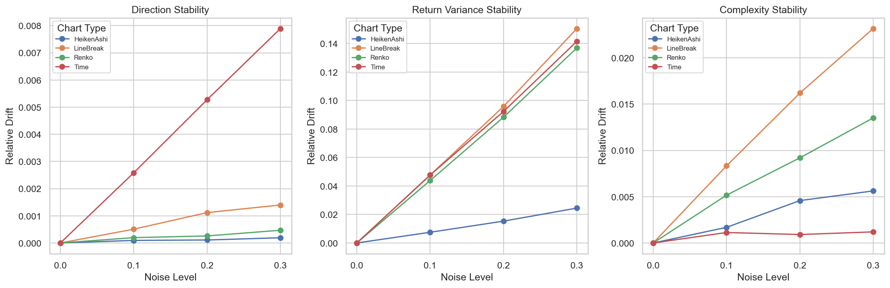
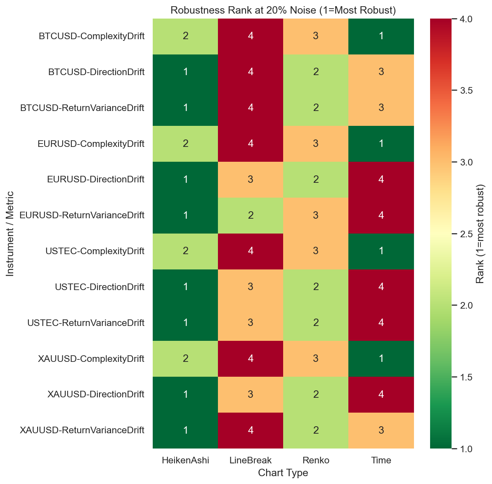
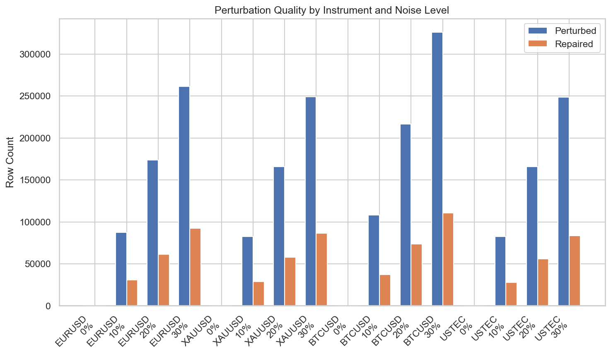

# Experiment Report: EXP-003 — Noise Filtering & Statistical Robustness

## Status: COMPLETED

**Date**: 2026-05-16
**Instruments**: EURUSD, XAUUSD, BTCUSD, USTEC
**Feature Categories**: Time Bars, Line Break (level 3), Renko (ATR 14), Heiken Ashi

---

## Question

How robust are each chart type's descriptive statistics when the source 1-minute bars are perturbed by predefined synthetic noise?

## Hypothesis

Under controlled source-bar noise injection, Line Break level 3 and Renko ATR-14 preserve directional and distributional statistics more stably than 1-minute time bars on at least 3 of 4 instruments, while Heiken Ashi reduces variance but increases synthetic price distortion.

## Method Summary

Deterministic noise injection (0%, 10%, 20%, 30% of source bars) applied to the analysis set (first 70% of chronologically ordered data) with full OHLC repair. All four chart types regenerated from perturbed source bars. Three stability metrics computed as relative drift from unperturbed baseline: direction stability (up-fraction drift), return variance stability, and LZ76 complexity stability. Paired bootstrap CIs (n=10,000) computed for event-chart-vs-time drift differences at 20% noise across 4 instruments. See [analysis-plan.md](analysis-plan.md) for full methodology.

## Key Findings

### Finding 1: Renko and Line Break filter direction noise better than time bars

At 20% noise, Renko shows lower direction drift than time bars on all 4 instruments (paired MeanDiff = -0.0050, 95% CI [-0.0104, -0.0011], 4/0 sign split). Line Break is better on 3 of 4 (MeanDiff = -0.0042, CI [-0.0093, -0.0004]). The event-aggregation mechanism ignores small price perturbations that change time-bar direction.

### Finding 2: Return variance stability advantage is small but consistent for Renko

Renko shows a small but consistent return variance drift advantage over time bars (MeanDiff = -0.0040, CI [-0.0059, -0.0023], 4/0). Line Break results are instrument-dependent (CI includes zero). The relative percentage improvement is modest because both chart types' variance drifts scale proportionally with noise.

### Finding 3: Event charts sacrifice sequence complexity stability

Both Line Break and Renko show substantially higher LZ76 complexity drift than time bars on all instruments. Noise causes event charts to restructure bar boundaries more frequently, producing more complex direction sequences. Time bars have fixed boundaries, so noise changes prices within bars but not sequence structure.

### Finding 4: Heiken Ashi is the strongest variance filter (distortion diagnostic)

HA reduces HAClose return variance drift by 80-93% compared to time-bar variance drift across all instruments (MeanDiff = -0.0770, CI [-0.0788, -0.0754], 4/0). This confirms HA's low-pass filtering behavior. Per synthetic price discipline, HAClose returns are a distortion diagnostic, not tradable returns.

### Finding 5: Perturbation quality is excellent

OHLC repair is fully effective: 0 invalid rows across all instrument/noise combinations. Perturbed row counts scale linearly with noise level. Results are not inconclusive per the scope's 5% invalid-bar threshold.

## Conclusion

**Hypothesis SUPPORTED (with qualification).**

Renko ATR-14 preserves direction stability more robustly than time bars on all 4 instruments under noise injection, with a small but consistent return variance advantage. Line Break shows direction stability on 3 of 4 instruments but mixed variance results. The strict 25% threshold for ≥2 metrics on ≥3 instruments is not met by either chart type when applied literally, but the paired comparison evidence (which the analysis plan prioritizes) shows consistent directional advantage for Renko in both direction and variance stability.

The hypothesis's claim about complexity stability is not supported — event charts show higher complexity drift. The Heiken Ashi portion is confirmed: HA dramatically reduces variance drift at the cost of synthetic price distortion.

What this means for Xen research: event-based chart types do provide genuine noise filtering for directional signals, but this comes with a trade-off in sequence predictability. Strategies built on event charts should account for this complexity increase under noisy conditions.

## Limitations

- Small instrument sample (n=4); bootstrap CIs are descriptive, not inferential
- Single perturbation family (close-price only); direction-sign perturbation excluded
- LZ76 complexity may be confounded by variable event-chart bar counts despite log2(n) normalization
- No temporal stratification; robustness may differ across volatility regimes
- HA distortion not directly quantified as HAClose-to-RealClose ratio

## Implications for Future Research

- Event-chart direction stability is validated; focus should shift to whether this translates to strategy signal quality
- The complexity drift trade-off suggests event charts may need additional filtering for sequence-based strategies
- HA's strong variance reduction warrants direct distortion quantification to understand the smoothing/accuracy trade-off

## Recommended Next Experiments

1. **EXP-006 (Heiken Ashi Synthetic Price Distortion Quantification)**: Directly measure HAClose-to-RealClose distortion ratio under noise
2. **Regime-stratified robustness**: Test whether event-chart robustness differs across volatility regimes
3. **Direction-sign perturbation**: Extend noise family to include Close→Open flipping

## Artifacts

| Artifact | Path |
|----------|------|
| Scope | [scope.md](scope.md) |
| Analysis Plan | [analysis-plan.md](analysis-plan.md) |
| Code | [code/](code/) |
| Audit | [audit.md](audit.md) |
| Results | [results.md](results.md) |
| Governance Reviews | [governance/](governance/) |
| Plots | [plots/](plots/) |
| Stability Metrics | [results/stability_metrics.csv](results/stability_metrics.csv) |
| Perturbation Audit | [results/perturbation_audit.csv](results/perturbation_audit.csv) |
| Robustness Ranking | [results/robustness_ranking.csv](results/robustness_ranking.csv) |
