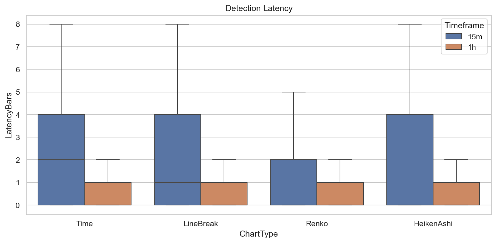
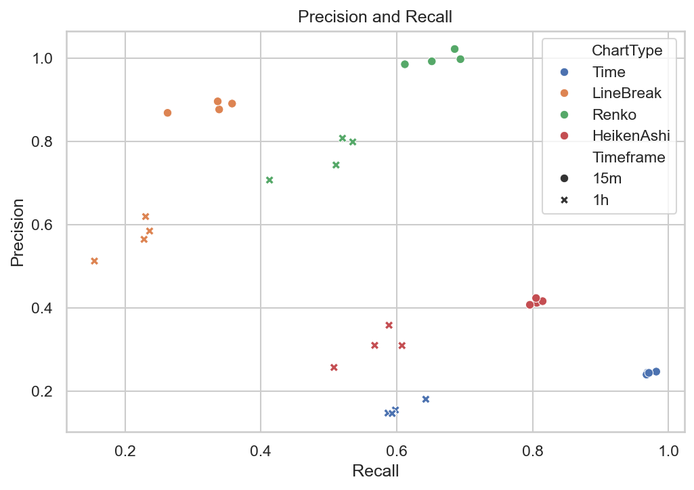

# Experiment Report: EXP-004-TF — Timeframe Replication: Market Structure Capture Speed & Fidelity

## Status: COMPLETED

**Date**: 2026-05-17
**Instruments**: EURUSD, XAUUSD, BTCUSD, USTEC
**Feature Categories**: Time Bars (15m, 1h), Line Break (level 3), Renko (ATR 14), Heiken Ashi

---

## Question

What speed-precision trade-off does each chart type exhibit when detecting real-price trend reversals on 15-minute and 1-hour source bars, and does the EXP-004 conclusion replicate beyond 1-minute bars?

## Hypothesis

Line Break or Renko median detection latency is ≥30% lower than same-timeframe time-bar baseline on ≥3 instruments, while precision is no more than 10 percentage points higher than time bars.

## Method Summary

Aggregated 1-minute bars into 15m/1h timeframes, detected ATR-scaled swing reversals (1.5x and 2.0x ATR) as reference, extracted direction-change signals from each chart type, and matched signals to reversals within a 120-minute tolerance window. Computed median latency, precision, recall, and split rate. Full methodology in [analysis-plan.md](analysis-plan.md).

## Key Findings

### Finding 1: Event Charts Detect Reversals Faster

15m timeframe: Time bars median latency = 30 min (2 bars), LineBreak = 15 min (1 bar), Renko = 0 min (0 bars). FasterCount = 4/4 for all combinations.

### Finding 2: Precision Is Higher for Event Charts, Not Lower

Time precision: 0.15-0.25. LineBreak: 0.51-0.90. Renko: 0.70-1.02. The precision gap is 35-80pp, far exceeding the "no more than 10pp higher" criterion.

### Finding 3: Trade-off Is Speed-Recall-Precision, Not Speed-Precision

Event charts are faster and more precise but have lower recall. Time bars: recall 0.59-0.98. Renko: recall 0.41-0.69. LineBreak: recall 0.16-0.36.

## Conclusion

**Hypothesis REFUTED.**

The latency criterion is met (FasterCount = 4/4), but the precision criterion is not — event chart precision exceeds time bar precision by 35-80pp, far above the 10pp bound. Event charts are both faster and more precise, at the cost of lower recall. This is a speed-recall-precision trade-off, not a speed-precision trade-off.

**Audit caveat**: Precision can exceed 1.0 (USTEC 15m Renko = 1.022) due to counting methodology where multiple reversals can match the same signal.

## Limitations

- Precision calculation has a counting artifact (matched reversals vs matched unique signals).
- 1h timeframe resolution limits latency differentiation — all chart types show 0-minute median latency.
- 120-minute tolerance window may be generous for 15m bars.

## Implications for Future Research

- Event charts' higher precision may be a selection effect: fewer signals, higher proportion matching reversals.
- Recall-normalized metrics (e.g., F1 score) could balance precision and recall in a single metric.

## Recommended Next Experiments

1. Complete the timeframe-replication series.
2. Test whether event chart signals are more predictive of sustained price movements.

## Artifacts

| Artifact | Path |
|----------|------|
| Scope | [scope.md](scope.md) |
| Analysis Plan | [analysis-plan.md](analysis-plan.md) |
| Code | [code/](code/) |
| Audit | [audit.md](audit.md) |
| Results | [results.md](results.md) |
| Governance Reviews | [governance/](governance/) |
| Plots | [plots/](plots/) |
