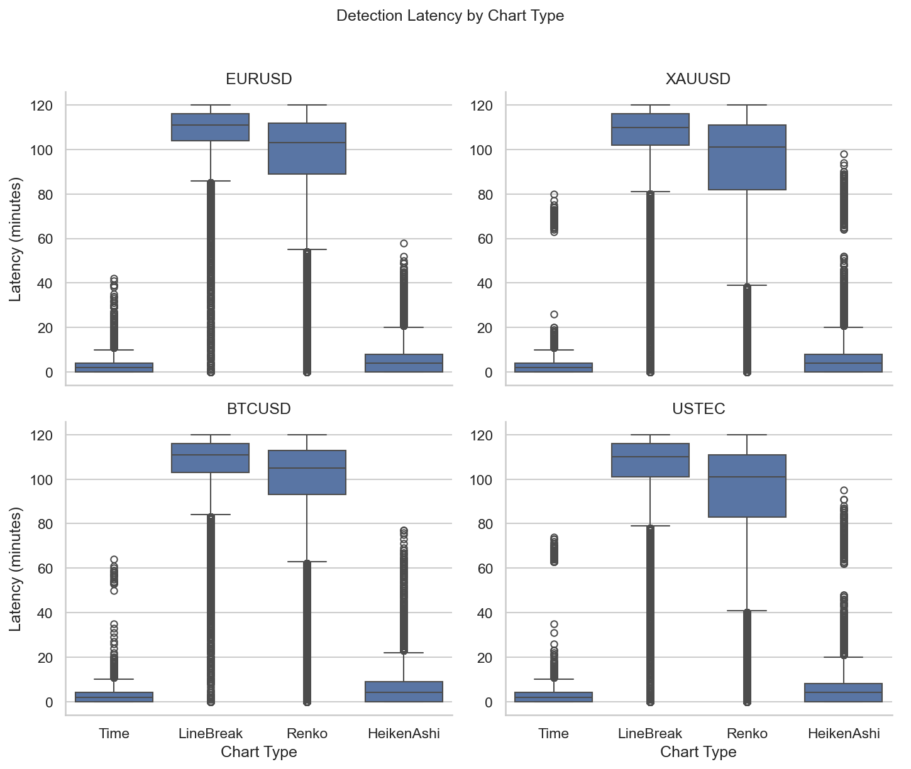
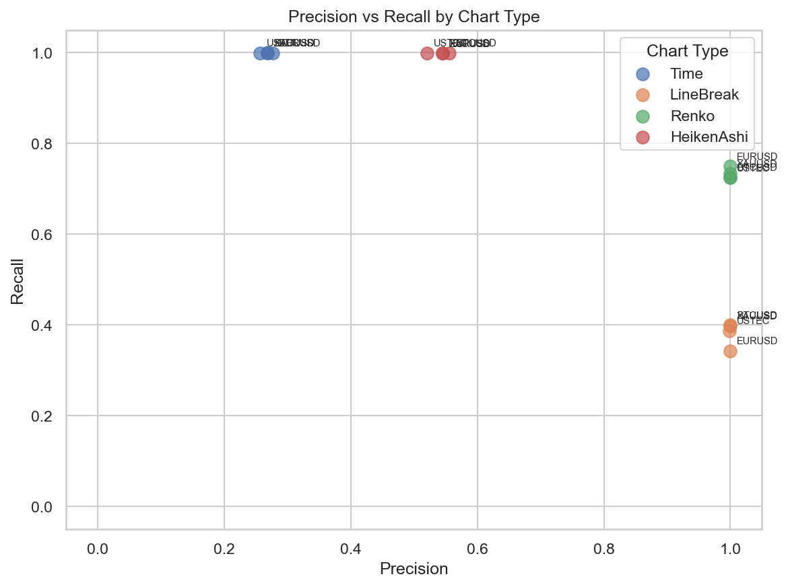

# Experiment Report: EXP-004 — Market Structure Capture Speed & Fidelity

## Status: COMPLETED

**Date**: 2026-05-16
**Instruments**: EURUSD, XAUUSD, BTCUSD, USTEC
**Feature Categories**: Time Bars, Line Break (level 3), Renko (ATR-14), Heiken Ashi

---

## Question

What speed-precision trade-off does each chart type exhibit when detecting real-price trend reversals?

## Hypothesis

Line Break level 3 and Renko ATR-14 detect predefined real-price trend reversals faster than 1-minute time-bar confirmation on at least 3 of 4 instruments, but their precision is not higher than the time-bar baseline.

## Method Summary

ATR-scaled swing reversals (1.5x ATR) were detected on 1-minute time bars as the real-price reference. Direction-change signals were extracted from each chart type (timestamped by CloseTime for Time/HA, SourceCloseTime for LB/Renko) and matched to reference reversals within a 120-minute forward tolerance window. Median latency, precision (matched/total signals), recall, and split rate were computed per instrument and chart type. Reversal-label stability was checked against an alternate 2.0x ATR threshold. See [analysis-plan.md](analysis-plan.md) for full methodology.

## Key Findings

### Finding 1: Event-based charts are 50-55x slower than time bars

Median detection latency for event-based charts is dramatically higher than the time-bar baseline across all four instruments:

| Chart Type | EURUSD | XAUUSD | BTCUSD | USTEC |
|------------|--------|--------|--------|-------|
| Time | 2.0 min | 2.0 min | 2.0 min | 2.0 min |
| LineBreak | 111.0 min | 110.0 min | 111.0 min | 110.0 min |
| Renko | 103.0 min | 101.0 min | 105.0 min | 101.0 min |
| HeikenAshi | 4.0 min | 4.0 min | 4.0 min | 4.0 min |

The hypothesis required >=30% latency reduction on >=3 instruments. Zero instruments show any latency reduction for any event-based chart type. The effect is in the opposite direction with overwhelming magnitude.

### Finding 2: Event-based charts trade recall for precision

Line Break and Renko achieve ~99.9% precision but miss most reversals (recall 34-40% and 72-75% respectively). Time bars detect nearly all reversals (~100% recall) but with low precision (26-28%) due to massive signal redundancy (83-85% split rate).

| Chart Type | Precision | Recall | Split Rate |
|------------|-----------|--------|------------|
| Time | 26-28% | ~100% | 83-85% |
| LineBreak | 99.9% | 34-40% | ~0% |
| Renko | 99.9% | 72-75% | ~0.04% |
| HeikenAshi | 52-56% | ~100% | 47-51% |

### Finding 3: Reversal labels are stable

Primary (1.5x ATR) and alternate (2.0x ATR) reversal labels show 100% bidirectional overlap across all instruments, with median confirmation shift of 1.0 minute. The reference is stable under threshold variation.

## Conclusion

**Hypothesis REFUTED.**

Line Break and Renko do not detect real-price trend reversals faster than 1-minute time bars. They are 50-55x slower. The hypothesized speed-precision trade-off does not exist in the predicted direction. Instead, event-based charts exhibit a precision-recall trade-off: they emit fewer, higher-quality signals but miss most reversals that the 1-minute time-bar reference detects.

This finding matters because it corrects a common intuition about event-based charts. The value of Line Break and Renko is not in faster detection — it is in signal denoising. They reduce the split rate from 83-85% (time bars) to near-zero, at the cost of missing 25-66% of reversals.

## Limitations

- The reversal reference is built from 1-minute bars, inherently favoring time-bar speed. A coarser reference (e.g., 15-minute swings) might yield different results.
- The sensitivity check's 120-minute tolerance window has limited discriminative power (audit.md Warning 1).
- Only direction-change signals were tested; more sophisticated chart-type signals might show different speed characteristics.

## Implications for Future Research

- Event-based charts should be evaluated for signal quality (precision, split rate) rather than speed.
- The precision-recall trade-off suggests chart-type parameters can be tuned along an efficiency frontier.
- EXP-001 (Information Density) findings are reinforced: time bars produce massive redundant signals.

## Recommended Next Experiments

1. **EXP-007 (proposed)**: Repeat speed-precision comparison with a coarser reversal reference (15-minute bar swings or higher ATR multiplier) to test whether event-based charts show speed advantage when the reference is not on the 1-minute grid.
2. **EXP-008 (proposed)**: Map the precision-recall efficiency frontier as a function of chart-type parameters (Line Break level, Renko ATR period).

## Artifacts

| Artifact | Path |
|----------|------|
| Scope | [scope.md](scope.md) |
| Analysis Plan | [analysis-plan.md](analysis-plan.md) |
| Code | [code/](code/) |
| Audit | [audit.md](audit.md) |
| Results | [results.md](results.md) |
| Governance Reviews | [governance/](governance/) |
| Plots | [plots/](plots/) |
