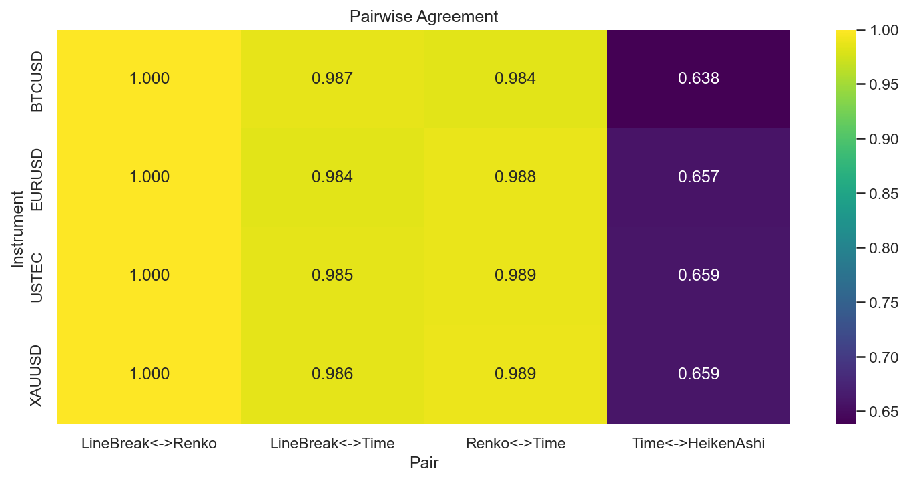

# Experiment Report: EXP-005-TF — Timeframe Replication: Cross-Chart-Type Alignment & Regime Correspondence

## Status: COMPLETED

**Date**: 2026-05-17
**Instruments**: EURUSD, XAUUSD, BTCUSD, USTEC
**Feature Categories**: Time Bars (15m, 1h), Line Break (level 3), Renko (ATR 14), Heiken Ashi

---

## Question

Do chart types agree on trend direction and trend-change timing on 15-minute and 1-hour source bars, and does the EXP-005 agreement verdict replicate beyond 1-minute bars?

## Hypothesis

In medium- and high-volatility regimes, LB/Renko timestamp-aligned direction agreement is ≥10pp higher than each chart type's agreement with same-timeframe time bars on ≥3 instruments, with paired bootstrap CIs excluding zero.

## Method Summary

Aggregated 1-minute bars into 15m/1h timeframes, generated chart types, built timestamp/direction tables, collapsed repeated event-chart rows at same SourceCloseTime, and performed pairwise nearest-neighbor timestamp matching within 5-minute (primary) and 15-minute (sensitivity) tolerance windows. Computed agreement rates by regime and paired bootstrap CIs. Full methodology in [analysis-plan.md](analysis-plan.md).

## Key Findings

### Finding 1: LB<->Renko Agreement Is Perfect on Matched Events

Agreement = 1.0 for all 8 instrument-timeframe combinations at 5-min tolerance. When LB and Renko events align within 5 minutes, they always agree on direction.

### Finding 2: But Overlap Is Only ~50%

OverlapRate at 5-min tolerance: 0.495-0.531. Only half of LB events find a Renko match within 5 minutes. At 15-min tolerance: 0.728-0.769.

### Finding 3: Agreement Improvement Is Only 1-2pp

LB<->Time agreement: 0.981-0.991. Renko<->Time: 0.977-0.993. LB<->Renko exceeds these by only 1-2pp, far below the ≥10pp threshold. Bootstrap CI at 5-min excludes zero (statistically significant but practically small).

## Conclusion

**Hypothesis REFUTED.**

The agreement improvement is 1-2pp (far below 10pp threshold). Event charts agree with time bars almost as well as they agree with each other (97-100% across all pairs). Trend direction is robustly captured by all chart types, not just event charts.

## Limitations

- 50% overlap means perfect LB<->Renko agreement applies to only half of LB events.
- Bootstrap operates on n=8 (4 instruments × 2 regimes), treating combinations as independent.
- Direction agreement is binary; does not capture magnitude or timing of changes.

## Implications for Future Research

- High agreement across all chart types suggests trend direction is a robust property of price data.
- Event charts' value may lie in bar count reduction and ghost bar filtering, not directional superiority.

## Recommended Next Experiments

1. Complete the timeframe-replication series.
2. Test whether event chart direction changes are more predictive of future price movement.

## Artifacts

| Artifact | Path |
|----------|------|
| Scope | [scope.md](scope.md) |
| Analysis Plan | [analysis-plan.md](analysis-plan.md) |
| Code | [code/](code/) |
| Audit | [audit.md](audit.md) |
| Results | [results.md](results.md) |
| Governance Reviews | [governance/](governance/) |
| Plots | [plots/](plots/) |
