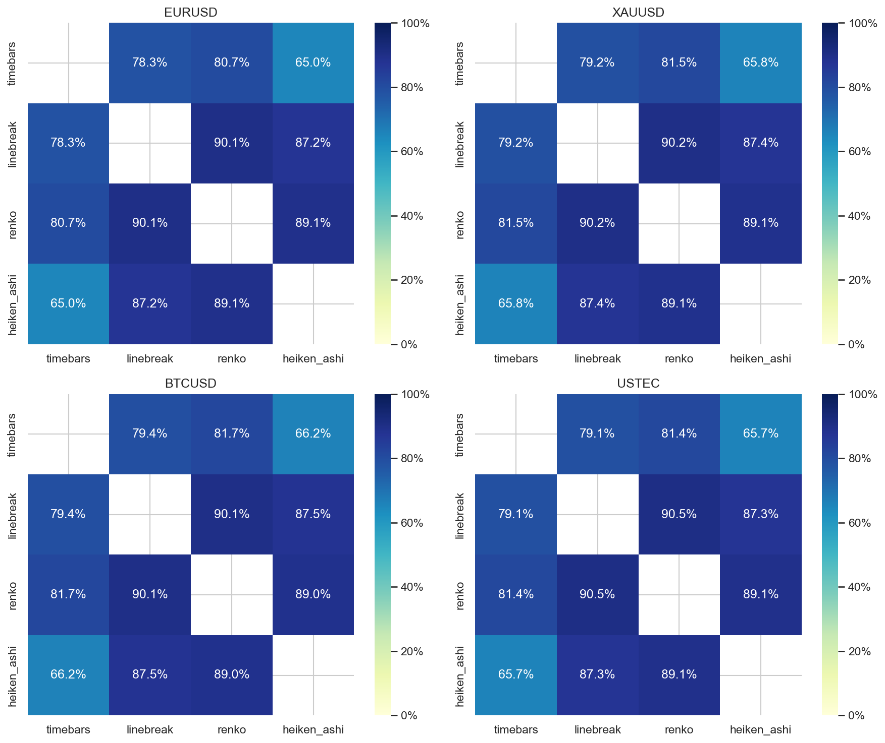
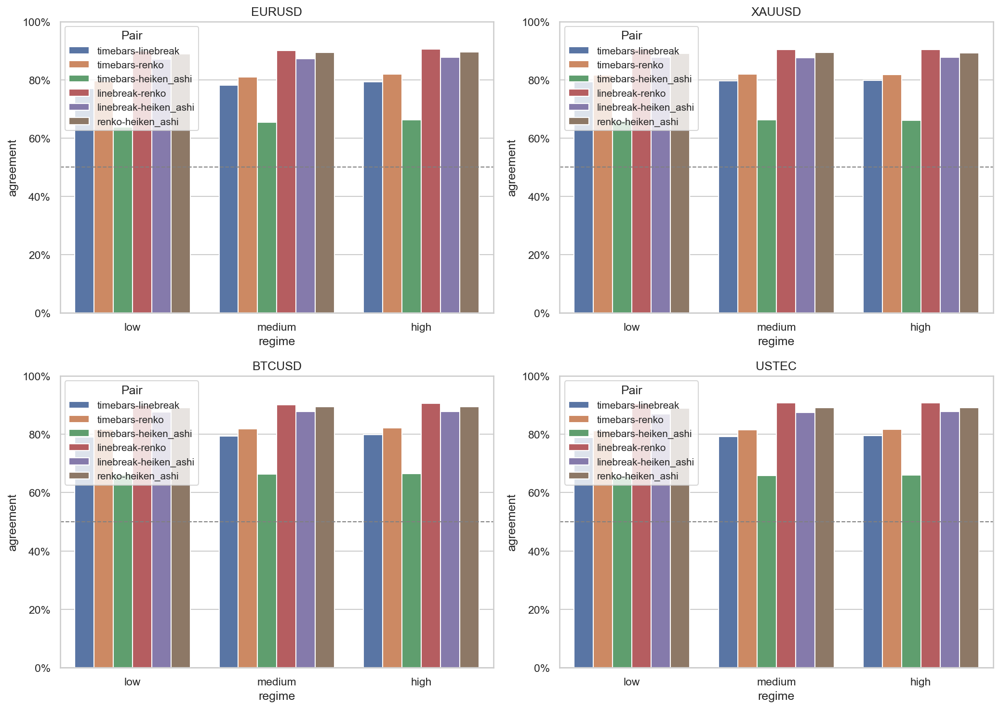

# Experiment Report: EXP-005 — Cross-Chart-Type Alignment & Regime Correspondence

## Status: COMPLETED

**Date**: 2026-05-16
**Instruments**: EURUSD, XAUUSD, BTCUSD, USTEC
**Feature Categories**: Time Bars, Line Break (level 3), Renko (ATR 14), Heiken Ashi

---

## Question

Do chart types agree on trend direction and event timing after timestamp alignment, and does agreement vary by volatility regime?

## Hypothesis

Line Break level 3 and Renko ATR-14 show stronger trend-direction agreement with each other than either does with 1-minute time bars during medium- and high-volatility regimes, measured by timestamp-aligned agreement within a fixed tolerance window.

## Method Summary

Direction labels were extracted from all four chart types and aligned by timestamp using nearest-neighbour matching within a 5-minute tolerance (15-minute for sensitivity). Volatility regimes (low/medium/high) were derived from 60-bar rolling standard deviation of log returns on time bars, with tercile thresholds calibrated on the first 70% of the analysis set and applied only to the evaluation segment. Pairwise agreement rates were computed symmetrically, and paired bootstrap confidence intervals (10,000 iterations) tested whether LB↔Renko agreement exceeds each chart type's agreement with time bars on the subset of reference events matching both targets. See [analysis-plan.md](analysis-plan.md) for full methodology.

## Key Findings

### Finding 1: Raw LB↔Renko agreement is ~90% across all instruments

At 5m tolerance, Line Break and Renko direction agreement ranges from 90.1% (BTCUSD) to 90.5% (USTEC), exceeding both LB↔TimeBars (78-79%) and Renko↔TimeBars (81-82%). This pattern is consistent across all four instruments.

However, this raw agreement uses asymmetric denominators: sparse event charts (LB: ~213K events, Renko: ~226K) are compared against dense time bars (~872K). The high agreement partly reflects that both event charts filter noise similarly.

### Finding 2: Paired bootstrap refutes the hypothesis

The pre-specified test — paired bootstrap on reference events matching both targets — shows negative differences for all instruments:

| Instrument | Ref | Diff (pp) | 95% CI | n |
|-----------|-----|-----------|--------|---|
| EURUSD | LB | -0.73 | [-0.93, -0.53] | 54,833 |
| XAUUSD | LB | -2.80 | [-2.99, -2.60] | 58,460 |
| BTCUSD | LB | -3.22 | [-3.41, -3.04] | 66,003 |
| USTEC | LB | -2.75 | [-2.95, -2.55] | 54,052 |

All CIs exclude zero in the negative direction, meaning Line Break agrees with Time Bars slightly MORE than with Renko on the paired subset. For Renko as reference, the differences are larger (-13 to -15 pp), meaning Renko agrees with Time Bars much more than with Line Break.

### Finding 3: Agreement increases with volatility

Direction agreement rates increase from low to high volatility regimes for most pairs, by 1-2 pp per regime step. This is consistent with stronger trends producing clearer directional signals.

### Finding 4: Heiken Ashi shows lowest agreement

TimeBars↔HeikenAshi agreement is consistently ~65%, the lowest of all pairs. HA's smoothing formula inverts direction labels on ranging bars, making HA direction not directly comparable to raw bar direction.

## Conclusion

**Hypothesis REFUTED.**

The pre-specified success criterion required paired bootstrap confidence intervals excluding zero in the positive direction (LB↔Renko agreement improvement over each chart type's agreement with time bars). The bootstrap CIs exclude zero decisively, but in the negative direction: Line Break agrees with Time Bars slightly more than with Renko, and Renko agrees with Time Bars substantially more than with Line Break. This pattern holds across all four instruments and all regime scopes.

The raw pairwise agreement of ~90% between LB and Renko is real but reflects shared noise-filtering methodology rather than independent trend confirmation. When controlled for the same reference events, the advantage disappears.

## Limitations

- Paired bootstrap operates on a subset of events (n = 16K-66K) that match both targets, not the full event population.
- Regime labels cover only the evaluation segment (last ~30% of the analysis set).
- Direction labels are binary (+1/-1), losing information about trend strength and duration.
- One dataset session per instrument; results may not generalise to other time periods.

## Implications for Future Research

- Event density differences between chart types may explain agreement patterns independently of trend-direction correspondence.
- Renko's ATR-based sizing tracks time bars more closely than Line Break's fixed level parameter, suggesting adaptive parameters matter for cross-chart alignment.
- Heiken Ashi's low agreement with other chart types confirms its direction labels are structurally different, supporting the planned EXP-006 on HA synthetic price distortion.

## Recommended Next Experiments

1. **EXP-007 (proposed)**: Quantify event density and temporal resolution across chart types to test whether density differences explain agreement patterns.
2. **EXP-008 (proposed)**: Test whether Line Break with volatility-adaptive level improves LB↔Renko agreement on the paired subset.
3. **EXP-006 (already planned)**: Heiken Ashi Synthetic Price Distortion Quantification.

## Artifacts

| Artifact | Path |
|----------|------|
| Scope | [scope.md](scope.md) |
| Analysis Plan | [analysis-plan.md](analysis-plan.md) |
| Code | [code/](code/) |
| Audit | [audit.md](audit.md) |
| Results | [results.md](results.md) |
| Governance Reviews | [governance/](governance/) |
| Plots | [plots/](plots/) |
