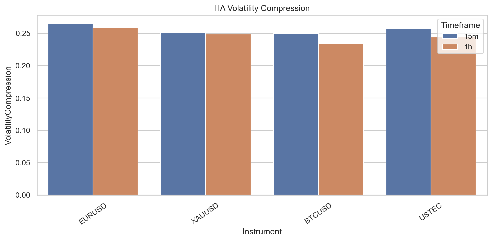
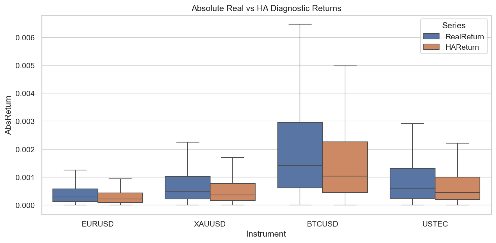

# Experiment Report: EXP-006-TF — Timeframe Replication: Heiken Ashi Synthetic Price Distortion Quantification

## Status: COMPLETED

**Date**: 2026-05-17
**Instruments**: EURUSD, XAUUSD, BTCUSD, USTEC
**Feature Categories**: Time Bars (15m, 1h), Heiken Ashi

---

## Question

How large is the distortion between Heiken Ashi synthetic prices and real prices on 15-minute and 1-hour source bars, and does the EXP-006 synthetic-price conclusion replicate beyond 1-minute bars?

## Hypothesis

On all 4 instruments, absolute HA close-to-close return volatility is ≥30% lower than real same-timeframe return volatility, and median absolute HA return magnitude is ≥20% lower than real return magnitude.

## Method Summary

Aggregated 1-minute bars into 15m/1h timeframes, generated Heiken Ashi from each timeframe, computed paired HAClose and RealClose log returns at identical timestamps, and measured volatility compression, median absolute return compression, and direction change compression. Stratified by volatility regime and applied block bootstrap (n=1000, block size 100). Full methodology in [analysis-plan.md](analysis-plan.md).

## Key Findings

### Finding 1: Volatility Compression 23.5-26.5% (Below 30% Threshold)

All instruments at both timeframes show 23.5-26.5% volatility compression. Below the 30% threshold on every combination.

### Finding 2: Median Return Compression 23.3-28.6% (Meets 20% Threshold)

All instruments meet the 20% median absolute return compression threshold (range: 23.3-28.6%).

### Finding 3: Compression Consistent Across Timeframes and Regimes

No material difference between 15m and 1h compression values. Slightly higher compression in low-volatility regimes for most instruments.

## Conclusion

**Hypothesis REFUTED.**

Volatility compression threshold (≥30%) was not met on any instrument (23.5-26.5%). Median return compression threshold (≥20%) was met on all instruments (23.3-28.6%). Because both thresholds must be met, the hypothesis is refuted.

However, the practical warning remains valid: HA compresses return magnitude and volatility by 23-29%, which is substantial enough to invalidate HA-price-derived returns for strategy evaluation.

## Limitations

- The 30% threshold may be conservative — even 24% compression is practically significant.
- Block bootstrap uses block size of 100, which may not capture all temporal dependence.
- HA returns are diagnostic only; real strategy evaluation would use HA direction signals with real prices.

## Implications for Future Research

- HA distortion is a structural property of its formula, consistent across instruments and timeframes.
- The practical conclusion (HA returns unsuitable for strategy evaluation) remains valid even below the 30% threshold.

## Recommended Next Experiments

1. Complete the timeframe-replication series.
2. Test whether HA distortion materially affects strategy backtest results when HA direction signals are evaluated with real prices.

## Artifacts

| Artifact | Path |
|----------|------|
| Scope | [scope.md](scope.md) |
| Analysis Plan | [analysis-plan.md](analysis-plan.md) |
| Code | [code/](code/) |
| Audit | [audit.md](audit.md) |
| Results | [results.md](results.md) |
| Governance Reviews | [governance/](governance/) |
| Plots | [plots/](plots/) |
