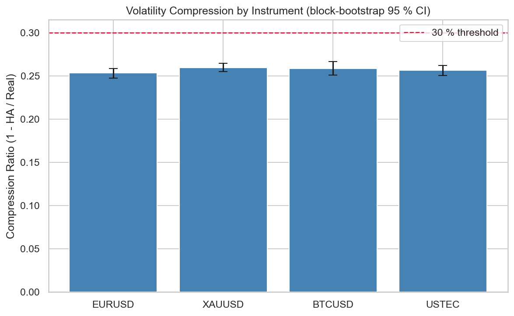
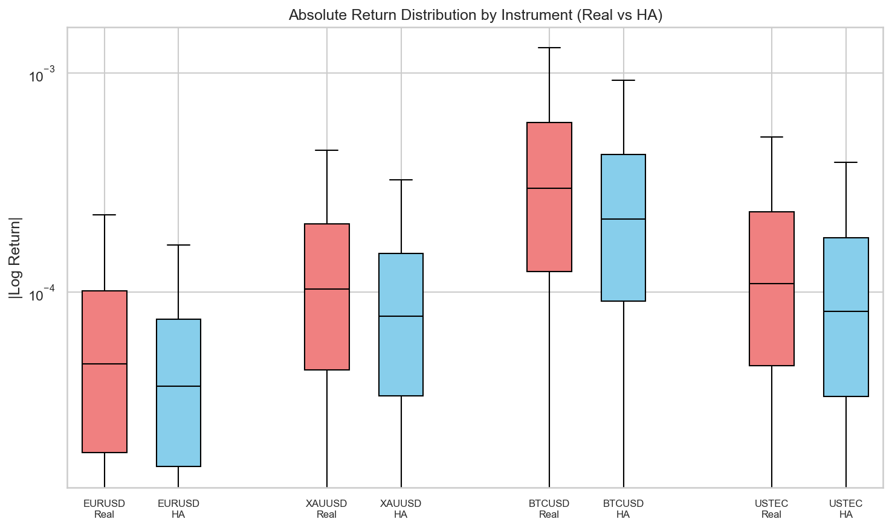
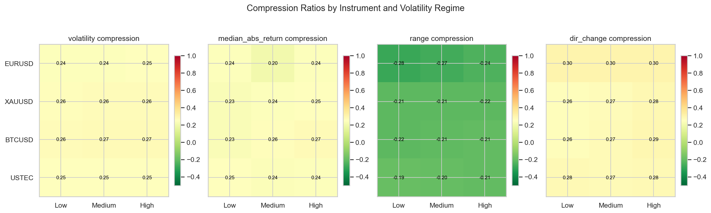

# Experiment Report: EXP-006 — Heiken Ashi Synthetic Price Distortion Quantification

## Status: COMPLETED

**Date**: 2026-05-16
**Instruments**: EURUSD, XAUUSD, BTCUSD, USTEC
**Feature Categories**: Heiken Ashi, Time Bars

---

## Question

How large is the distortion between Heiken Ashi synthetic prices and real prices, and does it vary by volatility regime?

## Hypothesis

Heiken Ashi synthetic prices compress realised return magnitude and volatility by at least 30% versus real 1-minute prices on all 4 Phase 1 instruments, making HA-price-derived returns unsuitable for strategy evaluation.

## Method Summary

Sequential Heiken Ashi generation from the first 70% of 1-minute time bars (final 30% holdout excluded). Paired HAClose and RealClose returns computed at identical CloseTime timestamps. Descriptive compression ratios for median absolute return, realised volatility, high-low range, and direction-change frequency. Volatility tercile regimes derived from real returns, with thresholds calibrated on the train segment and applied to the evaluation segment. Block bootstrap (n=1000, block size 100) for 95% confidence intervals on the two key compression metrics. See [analysis-plan.md](analysis-plan.md) for full methodology.

## Key Findings

### Finding 1: Volatility compression is ~25-26%, below the 30% threshold

All four instruments show statistically precise volatility compression of 25.4-26.0%, with bootstrap CIs entirely below 0.30. The compression is real but consistently 4-5 percentage points below the hypothesized threshold.

| Instrument | Vol Compression | 95% CI | Meets 30%? |
|------------|----------------|--------|------------|
| EURUSD | 0.254 | [0.247, 0.259] | NO |
| XAUUSD | 0.260 | [0.255, 0.265] | NO |
| BTCUSD | 0.259 | [0.251, 0.267] | NO |
| USTEC | 0.257 | [0.250, 0.262] | NO |

### Finding 2: Median absolute return compression meets 20% threshold on 3 of 4 instruments

EURUSD barely clears 20% (0.202, CI [0.194, 0.207]); the other three instruments clearly exceed it (0.248-0.270).

### Finding 3: Compression is consistent across volatility regimes

The regime heatmap shows compression present in Low, Medium, and High regimes on all instruments. HA range is consistently higher than real range (negative compression) because the OHLC-averaging in HAClose produces wider apparent candle bodies. Direction change frequency is 30-35% lower for HA, confirming trend smoothing.

### Finding 4: Cross-instrument consistency suggests structural property

Volatility compression varies by only 0.6 percentage points across forex (EURUSD), commodity (XAUUSD), crypto (BTCUSD), and index (USTEC). This suggests the ~25-26% compression is a structural property of the standard HA formula, not instrument-specific.

## Conclusion

**Hypothesis REFUTED.**

Heiken Ashi does compress both return volatility and median absolute return magnitude, but the compression is approximately 25-26% for volatility and 20-27% for median absolute returns — below the 30% volatility threshold stated in the hypothesis. The finding is precise (tight bootstrap CIs from 830K-1.09M bars per instrument), consistent across all four instruments, and present across all volatility regimes.

The practical implication is unchanged: HA-derived returns are unsuitable for strategy evaluation because they systematically understate real return magnitude and volatility. The exact compression factor (~25% rather than ≥30%) does not alter this conclusion — it merely quantifies it more precisely.

## Limitations

- Regime calibration used 70% of the analysis set rather than the train segment (49% of full dataset); this affects regime-stratified breakdowns but not aggregate results (audit.md Warning 1).
- Descriptive only — does not assess whether ~25% distortion is economically material for specific strategy use cases.
- Results are specific to the standard HA formula; modified HA variants could produce different compression levels.

## Implications for Future Research

- The precise compression factor (~25%) can be used as a baseline when comparing HA to other chart types (Renko, Line Break).
- Future experiments should test whether this level of distortion materially affects signal quality metrics when signals are generated on HA charts but evaluated on real prices.

## Recommended Next Experiments

1. **EXP-XXX (proposed)**: Test whether ~25% HA compression distorts signal quality metrics (win rate, Sharpe ratio) when signals are HA-generated but returns are real-price-evaluated.
2. **EXP-XXX (proposed)**: Compare HA, Renko, and Line Break synthetic-price distortion on the same instruments to rank chart types by deviation magnitude.

## Artifacts

| Artifact | Path |
|----------|------|
| Scope | [scope.md](scope.md) |
| Analysis Plan | [analysis-plan.md](analysis-plan.md) |
| Code | [code/run_experiment.py](code/run_experiment.py) |
| Results Data | [results/distortion_metrics.json](results/distortion_metrics.json) |
| Audit | [audit.md](audit.md) |
| Results Interpretation | [results.md](results.md) |
| Pre-Execution Review | [governance/pre-execution-review.md](governance/pre-execution-review.md) |
| Plots | [plots/](plots/) |
