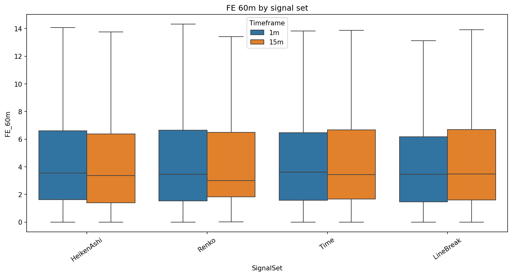
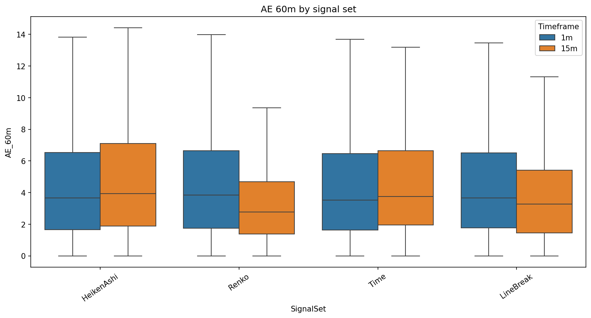
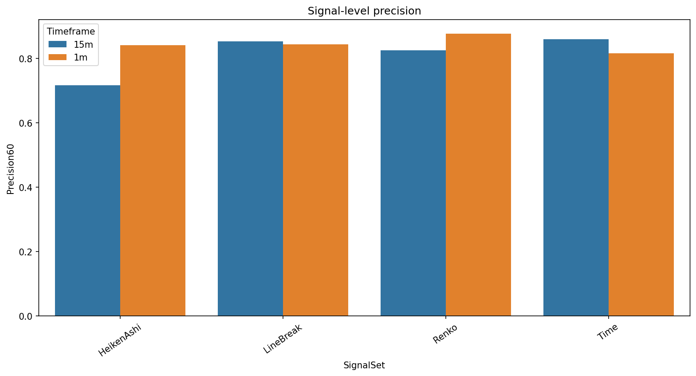
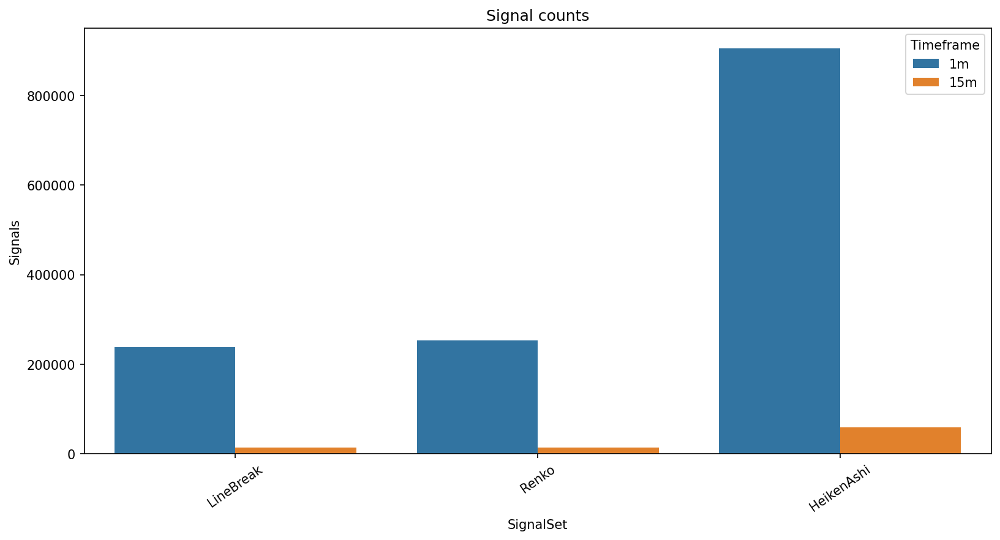

# Experiment Report: EXP-007 - Multi-State Signal-Quality Baseline

## Status: SUPPORTED

**Date**: 2026-05-17  
**Instruments**: EURUSD, XAUUSD, BTCUSD, USTEC  
**Feature Categories**: Time Bars, Line Break level 3, Renko ATR-14, Heiken Ashi  

## Question

What does the signal-quality distribution look like for each chart type when measured on real prices at signal emission timestamps, and is binary direction an adequate summary of that distribution?

## Hypothesis

Real-price signal quality cannot be adequately characterized by binary direction alone. A multi-state signal-quality framework measuring forward excursion, adverse excursion, run continuation, signal-level precision, and event-level recall in ATR units on the real-price timeline produces pre-specified differentiation across chart types and volatility regimes.

## Method Summary

The experiment generated Time, Line Break, Renko, and Heiken Ashi signal sets at 1-minute and 15-minute source timeframes for all four instruments. Every signal outcome was measured from aligned 1-minute real OHLC prices, excluding the final 30 percent global holdout. Bootstrap comparisons tested event-chart-minus-Time differences for FE60, AE60, signal-level precision, and 30-minute run continuation.

## Key Findings

### Finding 1: The Block B Measurement Gate Passed

Three pre-specified proceed criteria were met, all at 15 minutes: Renko AE60 passed on 4 of 4 instruments, Renko FE60 passed on 4 of 4 instruments, and LineBreak AE60 passed on 3 of 4 instruments. No 1-minute proceed criterion passed.

This validates the framework as a measurement language for downstream Block B experiments.

### Finding 2: The Main Effect Is A Trade-Off, Not A Simple Improvement

At 15 minutes, Renko reduced AE60 versus Time on all instruments, but also reduced FE60 on all instruments. Weighted overall 15-minute means were Renko FE60 `4.644` vs Time `4.964`, and Renko AE60 `4.462` vs Time `4.943`.

Downstream experiments should keep favourable and adverse excursion separate. A single quality score would hide the central trade-off.

### Finding 3: Precision And Run Continuation Were Not Primary Discriminators

Signal-level precision stayed tightly clustered: 15-minute Time `0.836`, Heiken Ashi `0.836`, LineBreak `0.824`, and Renko `0.818`. Run-continuation differences were small and did not meet the proceed threshold.

FE60 and AE60 should carry forward as the primary EXP-007-supported metrics. Precision and run continuation remain diagnostics.

### Finding 4: Missing-Signal States Are Large

Event charts emitted many fewer signals than Time and Heiken Ashi. Missing source-bar shares were 73.7 percent for 1-minute LineBreak, 72.0 percent for 1-minute Renko, 76.3 percent for 15-minute LineBreak, and 75.9 percent for 15-minute Renko.

Coverage cost is not optional context. It must be reported in downstream Block B experiments.

## Conclusion

**Hypothesis SUPPORTED.**

EXP-007 validates the multi-state real-price signal-quality framework. The framework differentiated chart types under the pre-specified criteria and gives EXP-008 through EXP-011 a usable measurement substrate.

The substantive finding is narrower than "event charts are better." At 15 minutes, event charts reshape the excursion distribution, especially through lower AE60, but Renko also lowers FE60. Block B should continue, but it should carry FE and AE as separate primary outcomes and report missing-signal states explicitly.

## Limitations

- Bootstrap intervals are row-level and descriptive; overlapping forward windows create temporal dependence.
- FE and AE are post-signal outcome labels, not live signal inputs.
- No 1-minute proceed criterion passed, so the strongest measurement evidence is timeframe-specific.
- The experiment characterizes signal quality only; it does not test P&L, execution, or optimized strategy thresholds.

## Implications for Future Research

- EXP-008 through EXP-011 can proceed, but FE60 and AE60 should be the primary carried-forward metrics.
- Precision and run continuation should not be treated as primary differentiators unless a future scope defines new criteria.
- Missing-signal states and signal-count ratios must remain first-class outputs.

## Recommended Next Experiments

1. **EXP-008**: Test whether Renko confirmation changes the FE60/AE60 trade-off for time-bar candidate signals.
2. **EXP-009**: Test whether Heiken Ashi direction changes improve FE60/AE60 relative to raw time-bar direction changes.
3. **EXP-010**: Test whether Line Break confirmation identifies a materially different subset of Renko signals.
4. **EXP-011**: Test whether event-native volatility regimes explain the 15-minute FE/AE differentiation.

## Artifacts

| Artifact | Path |
|----------|------|
| Scope | [scope.md](scope.md) |
| Analysis Plan | [analysis-plan.md](analysis-plan.md) |
| Code | [code/](code/) |
| Audit | [audit.md](audit.md) |
| Results | [results.md](results.md) |
| Governance Reviews | [governance/](governance/) |
| Plots | [plots/](plots/) |
