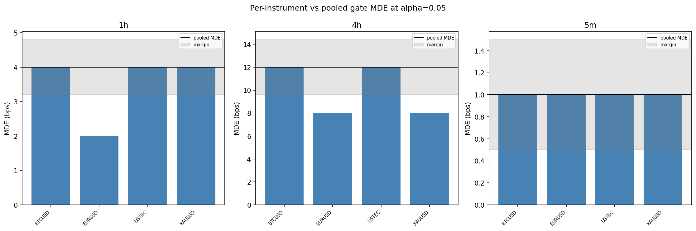
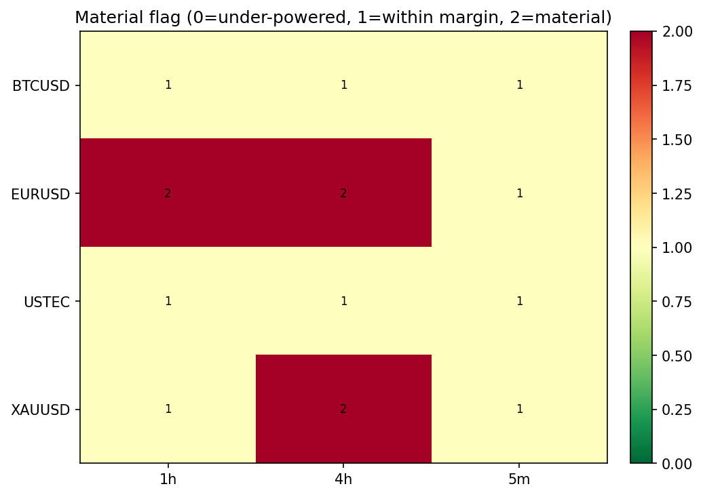

# Experiment Report: EXP-008 - Per-Instrument MDE De-Pooling

## Status: SUPPORTED

**Date**: 2026-06-04
**Instruments**: BTCUSD, EURUSD, USTEC, XAUUSD
**Data Views / Feature Categories**: EXP-003 gate-stack draw verdicts for 5m, 1h, and 4h OHLC domains, de-pooled by instrument; no chart-type views

---

## Question

Do per-instrument gate-stack MDEs differ materially from the Phase 001 four-instrument pooled domain MDEs?

## Hypothesis

At `alpha0 = 0.05`, at least one reportable instrument/domain gate-stack MDE differs from the EXP-003 pooled domain MDE by at least `max(0.5 bps, 20% of pooled_MDE)`.

## Method Summary

EXP-008 reprocessed the frozen EXP-003 gate-stack draw verdicts by grouping on `instrument x domain x alpha` instead of pooling instruments by domain. It recomputed Wilson FPR/TPR, selected the smallest planted edge with TPR >= 0.80 at controlled FPR and D-prec precision, and compared each per-instrument MDE against the pooled domain MDE. No market data or holdout rows were loaded.

## Key Findings

### Finding 1: Three Per-Instrument Cells Differ Materially

At `alpha0=0.05`, all 12 cells were reportable and 3 were material:

- EURUSD/1h: `2.0` bps vs pooled `4.0` bps.
- EURUSD/4h: `8.0` bps vs pooled `12.0` bps.
- XAUUSD/4h: `8.0` bps vs pooled `12.0` bps.

### Finding 2: 5m Shows No Visible Heterogeneity

BTCUSD, EURUSD, USTEC, and XAUUSD all matched the pooled 5m MDE of `1.0` bps. These cells are within grid resolution and do not support a 5m per-instrument adjustment.

### Finding 3: Precision Was Usable Everywhere

Gate FPR was `0/1000` in every per-instrument alpha0 cell, with Wilson half-width `0.001913`. Every per-instrument MDE row across the alpha grid had status `PASS`, so the material cells were not forced through under-powered logic.

## Conclusion

**Hypothesis SUPPORTED.**

EXP-008 shows that the pooled EXP-003 domain MDE map masks some instrument-level sensitivity. The material differences are all lower per-instrument MDEs, so the pooled map is conservative for EURUSD/1h and EURUSD/XAUUSD 4h. This does not adopt per-instrument thresholds; it gives EXP-011 a sharper map for synthesis.

## Limitations

- MDE values are grid-defined and should not be read as continuous thresholds.
- The experiment reuses EXP-003 oracle-style synthetic draw verdicts, not real strategies.
- Material differences are descriptive; operating-point decisions remain out of scope.

## Implications for Future Research

- EXP-011 should account for per-instrument MDE heterogeneity, especially in 1h EURUSD and 4h EURUSD/XAUUSD.
- Any future per-instrument threshold adoption should be ratified as a dedicated decision-phase scope.

## Recommended Next Experiments

1. **EXP-011**: Include the per-instrument MDE map in the predeclared loss-function synthesis.
2. **Phase 003 decision phase**: If EXP-011 recommends per-instrument thresholds, test the recommendation on fresh draws before adoption.

## Artifacts

| Artifact | Path |
|----------|------|
| Scope | [scope.md](scope.md) |
| Analysis Plan | [analysis-plan.md](analysis-plan.md) |
| Code | [code/](code/) |
| Audit | [audit.md](audit.md) |
| Results | [results.md](results.md) |
| Governance Reviews | [governance/](governance/) |
| Raw Results | [results/](results/) |
| Plots | [plots/](plots/) |
