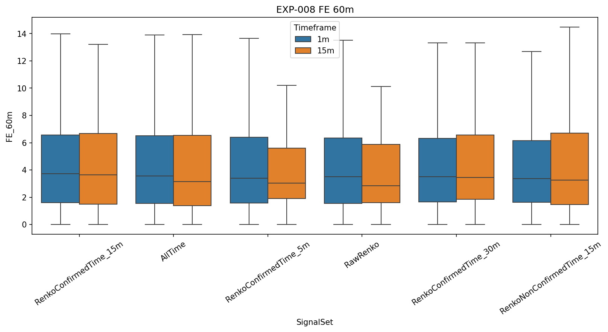
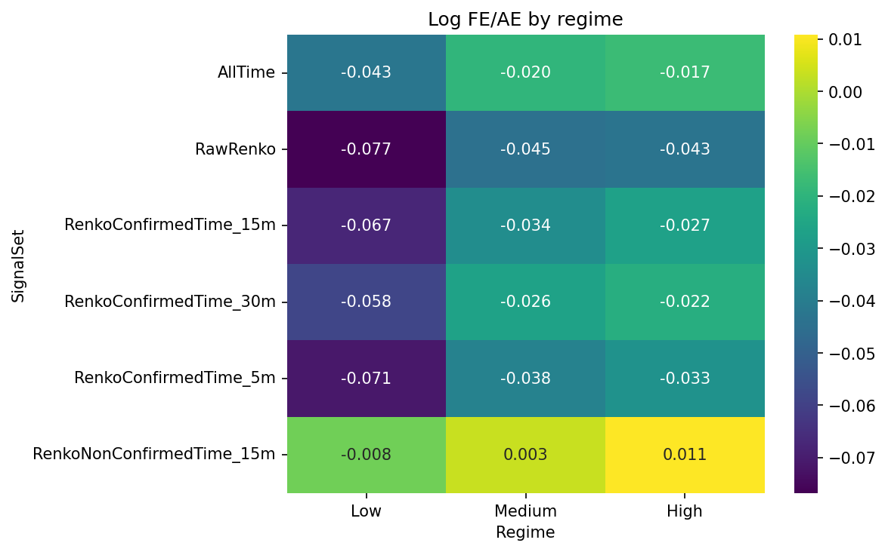
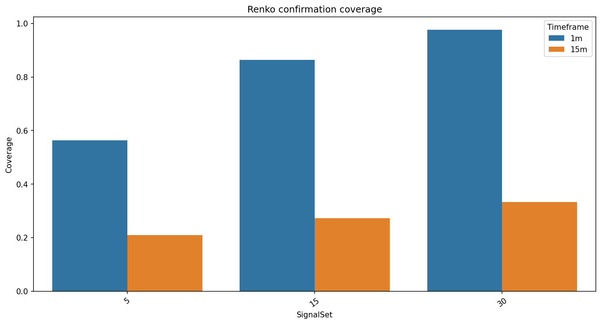

# Experiment Report: EXP-008 - Renko as a Precision Gate Over Time-Bar Signals

## Status: REFUTED

**Date**: 2026-05-17  
**Instruments**: EURUSD, XAUUSD, BTCUSD, USTEC  
**Feature Categories**: Time Bars, Renko ATR-14

## Question

Does Renko confirmation select a 15-minute time-bar signal subset with a better AE-relative-to-FE trade-off after coverage cost?

## Hypothesis

At the 15-minute source timeframe, time-bar direction signals confirmed by same-or-prior Renko ATR-14 emissions within a fixed tolerance window show a better AE-relative-to-FE trade-off than the full set of time-bar direction signals.

## Method Summary

The experiment generated holdout-excluded 1-minute and 15-minute time bars, generated Renko ATR-14 from the matching source timeframe, and evaluated all outcomes on real 1-minute OHLC prices. The 15-minute source timeframe and 15-minute confirmation window carried the verdict; 1-minute outputs were exploratory.

## Key Findings

### Primary Log FE/AE Did Not Improve Broadly

Confirmed-minus-all-time log FE/AE improved only for USTEC (`+0.042`, CI `[+0.020, +0.196]`) and worsened for EURUSD (`-0.073`, CI `[-0.184, -0.002]`). BTCUSD and XAUUSD were inconclusive.

### AE Reduction Came With FE Compression

AE60 declined on all four instruments (`-0.156` to `-0.598`), but FE60 also declined on BTCUSD, EURUSD, and XAUUSD with CIs excluding zero. This supports a compression interpretation rather than a quality-gate interpretation.

### Coverage Cost Was Large

At the primary 15-minute confirmation window, Renko confirmed only `24.6-28.7%` of time-bar signals.

## Conclusion

**Hypothesis REFUTED.**

Renko confirmation is not a supported precision gate over 15-minute time-bar signals under FE60/AE60 criteria. It reliably lowers adverse excursion, but it also lowers favourable excursion and discards most opportunities.

## Limitations

- The 1-minute arm is exploratory only.
- No Renko parameter or confirmation-window optimization was performed.
- Coverage-adjusted values are signal-quality diagnostics, not executable strategy returns.

## Recommended Next Experiments

1. Reframe Renko gating as a possible AE-control tool only if future scope permits explicit FE sacrifice.
2. Prioritize direct time-bar-native or raw Renko signal-quality features over Renko-confirmed time-bar gating.

## Artifacts

| Artifact | Path |
|----------|------|
| Scope | [scope.md](scope.md) |
| Analysis Plan | [analysis-plan.md](analysis-plan.md) |
| Code | [code/](code/) |
| Audit | [audit.md](audit.md) |
| Results | [results.md](results.md) |
| Governance Reviews | [governance/](governance/) |
| Plots | [plots/](plots/) |
