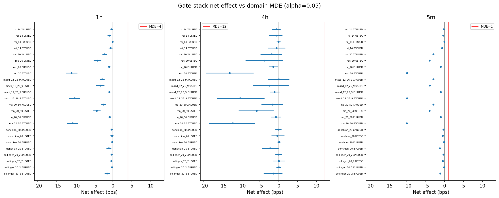
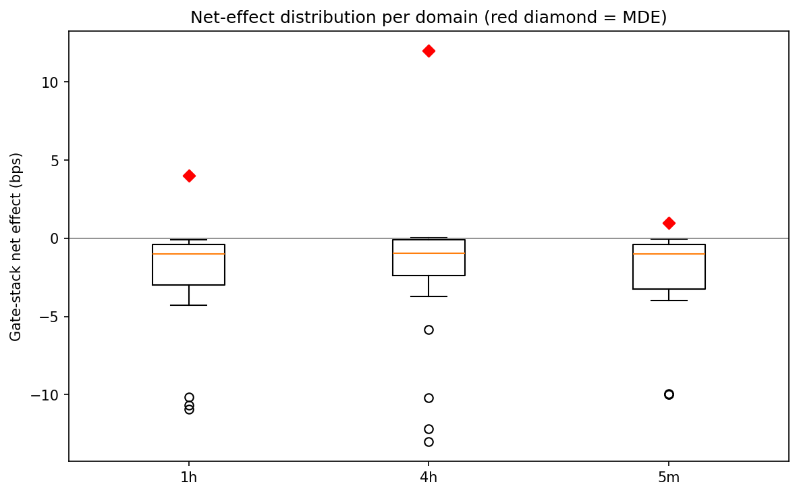

# Experiment Report: EXP-009 - Broadened Untuned Strategy Effect-Size Distribution

## Status: SUPPORTED

**Date**: 2026-06-04
**Instruments**: BTCUSD, EURUSD, USTEC, XAUUSD
**Data Views / Feature Categories**: 1-minute time bars resampled to 5m, 1h, and 4h OHLC domains; six fixed untuned simple strategy families; no chart-type views

---

## Question

Where do net effect sizes from a broadened set of untuned simple strategies sit relative to each domain's EXP-003 gate-stack MDE?

## Hypothesis

EXP-009 is exploratory measurement only: produce the gross/net effect-size distribution for six fixed untuned strategies and locate every cell relative to the pooled domain MDE map.

## Method Summary

EXP-009 evaluated Donchian(20), MA(20/50), RSI(14), Bollinger(20, 2.0), MACD(12,26,9), and ROC(20) on real domain `Close` returns. Donchian and MA reused the frozen harness; the other four causal indicators lived in an experiment-local helper. Every strategy was fixed and untuned, aligned to `t -> t+1` returns, and evaluated by the frozen referees with 1000 bootstrap resamples.

## Key Findings

### Finding 1: Every Gate-Stack Cell Is Below MDE

All 72 gate-stack alpha0 cells classify as `below_MDE`. No strategy/instrument/domain cell is `near_MDE` or `at_or_above_MDE`.

### Finding 2: The Distribution Is a Lower/Null Anchor

Domain medians are all near -1 bps net of cost:

- 5m: median `-1.018395` bps, range `[-9.987340, -0.069953]`.
- 1h: median `-0.998325` bps, range `[-10.949345, -0.080834]`.
- 4h: median `-0.952547` bps, range `[-13.029254, +0.045022]`.

### Finding 3: The Best Point Estimate Is Still Far Below MDE

The largest positive gate-stack effect is EURUSD/4h Donchian(20), `+0.045022` bps with CI `[-0.390681, +0.514643]`, far below the 4h gate MDE of `12.0` bps.

## Conclusion

**Exploratory measurement SUPPORTED.**

The scoped measurement was delivered, and it strengthens the EXP-004 lower/null anchor: a broader fixed simple-strategy set still sits below every calibrated domain MDE. EXP-009 does not qualify, tune, adopt, or reject any strategy; it records where simple untuned real-price effects actually fall.

## Limitations

- The strategy set is fixed and untuned by design.
- Results are located against pooled domain MDEs, not the EXP-008 per-instrument map.
- Cost-applied net effects can be strongly negative for active strategies; that is expected under the scoped flat-cost model.

## Implications for Future Research

- EXP-011 should treat EXP-009 as optional context: simple untuned strategies do not pressure the referee sensitivity frontier.
- Future candidate work should be separately scoped, especially if it introduces tuning, ensembles, or incremental-information units.

## Recommended Next Experiments

1. **EXP-011**: Use EXP-009 as context in the operating-point recommendation, not as an adoption input.
2. **Phase 003 seed**: Design the incremental-information unit before testing more complex candidates.

## Artifacts

| Artifact | Path |
|----------|------|
| Scope | [scope.md](scope.md) |
| Analysis Plan | [analysis-plan.md](analysis-plan.md) |
| Code | [code/](code/) |
| Audit | [audit.md](audit.md) |
| Results | [results.md](results.md) |
| Governance Reviews | [governance/](governance/) |
| Raw Results | [results/](results/) |
| Plots | [plots/](plots/) |
