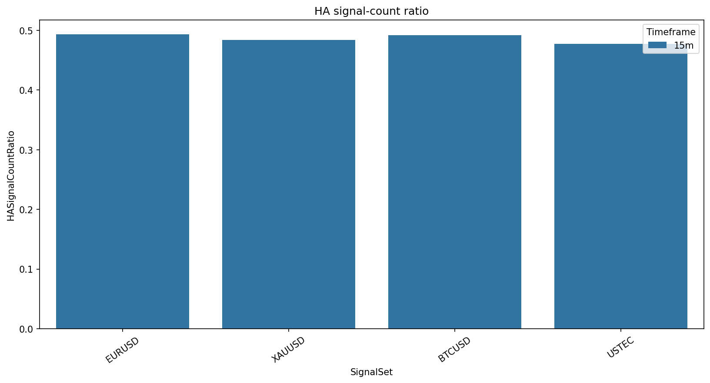
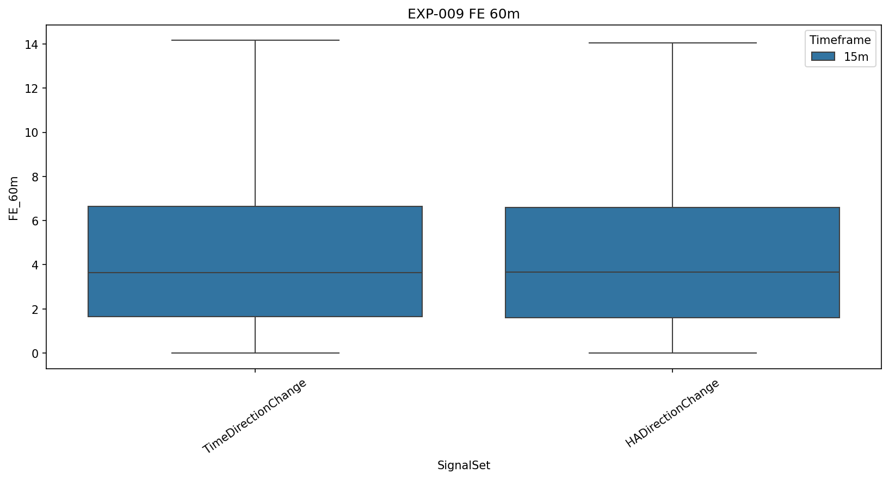
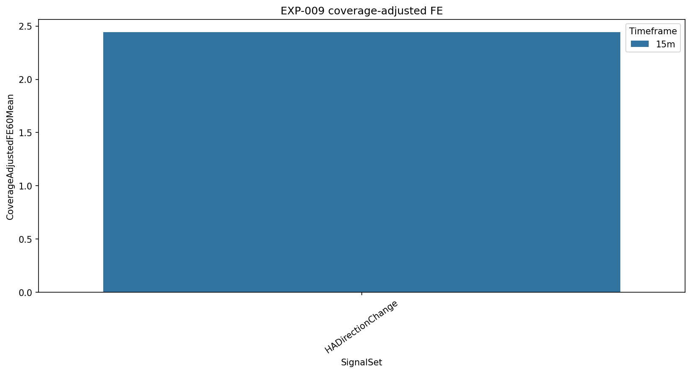

# Experiment Report: EXP-009 - Heiken Ashi Direction as a Signal Generator, Evaluated on Real Prices

## Status: REFUTED

**Date**: 2026-05-17  
**Instruments**: EURUSD, XAUUSD, BTCUSD, USTEC  
**Feature Categories**: Time Bars, Heiken Ashi

## Question

Does HA's lower 15-minute direction-change frequency select a higher-quality subset on real-price FE60/AE60 than raw time-bar direction changes?

## Hypothesis

At the 15-minute source timeframe, Heiken Ashi direction changes evaluated on real prices select a subset of the time-bar signal population with a better AE-relative-to-FE trade-off than raw time-bar direction changes.

## Method Summary

The experiment generated holdout-excluded 15-minute time bars, generated Heiken Ashi candles from those bars, and evaluated both time-bar and HA direction-change timestamps on real 1-minute OHLC prices. The hypothesis-carrying metrics were FE60, AE60, and log FE/AE with bootstrap CIs.

## Key Findings

### HA Cut Signal Count by About Half

HA/time-bar direction-change ratios were EURUSD `0.493`, XAUUSD `0.484`, BTCUSD `0.492`, and USTEC `0.477`. HA direction changes aligned with same-direction time-bar direction changes within 15 minutes for `86.6-89.5%` of HA signals.

### No Primary Log FE/AE Improvement

HA minus time-bar log FE/AE differences were BTCUSD `-0.040`, EURUSD `-0.017`, USTEC `+0.013`, and XAUUSD `+0.012`; all bootstrap CIs included zero. Only XAUUSD FE60 was significantly positive, and AE60 showed no significant improvement.

### Coverage Cost Dominated the Trade-Off

Coverage by regime ranged from `0.436` to `0.534`, so HA-selected outcomes cover only about half of the reference direction-change population.

## Conclusion

**Hypothesis REFUTED.**

HA smoothing meaningfully reduces 15-minute direction-change frequency, but it does not select a subset with reliable AE-relative-to-FE improvement. The data supports HA as a smoothing descriptor, not as a standalone 15-minute signal generator.

## Limitations

- Only 15-minute HA direction changes were tested.
- No strategy P&L or HA construction-price returns were computed.
- Coverage-adjusted results should be interpreted as opportunity-set diagnostics, not executable returns.

## Recommended Next Experiments

1. Test HA as one feature inside a time-bar-native signal filter.
2. Test whether HA delay relative to raw time-bar direction changes explains the missing AE/FE improvement.

## Artifacts

| Artifact | Path |
|----------|------|
| Scope | [scope.md](scope.md) |
| Analysis Plan | [analysis-plan.md](analysis-plan.md) |
| Code | [code/](code/) |
| Audit | [audit.md](audit.md) |
| Results | [results.md](results.md) |
| Governance Reviews | [governance/](governance/) |
| Plots | [plots/](plots/) |
