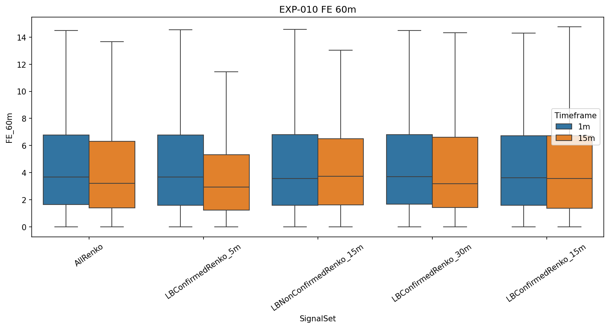
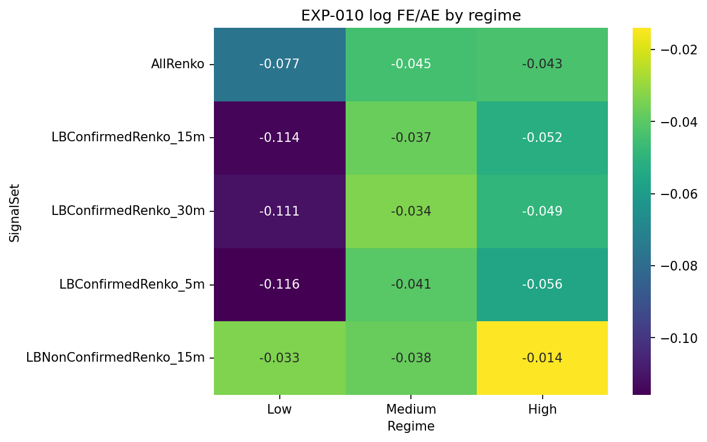
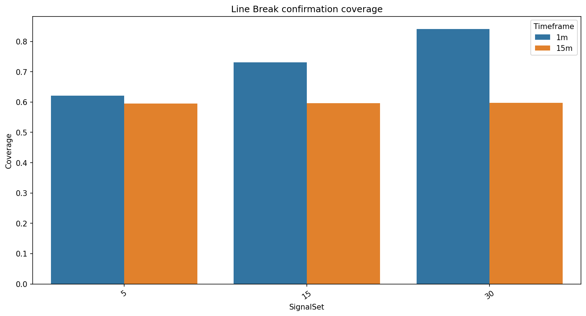

# Experiment Report: EXP-010 - Line Break as a Confirmation Layer Over Renko Signals

## Status: REFUTED

**Date**: 2026-05-17  
**Instruments**: EURUSD, XAUUSD, BTCUSD, USTEC  
**Feature Categories**: Renko ATR-14, Line Break level 3

## Question

Does Line Break confirmation select a Renko subset with a meaningfully better 15-minute log FE/AE ratio, after accounting for additional coverage loss?

## Hypothesis

At the 15-minute source timeframe, Renko signals confirmed by same-or-prior Line Break emissions show a better AE-relative-to-FE trade-off than the full Renko signal set.

## Method Summary

The experiment generated Renko and Line Break from holdout-excluded 1-minute and 15-minute source bars. Renko was the primary signal layer; Line Break confirmation used same-direction, same-or-prior `SourceCloseTime` within 5, 15, and 30 minutes. The 15-minute, 15-minute-window comparison carried the verdict.

## Key Findings

### Primary Ratio Improvement Did Not Generalize

Confirmed-minus-all-Renko log FE/AE improved with a CI excluding zero only for BTCUSD (`+0.057`, CI `[+0.010, +0.183]`). EURUSD, USTEC, and XAUUSD did not meet the primary ratio criterion.

### Confirmation Reduced AE, But Also Reduced FE

Confirmed-minus-non-confirmed AE60 was negative on all instruments (`-0.299` to `-0.473`), but FE60 also declined on 3 of 4 instruments. This supports a magnitude-compression interpretation, not a stable quality-gain interpretation.

### Coverage Cost Was Material

At the primary 15-minute confirmation window, Line Break confirmed only `53.5-62.6%` of Renko signals.

## Conclusion

**Hypothesis REFUTED.**

Line Break confirmation is a coverage-selection layer over Renko, but it does not reliably improve the AE-relative-to-FE trade-off. It selects lower-AE episodes, while also reducing FE and discarding a large share of Renko signals.

## Limitations

- The 1-minute arm is exploratory only.
- Renko same-timestamp emissions are preserved as emitted signal rows.
- No Line Break or Renko parameter optimization was performed.

## Recommended Next Experiments

1. Reframe any future Line Break confirmation work around explicit AE reduction with an allowed FE cost.
2. Prefer direct Renko signal-quality work over Line Break-confirmed Renko gating for Phase 3.

## Artifacts

| Artifact | Path |
|----------|------|
| Scope | [scope.md](scope.md) |
| Analysis Plan | [analysis-plan.md](analysis-plan.md) |
| Code | [code/](code/) |
| Audit | [audit.md](audit.md) |
| Results | [results.md](results.md) |
| Governance Reviews | [governance/](governance/) |
| Plots | [plots/](plots/) |
